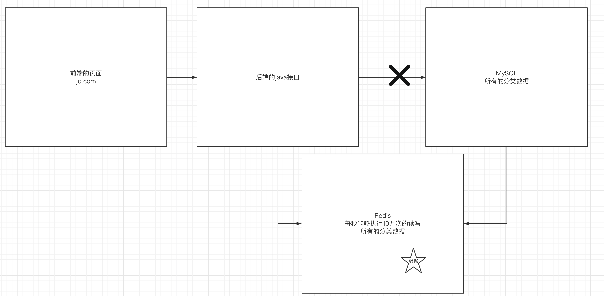
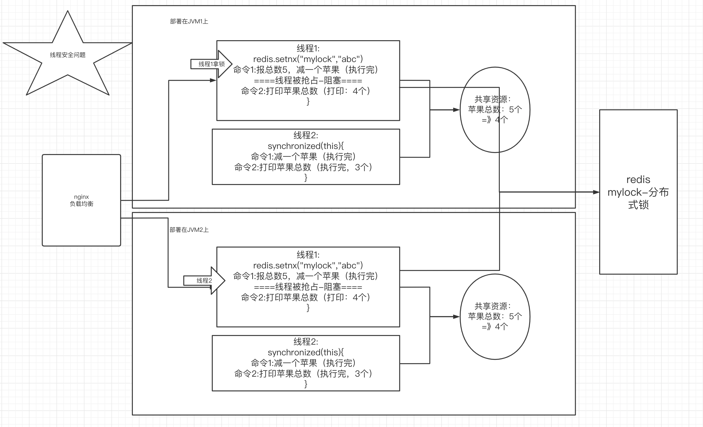
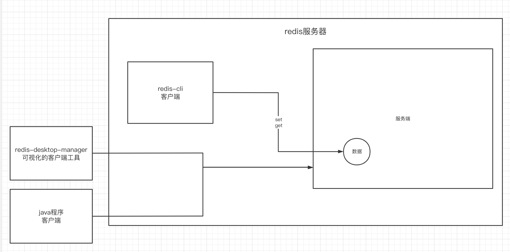

# 一、进入到第四阶段的准备工作

## 1.纪律-我们可以做到比之前的班级优秀

- 八点能到校
- 八点到了以后，去记背面试题，面试进到公司里面 没有实际开发，crud的流程？——在公司里碰到任何问题，都可以找我
- 8:50 晨考，考前一天的知识，不要去看前一天笔记，在下午的第四节课会对考的不好的同学提出要求。
- 上课时间：
  - 第一节课：9:05 - 10:10左右
  - 第二节课：10:30-11:30
  - 上午的练习时间：最后的半个小时
  - 第三节课：14:00-15:00
  - 第四节课：15:20-16:30

- 上课要做什么事情：

  唯一要做的事情：听课，有不懂的打断我

  看视频、没有时间消化、学的比别人差、找工作：1周 4周（2周，接下来的一个月都在找工作）

  


## 2.第四阶段的项目

### 1）第四阶段主要的两大项目

数据大屏、秒杀。

### 2）其他项目：

电商闭环（视频的方式）：前台+后台

jwt：后台的权限管理（上课的形式）

2007-2101 电商闭环 秒杀 订单、购物车==》 2102、2103 秒杀、数据大屏（VUE）==〉抖音大屏、智慧城市、城市大脑。后端提供这种高性能的接口，能够让海量的数据实时的显示在前端大屏上。

- 工程架构
- 业务架构
- 中间件架构

希望通过这些架构设计，让我们的系统做到高性能、高可用。

- 什么是高性能、高可用？

高性能：应对海量的并发，2009年的双11，支付宝宕机了3分钟==》1、2秒钟的阻塞，业务不会出现宕机的。

高可用：追求的n个9，4个9，一年时间中有99.999%的时间，系统是可以用的。

- 数据大屏的接口：

可能应对海量的数据（3台kafka=》每台产生了5000万条数据），1.5亿条数据就产生了消息积压


## 3.第四阶段的学习目标

第四阶段要学的就是思想。分布式-微服务-思想


# 二、redis的应用场景

## 1.缓存服务器



## 

redis还能作为分布式session和分布式锁 的中间件来使用


## 2.redis的分布式锁应用场景




## 3.redis的介绍

redis是一个nosql数据库，所谓的nosql就是非关系型数据库。比如mysql是一个关系型数据库：创建数据库、创建表、创建字段再存数据。那么非关系型数据库很简单：就是键值对（key-value）

redis是用c开发的，是在内存中操作数据，所以性能很好，可以做到平均每秒10万次读写。redis还配了持久化机制、哨兵模式、主从方案、集群搭建方案，所以现在使用redis作为非关系型数据库是一个很好的选择。


# 三、redis的安装和使用

## 1.redis的安装

编写docker-compose.yml文件

```yml
version: '3.1'
services:
  redis:
    image: daocloud.io/library/redis:5.0.7
    restart: always
    container_name: redis
    environment:
      - TZ=Asia/Shanghai
    ports:
      - 6379:6379
```


## 2.启动后用客户端进行操作即可

- 进入到容器内部

```shell
docker exec -it 容器id bash
```

- 执行redis-cli

使用redis命令操作redis存取键值对

```shell
set k1 v1
get k1
```


## 3.redis的服务端和客户端模式

redis服务器内部又是一种客户端和服务端模式，客户端可以有以下几种：

- redis-cli：官方提供的客户端工具，可以连接指定的redis服务器
- rdm：redis桌面管理工具，提供可视化的管理
- java程序客户端：自己写的java程序来操作redis




# 四、redis内部的数据结构（非常重要）

## 1.redis数据结构概述——针对于值的数据结构来讨论

redis为什么这么受欢迎，有很大的一部分原因，是redis拥有非常丰富的数据结构。什么叫数据结构，就是存储数据的结构，也就是说redis用什么样的结构来存储值的数据。

redis中所有的键都是string类型，但是值的类型有以下几种：

- string：字符串
- hash：哈希表
- list：列表
- set：集合
- zset：有序集合


## 2.string类型

string类型是redis中最基本的和最常用的一种数据结构。

所有操作String类型的命令：

```shell
# 向redis服务器设置一个键值对，值是string类型的值,如果键相同，则值会被覆盖
set k1 v1
# 
get k1
# 一次存储多个键值对
mset k1 v1 k2 v2 k3 v3
# 一次取多个键值对
mget k1 k2 k3
# 会对age值进行+1，redis会对integer的值做一个自动类型转换，前提是值是一个数值（integer）
incr age
# 设置了步长
incrby age 2
# 减少
decr age
#
decrby age 2
# 删除
del age
# 上分布式锁，如果mylock存在，则设置失败返回0，否则返回1
setnx mylock abc
# 设置k1的过期时间
expire k1 10
# 查看k1的过期时间
ttl k1
# 让k1永久存活
persist k1
# 设置键值对，同时设置它的超时时间
setex k4 20 v4
# 追加内容
append k2 vvv
# 查看字符串长度
strlen k2
```


## 3.hash类型

键还是一个字符串，但是值是由一个或多个属性和属性值组成的。

student对象信息：

```java
public class Student{
  private Long id;
  private String name;
  private int age;
}

Student stu = new Student(1001L,"xiaoming",21)
```


**redis中如何存储对象信息：**

- 用string来存整个对象数据

```shell
student:1001:name == xiaoming
student:1001:age == 20

student:1002:name == xiaoli
student:1002:age == 21
```

- 用json来存对象

```json
set student:1002 '{"id":1001,"name":"xiaoli","age":21}'
```

- 用hash类型来存（性能更好）

```shell
172.16.253.34:6379> hset student:1003 id 1003
(integer) 1
172.16.253.34:6379> hset student:1003 name xiaowang
(integer) 1
172.16.253.34:6379> hset student:1003 age 21
(integer) 1

```


**hash类型的基本操作**

```shell
# 向student:1001键存入一个值。值的类型是hash类型，hash类型来说值是多个键值对（属性和属性值）组成的
hset student:1001 name xiaoming
hset student:1001 age 20
# 一次性设置多个属性属性值
hmset student:1004 name xiaowang age 20 birthday 2001
# 一次型获取所有的属性属性值
hgetall student:1003
# 获取某一个属性的值
hget student:1003 name
# 一次型获取多个属性值
hmget student:1004 name age birthday
# 增加
hincrby student:1004 age 1
# 判断某个属性是否存在
HEXISTS student:1004 birthday
# 获取所有的属性的集合
hkeys student:1004
# 获取所有的值的集合
hvals student:1004
# 删除一个或多个属性属性值
hdel student:1004 birthday
# 获取属性的个数
hlen student:1004
```

## 4.list类型

redis的list类型，通过lpush、rpush、lpop、rpop可以方便的实现出队列和栈的效果。

队列： 先进先出

栈：先进后出

list的常用命令

```shell
# 从左边向队列中添加数据
lpush mylist a b c
# 查看队列中的数据 0是起始位置，-1标识最后一位，也可以是具体的位置索引
lrange mylist 0 -1
# 从右边弹出一个数据
rpop mylist
# 从右边添加
rpush mylist a b c
# 从左边弹出
lpop mylist
# 给列表的指定位置设置一个值
lset mylist 1 z
# 获取列表的指定位置的值
lindex mylist 1
# 获取列表的长度
llen mylist
# 删除列表中指定个数的指定值
lrem mylist 2 a
# 保留该索引范围的元素
ltrim mylist 1 4
# 合并两个链表（一次只弹出一个）
rpoplpush mylist1 mylist2

```


## 5.set类型

set是redis中的集合。redis中的集合跟java中集合的概念相同，都是存储 不能重复，无序的数据。

set集合的常用命令

```shell
# 添加元素到集合中
sadd myset a b c
# 输出集合中所有元素
smembers myset
# 从集合中随机弹出一个元素
spop myset
# 删除集合中的指定元素
srem myset a
# 判断元素是否在集合中
sismember myset a
# 求两个集合的交集
sinter myset1 myset2
# 求两个集合的并集
sunion myset1 myset2
# 求第一个集合在第二个集合中的差集
sdiff myset1 myset2
```


## 6.zset类型

有序的集合，排序依据是分数。比如说微博的热搜排行榜，这些热搜数据的统计是发生非常频繁的用户行为触发的接口。肯定不能用mysql来维护，因为性能不ok，因此用redis，那么redis的什么数据类型来维护呢？——zset

```shell
1.***公司
2.奥运
3.////
```


zset的相关命令

```shell
# 向有序的集合中添加元素，指明分数
zadd myzset 2000 nba 2001 wnba 1999 cba
# 升序输出集合中的元素
zrange myzset 0 -1
# 降序输出集合中的元素
zrevrange myzset 0 -1
# 给集合中的元素加分熟
zincrby myzset 2 nba
# 获得集合中的元素的分熟
zscore myzset nba
# 获得指定分数范围内的元素个数
zcount myzset 2000 3000
# 获得指定分数范围内的元素
zrangebyscore myzset 2000 3000
# 获得集合中的元素个数
zcard myzset
# 删除集合中的元素
zrem myzset nba
```


# 五、java客户端-Maven工程

## 1.引入依赖

```xml

  <dependencies>
    <!--    1、 Jedis-->
    <dependency>
      <groupId>redis.clients</groupId>
      <artifactId>jedis</artifactId>
      <version>2.9.0</version>
    </dependency>
    <!--    2、 Junit测试-->
    <dependency>
      <groupId>junit</groupId>
      <artifactId>junit</artifactId>
      <version>4.12</version>
    </dependency>
    <!--    3、 Lombok-->
    <dependency>
      <groupId>org.projectlombok</groupId>
      <artifactId>lombok</artifactId>
      <version>1.16.20</version>
    </dependency>
  </dependencies>

```


## 2.编写连接池工具类

```java
package com.qf.jedis.util;

import org.apache.commons.pool2.impl.GenericObjectPoolConfig;
import redis.clients.jedis.Jedis;
import redis.clients.jedis.JedisPool;

public class JedisUtil {

  private static GenericObjectPoolConfig poolConfig ;
  private static String host;
  private static JedisPool jedisPool;

  static{

    poolConfig = new GenericObjectPoolConfig();
    poolConfig.setMaxIdle(10);// 最大空闲数
    poolConfig.setMaxTotal(10);//连接池的性能最好的时候，池中有10个连接被使用，且最大连接数是10
    poolConfig.setMinIdle(4); // 最小空闲数
    poolConfig.setMaxWaitMillis(3000);
    host = "172.16.253.34";

    //1.初始化连接池的配置
    jedisPool = new JedisPool(poolConfig,host);
  }

  /**
   * 获得一个连接对象
   * @return
   */
  public static Jedis getJedis(){
    Jedis jedis = jedisPool.getResource();
    return jedis;
  }

  /**
   * 获得连接池对象
   * @return
   */
  public static JedisPool getJedisPool(){
    return jedisPool;
  }

}

```


## 3.熟悉jedis的api

发现jedis中的api基本上redis-cli中的命令是一致的。


## 4.如何向redis中保存对象

提供了几种方案：

```java
=============用redis的hash来存对象==============
/**
   * 存储java对象
   * 向redis保存一个hash对象
   */
  @Test
  public void testHashObjectToReids(){
    //1.从连接池中获得一个连接对象
    Jedis jedis = JedisUtil.getJedis();

    Student stu = new Student();
    stu.setId(2001L);
    stu.setName("xiaoming");
    stu.setAge(20);

    //2
    Map<String,String> map = new HashMap<>();
    map.put("id",String.valueOf(stu.getId()));
    map.put("name",stu.getName());
    map.put("age",String.valueOf(stu.getAge()));
    jedis.hmset("student1:2001",map);


  }

=============用Spring的序列化工具序列化对象为byte数组来存对象==============

  /**
   * 取java对象
   */
  @Test
  public void testGetObjectFromRedis(){
    //1.从连接池中获得一个连接对象
    Jedis jedis = JedisUtil.getJedis();
    String key = "stu:2001";
    //序列化键
    byte[] keyBytes = SerializationUtils.serialize(key);

    //从redis中取值
    byte[] valueBytes = jedis.get(keyBytes);
    //反序列化
    Object deserialize = SerializationUtils.deserialize(valueBytes);
    if(deserialize instanceof Student){
      Student stu = (Student) deserialize;
      System.out.println(stu);
    }

  }


  /**
   * 存储java对象
   */
  @Test
  public void testObjectToRedis(){
    //1.从连接池中获得一个连接对象
    Jedis jedis = JedisUtil.getJedis();

    Student stu = new Student();
    stu.setId(2001L);
    stu.setName("xiaoming");
    stu.setAge(20);


    String key = "stu:2001";

    byte[] keyBytes = SerializationUtils.serialize(key);

    byte[] valBytes = SerializationUtils.serialize(stu);


    jedis.set(keyBytes,valBytes);


  }


=============用json来存取对象==============

  /**
   * 从redis中取数据
   */
  @Test
  public void testGetObject(){
    //1.从连接池中获得一个连接对象
    Jedis jedis = JedisUtil.getJedis();
    String json = jedis.get("student:2001");
    //2.将json解析成java对象
    Student student = JSONObject.parseObject(json, Student.class);
    System.out.println(student);


  }

  /**
   * 存储java对象
   * 向redis保存一个json字符串
   */
  @Test
  public void testObject(){
    //1.从连接池中获得一个连接对象
    Jedis jedis = JedisUtil.getJedis();

    Student stu = new Student();
    stu.setId(2001L);
    stu.setName("xiaoming");
    stu.setAge(20);

    //2.转换成json字符串
    String json = JSONObject.toJSONString(stu);
    jedis.set("student:"+stu.getId(),json);


  }

```


# 作业

- 掌握好redis的五大数据类型及各种api的操作（记背）
- 掌握jedis的使用，api自己跑一跑、连接池工具类
- 场景1：
  - 步骤一：创建数据库表：所有的工地查询出来-》List<>=〉存到redis中
  - 步骤二：访问一个接口（web接口，@Test）：查询redis中所有的工地数据，并展示，把对象的细节都展示
- 场景2: 做一个抽奖程序：
  - 步骤一：向redis中存入数据
  - 步骤二：从数据中随机弹出一个