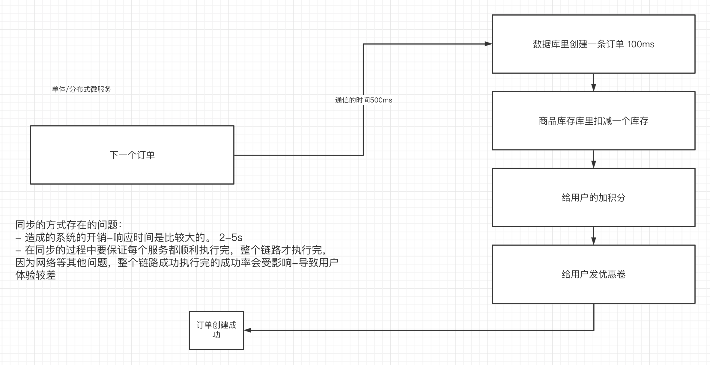
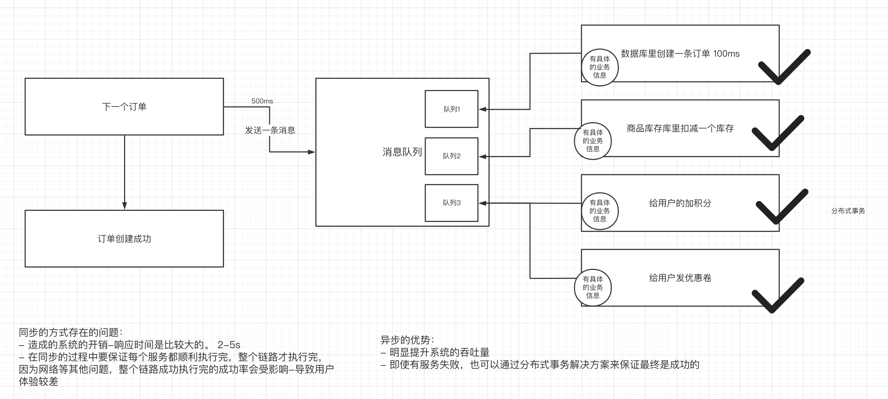
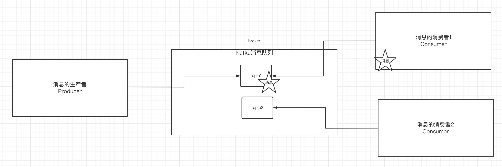

# 一、为什么使用消息队列

## 1.使用同步的通信方式来解决多个服务之间的通信



同步的通信方式会存在性能和稳定性的问题。


## 2.使用异步的通信方式



针对于同步的通信方式来说，异步的方式，可以让上游快速成功，极大提高了系统的吞吐量。而且在分布式系统中，通过下游多个服务的分布式事务的保障，也能保障业务执行之后的最终一致性。

消息队列解决具体的是什么问题——通信问题。


# 二、消息队列的流派

目前消息队列的中间件选型有很多种：

- rabbitMQ：内部的可玩性（功能性）是非常强的
- rocketMQ： 阿里内部一个大神，根据kafka的内部执行原理，手写的一个消息队列中间件。性能是与Kafka相比肩，除此之外，在功能上封装了更多的功能。
- kafka：全球消息处理性能最快的一款MQ

- zeroMQ

这些消息队列中间件有什么区别？

## 1. 有broker

- 重topic：Kafka、RocketMQ、ActiveMQ

  整个broker，依据topic来进行消息的中转。在重topic的消息队列里必然需要topic的存在

- 轻topic：RabbitMQ

  topic只是一种中转模式。


## 2.无broker

在生产者和消费者之间没有使用broker，例如zeroMQ，直接使用socket进行通信。


# 三、Kafka的基本知识

## 1.Kafka的安装

- 部署一台zookeeper服务器
- 安装jdk
- 下载kafka的安装包：http://kafka.apache.org/downloads
- 上传到kafka服务器上：`/usr/local/kafka`
- 解压缩压缩包
- 进入到config目录内，修改server.properties

```shell
#broker.id属性在kafka集群中必须要是唯一
broker.id=0
#kafka部署的机器ip和提供服务的端口号
listeners=PLAINTEXT://192.168.65.60:9092   
#kafka的消息存储文件
log.dir=/usr/local/data/kafka-logs
#kafka连接zookeeper的地址
zookeeper.connect=192.168.65.60:2181
```

- 进入到bin目录内，执行以下命令来启动kafka服务器（带着配置文件）

```shell
./kafka-server-start.sh -daemon ../config/server.properties 
```

- 校验kafka是否启动成功：ps aux | grep server.properties

进入到zk内查看是否有kafka的节点：`/brokers/ids/0`

## 2.kafka中的一些基本概念

kafka中有这么些复杂的概念




| **名称** | **解释**                                                     |
| -------- | ------------------------------------------------------------ |
| Broker   | 消息中间件处理节点，一个Kafka节点就是一个broker，一个或者多个Broker可以组成一个Kafka集群 |
| Topic    | Kafka根据topic对消息进行归类，发布到Kafka集群的每条消息都需要指定一个topic |
| Producer | 消息生产者，向Broker发送消息的客户端                         |
| Consumer | 消息消费者，从Broker读取消息的客户端                         |
|          |                                                              |
|          |                                                              |


## 3.创建topic

- 通过kafka命令向zk中创建一个主题

```shell
./kafka-topics.sh --create --zookeeper 192.168.140.129:2181 --replication-factor 1 --partitions 1 --topic test
```

- 查看当前zk中所有的主题

```shell
./kafka-topics.sh --list --zookeeper 192.168.140.129:2181
test
```


## 4.发送消息

把消息发送给broker中的某个topic，打开一个kafka发送消息的客户端，然后开始用客户端向kafka服务器发送消息

```shell
./kafka-console-producer.sh --broker-list 192.168.140.129:9092 --topic test
```


## 5.消费消息

打开一个消费消息的客户端，向kafka服务器的某个主题消费消息

- 方式一：从当前主题中的最后一条消息的offset（偏移量位置）+1开始消费

```shell
./kafka-console-consumer.sh --bootstrap-server 192.168.140.129:9092 --topic test
```

- 方式二：从当前主题中的第一条消息开始消费

```shell
./kafka-console-consumer.sh --bootstrap-server 192.168.140.129:9092 --from-beginning --topic test
```


## 6.关于消息的细节


- 生产者将消息发送给broker，broker会将消息保存在本地的日志文件中

```shell
/usr/local/kafka/data/kafka-logs/主题-分区/00000000.log
```

- 消息的保存是有序的，通过offset偏移量来描述消息的有序性
- 消费者消费消息时也是通过offset来描述当前要消费的那条消息的位置


# 作业

- 掌握zk在数据一致性上的解决方案
- 掌握cap和base理论
- 掌握为什么要使用消息队列
- 安装kafka
- 使用kafka的命令工具来创建主题、发送消息、接收消息
- 预习kafka的其他知识
- 准备面试题
- 有时间可以去看看电商：单点登陆、购物车、订单、支付等等

