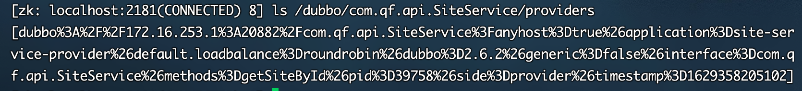
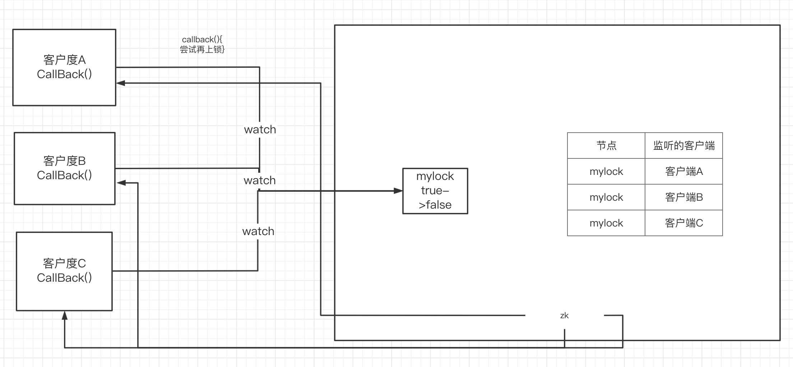
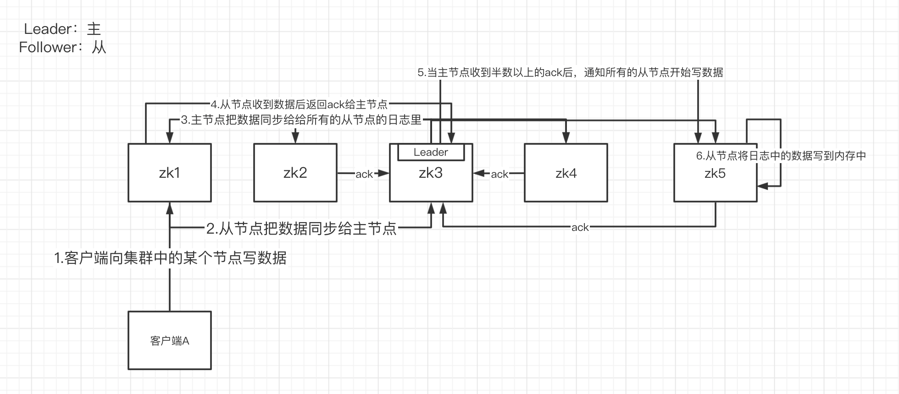
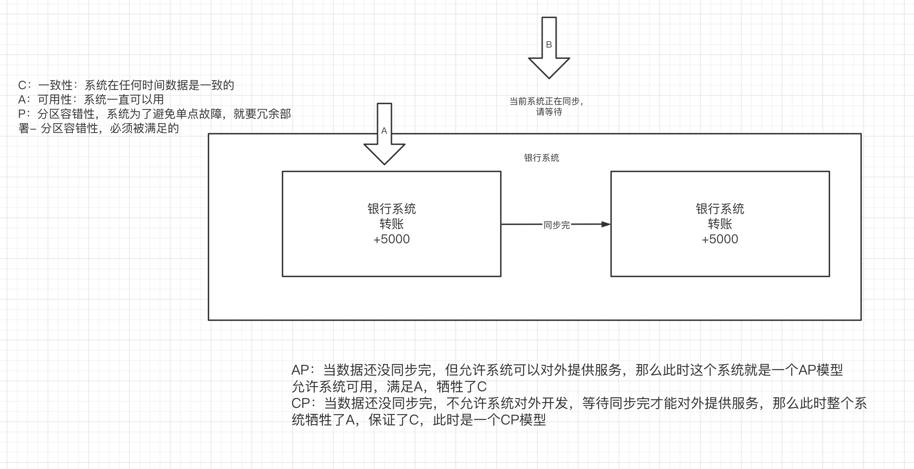
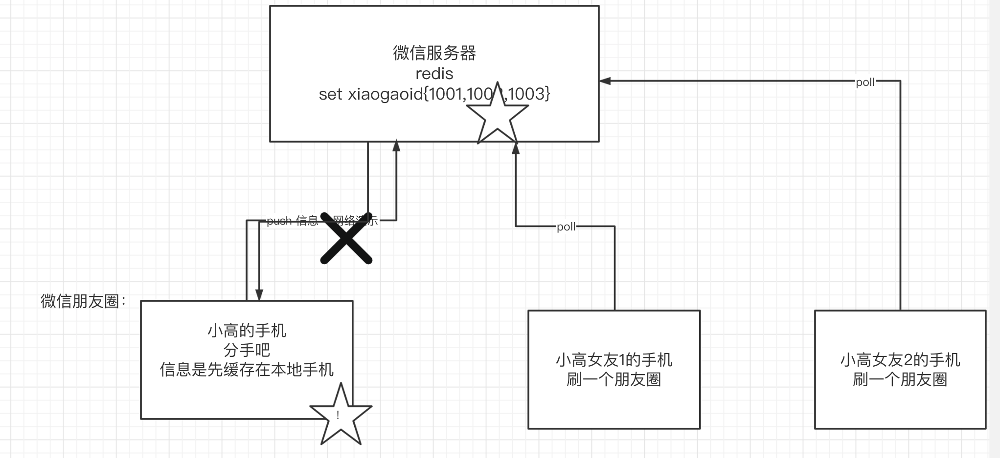

# 一、zookeeper的应用场景  

## 1.分布式协调组件

在分布式系统中，需要有zookeeper作为分布式协调组件，协调分布式系统中的状态。

## 2.分布式锁

zk在实现分布式锁上，可以做到强一致性

## 3.无状态化的实现

# 二、zk内部的数据模型

## 1.zk是如何保存数据的

zk中的数据是保存在节点上的，节点就是znode，多个znode之间构成一颗树的目录结构

以zk作为dubbo的注册中心为例。当有服务注册到zk上时，zk会在内部为服务创建znode节点，来存放服务信息，供消费者去订阅。

通过zkCli工具去查看zk中的节点信息:  ./zkCli.sh

## 2.zk中的znode是什么样的结构

zk中的znode，包含了四个部分：

- data：保存数据
- acl：权限
- stat：描述当前znode的元数据
- child：当前节点的子节点

## 3.zk中节点znode的类型

- 持久节点: 创建出的节点，在会话结束后依然存在。保存数据

- 持久序号节点: 创建出的节点，根据先后顺序，会在节点之后带上一个数值，越后执行数值越大，适用于分布式锁的应用场景- 单调递增

- 临时节点：

  ==临时节点是在会话结束后，自动被删除的，通过这个特性，zk可以实现服务注册与发现的效果==

- 临时序号节点：跟持久序号节点相同，适用于临时的分布式锁。

# 三、zk实现分布式锁

## 1.zk中锁的种类：

- 读锁：大家都可以读，要想上读锁的前提：之前的锁没有写锁
- 写锁：只有得到写锁的才能写。要想上写锁的前提是，之前没有任何锁。

## 2.zk如何上读锁

- 创建一个临时序号节点，节点的数据是read，表示是 读锁

- 获取当前zk中序号比自己小的所有节点

- 判断最小节点是否是读锁：

  - 如果不是读锁的话，则上锁失败，为最小节点设置监听。阻塞等待，zk的watch机制会当最小节点发生变化时通知当前节点，于是再执行第二步的流程

  - 如果是读锁的话，则上锁成功

## 3.zk如何上写锁

- 创建一个临时序号节点，节点的数据是write，表示是 写锁
- 获取zk中所有的子节点
- 判断自己是否是最小的节点：
  - 如果是，则上写锁成功
  - 如果不是，说明前面还有锁，则上锁失败，监听最小的节点，如果最小节点有变化，则回到第二步。

## 4.羊群效应

如果用上述的上锁方式，只要有节点发生变化，就会触发其他节点的监听事件，这样的话对zk的压力非常大，——羊群效应。可以调整成

**链式监听**。解决这个问题。

# 四、zk的watch机制

zk提供了watch机制：让客户端去监听zk中的某个节点，当节点内容发生改变的时候，客户端事先设置好的回调方法就会被调用。

# 五、zk的崩溃恢复机制

## 1.场景

zookeeper作为非常重要的分布式协调组件，需要进行集群部署，集群中会以一主多从的形式进行部署。zookeeper为了保证数据的一致性，使用了ZAB协议，这个协议解决了Zookeeper的崩溃恢复和主从数据同步问题。接下来来看下崩溃恢复是怎么解决的？

## 2.崩溃恢复的实现

第一阶段：投票阶段-》选出多个准leader

1）第1轮：每个节点自己给自己投一票

2）第2轮：每个节点带着自己的事务id，去和相邻的一个节点进行比较，谁事务id大，谁就获得票数

3）投票结束的条件：有节点获得了集群中 半数以上的票数

第二阶段：发现阶段-》确定出真正的leader

在第一阶段结束后会有多个节点获得半数以上的票数，这些节点称为准Leader。

在发现阶段，准leader就要带着自己的事务id，去访问集群中的其他节点，只要准leader获得半数以上的ack，那么准leader将为成为真正的leader

第三阶段：同步阶段

新的主节点中的数据是最新的，于是在这个阶段，新的主节点把数据同步给其他所有从节点，实现集群的数据一致性

# 六、zk的主从数据同步

zk为了保证集群中的每个节点的数据一致性，zk在进行数据同步时，需要经历这么几个步骤

- 客户端向集群写数据
- 从节点将客户端的数据写给主节点
- 主节点收到数据后把数据发给每个从节点。
- 从节点将数据保存在日志中，并返回ack给主节点。
- 当主节点收到半数以上ack后通知从节点写数据
- 从节点将日志中的数据写入到内存中，完成主从数据同步。

# 七、CAP理论

## 1.理论介绍

在分布式系统中，任何的系统必然满足CAP理论，所谓的CAP理论是：

- C： 一致性
- A：可用性
- P：分区容错性

任何系统只能满足CAP中的两项。因为分布系统要避免单点故障，所以必须要满足P。那么在C、A中如何取舍：

如果是CP： 牺牲了可用性，追求数据一致性

如果是AP：牺牲了数据一致性，追求可用性

## 2.CAP中的强一致性和最终一致性

在一致性中，有很多的维度：

- 强一致性：比如说银行的系统

- 弱一致性（最终一致性）

  

- 单调一致性

### 1）zk追求的是强一致性还是最终一致性？

- zk在进行崩溃恢复的时候：追求强一致性：CP模型

- zk在进行数据同步的时候：追求的单调一致性，ap模型，但是牺牲的一致性也不是完全牺牲掉了一致性，而是可以保留一个单调一致性。对于多个客户端连接的同一个zk节点，是可以保证数据一致的。

### 2）eureka追求的是哪一种？

追求的是AP，==所以在注册中心的选型上，eureka更适合于大规模集群。==但是并不意味着ZK就不能用，经过实际检验，**如果客户端数量超过1000台时，zk的崩溃恢复带来的影响才会比较明显。但是我们常常把zk作为服务之间内部rpc调用的注册中心，所以客户端数量一般不会达到1000台**，zk的稳定性也是非常不错的。

## 3.BASE理论

BASE理论是对CAP的延伸。

- BA：基本可用
- S：软状态
- E：最终一致性

当系统因为某些原因，数据不一致，系统处于基本可用的情况，也成为软状态。但是这样的软状态，在经过一段时间后，就会回到数据的一致性，就满足了最终一致性的特点。

​     