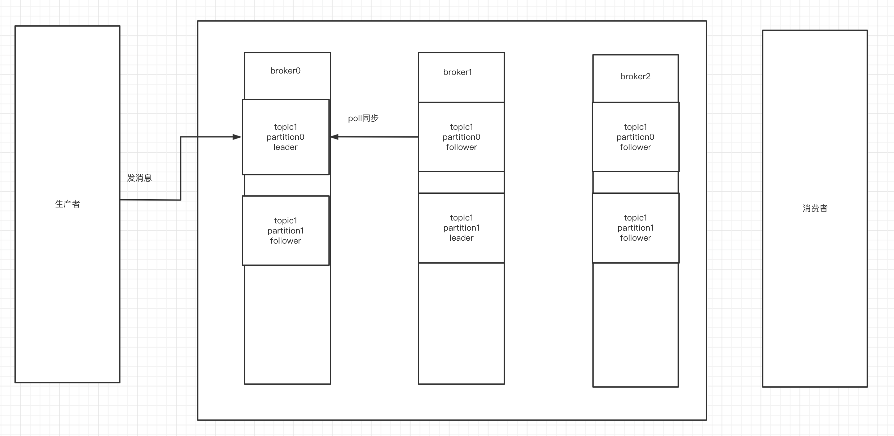
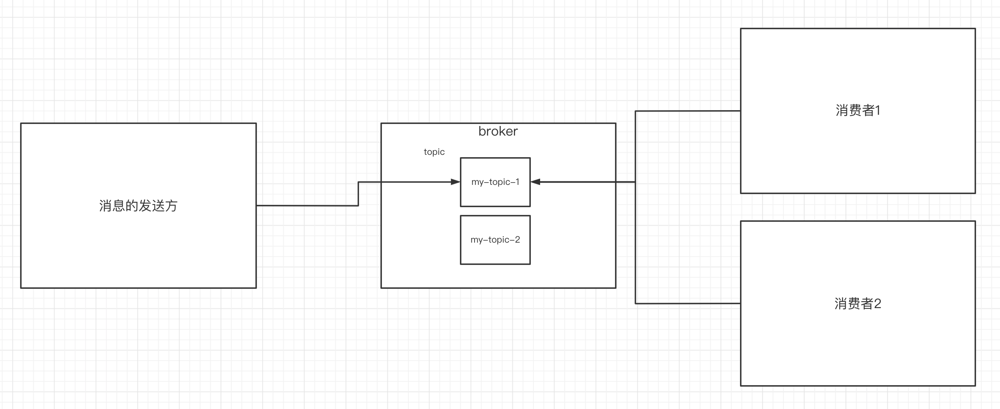
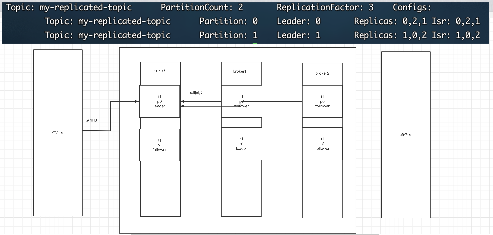
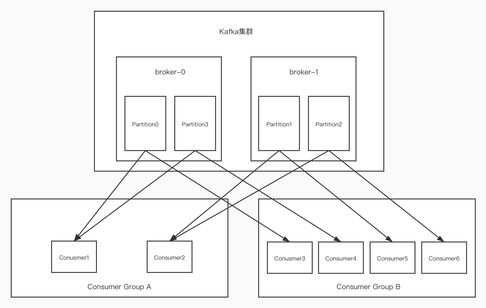

# 一、Kafka介绍

Kafka是最初由Linkedin公司开发，是一个分布式、支持分区的（partition）、多副本的（replica），基于zookeeper协调的分布式消息系统，它的最大的特性就是可以实时的处理大量数据以满足各种需求场景：比如基于hadoop的批处理系统、低延迟的实时系统、Storm/Spark流式处理引擎，web/nginx日志、访问日志，消息服务等等，用scala语言编写，Linkedin于2010年贡献给了Apache基金会并成为顶级开源 项目。

## 1.**Kafka的使用场景**

- 日志收集：一个公司可以用Kafka收集各种服务的log，通过kafka以统一接口服务的方式开放给各种consumer，例如hadoop、Hbase、Solr等。
- 消息系统：解耦和生产者和消费者、缓存消息等。
- 用户活动跟踪：Kafka经常被用来记录web用户或者app用户的各种活动，如浏览网页、搜索、点击等活动，这些活动信息被各个服务器发布到kafka的topic中，然后订阅者通过订阅这些topic来做实时的监控分析，或者装载到hadoop、数据仓库中做离线分析和挖掘。
- 运营指标：Kafka也经常用来记录运营监控数据。包括收集各种分布式应用的数据，生产各种操作的集中反馈，比如报警和报告。

## 2.**Kafka基本概念**

kafka是一个分布式的，分区的消息(官方称之为commit log)服务。它提供一个消息系统应该具备的功能，但是确有着独特的设计。可以这样来说，Kafka借鉴了JMS规范的思想，但是确并**没有完全遵循JMS规范。**

首先，让我们来看一下基础的消息(Message)相关术语：

| **名称**      | **解释**                                                     |
| ------------- | ------------------------------------------------------------ |
| Broker        | 消息中间件处理节点，一个Kafka节点就是一个broker，一个或者多个Broker可以组成一个Kafka集群 |
| Topic         | Kafka根据topic对消息进行归类，发布到Kafka集群的每条消息都需要指定一个topic |
| Producer      | 消息生产者，向Broker发送消息的客户端                         |
| Consumer      | 消息消费者，从Broker读取消息的客户端                         |
| ConsumerGroup | 每个Consumer属于一个特定的Consumer Group，一条消息可以被多个不同的Consumer Group消费，但是一个Consumer Group中只能有一个Consumer能够消费该消息 |
| Partition     | 物理上的概念，一个topic可以分为多个partition，每个partition内部消息是有序的 |

因此，从一个较高的层面上来看，producer通过网络发送消息到Kafka集群，然后consumer来进行消费，如下图：



服务端(brokers)和客户端(producer、consumer)之间通信通过**TCP协议**来完成。

# 二、kafka基本使用

## 1.**安装前的环境准备**

- 安装jdk
- 安装zk
- 官网下载kafka的压缩包:http://kafka.apache.org/downloads 
- 解压缩至如下路径

```
/usr/local/kafka/
```

- 修改配置文件：/usr/local/kafka/kafka2.11-2.4/config/server.properties

```shell
#broker.id属性在kafka集群中必须要是唯一
broker.id=0
#kafka部署的机器ip和提供服务的端口号
listeners=PLAINTEXT://192.168.65.60:9092   
#kafka的消息存储文件
log.dir=/usr/local/data/kafka-logs
#kafka连接zookeeper的地址
zookeeper.connect=192.168.65.60:2181
```

## 2.启动kafka服务器

进入到bin目录下。使用命令来启动

```shell
./kafka-server-start.sh -daemon ../config/server.properties
```

验证是否启动成功：

进入到zk中的节点看id是0的broker有没有存在（上线）

```shell
ls /brokers/ids/
```

**server.properties核心配置详解：**

| **Property**               | **Default**                    | **Description**                                              |
| -------------------------- | ------------------------------ | ------------------------------------------------------------ |
| broker.id                  | 0                              | 每个broker都可以用一个唯一的非负整数id进行标识；这个id可以作为broker的“名字”，你可以选择任意你喜欢的数字作为id，只要id是唯一的即可。 |
| log.dirs                   | /tmp/kafka-logs                | kafka存放数据的路径。这个路径并不是唯一的，可以是多个，路径之间只需要使用逗号分隔即可；每当创建新partition时，都会选择在包含最少partitions的路径下进行。 |
| listeners                  | PLAINTEXT://192.168.65.60:9092 | server接受客户端连接的端口，ip配置kafka本机ip即可            |
| zookeeper.connect          | localhost:2181                 | zooKeeper连接字符串的格式为：hostname:port，此处hostname和port分别是ZooKeeper集群中某个节点的host和port；zookeeper如果是集群，连接方式为 hostname1:port1, hostname2:port2, hostname3:port3 |
| log.retention.hours        | 168                            | 每个日志文件删除之前保存的时间。默认数据保存时间对所有topic都一样。 |
| num.partitions             | 1                              | 创建topic的默认分区数                                        |
| default.replication.factor | 1                              | 自动创建topic的默认副本数量，建议设置为大于等于2             |
| min.insync.replicas        | 1                              | 当producer设置acks为-1时，min.insync.replicas指定replicas的最小数目（必须确认每一个repica的写数据都是成功的），如果这个数目没有达到，producer发送消息会产生异常 |
| delete.topic.enable        | false                          | 是否允许删除主题                                             |

## 3.创建主题topic

topic是什么概念？topic可以实现消息的分类，不同消费者订阅不同的topic。



执行以下命令创建名为“test”的topic，这个topic只有一个partition，并且备份因子也设置为1：

```shell
./kafka-topics.sh --create --zookeeper 172.16.253.35:2181 --replication-factor 1 --partitions 1 --topic test
```

查看当前kafka内有哪些topic

```shell
 ./kafka-topics.sh --list --zookeeper 172.16.253.35:2181 
```

## 4.发送消息

kafka自带了一个producer命令客户端，可以从本地文件中读取内容，或者我们也可以以命令行中直接输入内容，并将这些内容以消息的形式发送到kafka集群中。在默认情况下，每一个行会被当做成一个独立的消息。使用kafka的发送消息的客户端，指定发送到的kafka服务器地址和topic

```shell
./kafka-console-producer.sh --broker-list 172.16.253.38:9092 --topic test
```

## 5.消费消息

对于consumer，kafka同样也携带了一个命令行客户端，会将获取到内容在命令中进行输出，**默认是消费最新的消息**。使用kafka的消费者消息的客户端，从指定kafka服务器的指定topic中消费消息

- 方式一：从最后一条消息的偏移量+1开始消费

```shell
./kafka-console-consumer.sh --bootstrap-server 172.16.253.38:9092 --topic test
```

- 方式二：从头开始消费

```shell
./kafka-console-consumer.sh --bootstrap-server 172.16.253.38:9092 --from-beginning --topic test
```

几个注意点：

- 消息会被存储
- 消息是顺序存储
- 消息是有偏移量的
- 消费时可以指明偏移量进行消费

# 三、Kafka中的关键细节

## 1.消息的顺序存储

消息的发送方会把消息发送到broker中，broker会存储消息，消息是按照发送的顺序进行存储。因此消费者在消费消息时可以指明主题中消息的偏移量。默认情况下，是从最后一个消息的下一个偏移量开始消费。


## 2. 单播消息的实现

单播消息：一个消费组里 只会有一个消费者能消费到某一个topic中的消息。于是可以创建多个消费者，这些消费者在同一个消费组中。

```shell
./kafka-console-consumer.sh --bootstrap-server 10.31.167.10:9092  --consumer-property group.id=testGroup --topic test
```


## 3.多播消息的实现

在一些业务场景中需要让一条消息被多个消费者消费，那么就可以使用多播模式。

kafka实现多播，只需要让不同的消费者处于不同的消费组即可。

```shell
./kafka-console-consumer.sh --bootstrap-server 10.31.167.10:9092  --consumer-property group.id=testGroup1 --topic test
./kafka-console-consumer.sh --bootstrap-server 10.31.167.10:9092  --consumer-property group.id=testGroup2 --topic test

```


## 4.查看消费组及信息

```shell
# 查看当前主题下有哪些消费组
./kafka-consumer-groups.sh --bootstrap-server 10.31.167.10:9092 --list

# 查看消费组中的具体信息：比如当前偏移量、最后一条消息的偏移量、堆积的消息数量
 ./kafka-consumer-groups.sh --bootstrap-server 172.16.253.38:9092 --describe --group testGroup
```


- Currennt-offset: 当前消费组的已消费偏移量
- Log-end-offset: 主题对应分区消息的结束偏移量(HW)
- Lag: 当前消费组未消费的消息数


# 四、主题、分区的概念

## 1.主题Topic

主题Topic可以理解成是一个类别的名称。

## 2.partition分区


一个主题中的消息量是非常大的，因此可以通过分区的设置，来分布式存储这些消息。比如一个topic创建了3个分区。那么topic中的消息就会分别存放在这三个分区中。


**为一个主题创建多个分区**

```shell
./kafka-topics.sh --create --zookeeper localhost:2181 --partitions 2 --topic test1
```


**可以通过这样的命令查看topic的分区信息**

```shell
./kafka-topics.sh --describe --zookeeper localhost:2181 --topic test1
```

分区的作用：

- 可以分布式存储
- 可以并行写


实际上是存在data/kafka-logs/test-0 和 test-1中的0000000.log文件中

小细节：

- 定期将⾃⼰消费分区的offset提交给kafka内部topic：__consumer_offsets，提交过去的时候，key是consumerGroupId+topic+分区号，value就是当前offset的值，kafka会定期清理topic⾥的消息，最后就保留最新的那条数据

  因为__consumer_offsets可能会接收⾼并发的请求，kafka默认给其分配50个分区(可以通过offsets.topic.num.partitions设置)，这样可以通过加机器的⽅式抗⼤并发。

  通过如下公式可以选出consumer消费的offset要提交到__consumer_offsets的哪个分区

  公式：hash(consumerGroupId) % __consumer_offsets主题的分区数


# 五、Kafka集群及副本的概念

## 1.搭建kafka集群，3个broker

准备3个server.properties文件

每个文件中的这些内容要调整

- server.properties

```shell
broker.id=0
listeners=PLAINTEXT://192.168.65.60:9092
log.dir=/usr/local/data/kafka-logs
```


- server1.properties

```shell
broker.id=1
listeners=PLAINTEXT://192.168.65.60:9093
log.dir=/usr/local/data/kafka-logs-1
```


- server2.properties

```shell
broker.id=2
listeners=PLAINTEXT://192.168.65.60:9094
log.dir=/usr/local/data/kafka-logs-2
```


使用如下命令来启动3台服务器

```shell
./kafka-server-start.sh -daemon ../config/server0.properties
./kafka-server-start.sh -daemon ../config/server1.properties
./kafka-server-start.sh -daemon ../config/server2.properties
```


搭建完后通过查看zk中的/brokers/ids 看是否启动成功


## 2.副本的概念

副本是对分区的备份。在集群中，不同的副本会被部署在不同的broker上。下面例子：创建1个主题，2个分区、3个副本。

```shell
./kafka-topics.sh --create --zookeeper 172.16.253.35:2181 --replication-factor 3 --partitions 2 --topic my-replicated-topic
```



通过查看主题信息，其中的关键数据：

- replicas：

  当前副本存在的broker节点

- leader：副本里的概念

  每个partition都有一个broker作为leader。

  消息发送方要把消息发给哪个broker？就看副本的leader是在哪个broker上面。副本里的leader专门用来接收消息。

  接收到消息，其他follower通过poll的方式来同步数据。

- follower：leader处理所有针对这个partition的读写请求，而follower被动复制leader，不提供读写（主要是为了保证多副本数据与消费的一致性），如果leader所在的broker挂掉，那么就会进行新leader的选举，至于怎么选，在之后的controller的概念中介绍。

通过kill掉leader后再查看主题情况

```shell
# kill掉leader
ps -aux | grep server.properties
kill 17631
# 查看topic情况
./kafka-topics.sh --describe --zookeeper 172.16.253.35:2181 --topic my-replicated-topic
```

- isr：

  可以同步的broker节点和已同步的broker节点，存放在isr集合中。


## 3.broker、主题、分区、副本

- kafka集群中由多个broker组成
- 一个broker中存放一个topic的不同partition——副本


## 4.kafka集群消息的发送

```shell
./kafka-console-producer.sh --broker-list 172.16.253.38:9092,172.16.253.38:9093,172.16.253.38:9094 --topic my-replicated-topic
```

## 5.kafka集群消息的消费

```shell
./kafka-console-consumer.sh --bootstrap-server 172.16.253.38:9092,172.16.253.38:9093,172.16.253.38:9094 --from-beginning --topic my-replicated-topic
```


## 6.关于分区消费组消费者的细节



图中Kafka集群有两个broker，每个broker中有多个partition。一个partition只能被一个消费组里的某一个消费者消费，从而保证消费顺序。Kafka只在partition的范围内保证消息消费的局部顺序性，不能在同⼀个topic中的多个partition中保证总的消费顺序性。一个消费者可以消费多个partition。

消费组中消费者的数量不能比一个topic中的partition数量多，否则多出来的消费者消费不到消息。

