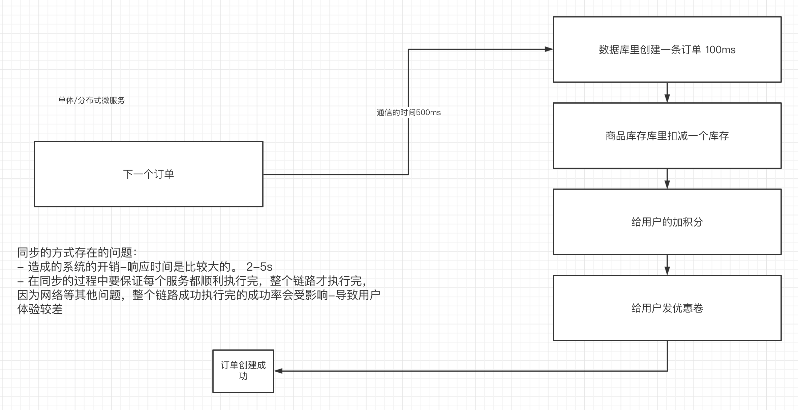
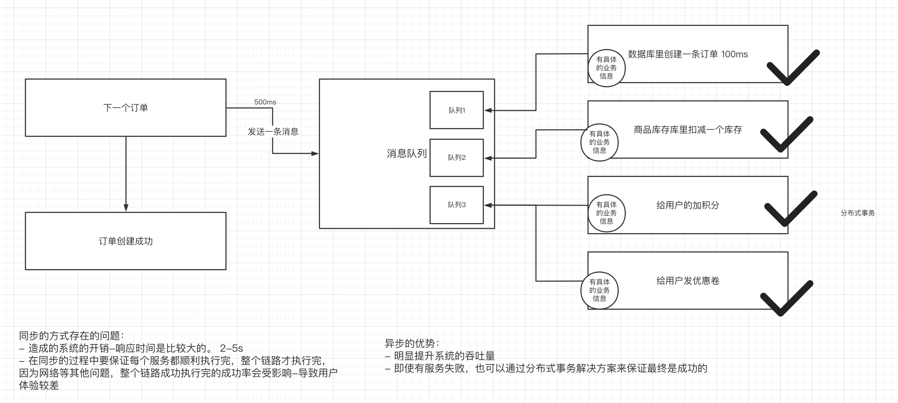
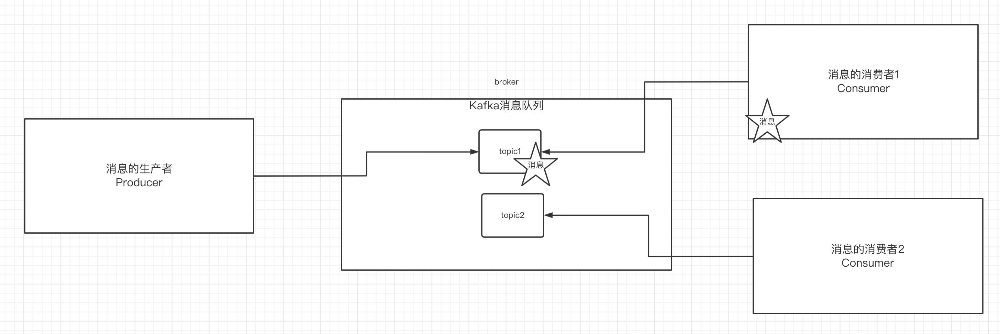
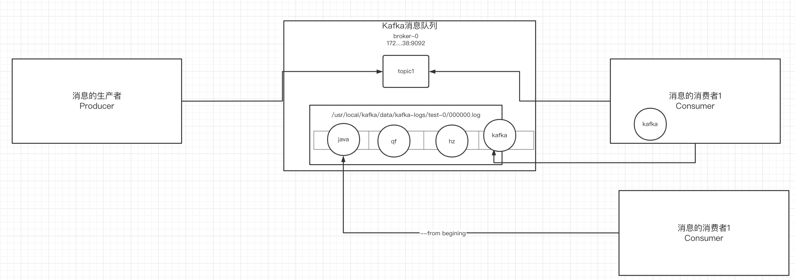
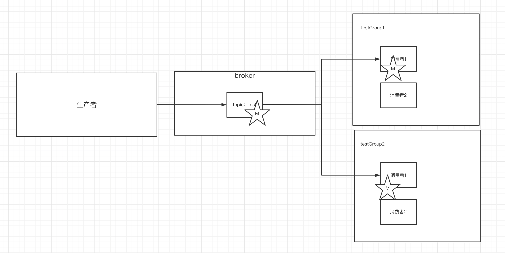
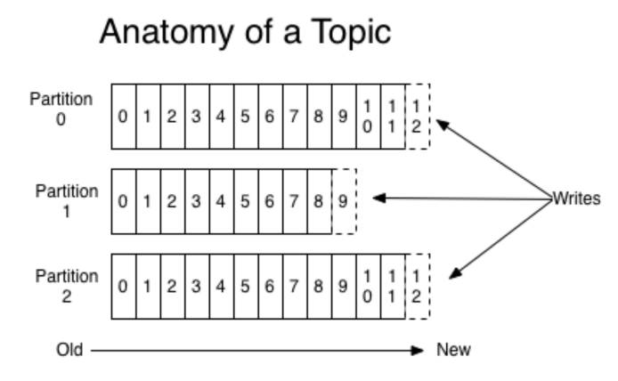
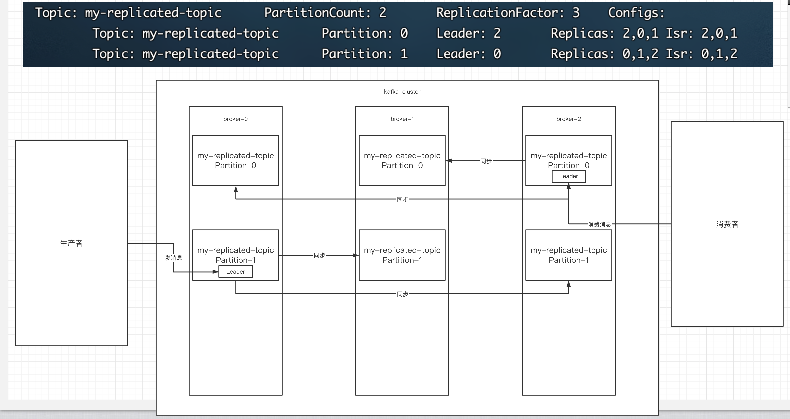

# 一、为什么使用消息队列

## 1.使用同步的通信方式来解决多个服务之间的通信



同步的通信方式会存在性能和稳定性的问题。


## 2.使用异步的通信方式



针对于同步的通信方式来说，异步的方式，可以让上游快速成功，极大提高了系统的吞吐量。而且在分布式系统中，通过下游多个服务的分布式事务的保障，也能保障业务执行之后的最终一致性。

消息队列解决具体的是什么问题——通信问题。


# 二、消息队列的流派

目前消息队列的中间件选型有很多种：

- rabbitMQ：内部的可玩性（功能性）是非常强的
- rocketMQ： 阿里内部一个大神，根据kafka的内部执行原理，手写的一个消息队列中间件。性能是与Kafka相比肩，除此之外，在功能上封装了更多的功能。
- kafka：全球消息处理性能最快的一款MQ

- zeroMQ

这些消息队列中间件有什么区别？

## 1. 有broker

- 重topic：Kafka、RocketMQ、ActiveMQ

  整个broker，依据topic来进行消息的中转。在重topic的消息队列里必然需要topic的存在

- 轻topic：RabbitMQ

  topic只是一种中转模式。


## 2.无broker

在生产者和消费者之间没有使用broker，例如zeroMQ，直接使用socket进行通信。


# 三、Kafka的基本知识

## 1.Kafka的安装

- 部署一台zookeeper服务器
- 安装jdk
- 下载kafka的安装包：http://kafka.apache.org/downloads
- 上传到kafka服务器上：`/usr/local/kafka`
- 解压缩压缩包
- 进入到config目录内，修改server.properties

```shell
#broker.id属性在kafka集群中必须要是唯一
broker.id=0
#kafka部署的机器ip和提供服务的端口号
listeners=PLAINTEXT://192.168.65.60:9092   
#kafka的消息存储文件
log.dir=/usr/local/data/kafka-logs
#kafka连接zookeeper的地址
zookeeper.connect=192.168.65.60:2181
```

- 进入到bin目录内，执行以下命令来启动kafka服务器（带着配置文件）

```shell
./kafka-server-start.sh -daemon ../config/server.properties 
```

- 校验kafka是否启动成功：

进入到zk内查看是否有kafka的节点：`/brokers/ids/0`

## 2.kafka中的一些基本概念

kafka中有这么些复杂的概念




| **名称** | **解释**                                                     |
| -------- | ------------------------------------------------------------ |
| Broker   | 消息中间件处理节点，一个Kafka节点就是一个broker，一个或者多个Broker可以组成一个Kafka集群 |
| Topic    | Kafka根据topic对消息进行归类，发布到Kafka集群的每条消息都需要指定一个topic |
| Producer | 消息生产者，向Broker发送消息的客户端                         |
| Consumer | 消息消费者，从Broker读取消息的客户端                         |
|          |                                                              |
|          |                                                              |


## 3.创建topic

- 通过kafka命令向zk中创建一个主题

```shell
./kafka-topics.sh --create --zookeeper 172.16.253.35:2181 --replication-factor 1 --partitions 1 --topic test
```

- 查看当前zk中所有的主题

```shell
./kafka-topics.sh --list --zookeeper 172.16.253.35:2181
test
```


## 4.发送消息

把消息发送给broker中的某个topic，打开一个kafka发送消息的客户端，然后开始用客户端向kafka服务器发送消息

```shell
./kafka-console-consumer.sh --bootstrap-server 172.16.253.38:9092 --topic test
```


## 5.消费消息

打开一个消费消息的客户端，向kafka服务器的某个主题消费消息

- 方式一：从当前主题中的最后一条消息的offset（偏移量位置）+1开始消费

```shell
./kafka-console-consumer.sh --bootstrap-server 172.16.253.38:9092 --topic test
```

- 方式二：从当前主题中的第一条消息开始消费

```shell
./kafka-console-consumer.sh --bootstrap-server 172.16.253.38:9092 --from-beginning --topic test
```


## 6.关于消息的细节



- 生产者将消息发送给broker，broker会将消息保存在本地的日志文件中

```shell
/usr/local/kafka/data/kafka-logs/主题-分区/00000000.log
```

- 消息的保存是有序的，通过offset偏移量来描述消息的有序性
- 消费者消费消息时也是通过offset来描述当前要消费的那条消息的位置


## 7.单播消息

在一个kafka的topic中，启动两个消费者，一个生产者，问：生产者发送消息，这条消息是否同时会被两个消费者消费？

同一个消费组中只能有一个消费者收到一个topic中的消息。

```
./kafka-console-consumer.sh --bootstrap-server 172.16.253.38:9092  --consumer-property group.id=testGroup --topic test
```


## 8.多播消息

不同的消费组订阅同一个topic，那么不同的消费组中的一个消费者能收到消息。实际上也是多个消费组中的多个消费者收到了同一个消息。

```shell
./kafka-console-consumer.sh --bootstrap-server 172.16.253.38:9092  --consumer-property group.id=testGroup1 --topic test
./kafka-console-consumer.sh --bootstrap-server 172.16.253.38:9092  --consumer-property group.id=testGroup2 --topic test
```


下图就是描述多播和单播消息的区别




## 9. 查看消费组的详细信息

通过以下命令可以查看到消费组的相信信息：

```shell
./kafka-consumer-groups.sh --bootstrap-server 172.16.253.38:9092 --describe --group testGroup
```


重点关注以下几个信息：

- current-offset: 最后被消费的消息的偏移量
- Log-end-offset: 消息总量（最后一条消息的偏移量）
- Lag：积压了多少条消息


# 四、Kafka中主题和分区的概念

## 1.主题Topic

主题-topic在kafka中是一个逻辑的概念，kafka通过topic将消息进行分类。不同的topic会被订阅该topic的消费者消费。

但是有一个问题，如果说这个topic中的消息非常非常多，多到需要几T来存，因为消息是会被保存到log日志文件中的。为了解决这个文件过大的问题，kafka提出了Partition分区的概念

## 2.分区Partition

### 1）分区的概念

通过partition将一个topic中的消息分区来存储。这样的好处有多个：

- 分区存储，可以解决统一存储文件过大的问题
- 提供了读写的吞吐量：读和写可以同时在多个分区中进行




### 2）创建多分区的主题

```shell
./kafka-topics.sh --create --zookeeper 172.16.253.35:2181 --replication-factor 1 --partitions 2 --topic test1
```


## 3.kafka中消息日志文件中保存的内容

- 00000.log： 

- __consumer_offsets-49:

  kafka内部自己创建了__consumer_offsets主题包含了50个分区。这个主题用来存放消费者消费某个主题的偏移量。因为每个消费者都会自己维护着消费的主题的偏移量，也就是说每个消费者会把消费的主题的偏移量自主上报给kafka中的默认主题：consumer_offsets。因此kafka为了提升这个主题的并发性，默认设置了50个分区。

  - 提交到哪个分区：通过hash函数：hash(consumerGroupId) % __consumer_offsets主题的分区数

  - 提交到该主题中的内容是：key是consumerGroupId+topic+分区号，value就是当前offset的值

- 文件中保存的消息，默认保存7天。七天到后消息会被删除。


# 五、Kafka集群操作

## 1.搭建kafka集群（三个broker）

- 创建三个server.properties文件

```shell
# 0 1 2
broker.id=2
// 9092 9093 9094
listeners=PLAINTEXT://192.168.65.60:9094
//kafka-logs kafka-logs-1 kafka-logs-2
log.dir=/usr/local/data/kafka-logs-2
```

- 通过命令来启动三台broker

```shell
./kafka-server-start.sh -daemon ../config/server.properties
./kafka-server-start.sh -daemon ../config/server1.properties
./kafka-server-start.sh -daemon ../config/server2.properties
```

- 校验是否启动成功:ps -aux | grep server.properties   
- 无法启动可能的解决方案:执行启动命令后等待执行,不要按任何键,或者是删除data文件夹中的内容

进入到zk中查看/brokers/ids中过是否有三个znode（0，1，2）


## 2.副本的概念

在创建主题时，除了指明了主题的分区数以外，还指明了副本数，那么副本是一个什么概念呢？

```shell
./kafka-topics.sh --create --zookeeper 172.16.253.35:2181 --replication-factor 3 --partitions 2 --topic my-replicated-topic
```


副本是为了为主题中的分区创建多个备份，多个副本在kafka集群的多个broker中，会有一个副本作为leader，其他是follower。

查看topic情况：

```shell
# 查看topic情况
./kafka-topics.sh --describe --zookeeper 172.16.253.35:2181 --topic my-replicated-topic
```




- leader：

kafka的写和读的操作，都发生在leader上。leader负责把数据同步给follower。当leader挂了，经过主从选举，从多个follower中选举产生一个新的leader

- follower

接收leader的同步的数据

- isr：

  可以同步和已同步的节点会被存入到isr集合中。这里有一个细节：如果isr中的节点性能较差，会被提出isr集合。


（重点～！）此时，broker、主题、分区、副本 这些概念就全部展现了，大家需要把这些概念梳理清楚：

集群中有多个broker，创建主题时可以指明主题有多个分区（把消息拆分到不同的分区中存储），可以为分区创建多个副本，不同的副本存放在不同的broker里。


## 3.关于集群消费


### 1）向集群发送消息：

```shell
./kafka-console-consumer.sh --bootstrap-server 172.16.253.38:9092,172.16.253.38:9093,172.16.253.38:9094 --from-beginning --consumer-property group.id=testGroup1 --topic my-replicated-topic
```

### 2）从集群中消费消息

```shell
./kafka-console-producer.sh --broker-list 172.16.253.38:9092,172.16.253.38:9093,172.16.253.38:9094 --topic my-replicated-topic
```

### 3）指定消费组来消费消息

```shell
./kafka-console-consumer.sh --bootstrap-server 172.16.253.38:9092,172.16.253.38:9093,172.16.253.38:9094 --from-beginning --consumer-property group.id=testGroup1 --topic my-replicated-topic
```

### 4）分区分消费组的集群消费中的细节


- 一个partition只能被一个消费组中的一个消费者消费，目的是为了保证消费的顺序性，但是多个partion的多个消费者消费的总的顺序性是得不到保证的，那怎么做到消费的总顺序性呢？

- partition的数量决定了消费组中消费者的数量，建议同一个消费组中消费者的数量不要超过partition的数量，否则多的消费者消费不到消息

- 如果消费者挂了，那么会触发rebalance机制（后面介绍），会让其他消费者来消费该分区

  

 # 六、kafka的java客户端-生产者的实现

## 1.生产者的基本实现

- 引入依赖

```xml
<dependency>
      <groupId>org.apache.kafka</groupId>
      <artifactId>kafka-clients</artifactId>
      <version>2.4.1</version>
    </dependency>
```

- 具体实现

```java
package com.qf.kafka;

import org.apache.kafka.clients.producer.*;
import org.apache.kafka.common.serialization.StringSerializer;

import java.util.Properties;
import java.util.concurrent.ExecutionException;

public class MySimpleProducer {

  private final static String TOPIC_NAME = "my-replicated-topic";

  public static void main(String[] args) throws ExecutionException, InterruptedException {

    //1.设置参数
    Properties props = new Properties();
    props.put(ProducerConfig.BOOTSTRAP_SERVERS_CONFIG, "172.16.253.38:9092,172.16.253.38:9093,172.16.253.38:9094");

    //把发送的key从字符串序列化为字节数组
    props.put(ProducerConfig.KEY_SERIALIZER_CLASS_CONFIG, StringSerializer.class.getName());
    //把发送消息value从字符串序列化为字节数组
    props.put(ProducerConfig.VALUE_SERIALIZER_CLASS_CONFIG, StringSerializer.class.getName());

    //2.创建生产消息的客户端，传入参数
    Producer<String,String> producer = new KafkaProducer<String, String>(props);

    //3.创建消息
    //key：作用是决定了往哪个分区上发，value：具体要发送的消息内容
    ProducerRecord<String,String> producerRecord = new ProducerRecord<>(TOPIC_NAME,"mykeyvalue","hellokafka");

    //4.发送消息,得到消息发送的元数据并输出
    RecordMetadata metadata = producer.send(producerRecord).get();
    System.out.println("同步方式发送消息结果：" + "topic-" + metadata.topic() + "|partition-"
      + metadata.partition() + "|offset-" + metadata.offset());
  }
}

```


## 2.生产者的同步发送消息


如果生产者发送消息没有收到ack，生产者会阻塞，阻塞到3s的时间，如果还没有收到消息，会进行重试。重试的次数3次。

```java
    RecordMetadata metadata = producer.send(producerRecord).get();
    System.out.println("同步方式发送消息结果：" + "topic-" + metadata.topic() + "|partition-"
      + metadata.partition() + "|offset-" + metadata.offset());
```


## 3.生产者的异步发送消息


异步发送，生产者发送完消息后就可以执行之后的业务，broker在收到消息后异步调用生产者提供的callback回调方法。

```java
//5.异步发送消息
    producer.send(producerRecord, new Callback() {
      public void onCompletion(RecordMetadata metadata, Exception exception) {
        if (exception != null) {
          System.err.println("发送消息失败：" + exception.getStackTrace());

        }
        if (metadata != null) {
          System.out.println("异步方式发送消息结果：" + "topic-" + metadata.topic() + "|partition-"
            + metadata.partition() + "|offset-" + metadata.offset());
        }
      }
    });
```


## 4.生产者中的ack的配置

在同步发送的前提下，生产者在获得集群返回的ack之前会一直阻塞。那么集群什么时候返回ack呢？此时ack有3个配置：

- ack = 0   kafka-cluster不需要任何的broker收到消息，就立即返回ack给生产者，最容易丢消息的，效率是最高的

- ack=1（默认）： 多副本之间的leader已经收到消息，并把消息写入到本地的log中，才会返回ack给生产者，性能和安全性是最均衡的

- ack=-1/all。里面有默认的配置min.insync.replicas=2(默认为1，推荐配置大于等于2)，此时就需要leader和一个follower同步完后，才会返回ack给生产者（此时集群中有2个broker已完成数据的接收），这种方式最安全，但性能最差。


下面是关于ack和重试（如果没有收到ack，就开启重试）的配置

```java
		props.put(ProducerConfig.ACKS_CONFIG, "1");
     /*
        发送失败会重试，默认重试间隔100ms，重试能保证消息发送的可靠性，但是也可能造成消息重复发送，比如网络抖动，所以需要在
        接收者那边做好消息接收的幂等性处理
        */	
        props.put(ProducerConfig.RETRIES_CONFIG, 3);
        //重试间隔设置
        props.put(ProducerConfig.RETRY_BACKOFF_MS_CONFIG, 300);
```


## 5.关于消息发送的缓冲区


- kafka默认会创建一个消息缓冲区，用来存放要发送的消息，缓冲区是32m

```java
props.put(ProducerConfig.BUFFER_MEMORY_CONFIG, 33554432);
```

- kafka本地线程会去缓冲区中一次拉16k的数据，发送到broker

```java
props.put(ProducerConfig.BATCH_SIZE_CONFIG, 16384);
```

- 如果线程拉不到16k的数据，间隔10ms也会将已拉到的数据发到broker

```java
props.put(ProducerConfig.LINGER_MS_CONFIG, 10);
```

# 七、Java客户端消费者的实现细节

## 1.消费者的基本实现

```java
package com.qf.kafka;

import org.apache.kafka.clients.consumer.ConsumerConfig;
import org.apache.kafka.clients.consumer.ConsumerRecord;
import org.apache.kafka.clients.consumer.ConsumerRecords;
import org.apache.kafka.clients.consumer.KafkaConsumer;
import org.apache.kafka.common.serialization.StringDeserializer;

import java.time.Duration;
import java.util.Arrays;
import java.util.Properties;

public class MySimpleConsumer {


  private final static String TOPIC_NAME = "my-replicated-topic";
  private final static String CONSUMER_GROUP_NAME = "testGroup";

  public static void main(String[] args) {
    Properties props = new Properties();
    props.put(ConsumerConfig.BOOTSTRAP_SERVERS_CONFIG, "172.16.253.38:9092,172.16.253.38:9093,172.16.253.38:9094");
    // 消费分组名
    props.put(ConsumerConfig.GROUP_ID_CONFIG, CONSUMER_GROUP_NAME);
    props.put(ConsumerConfig.KEY_DESERIALIZER_CLASS_CONFIG, StringDeserializer.class.getName());
    props.put(ConsumerConfig.VALUE_DESERIALIZER_CLASS_CONFIG, StringDeserializer.class.getName());
    //1.创建一个消费者的客户端
    KafkaConsumer<String, String> consumer = new KafkaConsumer<String, String>(props);
    //2. 消费者订阅主题列表
    consumer.subscribe(Arrays.asList(TOPIC_NAME));

    while (true) {
      /*
       * 3.poll() API 是拉取消息的长轮询
       */
      ConsumerRecords<String, String> records = consumer.poll(Duration.ofMillis(1000));
      for (ConsumerRecord<String, String> record : records) {
        //4.打印消息
        System.out.printf("收到消息：partition = %d,offset = %d, key = %s, value = %s%n", record.partition(),
          record.offset(), record.key(), record.value());
      }
    }
  }

}

```

## 2.关于消费者自动提交和手动提交offset

### 1）提交的内容

消费者无论是自动提交还是手动提交，都需要把所属的消费组+消费的某个主题+消费的某个分区及消费的偏移量，这样的信息提交到集群的_consumer_offsets主题里面。

### 2）自动提交

消费者poll消息下来以后就会自动提交offset

```java
// 是否自动提交offset，默认就是true
props.put(ConsumerConfig.ENABLE_AUTO_COMMIT_CONFIG, "true");
// 自动提交offset的间隔时间
props.put(ConsumerConfig.AUTO_COMMIT_INTERVAL_MS_CONFIG, "1000");
```

注意：自动提交会丢消息。因为消费者在消费前提交offset，有可能提交完后还没消费时消费者挂了。

### 3）手动提交

需要把自动提交的配置改成false

```java
props.put(ConsumerConfig.ENABLE_AUTO_COMMIT_CONFIG, "false");
```

手动提交又分成了两种：

- 手动同步提交

  在消费完消息后调用同步提交的方法，当集群返回ack前一直阻塞，返回ack后表示提交成功，执行之后的逻辑

  ```java
   while (true) {
        /*
         * poll() API 是拉取消息的长轮询
         */
        ConsumerRecords<String, String> records = consumer.poll(Duration.ofMillis(1000));
        for (ConsumerRecord<String, String> record : records) {
          System.out.printf("收到消息：partition = %d,offset = %d, key = %s, value = %s%n", record.partition(),
            record.offset(), record.key(), record.value());
        }
        //所有的消息已消费完
        if (records.count() > 0) {//有消息
          // 手动同步提交offset，当前线程会阻塞直到offset提交成功
          // 一般使用同步提交，因为提交之后一般也没有什么逻辑代码了
          consumer.commitSync();//=======阻塞=== 提交成功
        }
      }
    }
  ```

  

- 手动异步提交

  在消息消费完后提交，不需要等到集群ack，直接执行之后的逻辑，可以设置一个回调方法，供集群调用

  ```java
   while (true) {
        /*
         * poll() API 是拉取消息的长轮询
         */
        ConsumerRecords<String, String> records = consumer.poll(Duration.ofMillis(1000));
        for (ConsumerRecord<String, String> record : records) {
          System.out.printf("收到消息：partition = %d,offset = %d, key = %s, value = %s%n", record.partition(),
            record.offset(), record.key(), record.value());
        }
        //所有的消息已消费完
        if (records.count() > 0) {
  
          // 手动异步提交offset，当前线程提交offset不会阻塞，可以继续处理后面的程序逻辑
          consumer.commitAsync(new OffsetCommitCallback() {
            @Override
            public void onComplete(Map<TopicPartition, OffsetAndMetadata> offsets, Exception exception) {
              if (exception != null) {
                System.err.println("Commit failed for " + offsets);
                System.err.println("Commit failed exception: " + exception.getStackTrace());
              }
            }
          });
  
        }
      }
    }
  ```

  

## 3.长轮询poll消息

- 默认情况下，消费者一次会poll500条消息。

```java
//一次poll最大拉取消息的条数，可以根据消费速度的快慢来设置
props.put(ConsumerConfig.MAX_POLL_RECORDS_CONFIG, 500);
```

- 代码中设置了长轮询的时间是1000毫秒

```java
 while (true) {
      /*
       * poll() API 是拉取消息的长轮询
       */
      ConsumerRecords<String, String> records = consumer.poll(Duration.ofMillis(1000));
      for (ConsumerRecord<String, String> record : records) {
        System.out.printf("收到消息：partition = %d,offset = %d, key = %s, value = %s%n", record.partition(),
          record.offset(), record.key(), record.value());
      }
```

意味着：

- - 如果一次poll到500条，就直接执行for循环
  - 如果这一次没有poll到500条。且时间在1秒内，那么长轮询继续poll，要么到500条，要么到1s
  - 如果多次poll都没达到500条，且1秒时间到了，那么直接执行for循环
- 如果两次poll的间隔超过30s，集群会认为该消费者的消费能力过弱，该消费者被踢出消费组，触发rebalance机制，rebalance机制会造成性能开销。可以通过设置这个参数，让一次poll的消息条数少一点

```java
  //一次poll最大拉取消息的条数，可以根据消费速度的快慢来设置
    props.put(ConsumerConfig.MAX_POLL_RECORDS_CONFIG, 500);
    //如果两次poll的时间如果超出了30s的时间间隔，kafka会认为其消费能力过弱，将其踢出消费组。将分区分配给其他消费者。-rebalance
    props.put(ConsumerConfig.MAX_POLL_INTERVAL_MS_CONFIG, 30 * 1000);
```

# 作业

- 掌握kafka的单播、多播
- 掌握集群搭建
- 掌握broker、主题、分区、副本
- 掌握java客户端的生产者和消费者