# ==一、为什么使用消息队列

## 1.使用同步的通信方式来解决多个服务之间的通信


同步的通信方式会存在性能和稳定性的问题。


## 2.使用异步的通信方式


针对于同步的通信方式来说，==异步的方式，可以让上游快速成功，极大提高了系统的吞吐量。==而且在分布式系统中，通过下游多个服务的分布式事务的保障，也能保障业务执行之后的最终一致性。

==消息队列解决具体的是什么问题——通信问题。==


# 二、消息队列的流派

目前消息队列的中间件选型有很多种：

- rabbitMQ：内部的可玩性（功能性）是非常强的
- rocketMQ： 阿里内部一个大神，根据kafka的内部执行原理，手写的一个消息队列中间件。性能是与Kafka相比肩，除此之外，在功能上封装了更多的功能。
- ==kafka：全球消息处理性能最快的一款MQ==

- zeroMQ

这些消息队列中间件有什么区别？

## 1. 有broker

- 重topic：Kafka、RocketMQ、ActiveMQ

  整个broker，依据topic来进行消息的中转。在重topic的消息队列里必然需要topic的存在

- 轻topic：RabbitMQ

  topic只是一种中转模式。


## 2.无broker

在生产者和消费者之间没有使用broker，例如zeroMQ，直接使用socket进行通信。


# 三、Kafka的基本知识

## 1.Kafka的安装

- 部署一台zookeeper服务器
- 安装jdk
- 下载kafka的安装包：http://kafka.apache.org/downloads
- 上传到kafka服务器上：`/usr/local/kafka`
- 解压缩压缩包
- 进入到config目录内，修改server.properties

```shell
#broker.id属性在kafka集群中必须要是唯一
broker.id=0
#kafka部署的机器ip和提供服务的端口号
listeners=PLAINTEXT://192.168.65.60:9092   
#kafka的消息存储文件
log.dir=/usr/local/data/kafka-logs
#kafka连接zookeeper的地址
zookeeper.connect=192.168.65.60:2181
```

- 进入到bin目录内，执行以下命令来启动kafka服务器（带着配置文件）

```shell
./kafka-server-start.sh -daemon ../config/server.properties 
```

- 校验kafka是否启动成功：

进入到zk内查看是否有kafka的节点：`/brokers/ids/0`

## 2.kafka中的一些基本概念

kafka中有这么些复杂的概念


| **名称** | **解释**                                                     |
| -------- | ------------------------------------------------------------ |
| Broker   | ==消息中间件处理节点，一个Kafka节点就是一个broker，==一个或者多个Broker可以组成一个Kafka集群 |
| Topic    | Kafka根据topic对消息进行归类，发布到Kafka集群的每条消息都需要指定一个topic |
| Producer | 消息生产者，向Broker发送消息的客户端                         |
| Consumer | 消息消费者，从Broker读取消息的客户端                         |
|          |                                                              |
|          |                                                              |


## 3.创建topic

- 通过kafka命令向zk中创建一个主题

```shell
./kafka-topics.sh --create --zookeeper 172.16.253.35:2181 --replication-factor 1 --partitions 1 --topic test
```

- 查看当前zk中所有的主题

```shell
./kafka-topics.sh --list --zookeeper 172.16.253.35:2181
test
```


## 4.发送消息

把消息发送给broker中的某个topic，打开一个kafka发送消息的客户端，然后开始用客户端向kafka服务器发送消息

```shell
./kafka-console-producer.sh --broker-list 192.168.140.129:9092 --topic test
```


## 5.消费消息

打开一个消费消息的客户端，向kafka服务器的某个主题消费消息

- 方式一：从当前主题中的最后一条消息的offset（偏移量位置）+1开始消费

```shell
./kafka-console-consumer.sh --bootstrap-server 192.168.140.129:9092 --topic test
```

- 方式二：从当前主题中的第一条消息开始消费

```shell
./kafka-console-consumer.sh --bootstrap-server 192.168.140.129:9092 --from-beginning --topic test
```


## 6.关于消息的细节

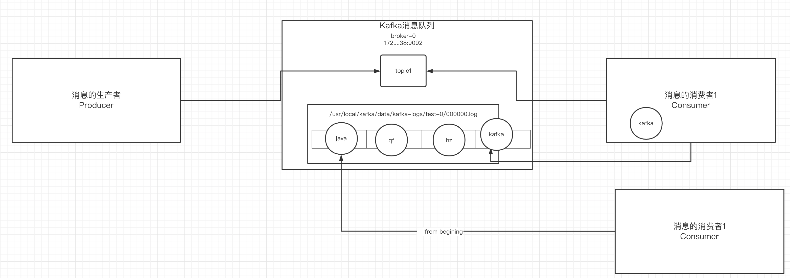

- ==生产者将消息发送给broker，broker会将消息保存在本地的日志文件中==

```shell
/usr/local/kafka/data/kafka-logs/主题-分区/00000000.log
```

- 消息的保存是有序的，通过offset偏移量来描述消息的有序性
- 消费者消费消息时也是通过offset来描述当前要消费的那条消息的位置


## 7.单播消息

在一个kafka的topic中，启动两个消费者，一个生产者，问：生产者发送消息，这条消息是否同时会被两个消费者消费？

如果多个消费者在同一个消费组，那么只有一个消费者可以收到订阅的topic中的消息。换言之，同一个消费组中只能有一个消费者收到一个topic中的消息。

```
./kafka-console-consumer.sh --bootstrap-server 172.16.253.38:9092  --consumer-property group.id=testGroup --topic test
```


## 8.多播消息

不同的消费组订阅同一个topic，那么不同的消费组中只有一个消费者能收到消息。实际上也是多个消费组中的多个消费者收到了同一个消息。

```shell
./kafka-console-consumer.sh --bootstrap-server 172.16.253.38:9092  --consumer-property group.id=testGroup1 --topic test
./kafka-console-consumer.sh --bootstrap-server 172.16.253.38:9092  --consumer-property group.id=testGroup2 --topic test
```


下图就是描述多播和单播消息的区别

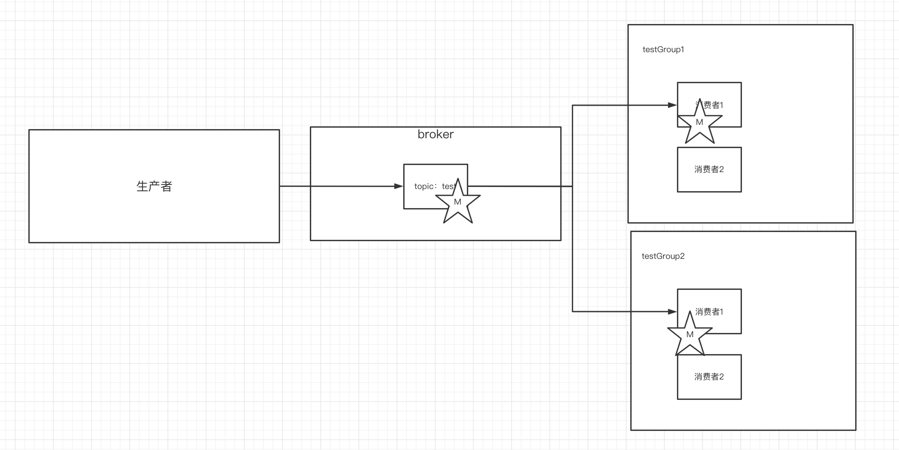


## 9. 查看消费组的详细信息

通过以下命令可以查看到消费组的详细信息：

```shell
./kafka-consumer-groups.sh --bootstrap-server 172.16.253.38:9092 --describe --group testGroup
```


重点关注以下几个信息：

- current-offset: 最后被消费的消息的偏移量
- Log-end-offset: 消息总量（最后一条消息的偏移量）
- Lag：积压了多少条消息


# 四、Kafka中主题和分区的概念

## 1.主题Topic

主题-topic在kafka中是一个逻辑的概念，kafka通过topic将消息进行分类。不同的topic会被订阅该topic的消费者消费。

但是有一个问题，如果说这个topic中的消息非常非常多，多到需要几T来存，因为消息是会被保存到log日志文件中的。为了解决这个文件过大的问题，kafka提出了Partition分区的概念

## 2.分区Partition

### 1）分区的概念

通过partition将一个topic中的消息分区来存储。这样的好处有多个：

- 分区存储，可以解决统一存储文件过大的问题
- 提供了读写的吞吐量：读和写可以同时在多个分区中进行

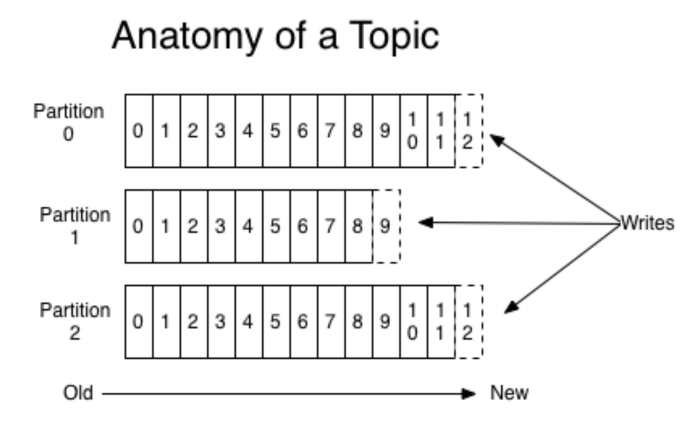


### 2）创建多分区的主题

```shell
./kafka-topics.sh --create --zookeeper 172.16.253.35:2181 --replication-factor 1 --partitions 2 --topic test1
```


## 3.kafka中消息日志文件中保存的内容

- 00000.log： 这个文件中保存的就是消息

- __consumer_offsets-49:

  kafka内部自己创建了__consumer_offsets主题包含了50个分区。这个主题用来存放消费者消费某个主题的偏移量。因为每个消费者都会自己维护着消费的主题的偏移量，也就是说每个消费者会把消费的主题的偏移量自主上报给kafka中的默认主题：consumer_offsets。因此kafka为了提升这个主题的并发性，默认设置了50个分区。

  - 提交到哪个分区：通过hash函数：hash(consumerGroupId) % __consumer_offsets主题的分区数

  - 提交到该主题中的内容是：key是consumerGroupId+topic+分区号，value就是当前offset的值

- 文件中保存的消息，==默认保存7天。==七天到后消息会被删除。


# 五、Kafka集群操作

## 1.搭建kafka集群（三个broker）

- 创建三个server.properties文件

```shell
# 0 1 2
broker.id=2
// 9092 9093 9094
listeners=PLAINTEXT://192.168.65.60:9094
//kafka-logs kafka-logs-1 kafka-logs-2
log.dir=/usr/local/data/kafka-logs-2
```

- 通过命令来启动三台broker

```shell
./kafka-server-start.sh -daemon ../config/server.properties
./kafka-server-start.sh -daemon ../config/server1.properties
./kafka-server-start.sh -daemon ../config/server2.properties
```

- 校验是否启动成功

进入到zk中查看/brokers/ids中过是否有三个znode（0，1，2）


## 2.副本的概念

在创建主题时，除了指明了主题的分区数以外，还指明了副本数，那么副本是一个什么概念呢？

```shell
./kafka-topics.sh --create --zookeeper 172.16.253.35:2181 --replication-factor 3 --partitions 2 --topic my-replicated-topic
```


==副本是为了为主题中的分区创建多个备份==，多个副本在kafka集群的多个broker中，会有一个副本作为leader，其他是follower。

查看topic情况：

```shell
# 查看topic情况
./kafka-topics.sh --describe --zookeeper 172.16.253.35:2181 --topic my-replicated-topic
```


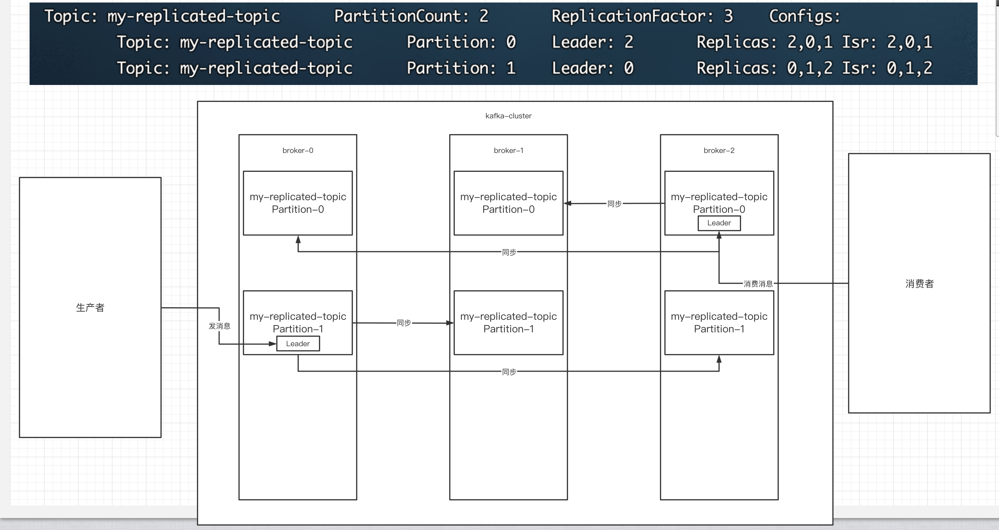

- leader(副本的leader)：

==kafka的写和读的操作，都发生在leader上==。leader负责把数据同步给follower。当leader挂了，经过主从选举，从多个follower中选举产生一个新的leader

- follower

接收leader的同步的数据

- isr：

  ==可以同步和已同步的节点会被存入到isr集合中。这里有一个细节：如果isr中的节点性能较差，会被踢出isr集合。==


（重点～！）此时，broker、主题、分区、副本 这些概念就全部展现了，大家需要把这些概念梳理清楚：

集群中有多个broker，创建主题时可以指明主题有多个分区（把消息拆分到不同的分区中存储），可以为分区创建多个副本，不同的副本存放在不同的broker里。


## 3.关于集群消费


### 1）向集群发送消息：

```shell
./kafka-console-consumer.sh --bootstrap-server 172.16.253.38:9092,172.16.253.38:9093,172.16.253.38:9094 --from-beginning --consumer-property group.id=testGroup1 --topic my-replicated-topic
```

### 2）从集群中消费消息

```shell
./kafka-console-producer.sh --broker-list 172.16.253.38:9092,172.16.253.38:9093,172.16.253.38:9094 --topic my-replicated-topic
```

### 3）指定消费组来消费消息

```shell
./kafka-console-consumer.sh --bootstrap-server 172.16.253.38:9092,172.16.253.38:9093,172.16.253.38:9094 --from-beginning --consumer-property group.id=testGroup1 --topic my-replicated-topic
```

### 4）分区分消费组的集群消费中的细节

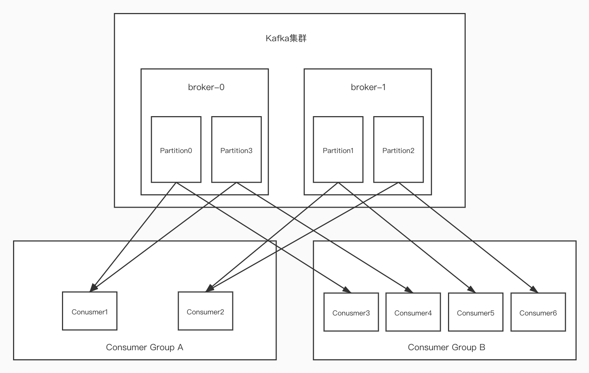

- ==一个partition只能被一个消费组中的一个消费者消费==，目的是为了保证消费的顺序性，但是多个partion的多个消费者消费的总的顺序性是得不到保证的，那怎么做到消费的总顺序性呢？

- partition的数量决定了消费组中消费者的数量，建议同一个消费组中消费者的数量不要超过partition的数量，否则多的消费者消费不到消息

- 如果消费者挂了，那么会触发rebalance机制（后面介绍），会让其他消费者来消费该分区

  

 # 六、kafka的java客户端-生产者的实现

## 1.生产者的基本实现

- 引入依赖

```xml
<dependency>
      <groupId>org.apache.kafka</groupId>
      <artifactId>kafka-clients</artifactId>
      <version>2.4.1</version>
    </dependency>
```

- 具体实现

```java
package com.qf.kafka;

import org.apache.kafka.clients.producer.*;
import org.apache.kafka.common.serialization.StringSerializer;

import java.util.Properties;
import java.util.concurrent.ExecutionException;

public class MySimpleProducer {

  private final static String TOPIC_NAME = "my-replicated-topic";

  public static void main(String[] args) throws ExecutionException, InterruptedException {

    //1.设置参数
    Properties props = new Properties();
    props.put(ProducerConfig.BOOTSTRAP_SERVERS_CONFIG, "172.16.253.38:9092,172.16.253.38:9093,172.16.253.38:9094");

    //把发送的key从字符串序列化为字节数组
    props.put(ProducerConfig.KEY_SERIALIZER_CLASS_CONFIG, StringSerializer.class.getName());
    //把发送消息value从字符串序列化为字节数组
    props.put(ProducerConfig.VALUE_SERIALIZER_CLASS_CONFIG, StringSerializer.class.getName());

    //2.创建生产消息的客户端，传入参数
    Producer<String,String> producer = new KafkaProducer<String, String>(props);

    //3.创建消息
    //key：作用是决定了往哪个分区上发，value：具体要发送的消息内容
    ProducerRecord<String,String> producerRecord = new ProducerRecord<>(TOPIC_NAME,"mykeyvalue","hellokafka");

    //4.发送消息,得到消息发送的元数据并输出
    RecordMetadata metadata = producer.send(producerRecord).get();
    System.out.println("同步方式发送消息结果：" + "topic-" + metadata.topic() + "|partition-"
      + metadata.partition() + "|offset-" + metadata.offset());
  }
}

```


## 2.生产者的同步发送消息


==如果生产者发送消息没有收到ack，生产者会阻塞，阻塞到3s的时间，如果还没有收到消息，会进行重试。重试的次数3次。==

```java
    RecordMetadata metadata = producer.send(producerRecord).get();
    System.out.println("同步方式发送消息结果：" + "topic-" + metadata.topic() + "|partition-"
      + metadata.partition() + "|offset-" + metadata.offset());
```


## 3.生产者的异步发送消息


异步发送，生产者发送完消息后就可以执行之后的业务，broker在收到消息后异步调用生产者提供的callback回调方法。

```java
//5.异步发送消息
    producer.send(producerRecord, new Callback() {
      public void onCompletion(RecordMetadata metadata, Exception exception) {
        if (exception != null) {
          System.err.println("发送消息失败：" + exception.getStackTrace());

        }
        if (metadata != null) {
          System.out.println("异步方式发送消息结果：" + "topic-" + metadata.topic() + "|partition-"
            + metadata.partition() + "|offset-" + metadata.offset());
        }
      }
    });
```


## 4.生产者中的ack的配置

在同步发送的前提下，生产者在获得集群返回的ack之前会一直阻塞。那么集群什么时候返回ack呢？此时ack有3个配置：

- ==ack = 0==   kafka-cluster不需要任何的broker收到消息，就立即返回ack给生产者，最容易丢消息的，效率是最高的

- ==ack=1（默认）==： 多副本之间的leader已经收到消息，并把消息写入到本地的log中，才会返回ack给生产者，性能和安全性是最均衡的

- ==ack=-1/all==： 里面有默认的配置min.insync.replicas=2(默认为1，推荐配置大于等于2)，此时就需要leader和一个follower同步完后，才会返回ack给生产者（此时集群中有2个broker已完成数据的接收），这种方式最安全，但性能最差。


下面是关于ack和重试（如果没有收到ack，就开启重试）的配置

```java
			  props.put(ProducerConfig.ACKS_CONFIG, "1");
     /*
        发送失败会重试，默认重试间隔100ms，重试能保证消息发送的可靠性，但是也可能造成消息重复发送，比如网络抖动，所以需要在
        接收者那边做好消息接收的幂等性处理
        */
        props.put(ProducerConfig.RETRIES_CONFIG, 3);
        //重试间隔设置
        props.put(ProducerConfig.RETRY_BACKOFF_MS_CONFIG, 300);
```


## 5.关于消息发送的缓冲区


- kafka默认会创建一个消息缓冲区，用来存放要发送的消息，缓冲区是32m

```java
props.put(ProducerConfig.BUFFER_MEMORY_CONFIG, 33554432);
```

- kafka本地线程会去缓冲区中一次拉16k的数据，发送到broker

```java
props.put(ProducerConfig.BATCH_SIZE_CONFIG, 16384);
```

- 如果线程拉不到16k的数据，间隔10ms也会将已拉到的数据发到broker

```java
props.put(ProducerConfig.LINGER_MS_CONFIG, 10);
```

# 七、Java客户端消费者的实现细节

## 1.消费者的基本实现

```java
package com.qf.kafka;

import org.apache.kafka.clients.consumer.ConsumerConfig;
import org.apache.kafka.clients.consumer.ConsumerRecord;
import org.apache.kafka.clients.consumer.ConsumerRecords;
import org.apache.kafka.clients.consumer.KafkaConsumer;
import org.apache.kafka.common.serialization.StringDeserializer;

import java.time.Duration;
import java.util.Arrays;
import java.util.Properties;

public class MySimpleConsumer {


  private final static String TOPIC_NAME = "my-replicated-topic";
  private final static String CONSUMER_GROUP_NAME = "testGroup";

  public static void main(String[] args) {
    Properties props = new Properties();
    props.put(ConsumerConfig.BOOTSTRAP_SERVERS_CONFIG, "172.16.253.38:9092,172.16.253.38:9093,172.16.253.38:9094");
    // 消费分组名
    props.put(ConsumerConfig.GROUP_ID_CONFIG, CONSUMER_GROUP_NAME);
    props.put(ConsumerConfig.KEY_DESERIALIZER_CLASS_CONFIG, StringDeserializer.class.getName());
    props.put(ConsumerConfig.VALUE_DESERIALIZER_CLASS_CONFIG, StringDeserializer.class.getName());
    //1.创建一个消费者的客户端
    KafkaConsumer<String, String> consumer = new KafkaConsumer<String, String>(props);
    //2. 消费者订阅主题列表
    consumer.subscribe(Arrays.asList(TOPIC_NAME));

    while (true) {
      /*
       * 3.poll() API 是拉取消息的长轮询
       */
      ConsumerRecords<String, String> records = consumer.poll(Duration.ofMillis(1000));
      for (ConsumerRecord<String, String> record : records) {
        //4.打印消息
        System.out.printf("收到消息：partition = %d,offset = %d, key = %s, value = %s%n", record.partition(),
          record.offset(), record.key(), record.value());
      }
    }
  }

}

```

## 2.关于消费者自动提交和手动提交offset

### 1）提交的内容

消费者无论是自动提交还是手动提交，都需要把所属的消费组+消费的某个主题+消费的某个分区及消费的偏移量，这样的信息提交到集群的_consumer_offsets主题里面。

### 2）自动提交

消费者poll消息下来以后就会自动提交offset

```java
// 是否自动提交offset，默认就是true
props.put(ConsumerConfig.ENABLE_AUTO_COMMIT_CONFIG, "true");
// 自动提交offset的间隔时间
props.put(ConsumerConfig.AUTO_COMMIT_INTERVAL_MS_CONFIG, "1000");
```

注意：自动提交会丢消息。因为消费者在消费前提交offset，有可能提交完后还没消费时消费者挂了。

### 3）手动提交

需要把自动提交的配置改成false

```java
props.put(ConsumerConfig.ENABLE_AUTO_COMMIT_CONFIG, "false");
```

手动提交又分成了两种：

- 手动同步提交

  在消费完消息后调用同步提交的方法，当集群返回ack前一直阻塞，返回ack后表示提交成功，执行之后的逻辑

  ```java
   while (true) {
        /*
         * poll() API 是拉取消息的长轮询
         */
        ConsumerRecords<String, String> records = consumer.poll(Duration.ofMillis(1000));
        for (ConsumerRecord<String, String> record : records) {
          System.out.printf("收到消息：partition = %d,offset = %d, key = %s, value = %s%n", record.partition(),
            record.offset(), record.key(), record.value());
        }
        //所有的消息已消费完
        if (records.count() > 0) {//有消息
          // 手动同步提交offset，当前线程会阻塞直到offset提交成功
          // 一般使用同步提交，因为提交之后一般也没有什么逻辑代码了
          consumer.commitSync();//=======阻塞=== 提交成功
        }
      }
    }
  ```

  

- 手动异步提交

  在消息消费完后提交，不需要等到集群ack，直接执行之后的逻辑，可以设置一个回调方法，供集群调用

  ```java
   while (true) {
        /*
         * poll() API 是拉取消息的长轮询
         */
        ConsumerRecords<String, String> records = consumer.poll(Duration.ofMillis(1000));
        for (ConsumerRecord<String, String> record : records) {
          System.out.printf("收到消息：partition = %d,offset = %d, key = %s, value = %s%n", record.partition(),
            record.offset(), record.key(), record.value());
        }
        //所有的消息已消费完
        if (records.count() > 0) {
  
          // 手动异步提交offset，当前线程提交offset不会阻塞，可以继续处理后面的程序逻辑
          consumer.commitAsync(new OffsetCommitCallback() {
            @Override
            public void onComplete(Map<TopicPartition, OffsetAndMetadata> offsets, Exception exception) {
              if (exception != null) {
                System.err.println("Commit failed for " + offsets);
                System.err.println("Commit failed exception: " + exception.getStackTrace());
              }
            }
          });
  
        }
      }
    }
  ```

  

## 3.长轮询poll消息

- 默认情况下，消费者一次会poll500条消息。

```java
//一次poll最大拉取消息的条数，可以根据消费速度的快慢来设置
props.put(ConsumerConfig.MAX_POLL_RECORDS_CONFIG, 500);
```

- 代码中设置了长轮询的时间是1000毫秒

```java
 while (true) {
      /*
       * poll() API 是拉取消息的长轮询
       */
      ConsumerRecords<String, String> records = consumer.poll(Duration.ofMillis(1000));
      for (ConsumerRecord<String, String> record : records) {
        System.out.printf("收到消息：partition = %d,offset = %d, key = %s, value = %s%n", record.partition(),
          record.offset(), record.key(), record.value());
      }
```

意味着：

- - 如果一次poll到500条，就直接执行for循环
  - 如果这一次没有poll到500条。且时间在1秒内，那么长轮询继续poll，要么到500条，要么到1s
  - 如果多次poll都没达到500条，且1秒时间到了，那么直接执行for循环
- 如果两次poll的间隔超过30s，集群会认为该消费者的消费能力过弱，该消费者被踢出消费组，触发rebalance机制，rebalance机制会造成性能开销。可以通过设置这个参数，让一次poll的消息条数少一点

```java
  //一次poll最大拉取消息的条数，可以根据消费速度的快慢来设置
    props.put(ConsumerConfig.MAX_POLL_RECORDS_CONFIG, 500);
    //如果两次poll的时间如果超出了30s的时间间隔，kafka会认为其消费能力过弱，将其踢出消费组。将分区分配给其他消费者。-rebalance
    props.put(ConsumerConfig.MAX_POLL_INTERVAL_MS_CONFIG, 30 * 1000);
```


## 4.消费者的健康状态检查

消费者每隔1s向kafka集群发送心跳，集群发现如果有超过10s没有续约的消费者，将被踢出消费组，触发该消费组的rebalance机制，将该分区交给消费组里的其他消费者进行消费。

```java
//consumer给broker发送心跳的间隔时间
    props.put(ConsumerConfig.HEARTBEAT_INTERVAL_MS_CONFIG, 1000);
    //kafka如果超过10秒没有收到消费者的心跳，则会把消费者踢出消费组，进行rebalance，把分区分配给其他消费者。
    props.put(ConsumerConfig.SESSION_TIMEOUT_MS_CONFIG, 10 * 1000);
```


## 5.指定分区和偏移量、时间消费

- 指定分区消费

```java
consumer.assign(Arrays.asList(new TopicPartition(TOPIC_NAME, 0)));
```

- 从头消费

```java
consumer.assign(Arrays.asList(new TopicPartition(TOPIC_NAME, 0)));
consumer.seekToBeginning(Arrays.asList(new TopicPartition(TOPIC_NAME, 0)));
```

- 指定offset消费

```java
consumer.assign(Arrays.asList(new TopicPartition(TOPIC_NAME, 0)));
consumer.seek(new TopicPartition(TOPIC_NAME, 0), 10);
```

- 指定时间消费

根据时间，去所有的partition中确定该时间对应的offset，然后去所有的partition中找到该offset之后的消息开始消费。

```java
List<PartitionInfo> topicPartitions = consumer.partitionsFor(TOPIC_NAME);
        //从1小时前开始消费
        long fetchDataTime = new Date().getTime() - 1000 * 60 * 60;
        Map<TopicPartition, Long> map = new HashMap<>();
        for (PartitionInfo par : topicPartitions) {
            map.put(new TopicPartition(TOPIC_NAME, par.partition()), fetchDataTime);
        }
        Map<TopicPartition, OffsetAndTimestamp> parMap = consumer.offsetsForTimes(map);
        for (Map.Entry<TopicPartition, OffsetAndTimestamp> entry : parMap.entrySet()) {
            TopicPartition key = entry.getKey();
            OffsetAndTimestamp value = entry.getValue();
            if (key == null || value == null) continue;
            Long offset = value.offset();
            System.out.println("partition-" + key.partition() + "|offset-" + offset);
            System.out.println();
            //根据消费里的timestamp确定offset
            if (value != null) {
                consumer.assign(Arrays.asList(key));
                consumer.seek(key, offset);
            }
        }

```

## 6.新消费组的消费offset规则

新消费组中的消费者在启动以后，默认会从当前分区的最后一条消息的offset+1开始消费（消费新消息）。可以通过以下的设置，让新的消费者第一次从头开始消费。之后开始消费新消息（最后消费的位置的偏移量+1）

- Latest:默认的，消费新消息
- earliest：第一次从头开始消费。之后开始消费新消息（最后消费的位置的偏移量+1）

```java
props.put(ConsumerConfig.AUTO_OFFSET_RESET_CONFIG, "earliest");
```


# 八、Springboot中使用Kafka

## 1.引入依赖

```xml
<dependency>
      <groupId>org.springframework.kafka</groupId>
      <artifactId>spring-kafka</artifactId>
    </dependency>
```

## 2.编写配置文件

```yml
server:
  port: 8080

spring:
  kafka:
    bootstrap-servers: 172.16.253.38:9092,172.16.253.38:9093,172.16.253.38:9094
    producer: # 生产者
      retries: 3 # 设置大于0的值，则客户端会将发送失败的记录重新发送
      batch-size: 16384
      buffer-memory: 33554432
      acks: 1
      # 指定消息key和消息体的编解码方式
      key-serializer: org.apache.kafka.common.serialization.StringSerializer
      value-serializer: org.apache.kafka.common.serialization.StringSerializer
    consumer:
      group-id: default-group
      enable-auto-commit: false
      auto-offset-reset: earliest
      key-deserializer: org.apache.kafka.common.serialization.StringDeserializer
      value-deserializer: org.apache.kafka.common.serialization.StringDeserializer
      max-poll-records: 500
    listener:
      # 当每一条记录被消费者监听器（ListenerConsumer）处理之后提交
      # RECORD
      # 当每一批poll()的数据被消费者监听器（ListenerConsumer）处理之后提交
      # BATCH
      # 当每一批poll()的数据被消费者监听器（ListenerConsumer）处理之后，距离上次提交时间大于TIME时提交
      # TIME
      # 当每一批poll()的数据被消费者监听器（ListenerConsumer）处理之后，被处理record数量大于等于COUNT时提交
      # COUNT
      # TIME |　COUNT　有一个条件满足时提交
      # COUNT_TIME
      # 当每一批poll()的数据被消费者监听器（ListenerConsumer）处理之后, 手动调用Acknowledgment.acknowledge()后提交
      # MANUAL
      # 手动调用Acknowledgment.acknowledge()后立即提交，一般使用这种
      # MANUAL_IMMEDIATE
      ack-mode: MANUAL_IMMEDIATE
  redis:
    host: 172.16.253.21

```


## 3.编写消息生产者

```java
package com.qf.kafka.spring.boot.demo.controller;

import org.springframework.beans.factory.annotation.Autowired;
import org.springframework.kafka.core.KafkaTemplate;
import org.springframework.web.bind.annotation.RequestMapping;
import org.springframework.web.bind.annotation.RestController;

@RestController
@RequestMapping("/msg")
public class MyKafkaController {

  private final static String TOPIC_NAME = "my-replicated-topic";

  @Autowired
  private KafkaTemplate<String,String> kafkaTemplate;

  @RequestMapping("/send")
  public String sendMessage(){

    kafkaTemplate.send(TOPIC_NAME,0,"key","this is a message!");

    return "send success!";

  }


}

```


## 4.编写消费者

```java
package com.qf.kafka.spring.boot.demo.consumer;

import org.apache.kafka.clients.consumer.ConsumerRecord;
import org.apache.kafka.clients.consumer.ConsumerRecords;
import org.springframework.kafka.annotation.KafkaListener;
import org.springframework.kafka.support.Acknowledgment;
import org.springframework.stereotype.Component;

@Component
public class MyConsumer {

  @KafkaListener(topics = "my-replicated-topic",groupId = "MyGroup1")
  public void listenGroup(ConsumerRecord<String, String> record, Acknowledgment ack) {
    String value = record.value();
    System.out.println(value);
    System.out.println(record);
    //手动提交offset
    ack.acknowledge();
  }

}

```

## 5.消费者中配置消费主题、分区和偏移量

```java
  @KafkaListener(groupId = "testGroup", topicPartitions = {
    @TopicPartition(topic = "topic1", partitions = {"0", "1"}),
    @TopicPartition(topic = "topic2", partitions = "0",
      partitionOffsets = @PartitionOffset(partition = "1", initialOffset = "100"))
  },concurrency = "3")//concurrency就是同组下的消费者个数，就是并发消费数，建议小于等于分区总数
  public void listenGroupPro(ConsumerRecord<String, String> record, Acknowledgment ack) {
    String value = record.value();
    System.out.println(value);
    System.out.println(record);
    //手动提交offset
    ack.acknowledge();
  }

```


# 九、kafka集群中的controller、rebalance、HW

## 1.controller(==broker的controller==)

- 集群中谁来充当controller

每个broker启动时会向zk创建一个临时序号节点，==获得的序号最小的那个broker将会作为集群中的controller==，负责这么几件事：

- 当集群中有一个副本的leader挂掉，需要在集群中选举出一个新的leader，==选举的规则是从isr集合中最左边获得。==
- 当集群中有broker新增或减少，controller会同步信息给其他broker
- 当集群中有分区新增或减少，controller会同步信息给其他broker


## 2.rebalance机制

- 前提：消费组中的消费者没有指明分区来消费

- 触发的条件：当消费组中的消费者和分区的关系发生变化的时候

- 分区分配的策略：在rebalance之前，分区怎么分配 , 有这么三种策略 : 

  - range：根据公示计算得到每个消费者消费哪几个分区：前面的消费者是( 分区总数/消费者数量 )+1,之后的消费者是 分区总数/消费者数量
  - 轮询：大家轮着来
  - sticky：粘合策略，如果需要rebalance，会在之前已分配的基础上调整，不会改变之前的分配情况。如果这个策略没有开，那么就要进行全部的重新分配。建议开启。

  

## 3.HW和LEO

LEO是某个副本最后消息的消息位置（log-end-offset）

HW是已完成同步的位置。消息在写入broker时，且每个broker完成这条消息的同步后，hw才会变化。在这之前消费者是消费不到这条消息的。在同步完成之后，HW更新之后，消费者才能消费到这条消息，这样的目的是防止消息的丢失。

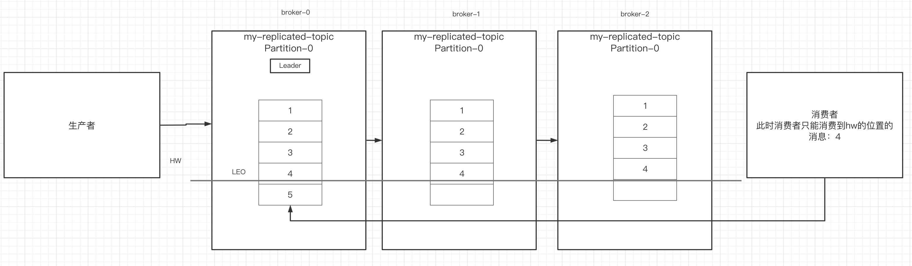


# 十、Kafka中的优化问题

## 1.如何防止消息丢失

- 生产者：1）使用同步发送	2）把ack设成1或者-1/all，并且设置同步的分区数>=2
- 消费者：把offset自动提交改成手动提交


## 2.如何防止重复消费

在防止消息丢失的方案中，如果生产者发送完消息后，因为网络抖动，没有收到ack，但实际上broker已经收到了。

此时生产者会进行重试，于是broker就会收到多条相同的消息，而造成消费者的重复消费。

怎么解决：

- 生产者关闭重试：会造成丢消息（不建议）

- 消费者解决非幂等性消费问题：

  所谓的幂等性：多次访问的结果是一样的。对于rest的请求（get（幂等）、post（非幂等）、put（幂等）、delete（幂等））

  解决方案：

  - 在数据库中创建联合主键，防止相同的主键 创建出多条记录
  - 使用分布式锁，以业务id为锁。保证只有一条记录能够创建成功

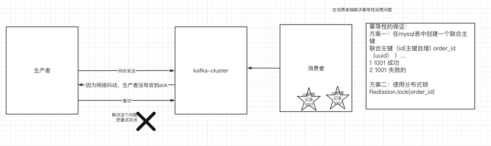

## 3.如何做到消息的顺序消费

- 生产者：保证消息按顺序消费，且消息不丢失——使用同步的发送，ack设置成非0的值。
- 消费者：主题只能设置一个分区，消费组中只能有一个消费者

kafka的顺序消费使用场景不多，因为牺牲掉了性能，但是比如rocketmq在这一块有专门的功能已设计好。


## 4.如何解决消息积压问题

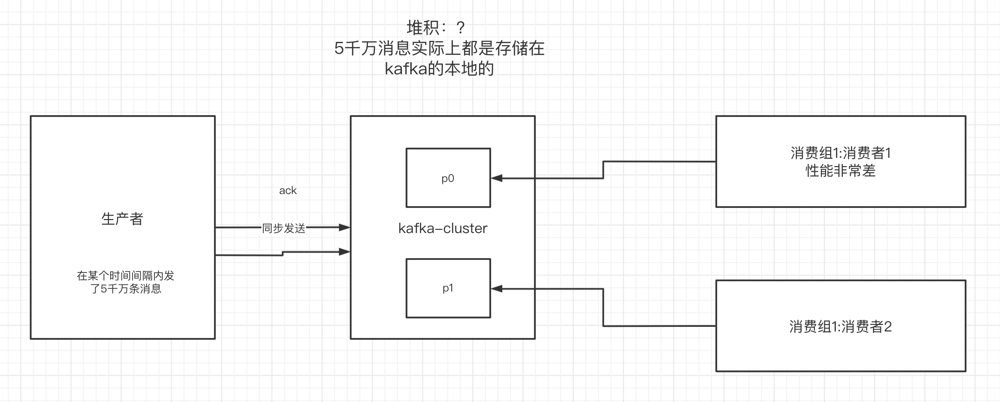

### 1）消息积压问题的出现

消息的消费者的消费速度远赶不上生产者的生产消息的速度，导致kafka中有大量的数据没有被消费。随着没有被消费的数据堆积越多，消费者寻址的性能会越来越差，最后导致整个kafka对外提供的服务的性能很差，从而造成其他服务也访问速度变慢，造成服务雪崩。

### 2）消息积压的解决方案

- ==在这个消费者中，使用多线程，充分利用机器的性能进行消费消息。==
- ==通过业务的架构设计，提升业务层面消费的性能。==
- ==创建多个消费组，多个消费者，部署到其他机器上，一起消费，提高消费者的消费速度==
- 创建一个消费者，该消费者在kafka另建一个主题，配上多个分区，多个分区再配上多个消费者。该消费者将poll下来的消息，不进行消费，直接转发到新建的主题上。此时，新的主题的多个分区的多个消费者就开始一起消费了。——不常用

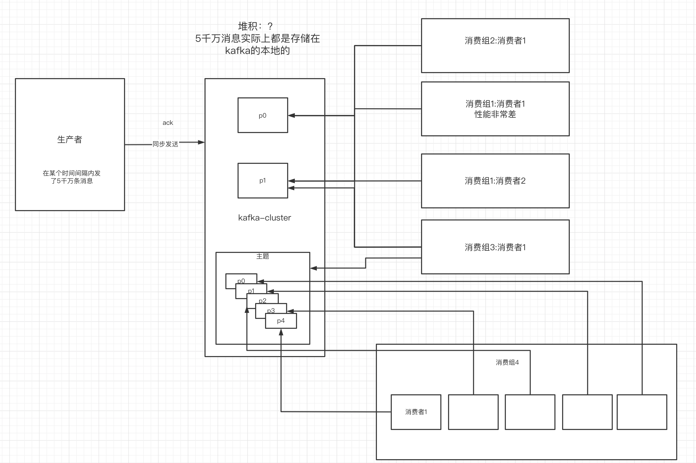


## 5.实现延时队列的效果

### 1）应用场景

订单创建后，超过30分钟没有支付，则需要取消订单，这种场景可以通过延时队列来实现


### 2）具体方案

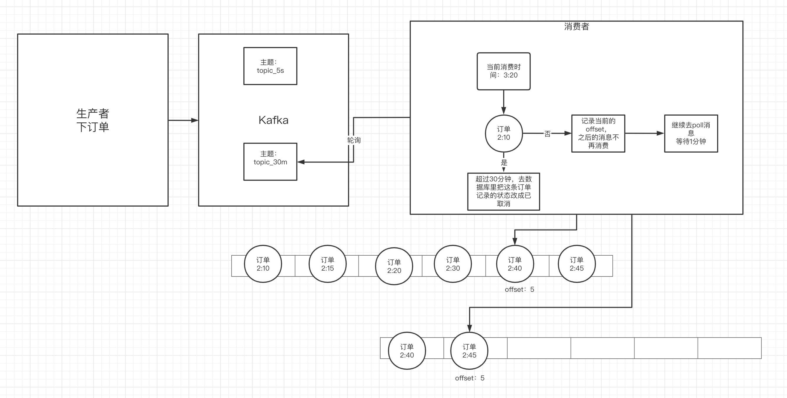

- kafka中创建相应的主题
- 消费者消费该主题的消息（轮询）
- 消费者消费消息时判断消息的创建时间和当前时间是否超过30分钟（前提是订单没支付）
  - 如果是：去数据库中修改订单状态为已取消
  - 如果否：记录当前消息的offset，并不再继续消费之后的消息。等待1分钟后，再次向kafka拉取该offset及之后的消息，继续进行判断，以此反复。

# 十一、Kafka-eagle监控平台

## 1.搭建

- 去kafka-eagle官网下载压缩包

http://download.kafka-eagle.org/

- 分配一台虚拟机
- 虚拟机中安装jdk
- 解压缩kafka-eagle的压缩包
- 给kafka-eagle配置环境变量

```shell
export KE_HOME=/usr/local/kafka-eagle
export PATH=$PATH:$KE_HOME/bin
```
重新加载配置文件: source /etc/profile

- 需要修改kafka-eagle内部的配置文件：`vim system-config.properties` 

  修改里面的zk的地址和mysql的地址

- 进入到bin中，通过命令来启动

```shell
./ke.sh start
```

## 2.平台的使用

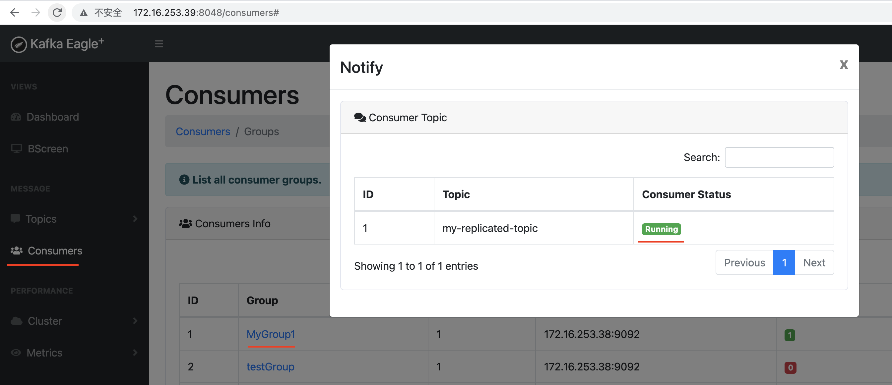

