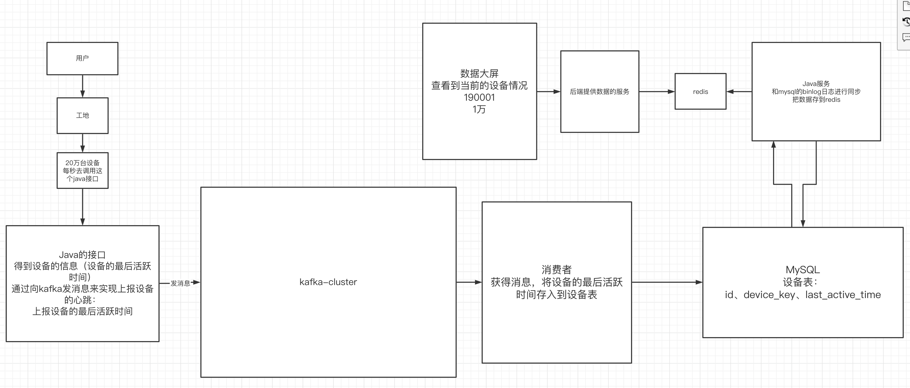
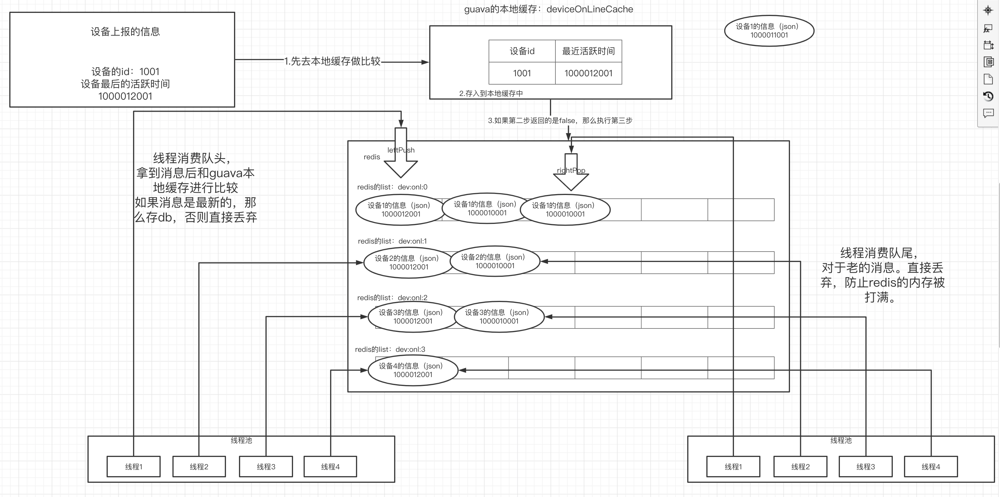

# 一、线上问题出现的场景

## 1.消息积压的出现




## 2.怎么解决问题




# 二、项目中使用kafka

## 1.创建消息生产者

- 创建web-facade项目
- facade里实现kafka消息的生产者

```java
package com.qf.data.view.facade.service.device;

import com.alibaba.dubbo.config.annotation.Service;
import com.fasterxml.jackson.core.JsonProcessingException;
import com.fasterxml.jackson.databind.ObjectMapper;
import com.qf.data.view.core.model.result.ResultModel;
import com.qf.data.view.facade.api.DeviceFacade;
import com.qf.data.view.facade.request.device.DeviceModelRequest;
import org.springframework.beans.factory.annotation.Autowired;
import org.springframework.kafka.core.KafkaTemplate;

@Service
public class DeviceFacadeImpl implements DeviceFacade {

    @Autowired
    private KafkaTemplate<String,String> kafkaTemplate;


    public static final String DEVICE_TOPIC = "device_topic";

    @Override
    public ResultModel deviceInfo(DeviceModelRequest request) {

        //request->json
        ObjectMapper mapper = new ObjectMapper();
        try {
            String json = mapper.writeValueAsString(request);
            //向kafka去发消息
            //1.创建消息
            kafkaTemplate.send(DEVICE_TOPIC,request.getDeviceKey(),json);
        } catch (Exception e) {
            return ResultModel.error(e.getMessage());
        }
        return ResultModel.success();
    }
}

```


- 启动zk、kafka、kafka-eagle
- postman发送消息

## 2.创建消费者

- 在web模块中使用消费者来接收消息

```java
package com.qf.bigdata.view.web.listener;

import com.alibaba.dubbo.common.utils.StringUtils;
import com.alibaba.fastjson.JSONObject;
import com.qf.bigdata.view.web.dto.DeviceDTO;
import org.apache.kafka.clients.consumer.ConsumerRecord;
import org.jboss.netty.util.internal.StringUtil;
import org.springframework.kafka.annotation.KafkaListener;
import org.springframework.stereotype.Component;

@Component
public class DeviceKafkaListener {

    public static final String DEVICE_TOPIC = "device_topic";

    @KafkaListener(topics = DEVICE_TOPIC,groupId = "group1")
    public void process(ConsumerRecord<String,String> record){
        //保存到db里面

        String value = record.value();
       if(StringUtils.isNotEmpty(value)){
           DeviceDTO deviceDTO = JSONObject.parseObject(value, DeviceDTO.class);
           System.out.println(deviceDTO);
       }
    }
}

```

