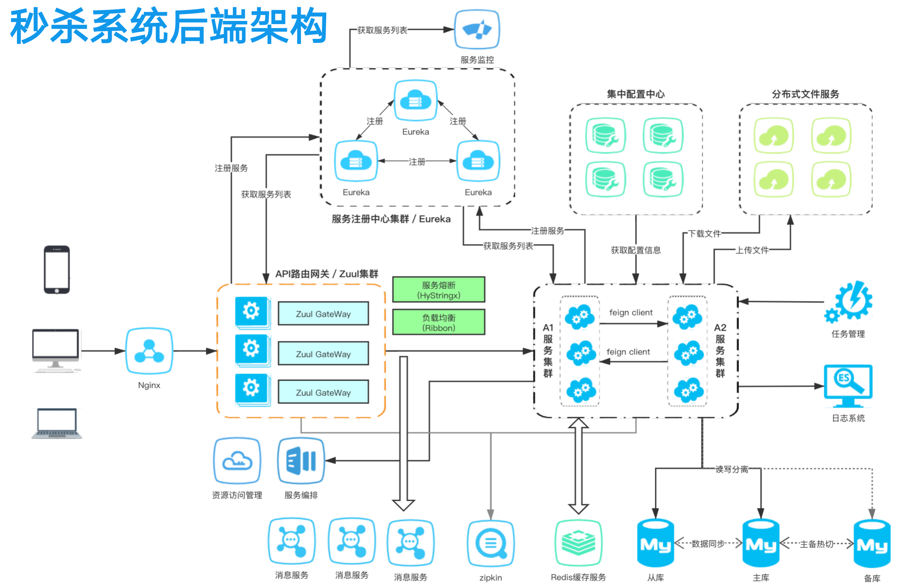

# 一、电商项目搭建

## 1.搭建后台

- 修改后台项目中的数据库的连接信息：db.properties
- 修改后台项目中的redis的连接信息:application-context-redis.xml

- 部署在本地的tomcat服务器上，注意路径：

## 2.搭建前台：

- cnpm install
- npm run dev

# 二、秒杀的背景

## 1.为什么要学习秒杀

因为秒杀的项目会让大家体会到真正的高并发、高性能、高可用的系统架构设计（工程架构、中间件架构、业务架构）。

日常高并发出现场景：

- 12306抢火车票
- 支付宝抢杭州优惠卷
- 浙江医疗预约挂号
- 抢耐克 抢茅台

秒杀的项目，无论是在电商、医疗、金融、教育、政府项目等等这些场景下，都会出现。秒杀的项目是最考验一个程序的系统设计能力的：并发编程、系统技术选型、架构应用的能力。

## 2.秒杀项目目前的地位

凡事要涉及到互联网营销，秒杀绝对是一个非常棒的突破口。从京东首页的秒杀模块就能看出秒杀项目的重要性。

## 3.秒杀项目要实现目录

通过优秀的架构设计，让系统能够顺利扛下大并发！我们自己也能形成一个应对大并发的解决方案的指导思想。

# 三、秒杀的中间件架构

上面的中间件架构图其实是适用于很多微服务的场景，但是并不能体现技术的深度。整个系统的性能关键，除了使用这些中间件以外，还有在业务层面进行详细的设计。

# 四、秒杀系统的前端架构

## 1.为什么要聊前端

秒杀接口被访问的前提是商品详情页顺利打开之后。那么如何保证商品详情页能顺利打开？这就跟前端架构有关系。

## 2.前端架构

前端使用相应的技术，让用户直接访问静态页面，而是通过用户的访问java程序动态生成页面。

- 当系统管理员在后台管理系统中添加秒杀商品后，生成静态页面

- 并且把静态资源上传到支持cdn的分布式文件存储系统中

# 五、秒杀系统的后端数据流转

# 六、超卖问题

## 1.秒杀系统的基本优化思路

通过设置多个门槛。让真正有效的请求才会去执行创建订单的动作，无效的请求会直接被return拒绝。

## 2.提交订单之前的库存判断，这个库存放哪里？

库存直接决定了交易是否成功，那么每次访问秒杀接口，实际上都要去判断是否还有库存？那库存放哪里？放到redis缓存服务器中。

MySQL表里是有该商品的真实库存的。

## 3.什么叫超卖？

卖出的商品数量超过了库存数量。为什么会出现超卖？

如果没有使用redis的原子操作，那么就极容易出现超卖问题。

## 4.如何解决超卖？

如果上锁的话，一旦用了锁，就会消耗性能。可以使用redis的单线程特性，结合redis原子操作来实现上锁的效果。让并行转为串行。

# 作业

- 充分掌握线上消息解压解决方案
- 掌握项目中如何使用kafka解决问题
- 充分理解秒杀的架构设计
- 理解什么是超卖及怎么解决超卖