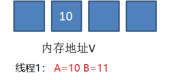

# CAS机制（乐观锁） 

CAS是英文单词Compare and Swap的缩写，翻译过来就是比较并替换。

CAS机制中使用了3个基本操作数：内存地址V，旧的预期值A，要修改的新值B。

更新一个变量的时候，只有当变量的预期值A和内存地址V当中的实际值相同时，才会将内存地址V对应的值修改为B。

我们看一个例子：

1. 在内存地址V当中，存储着值为10的变量。

2. 此时线程1想把变量的值增加1.对线程1来说，旧的预期值A=10，要修改的新值B=11.

3. 在线程1要提交更新之前，另一个线程2抢先一步，把内存地址V中的变量值率先更新成了11。

4. 线程1开始提交更新，首先进行A和地址V的实际值比较，发现A不等于V的实际值，提交失败。

5. 线程1 重新获取内存地址V的当前值，并重新计算想要修改的值。此时对线程1来说，A=11，B=12。这个重新尝试的过程被称为自旋。

6. 这一次比较幸运，没有其他线程改变地址V的值。线程1进行比较，发现A和地址V的实际值是相等的。

7. 线程1进行交换，把地址V的值替换为B，也就是12.

悲观锁： 总有刁民要害朕    update  insert  delete  for lock  MyISAM  InnoDB

乐观锁： 天天灰灰 疏而不漏

update ****   where version=3    只要有操作   version就会+1

从思想上来说，synchronized属于悲观锁，悲观的认为程序中的并发情况严重，所以严防死守，CAS属于乐观锁，乐观地认为程序中的并发情况不那么严重，所以让线程不断去重试更新。

在java中除了上面提到的Atomic系列类，以及Lock系列类夺得底层实现，甚至在JAVA1.6以上版本，synchronized转变为重量级锁之前，也会采用CAS机制。

**CAS的缺点：**

1） CPU开销过大

在并发量比较高的情况下，如果许多线程反复尝试更新某一个变量，却又一直更新不成功，循环往复，会给CPU带来很到的压力。

2） 不能保证代码块的原子性

CAS机制所保证的只是一个变量的原子性操作，而不能保证整个代码块的原子性。比如需要保证3个变量共同进行原子性的更新，就不得不使用synchronized了。

3） ABA问题

这是CAS机制最大的问题所在。（后面有介绍）

 

我们下面来介绍一下两个问题：

**1. JAVA中CAS的底层实现**

**2. CAS的ABA问题和解决办法。**

我们上面说过，CAS机制中使用了3个基本操作数：内存地址V，旧的预期值A，要修改的新值B。

而unsafe的compareAndSwapInt方法的参数包括了这三个基本元素：valueOffset参数代表了V，expect参数代表了A，update参数代表了B。

正是unsafe的compareAndSwapInt方法保证了Compare和Swap操作之间的原子性操作。

我们现在来说什么是ABA问题。假设内存中有一个值为A的变量，存储在地址V中。

此时有三个线程想使用CAS的方式更新这个变量的值，每个线程的执行时间有略微偏差。线程1和线程2已经获取当前值，线程3还未获取当前值。

接下来，线程1先一步执行成功，把当前值成功从A更新为B；同时线程2因为某种原因被阻塞住，没有做更新操作；线程3在线程1更新之后，获取了当前值B。

在之后，线程2仍然处于阻塞状态，线程3继续执行，成功把当前值从B更新成了A。

最后，线程2终于恢复了运行状态，由于阻塞之前已经获得了“当前值A”，并且经过compare检测，内存地址V中的实际值也是A，所以成功把变量值A更新成了B。

看起来这个例子没啥问题，但如果结合实际，就可以发现它的问题所在。

我们假设一个提款机的例子。假设有一个遵循CAS原理的提款机，小灰有100元存款，要用这个提款机来提款50元。

由于提款机硬件出了点问题，小灰的提款操作被同时提交了两次，开启了两个线程，两个线程都是获取当前值100元，要更新成50元。

理想情况下，应该一个线程更新成功，一个线程更新失败，小灰的存款值被扣一次。

线程1首先执行成功，把余额从100改成50.线程2因为某种原因阻塞。这时，小灰的妈妈刚好给小灰汇款50元。

线程2仍然是阻塞状态，线程3执行成功，把余额从50改成了100。

线程2恢复运行，由于阻塞之前获得了“当前值”100，并且经过compare检测，此时存款实际值也是100，所以会成功把变量值100更新成50。

原本线程2应当提交失败，小灰的正确余额应该保持100元，结果由于ABA问题提交成功了。

怎么解决呢？加个版本号就可以了。

真正要做到严谨的CAS机制，我们在compare阶段不仅要比较期望值A和地址V中的实际值，还要比较变量的版本号是否一致。

我们仍然以刚才的例子来说明，假设地址V中存储着变量值A，当前版本号是01。线程1获取了当前值A和版本号01，想要更新为B，但是被阻塞了。

这时候，内存地址V中变量发生了多次改变，版本号提升为03，但是变量值仍然是A。

随后线程1恢复运行，进行compare操作。经过比较，线程1所获得的值和地址的实际值都是A，但是版本号不相等，所以这一次更新失败。

 