# 一、电商项目搭建

## 1.搭建后台

- 修改后台项目中的数据库的连接信息：db.properties
- 修改后台项目中的redis的连接信息:application-context-redis.xml

- 部署在本地的tomcat服务器上，注意路径：


## 2.搭建前台：

- cnpm install
- npm run dev

# 二、秒杀的背景

## 1.为什么要学习秒杀

因为秒杀的项目会让大家体会到真正的高并发、高性能、高可用的系统架构设计（工程架构、中间件架构、业务架构）。

日常高并发出现场景：

- 12306抢火车票
- 支付宝抢杭州优惠卷
- 浙江医疗预约挂号
- 抢耐克 抢茅台

秒杀的项目，无论是在电商、医疗、金融、教育、政府项目等等这些场景下，都会出现。秒杀的项目是最考验一个程序的系统设计能力的：并发编程、系统技术选型、架构应用的能力。

## 2.秒杀项目目前的地位

凡事要涉及到互联网营销，秒杀绝对是一个非常棒的突破口。从京东首页的秒杀模块就能看出秒杀项目的重要性。


## 3.秒杀项目要实现目录

通过优秀的架构设计，让系统能够顺利扛下大并发！我们自己也能形成一个应对大并发的解决方案的指导思想。

# 三、秒杀的中间件架构


上面的中间件架构图其实是适用于很多微服务的场景，但是并不能体现技术的深度。整个系统的性能关键，除了使用这些中间件以外，还有在业务层面进行详细的设计。


# 四、秒杀系统的前端架构

## 1.为什么要聊前端

秒杀接口被访问的前提是商品详情页顺利打开之后。那么如何保证商品详情页能顺利打开？这就跟前端架构有关系。

## 2.前端架构

前端使用相应的技术，让用户直接访问静态页面，而是通过用户的访问java程序动态生成页面。

- 当系统管理员在后台管理系统中添加秒杀商品后，生成静态页面-手淘就提出-首页秒开


- 并且把静态资源上传到支持cdn的分布式文件存储系统中

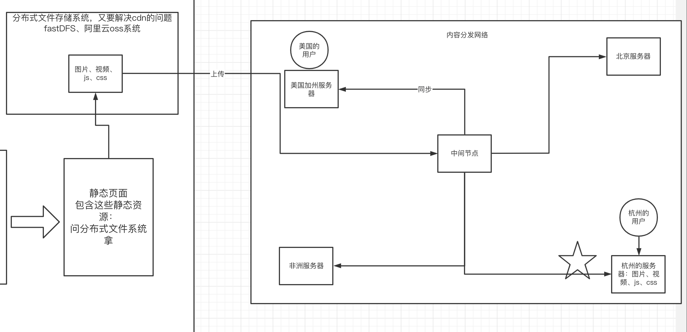


# 五、秒杀系统的后端数据流转


# 六、超卖问题

## 1.秒杀系统的基本优化思路

通过设置多个门槛。让真正有效的请求才会去执行创建订单的动作，无效的请求会直接被return拒绝。

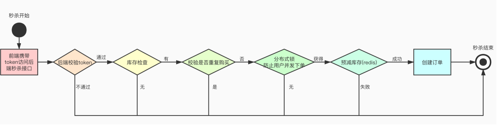


## 2.提交订单之前的库存判断，这个库存放哪里？

库存直接决定了交易是否成功，那么每次访问秒杀接口，实际上都要去判断是否还有库存？那库存放哪里？放到redis缓存服务器中。

MySQL表里是有该商品的真实库存的。


## 3.什么叫超卖？

卖出的商品数量超过了库存数量。为什么会出现超卖？


如果没有使用redis的原子操作，那么就极容易出现超卖问题。

## 4.如何解决超卖？

如果上锁的话，一旦用了锁，就会消耗性能。可以使用redis的单线程特性，结合redis原子操作来实现上锁的效果。让并行转为串行。

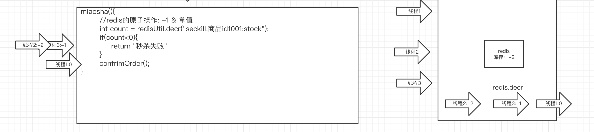


# 七、少卖问题

## 1.少卖出现的场景

如果有之前成功扣减redis库存的线程，在提交订单的时候失败了，那么就需要将redis中的库存+1，但此时redis的库存已被多个并发的线程扣减成了负数，于是+1完以后还是<=0的值，也就意味着库存依然没有，刚才+1的商品始终卖不出去，于是就少卖了。


## 2.解决方案

让把redis库存扣减成负数的线程 去执行+1的动作，让redis的库存始终保持是一个=0的状态。

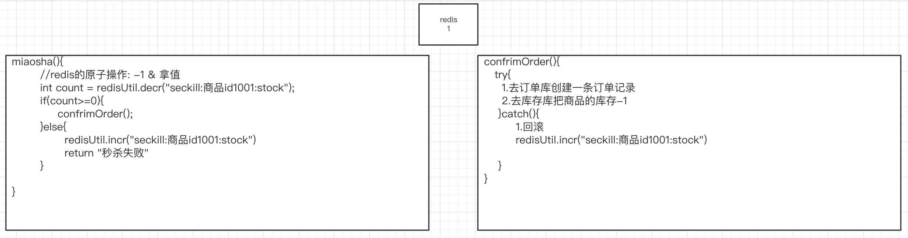


面试官经常会问：你的系统中redis和mysql的数据是怎么同步的？

- 对于秒杀系统来说，这个方案就是当提交订单时，去mysql的库存库里扣减，实现redis和mysql的数据同步
- 对于其他系统来说，具体的方案在后面专题去讲


# 八、如何解决秒杀已结束但依然要去扣减redis库存的问题

## 1.已结束后的redis的扣减会影响性能

redis中的库存已被扣完，但依然有很多用户的请求继续访问后端接口，如果这样的请求非常多，会造成后端多余的开销

## 2.解决方案：在redis里设置一个秒杀结束标记

当redis的库存扣完，那么就向redis存放一个结束标记，在下一次请求的时候，判断是否有结束标记。如果有就直接返回，不执行后面的额扣减。但是这种方案性能不好。

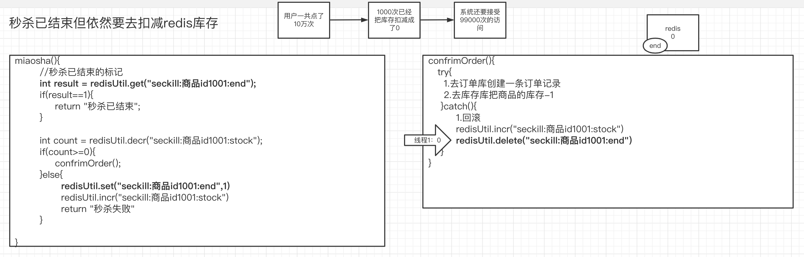

## 3.该方案存在的弊端

虽然设置的标记，但是redis的io请求次数没有减少，反而在正常扣减之前增加了redis的io次数。


## 4.另一套方案：使用jvm本地缓存来存放结束标记

使用一个存放在jvm本地内存中的数据结构-ConcurrentHashMap来存放结束标记，减少redis的io

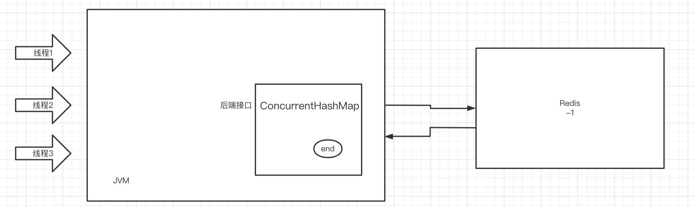

结束标记放在本地，每次执行业务之前先查看本地是否有结束标记，如果有则不执行之后的业务。


# 九、ConcurrentHashMap的特点

## 1.为什么要使用HashMap

因为HashMap的查询性能非常快，查询的时间复杂度是O(1)

- 数组：查询快（根据索引来查询）O(1)，没有索引就是O(n)，增删慢
- 链表：查询慢，要逐一遍历，O(n);增删快
- HashMap：查询快，增删也是很快的


## 2.HashMap的put过程

- 根据entry的key做hash运算，决定存放在哪个哈希表的位置中
- JDK1.7使用了头插法、JDK1.8使用了尾插法。

hashmap默认的负载因子是0.75，默认的初始化容量是16。当hashmap中的元素个数超过16X0.75的时候，就会进行扩容(2倍)。

1.7是先扩容，再插入，会造成死循环


1.8是先插入，再扩容，不会造成死循环

- JDK1.8加入了红黑树（能够自己维护平衡的一种特殊的平衡排序树）：如果说在hashmap中一个链表的长度大于等于8，那么这个链表会被转换成红黑树，目的是提升查询的性能。

为什么链表的长度大于等于8时会转换成红黑树：因为根据离散特性，8转换成红黑树对于系统的整个性能是最好的。

- 如果这个红黑树上的元素个数小于等于6，那么红黑树会转换回链表

为什么小于等于6，而不是直接小于等于8，一下等于7，一下等于8，给了一个缓冲的区间。

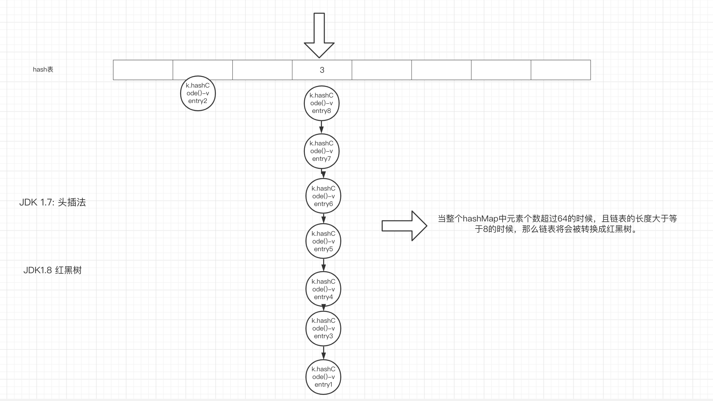


## 3.线程安全的HashMap

系统一旦涉及到线程安全问题，我们考虑的出发点就是：如何既保留了性能又保障了安全。

HashMap本身是线程不安全的，如何解决线程安全问题：

- Hashtable:对读的操作都上锁，并发性非常差

- ConcurrentHashMap：1.8版本的性能几乎与线程不安全的HashMap相同了。

  - 1.7 :使用segment上分段锁:锁的粒度变小，但是粒度还不够小
  - segment继承了Reentrantlock，entry储存在segment对象中,对segment上锁
  - 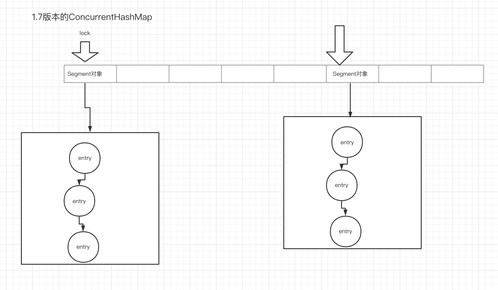
  - 1.8：使用cas+synchronized上锁（锁的粒度更小、synchronized会进行膨胀升级,当并发非常严重时，CAS自旋非常严重，此时直接上synchronized锁）

## 4.CAS机制

### 1）乐观锁和悲观锁

  - 悲观锁：总有刁民要害朕。 悲观的认为当前系统的并发性非常严重。所以任何的操作都要上锁。
  - 乐观锁：天网恢恢疏而不漏。乐观的认为当前系统的并发性不严重，所以基本上不上锁，但真的产生并发的时候，会有相关的机制来保证安全

### 2）CAS怎么实现

  CAS是一种乐观锁，当出现并发的时候，通过自旋来保证数据安全。CAS需要获得三个值

  - 内存地址v
  - 旧的期望值A
  - 新值B

  使用cas来修改数据，需要进行以下流程

  - 先获得内存地址V中的旧值A
  - 然后算出新值B。在提交的时候去查看内存地址V中的实际值是否和A相同，如果相同，提交成功；如果不相同， 自旋，更新旧值A，再次提交。

  CAS来说适用于并发不严重的情况，如果并发严重，那么自旋的情况会频繁出现，导致系统造成额外的较大的开销。

### 3）CAS中的ABA问题

当线程在提交的时候，因为阻塞导致提交的内部被多次更改，而此时旧值和多次更改的值是相同的（A->B->A），于是也提交成功了，实际上被多次修改了，那么这一次提交不应该成功，应该报错。此时可以通过版本号来解决这个问题。


#  十、将秒杀接口冗余部署到多个JVM后秒杀标记会造成不公平的情况

## 1.不公平情况的出现

当jvm冗余部署多台，如果之前有的线程在秒到最后一个商品发生了退库的操作，在这过程中，多个线程已经把结束标记打在了每个jvm本地，那么此时退库操作会把结束标记删掉，但只能删除该线程所访问的jvm的本地的标记。这就意味着，如果接下来再有请求访问的是这台jvm可以继续秒杀，但访问其他jvm，结束标记还在，不能秒杀。这就是不公平情况。

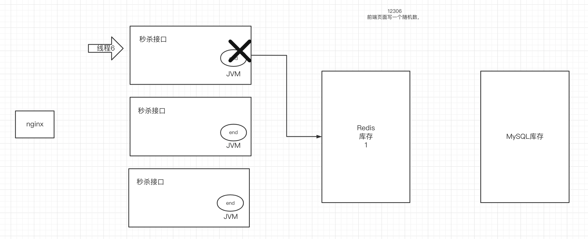


## 2.解决不公平问题

使用zk的watch机制

- 在线程扣减完redis库存发现库存不足时，创建结束标记
- 在zk中创建节点，并监听
- 设置回调方法，回调方法的内容根据 zk中节点的内容，是否删除结束标记
- 当有线程发生退库操作，修改zk中节点的内容
- 之前监听zk该节点的所有客户端的回调方法被调用，删除本地的结束标记

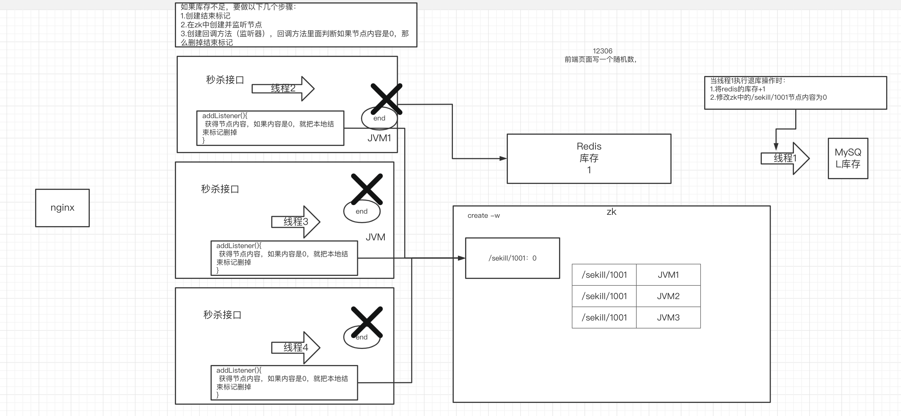


# 十一、防止同一个用户重复下单

## 1.问题的出现

当一个用户在抢购商品的时候，会疯狂点前端的按钮，很容易后端就会收到同一个用户的多个请求。如果不做限制，就有可能，这一次用户的重复点，该用户的多个请求会创建出多个订单。

## 2.解决方案

当用户创建订单成功后，在redis里放一个下单成功的标记。之后的请求去判断当前该用户的下单成功的标记是否已存在，如果已存在则直接返回

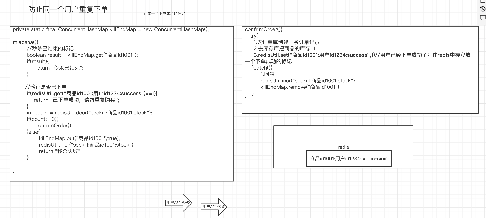

## 3.存在的问题

当用户并发访问的时候，线程1还没来的及存放标记，线程2就进来了继续提交订单，这样依然会出现重复购买的问题。


# 十二、前端如何有效获取秒杀结果

## 1.前端如何获得秒杀结果


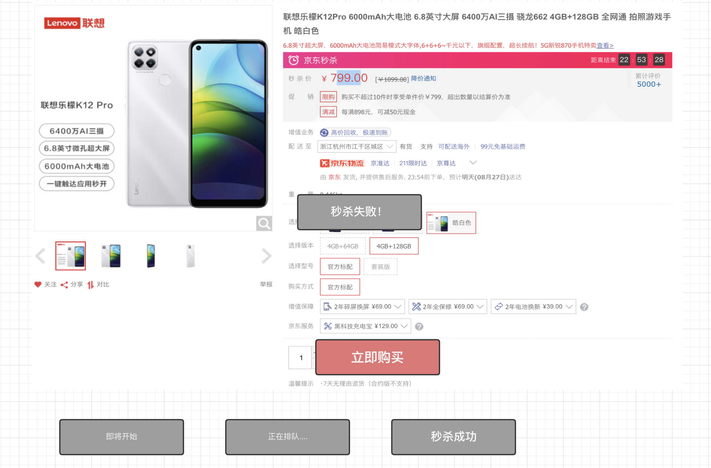


## 2.前端设置定时器，定时访问后端接口

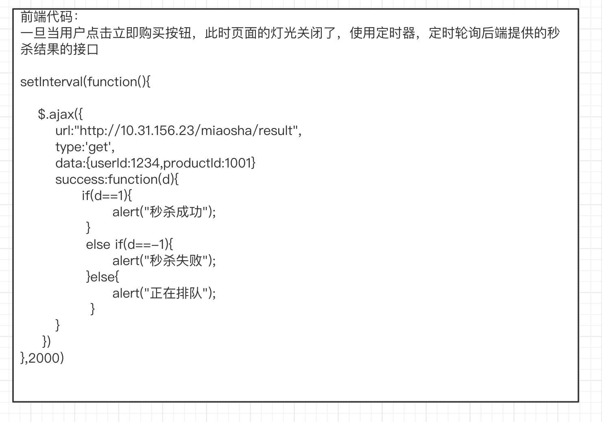


## 3.后端提供返回秒杀结果的接口

使用分布式锁实现排队标记，也解决了上一点中出现的问题

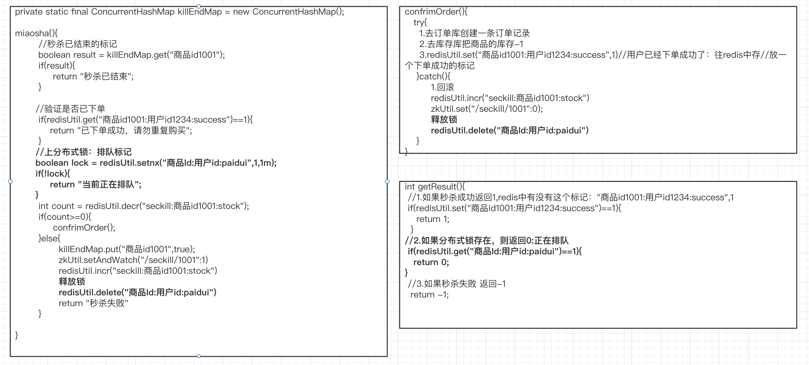


# 十三、如何保证接口安全

## 1.什么是接口安全

在早期的抢票环节，经常可以使用一些工具来盗刷接口，所以很多平台就出了一些具体的方案：

## 2.解决接口安全问题的方案

- 验证码：验证码的目的是为了排除机器在盗刷，判断当前是否是人类的操作。道高一尺魔高一丈

  之后的支付宝有个风控部门，因为访问频繁等等原因，你的风控系数上去了，于是支付宝给的验证码会非常非常难：1822199231/1293123=？

- 前端隐藏接口：前端vue框架基本上都是可以隐藏接口：http拦截工具是可以查看到访问的接口

- 使用一次性token做有效性验证。


## 3.对于只用验证码的情况来说会出现的问题

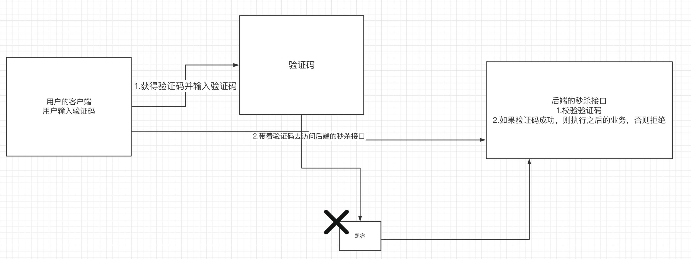

虽然验证码能拦截一部分机器，和分流。但是黑客依然有办法去使用人肉平台获得非常难的验证码去盗刷接口，那如何解决这个问题？

使用一次性token做安全校验。防止接口被频繁盗刷，导致服务器压力过大。

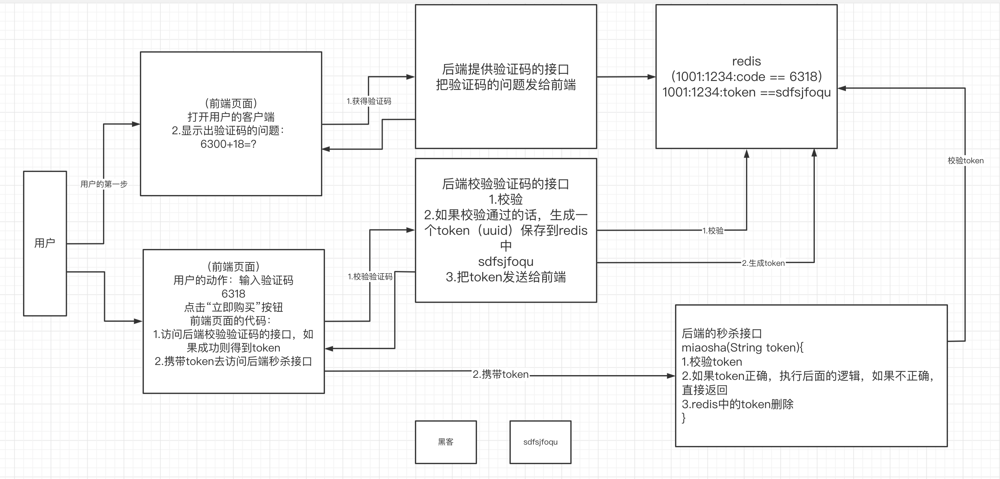


## 4.验证码+token的实现逻辑

### 1）前端打开页面时获得验证码

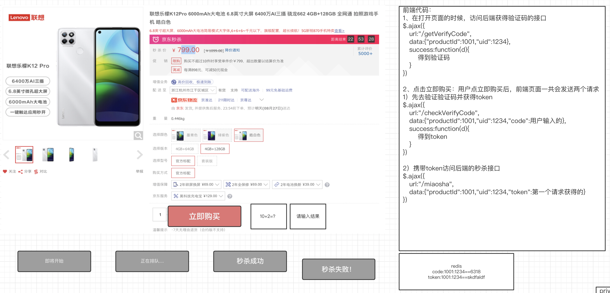

### 2）当用户点击立即购买，需要发两个请求

- 请求验证验证码，获得token
- 如果验证码通过，携带token，访问秒杀接口

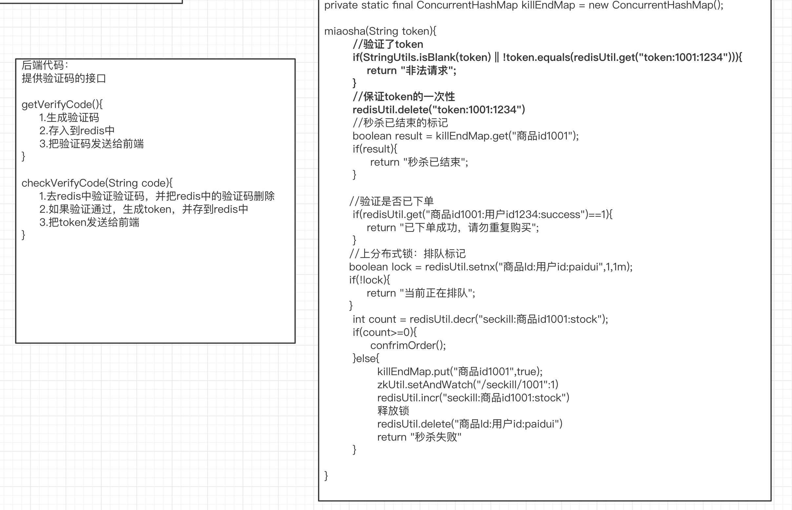


## 5.接口安全保障的时序图

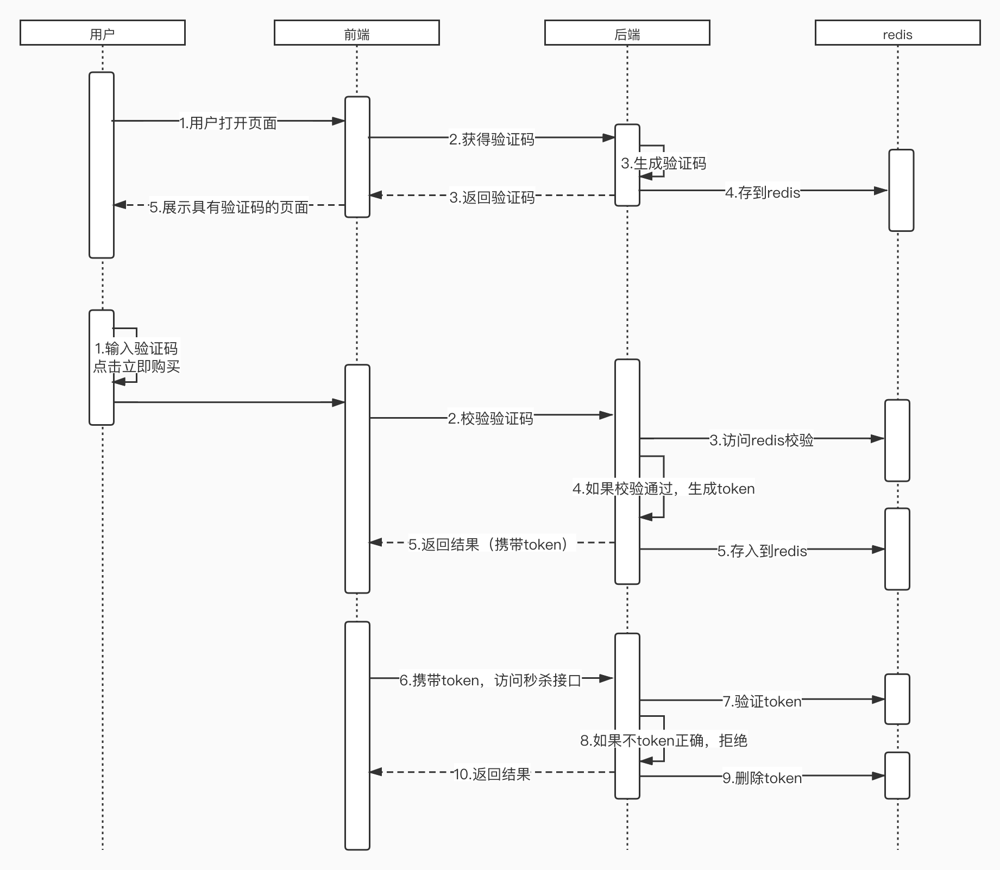


## 6.流程图

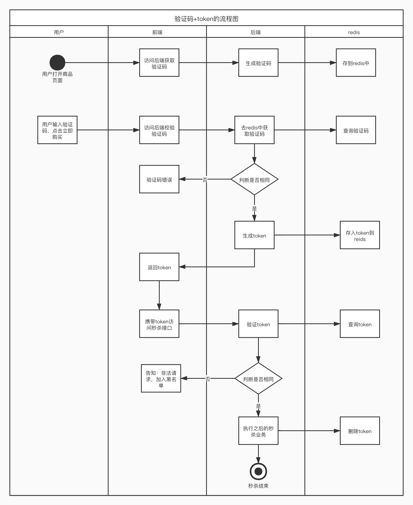


# 十四、限流方案

## 1.为什么要使用限流

一个项目上线后，为期安排的服务器资源、网络资源都是有限的。但是访问量、吞吐量是可以无限夸大的。也就是说系统在应对一个足够大的访问量的时候系统就会扛不住，为了防止这种情况，可以通过使用限流方案，让大流量在一定的范围内访问服务器。

换句话，即使做了很多的优化：中间件优化、通信工程优化、业务架构优化。访问量从1000-100000，如果来了1千万。这个时候就使用限流。

## 2.企业中的日常流量数据

如果要使用限流方案，那限多少流量呢？是十万，还是百万，还是千万？应根据企业的日常数据来判断。

- 注册用户数：800万

- 日活（每日活跃）用户数：七天日活数100万

- tps：transaction per second 每秒事务数 ===理解成每秒提交了多少个订单。

  ​	（峰值）每秒的订单数3000到4000。

- qps：query per second 每秒查询数== 1个tps相当是5-8个qps。

  ​	 （峰值）15000到30000

- 每日订单：2-3万个

- 客单价：15左右

- 利润：10%     4万5 

- 多少个服务 50个左右

- 有多少台服务器：大胆的说不知道

- 多少个docker：50*2个docker容器  一主一备


企业技术团队有多少人：产品3、前端4（2组）、后端12（2组）、测试3个人、运维3个人。25人*20万=500万


通过流量确定出系统的目标要扛下5万并发，通过压测，测出当前限流方案是否可行。


## 3.常见的限流算法

- 计数器限流。30000

来一个加一个，总数之内都可访问，超过则限流。

- 令牌桶算法

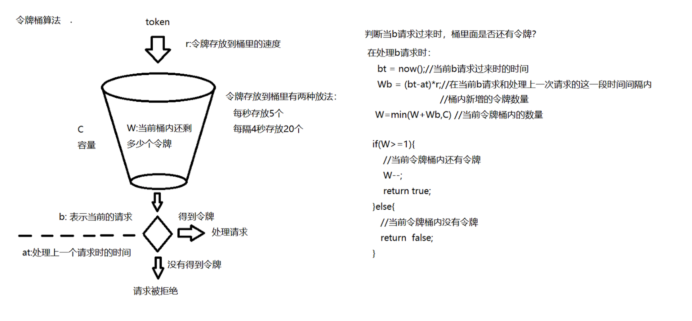


- 漏桶算法

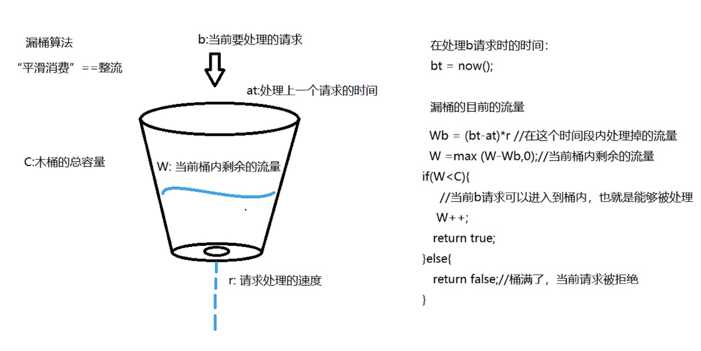

## 4.限流算法加在秒杀的哪个位置比较合适？

- 在网关层面可以用guava做令牌桶限流
- 在接口层面做计数器限流，因为计数器限流代码简单一些，效率更高

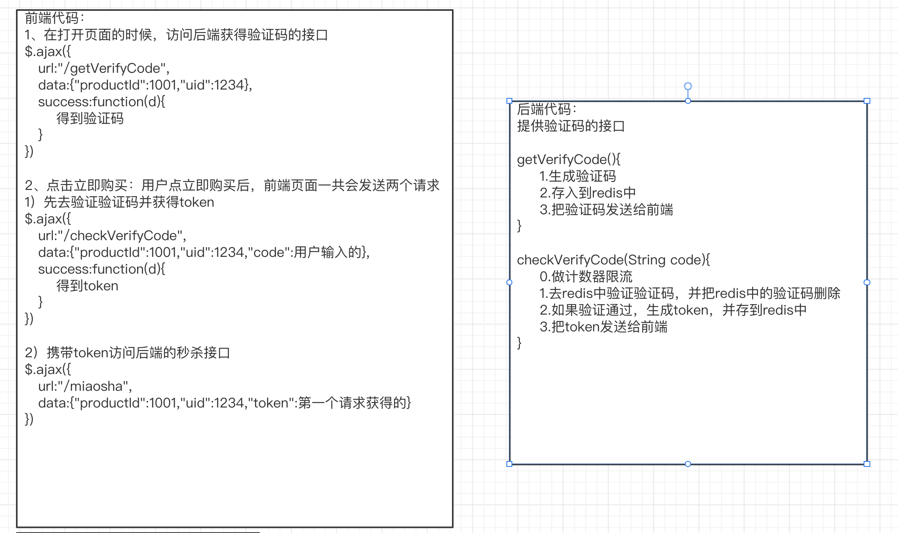


# 十五、关于简历课

## 1.简历模版

- 可以用这种基础模版写好内容/也可以直接在boss直聘网站上编写好在线简历。
- 使用导出/下载简历的功能，把这份在线简历下载后会是一个doc文档。这个doc文档就是一份非常专业的简历。

- 把doc转换成pdf，
- 把pdf上传到这种在线招聘网站作为自己的附件简历。
- 跟别人聊天，对方会问你要附件简历的。以及微信等等传的都是pdf简历。


## 2.项目怎么找

- 二阶段：点餐系统  去手机的应用市场，只写里面的一个具体的业务模块，需要有亮点，开发周期一个月。 或者这个项目去掉，换一个中后台的系统（点餐管理系统、秒杀的营销活动管理）
- 三阶段：杭州城建集团工地管理系统，多条件查询怎么实现：某个用户（当前的子账号（被管理的帐后））的某个工地（杭州拱墅区和平广场）的某一类设备（人脸识别设备），业务怎么实现？
- 四阶段：数据大屏，主要写消息积压解决方案： 大屏上要展示设备的正确率，异常设备。-》后端要查设备的最近活跃时间表（今天上报心跳的设备）-〉设备每3s就报一次心跳，设备总共有20万台，消息会积压，用kafka+我们的消息积压方案来解决消息积压。

https://gitee.com/lvyeyou/DaShuJuZhiDaPingZhanShi?_from=gitee_search

- 四阶段：秒杀

  - 教育app里的秒杀课程，去手机的应用市场 输入 施强教育-请百荣做的，app的权属：sq教育
  - 电商类 社区团购、生鲜，去手机的应用市场 输入 生鲜
  - 医疗类：爱康体检：体检套餐 1元秒杀，去手机的应用市场 输入体检

  从需求文档里再找一个

https://hangzhou.zbj.com/sem/index?pmcode=128454769&utm_source=baidu&utm_medium=SEM&sdclkid=ALos152Nb6DNxSD6AOA

去上面这个地方找公司的名称


## 3.写简历的注意事项：

- 基本技能：建议用通俗易懂的语言，写关键的中间件

```
● Java基础扎实，有良好的编程习惯，熟悉常用Java API，包括集合、多线程、JDBC、XML、反射等
● 熟练使用Spring，Springboot，等框架。
- 熟练使用dubbo、Springcloud等微服务框架完成微服务系统的开发
- 熟练使用常用的分布式中间件Redis、Kafka、zk、docker、Elasticsearch等。
● 熟悉Vue框架的基本使用，具备一定的前端开发能力，能够进行前后端分离开发
● 熟悉Elasticsearch搜索引擎
```

- 写项目介绍：一定要用白话。去阐述项目中的复杂业务。

```
目是一个微服务项目，各项目模块分离开发。其中客流监控模块与安装在市场门口的红外客流统计设备相结合，可以精确记录客流数据。项目中使用了Kafka消息中间件，通过异步的方式将客流数据发到Kafka消息队列中，后端消费者从Kafka订阅消息进行消费，将消费到的数据设置到Redis中，后端接口从Redis获取到数据，前端定时刷新请求从Redis中获取到数据，减轻数据库压力。Controller层提供获取数据的接口，优先从Redis获取，获取不到就去数据库中查询，查到后将数据存入Redis中。采用Zookeeper提供服务注册与发现功能，负载均衡策略采用轮询策略保证服务的高可用。利用Hystrix实现熔断器，避免系统雪崩。服务模块内部采用Dubbo的RPC调用，实现服务内部下游与下游功能的解耦合。
```

- 简历非常重要，一份好的简历，容易过筛选，你坐在那里面试很有自信心。

一定要精雕细琢，里面的文字都要非常讲究。

   非常懒-直接cv

- 项目要好好找，项目里的业务一定要去分析，找一些复杂业务，写在简历上


# 十六、整合及总结

## 1.业务流程的整合

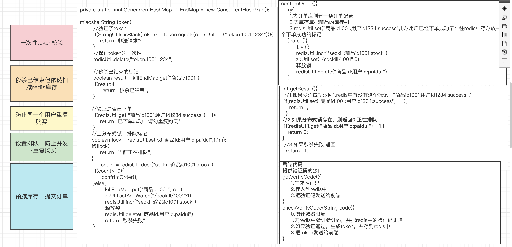

流程图：

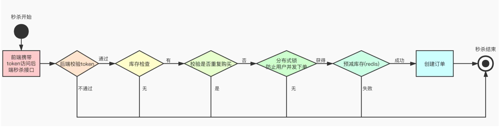


## 2.面试中如何介绍秒杀项目

面试官问：秒杀系统怎么设计的？

回答问题一定要有一个开头的概述（总括）+ 细节点去细化 +总结

- 我们秒杀系统为了应对突发的大流量做了很多的优化。
  - 为了提高吞吐量，把库存放到redis中
  - 为了防止redis库存扣减完还有大流量依然要去扣减redis库存，于是就在jvm本地设置一个秒杀结束标记，用ConcurrentHashMap来存，使用zk解决不公平问题。
  - 为了防止同一个用户重复下单，也设置相关的标记放到redis里，也设置了分布式锁（redis-cluster和zk的分布式锁）。

- 除了这些优化以外。我们系统还解决了超卖、少卖等问题，还加入了一些限流的措施（网关层面和接口层面都用了计数器限流）

- 根据我们这样整套方案，经过压测，可以做到qps达到10万。