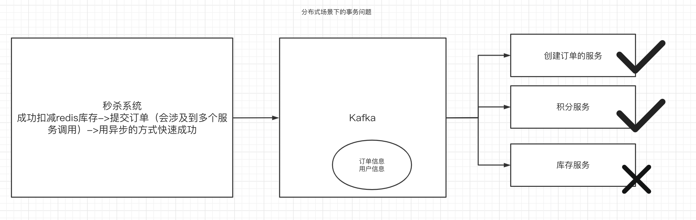
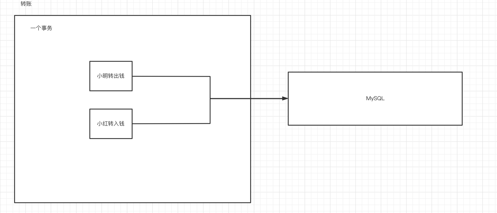
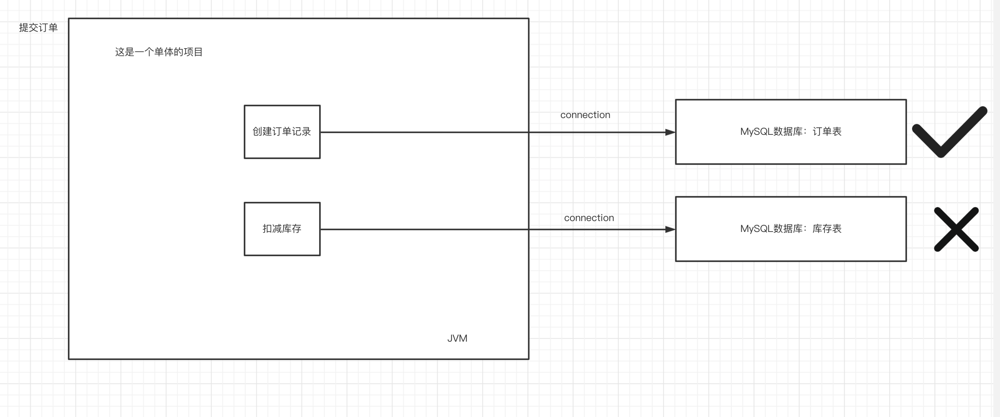
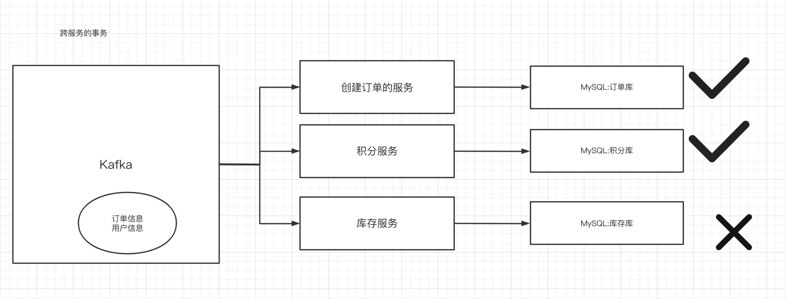
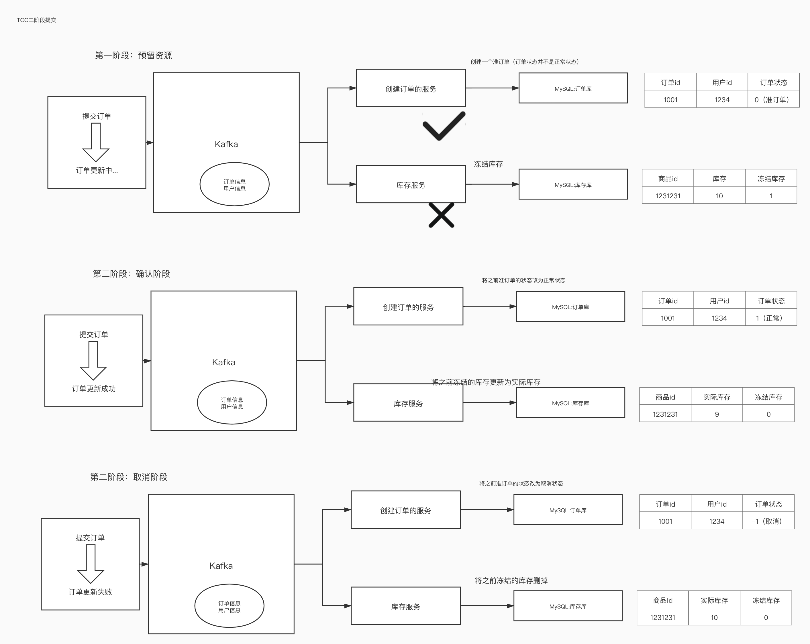
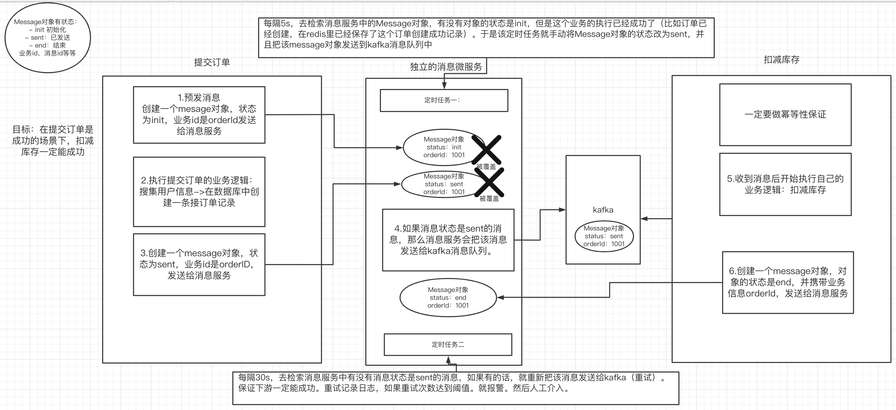
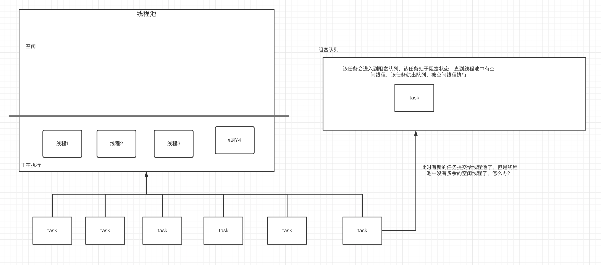
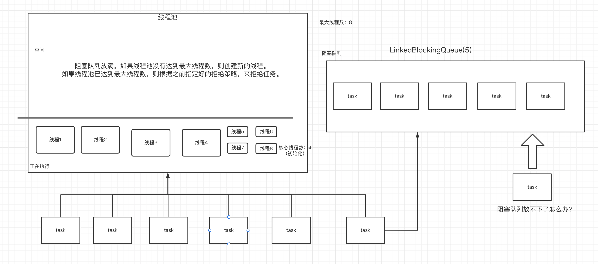

# 一、分布式事务的应用场景

## 1.在秒杀场景中的分布式事务问题



## 2.提供系统的吞吐量的方案

### 1）可以套用的模版

- 使用多线程
- 充分使用缓存服务器redis
- 对服务进行冗余部署。
- 把同步的通信方式改成异步（工作量是非常大的。应该属于系统架构阶段就要做的）
- 对服务进行拆分，用分布式微服务的方案来解决。
- 如果mysql查询性能达不到要求，可以使用搜索引擎中间件 solr/es


### 2）如何让查询的速度提升

比如现在有30万数据，要查这30万条数据（22s），如何让性能提升？如果这些查询里面包含了多个条件，而且有的条件是非常复杂的。

使用countdownlatch（门栓），合并多条线程的执行结果。


# 二、事务的概念

## 1.事务的特性

- 原子性
- 持久性
- 一致性
- 隔离性

## 2.本地事务



## 3.跨库（XA/JTA）事务——分布式事务的应用场景



在跨库事务的场景中，需要讲多个数据库操作，如果出现事务的问题的话要统一回滚。这里就涉及到一个概念XA跨资源服务协议，以及JTA（在java中的XA的解决方案）。

**跨库事务怎么解决？**

- 手动去之前的数据库中删除之前的记录
- 使用一个中间件：atomikos

跨库事务的应用场景在我们的分布式项目中出现的不多。


## 4.跨服务的事务——分布式事务应用场景

目前多个数据库的操作是在多个服务中执行的，那如何解决多个服务之间的事务问题——跨服务的事务解决方案




# 三、跨服务事务解决方案一：TCC二阶段（三阶段）提交

## 1.TCC的含义

- T：try 尝试 （第一阶段）
- C:  confirm 确认 （第二个阶段的一种情况）
- C：cancel 取消（第二个阶段的另一种情况）

TCC把分布式事务的过程拆分成了两部，让系统处于一个中间状态。

## 2.TCC怎么解决分布式事务问题



将整个事务的提交分成两个阶段：

- 预留资源：尝试去看看每个服务能否正常访问
- 确认/取消资源：如果第一阶段的额尝试有的服务是失败的，那么就需要取消资源。如果第一阶段的尝试，所有的服务都是成功的，那么就确认资源。

TCC有一些中间件是可以实现的，比如支付宝的GTS。Atomikos也提供了付费支持TCC的解决方案、SEATA

## 3.TCC存在的弊端

- 如果服务一多，只要有一个服务出现了问题，那么就需要取消其他所有的服务，这对性能影响是非常大的。当然，对于一些金融场景来说，为了保证数据的强一致性，就必须使用TCC。
- TCC会提供一套补偿机制：当在确认阶段时出现了提交失败，于是开启重试、记入日志、重试达到阈值，人工介入，人工解决。虽然TCC追求的是强一致性，但是在某些特殊情况下，TCC依然需要通过人工来解决，保证最终一致性。

总结来说，对于一些追求强一致性的应用场景来说，推荐使用TCC，但是系统的性能开销非常大，所以我们不会使用TCC来解决目前我们的高吞吐量的应用场景。

# 四、跨服务事务解决方案二：消息队列做可靠性补偿，实现最终一致性



## 1.Message状态

分为三种：

- init 
- sent
- end

## 2.方案执行流程：

- 上游创建一个Message对象，状态为init
- 将该message发送给==独立的消息微服务==
- 上游执行自己的业务逻辑
- 创建一个Message对象，状态为sent
- 将该message发送给独立的消息微服务
- 独立的消息微服务收到message，如果状态是sent，就会把该消息发送给kafka消息队列
- 下游监听kafka消息队列，执行自己的业务逻辑
- 下游创建一个Message对象，状态为end
- 将该message发送给独立的消息服务


## 3.独立的消息微服务中有两个定时任务：

- 定时任务一：定时去检索消息服务中的所有的message对象，如果message对象为init，并且该业务已执行完毕（比如从redis中获知该订单已创建），则意味着，上游发sent状态的消息失败了。所以该定时任务就将该message状态改为sent，并发送到kafka。**该定时任务保证只要上游业务执行成功，kafka消息队列肯定能收到消息。**
- 定时任务二：定时去检索消息服务中的所有的message对象，如果有message对象状态为sent，那么就重新将该message发送给kafka，并记录重试次数，如果重试达到阈值，日志告警，人工介入。这样的目的，**是保证下游肯定能执行成功，将end状态的message发送给消息服务。**注意，下游一定要做幂等性保证。


# 五、线程池

线程池是一个提供接口性能、吞吐量的首要方案。因为线程池可以提供多条线程，充分的利用服务器的资源。

## 1.线程池的介绍

线程池的目的，是在初始化线程池的时候，先往线程池中放入一定量的线程。这样的目的是：当有任务提交到线程池的时候，线程池可以直接安排之前创建好的线程来执行这些任务，而不需要此刻创建新的线程。因为如果需要执行一个任务就创建一个新的线程，这样的创建造成开销是非常大的。


频繁的创建和消费线程会带来很大的性能浪费

此时使用线程池可以解决这个问题


## 2.线程池的工作流程-JDK提供的解决方案

### 1）线程池初始化线程

当有任务提交到线程池中时。线程池，安排池中的线程执行任务，当任务执行完，线程回到线程池，进入到空闲状态，等待执行新的任务。


### 2）没有空闲线程，则新的任务会被阻塞

当有新的任务来时，如果线程池中没有空闲线程，那么新的任务会被阻塞——会进入到阻塞队列，直到有新的线程空闲，就出队列，被执行。



### 3）当阻塞队列被放满，会怎么样？



当阻塞队列放满，线程池就会尝试去创建新的线程，会面临以下两种情况：

- 线程池中的线程数没有达到最大线程数（之前在创建线程池时就指定的）：继续创建新的线程
- 线程池中的线程数已经达到最大线程数：就会执行之前指定的抛弃（拒绝）策略。


注意，如果线程池中的线程数>核心线程数，那么多出来的线程的空闲时间如果超过指定的时间，该线程会被删掉。线程池保持一个核心线程数的状态。


## 3.如何使用多线程

多线程的创建有以下几种：

- Thread
- Runnable
- Callable
- 使用线程池


**那么线程池该怎么用？**

### 1) 使用jdk提供的api来直接获得线程池的几种方式，都会造成内存的溢出

```java
package com.qf.thread.pool.demo;

import java.util.concurrent.ExecutorService;
import java.util.concurrent.Executors;
import java.util.concurrent.ScheduledExecutorService;

public class MyThreadPoolDemo {
  public static void main(String[] args) {

    /*
    public ThreadPoolExecutor(int corePoolSize, 核心线程数
                              int maximumPoolSize, 最大线程数
                              long keepAliveTime, 发呆时间（空闲时间）
                              TimeUnit unit, 时间单位
                              BlockingQueue<Runnable> workQueue, 阻塞队列
                              ThreadFactory threadFactory, 线程工厂
                              RejectedExecutionHandler handler) 拒绝策略
     */

    //1.创建线程池的方式-官方提供的四种api创建线程池都会造成内存溢出
    /* 1)创建只有一条线程的线程池
    new ThreadPoolExecutor(1, 1,
                                    0L, TimeUnit.MILLISECONDS,
                                    new LinkedBlockingQueue<Runnable>()) 队列容量过大，允许存入最大21亿个任务，导致内存溢出
     */
      ExecutorService pool = Executors.newSingleThreadExecutor();

    /*
    2)创建一个具有多条线程的线程池
    new ThreadPoolExecutor(nThreads, nThreads,
                                      0L, TimeUnit.MILLISECONDS,
                                      new LinkedBlockingQueue<Runnable>());队列容量过大，允许存入最大21亿个任务，导致内存溢出
     */
      ExecutorService pool = Executors.newFixedThreadPool(4);

    /*
    3)创建一个线程池，线程池中的线程数根据当前的内存情况来定，也就是说内存允许的情况下会一直创建出新的线程
    new ThreadPoolExecutor(0, Integer.MAX_VALUE, 创建的线程数过多，导致内存溢出
                                      60L, TimeUnit.SECONDS,
                                      new SynchronousQueue<Runnable>());
     */
      ExecutorService pool = Executors.newCachedThreadPool();

    /*
    4)创建一个跟定时任务相关的线程池
     super(corePoolSize, Integer.MAX_VALUE, 最大线程数过大，导致内存溢出
     0, NANOSECONDS,
              new DelayedWorkQueue());
     */
      ScheduledExecutorService pool = Executors.newScheduledThreadPool(4);


  }
}

```


### 2)自己创建多线程

```java
package com.qf.thread.pool.demo;

import java.io.IOException;
import java.util.concurrent.LinkedBlockingQueue;
import java.util.concurrent.ThreadPoolExecutor;
import java.util.concurrent.TimeUnit;

public class MyThreadPoolDemo1 {
  public static void main(String[] args) throws IOException {

    /*
    线程池初始化多少条线程是比较合适的？
    根据可获得cpu的核心数来确定
    最大线程数应该是多少：
    计算型：最大线程数=核心线程数
    突发型：最大线程数=核心线程数*2

     */
    //获得cpu的核心数
    int corePoolSize = Runtime.getRuntime().availableProcessors();

    //目标：使用线程池来创建多线程，执行多个任务
    ThreadPoolExecutor pool = new ThreadPoolExecutor(
      corePoolSize,
      corePoolSize * 2,
      60, //跟官方jdk一致
      TimeUnit.SECONDS,
      new LinkedBlockingQueue(1000) //这个队列的大小，根据实际的业务中每个任务所需要的jvm内存空间大小有关，该大小的设置，既要考虑吞吐量（如果慢了会拒绝，根据拒绝策略的不同，吞吐量也是不一样的），也要考虑安全性（不要造成内存溢出），这一块在讲jvm调优的时候详细讲
    );

    for (int i = 0; i < 10000; i++) {
      //线程池提交10000个任务
      pool.submit(new MyRunnable(i));
    }

    System.in.read();


  }

  static class MyRunnable implements Runnable{

    private int i;
    public MyRunnable(int i){
      this.i = i;
    }


    @Override
    public void run() {
      System.out.println(Thread.currentThread().getName()+":"+i);
    }
  }

}

```


## 4.阻塞队列的介绍

### 1）阻塞队列的目的

阻塞队列的目的：在实现生产者和消费者模式的时候，之前：生产者生产如果队列满了，生产者需要阻塞；消费者消费消息时如果队列空了，消费者需要阻塞——这些功能需要手动实现。但是阻塞队列帮我们实现了这些功能（阻塞的功能）。

### 2）阻塞队列有哪些？

- ArrayBlockingQueue：底层用数组来实现，阻塞队列
- LinkedBlockingQueue：底层用链表来实现，阻塞队列（频繁的进出，更加合适）
- DelayQueue：实现一个延迟队列，时间到了，才能被消费
- SynchronousQueue：没有队列缓冲区的队列，参考 Exeutors.newCachedThreadPool()使用的就是这个队列，直接创建新的线程，队列不提供空间来存放新的任务。==没有容量，是无缓冲等待队列，是一个不存储元素的阻塞队列，会直接将任务交给消费者(直接交给线程)，必须等队列中的添加元素被消费后才能继续添加新的元素。==


## 5.拒绝策略

当阻塞队列被放满，且线程池中的线程池也达到最大值，那么就会开始执行拒绝策略

- AbortPolicy：直接抛异常
- DiscardPolicy：把新的任务抛弃掉，不抛异常
- DiscardOldestPolicy：把队列中最老的任务抛弃掉，不抛异常
- CallerRunsPolicy：不抛异常，把新的任务交给主线程来执行


# 作业

- 掌握分布式事务解决方案，要做到能说
- 掌握线程池的实现逻辑，也是一样做到能说
- 写简历，本周五晚24点