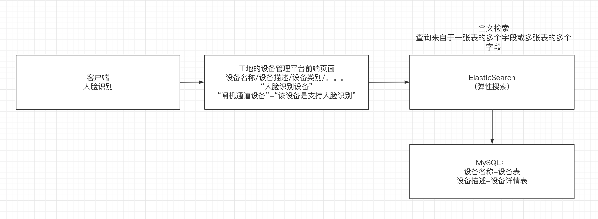
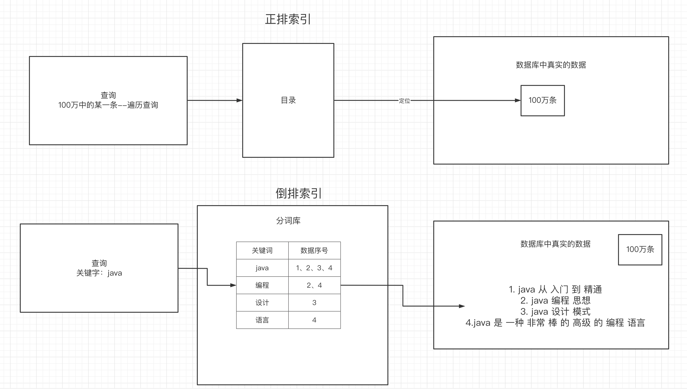
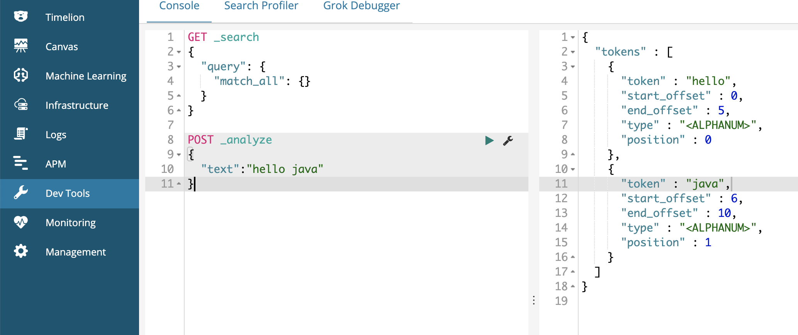
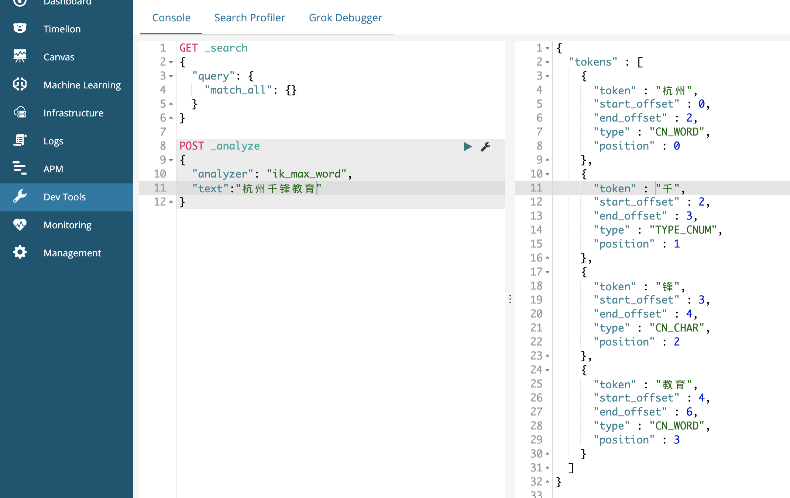
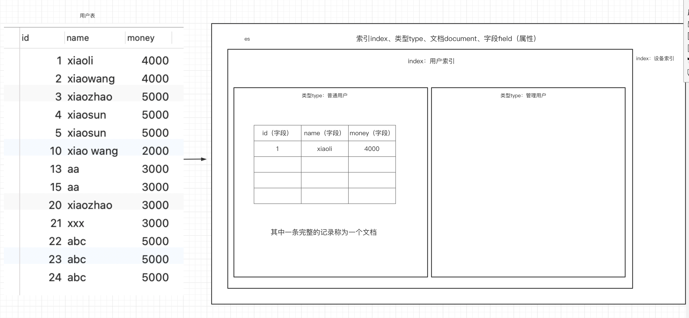
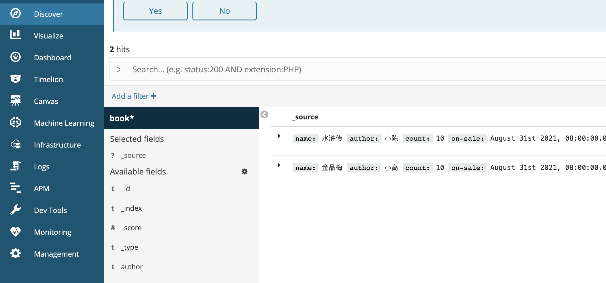
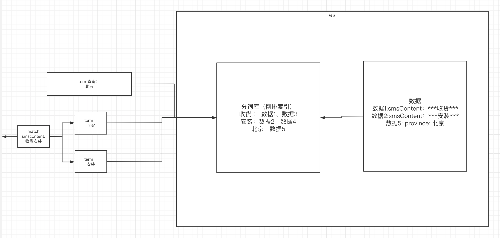
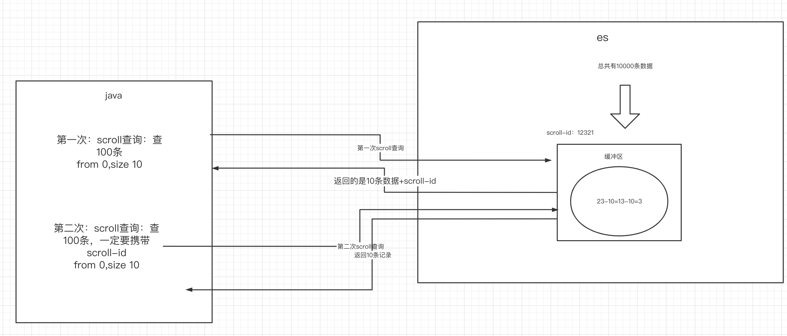
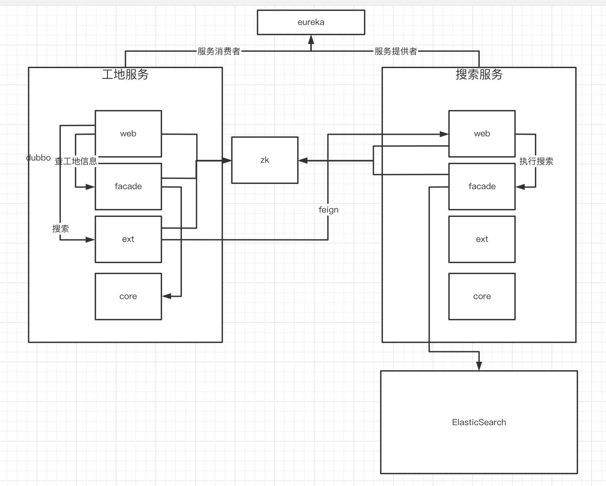

# 一、ES介绍

## 1.为什么要用ES做搜索

在大部分的APP应用场景内，搜索是一个非常重要且吞吐量非常大的模块。搜索一般都会使用全文检索，如果直接用MySQL做全文检索，性能没有使用ES那么的好。




## 2.ES的介绍

ES是一个基于lucene底层框架（目前的实现就两种：es/solr），是一个种分布式的支持全文检索的搜索引擎中间件，提供了优化的restful风格的web接口，让用户去访问。


## 3.倒排索引

倒排索引和普通的索引不同，==**普通索引**是通过索引只能查找某一个字段（索引建立在某个字段上的）的数据。==

==**倒排索引**可以通过分词技术，为关键词和数据之间建立映射关系==，也就是说通过关键词，就能找到匹配的多个数据，这种映射关系称为倒排索引。



# 二、es的安装和使用

## 1.es和kibana的安装

- 编写docker-compose

es提供了的是web接口。可以通过kibana的可视化界面来操作es

```yml
version: "3.1"
services:
  elasticsearch:
    image: daocloud.io/library/elasticsearch:6.5.4
    restart: always
    container_name: elasticsearch
    ports:
      - 9200:9200
  kibana:
    image: daocloud.io/library/kibana:6.5.4
    restart: always
    container_name: kibana
    ports:
      - 5601:5601
    environment:
      - elasticsearch_url=http://192.168.199.109:9200
    depends_on:
      - elasticsearch
```

- 在启动以后给虚拟机配置虚拟内存，否则可能因为内存不足而启动失败

```shell
sysctl -w vm.max_map_count=262144
```


- 在浏览器中输入服务器ip:9200端口 ，如果出现以下界面，表示es安装成功。

- 

- 访问kibana： http://172.16.253.40:5601/

- 尝试去用kibana做一个分词查询，发现默认支持英文分词，不支持中文分词，所以需要安装中文分词器：ikAnalyzer




## 2.安装中文分词器 ikAnalyzer

- 进入到es容器内部的bin路径下
- 执行如下命令，安装ik分词器

```shell
./elasticsearch-plugin install http://tomcat01.qfjava.cn:81/elasticsearch-analysis-ik-6.5.4.zip
```

- 重启es容器
- 使用ik分词器来进行分词



ik分词器要注意未登录词和歧义词


# 三、es的数据结构

## 1.四种概念的介绍

es从mysql中获取数据后，把数据保存在es的内部，来支持分词和倒排索引。那么es中是如何保存数据的？

es内部有四种概念来描述es的数据结构：

- 索引：相当于是mysql中的表
- 类型：类型就是多种数据类型，在es7中已经取消了这个概念
- 文档：相当于是一条完整的数据
- 字段：用来描述数据的各个属性



**把数据存到es中需要这么几个步骤：**

- 先创建一个索引
- 在索引中创建类型
- 在类型中指明字段
- 最后向指定索引的指定类型中添加数据（文档）


## 2.es的分布式特性

去es中创建一个索引，关键是这个索引带着分片数和备份数。体现了es的分布式特性

```json
# 创建索引
PUT /person
{
  "settings": {
    "number_of_shards": 5, # 分片数
    "number_of_replicas": 1 # 备份数
  }
}
```

- 分片数：es一般是要用集群来搭建的。默认的分片数是5个，也就是说索引的数据，会分开来保存在不同的5个分片中。
- 备份数：每个分片有一个备份。

es中默认的分片数和备份数，是一种分布式的体现。


## 3.向es中创建索引并指明索引中的类型、字段及字段类型

```json
# 创建索引，指定数据结构
PUT /book          			------------------------------->索引为book
{
  "settings": {
    # 分片数
    "number_of_shards": 5,
    # 备份数
    "number_of_replicas": 1
  },
  # 指定数据结构
  "mappings": {
    # 类型 Type 自定义
    "novel": {				------------------------------->type为novel(自定义)	
      # 文档存储的Field
      "properties": {
        # Field属性名
        "name": {			------------------------------->字段
    		# 类型
          "type": "text",
    		# 指定分词器
          "analyzer": "ik_max_word",
    		# 指定当前Field可以被作为查询的条件
          "index": true ,
    		# 是否需要额外存储
          "store": false 
        },
        "author": {
          "type": "keyword"
        },
        "count": {
          "type": "long"
        },
        "on-sale": {
          "type": "date",
           # 时间类型的格式化方式 
          "format": "yyyy-MM-dd HH:mm:ss||yyyy-MM-dd||epoch_millis"
        },
        "descr": {
          "type": "text",
          "analyzer": "ik_max_word"
        }
      }
    }
  }
}
```


**字段类型：**

```java
- 字符串类型：
  - text：一般被用于全文检索。 将当前Field进行分词。
  - keyword：当前Field不会被分词。

- 数值类型：
  - long：取值范围为-9223372036854774808~922337203685477480(-2的63次方到2的63次方-1)，占用8个字节
  - integer：取值范围为-2147483648~2147483647(-2的31次方到2的31次方-1)，占用4个字节
  - short：取值范围为-32768~32767(-2的15次方到2的15次方-1)，占用2个字节
  - byte：取值范围为-128~127(-2的7次方到2的7次方-1)，占用1个字节
  - double：1.797693e+308~ 4.9000000e-324 (e+308表示是乘以10的308次方，e-324表示乘以10的负324次方)占用8个字节
  - float：3.402823e+38 ~ 1.401298e-45(e+38表示是乘以10的38次方，e-45表示乘以10的负45次方)，占用4个字节
  - half_float：精度比float小一半。
  - scaled_float：根据一个long和scaled来表达一个浮点型，long-345，scaled-100 -> 3.45

- 时间类型：
  - date类型，针对时间类型指定具体的格式

- 布尔类型：

  - boolean类型，表达true和false

- 二进制类型：
  - binary类型暂时支持Base64 encode string

- 范围类型：
  - long_range：赋值时，无需指定具体的内容，只需要存储一个范围即可，指定gt，lt，gte，lte
  - integer_range：同上
  - double_range：同上
  - float_range：同上
  - date_range：同上
  - ip_range：同上

- 经纬度类型：
  - geo_point：用来存储经纬度的

- ip类型：
  - ip：可以存储IPV4或者IPV6
```


## 4.向索引中添加数据（document）

两种方式，一种是添加时没有指明id，es会自动生成记录的id，另一种是指明了id

```json
# 没有指明数据id
POST /book/novel
{
  "name":"金品梅",
  "author":"小高",
  "count":10,
  "on-sale":"2021-08-31",
  "descr":"很刺激"
}
#指明id
POST /book/novel/1001
{
  "name":"水浒传",
  "author":"小陈",
  "count":10,
  "on-sale":"2021-08-31",
  "descr":"很刺激"
}
```


## 5.在kibana中查询索引中的数据

- 在management->index patterns设置book索引的pattern
- 在discover中选中book,看到里面的记录




# 四、对数据做增删改

## 1.添加数据

在上一章节中已经介绍了

## 2.修改数据

会替代掉整个对象

```json
PUT /book/novel/1001
{
  "author":"小冯"
}
```

## 3.删除数据

```json
DELETE /book/novel/1001
```


# 五、在java中操作es

## 1.创建索引

- 引入依赖

```xml
<!--        1. elasticsearch-->
    <dependency>
      <groupId>org.elasticsearch</groupId>
      <artifactId>elasticsearch</artifactId>
      <version>6.5.4</version>
    </dependency>

    <!--        2. elasticsearch的高级API-->
    <dependency>
      <groupId>org.elasticsearch.client</groupId>
      <artifactId>elasticsearch-rest-high-level-client</artifactId>
      <version>6.5.4</version>
    </dependency>
```

- 封装创建索引的request请求，使用elasticsearch-rest-high-level-client客户端访问es的接口，实现创建

```java
package com.qf.es.util;

import org.apache.http.HttpHost;
import org.elasticsearch.client.RestClient;
import org.elasticsearch.client.RestClientBuilder;
import org.elasticsearch.client.RestHighLevelClient;

public class ESUtil {

  private static String host = "172.16.253.40";
  private static int port = 9200;

  /**
   * 获得一个操作es的es客户端工具
   */
  public static RestHighLevelClient getClient(){
    HttpHost httpHost = new HttpHost(host,port);
    RestClientBuilder builder = RestClient.builder(httpHost);
    RestHighLevelClient client = new RestHighLevelClient(builder);
    return client;
  }


}

```


```java
package com.qf.es;

import com.qf.es.util.ESUtil;
import org.elasticsearch.action.admin.indices.create.CreateIndexRequest;
import org.elasticsearch.action.admin.indices.create.CreateIndexResponse;
import org.elasticsearch.client.RequestOptions;
import org.elasticsearch.client.RestHighLevelClient;
import org.elasticsearch.common.settings.Settings;
import org.elasticsearch.common.xcontent.XContentBuilder;
import org.elasticsearch.common.xcontent.json.JsonXContent;
import org.junit.Test;

import java.io.IOException;

public class TestIndex {

  /**
   * 创建一个索引
   */
  @Test
  public void testCreateIndex() throws IOException {
    //1.访问es的restful接口的客户端
    RestHighLevelClient client = ESUtil.getClient();

    //2.定义索引的名称和类型
    String index = "book_pro";
    String type = "it";


    //3.指明settings
    Settings.Builder settings = Settings.builder()
      .put("number_of_shards", 5)
      .put("number_of_replicas", 1);
    //4.指明mappings
    XContentBuilder mappings = JsonXContent.contentBuilder()
      .startObject()
        .startObject("properties")
          .startObject("name")
            .field("type","text")
            .field("analyzer","ik_max_word")
            .field("index",true)
          .endObject()
          .startObject("author")
            .field("type","keyword")
          .endObject()
        .endObject()
      .endObject();

    //5.创建一个request请求,该请求表示要在es中创建一个索引，需要指明：索引、类型、字段
    CreateIndexRequest request = new CreateIndexRequest(index).settings(settings).mapping(type,mappings);

    //6.用es rest high level client客户端工具来访问es的rest接口--发送请求，得到响应结果
    CreateIndexResponse response = client.indices().create(request, RequestOptions.DEFAULT);
    System.out.println(response);
  }
}

```


## 2.操作数据-增删改

- 添加数据

```java
@Test
  public void testInsertDataToES() throws IOException {

    //1.获得一个客户端
    RestHighLevelClient client = ESUtil.getClient();

    //2.指明索引和类型
    String index = "book_pro"; //name author
    String type = "it";

    //3.准备数据
    Book book = new Book();
    book.setId(1001L);
    book.setName("言情小说");
    book.setAuthor("小高");

    //转换成json
    String json = JSON.toJSONString(book);

    //4.准备一个request对象
    IndexRequest request = new IndexRequest(index,type,book.getId().toString());
    request.source(json, XContentType.JSON);

    //5.用client去发送request——restful 得到响应结果
    IndexResponse response = client.index(request, RequestOptions.DEFAULT);
    System.out.println(response.getResult());
  }
```

- 更新数据

```java
@Test
  public void testUpdateDataToES() throws IOException {

    //1.获得一个客户端
    RestHighLevelClient client = ESUtil.getClient();

    //2.指明索引和类型
    String index = "book_pro"; //name author
    String type = "it";

    //3.准备数据
    Book book = new Book();
    book.setId(1001L);
    book.setName("写真");
    book.setAuthor("小高");

    //转换成json
    String json = JSON.toJSONString(book);

    //4.准备一个更新数据的request对象
    UpdateRequest request = new UpdateRequest(index,type,book.getId().toString());
    request.doc(json,XContentType.JSON);

    //5.用client去发送更新数据的request——restful 得到响应结果
//    IndexResponse response = client.index(request, RequestOptions.DEFAULT);
    UpdateResponse response = client.update(request, RequestOptions.DEFAULT);
    System.out.println(response.getResult());
  }
```

- 删除数据

```java
@Test
  public void testDeleteDataToES() throws IOException {

    //1.获得一个客户端
    RestHighLevelClient client = ESUtil.getClient();

    //2.指明索引和类型
    String index = "book_pro"; //name author
    String type = "it";

    //4.准备一个更新数据的request对象
//    UpdateRequest request = new UpdateRequest(index,type,book.getId().toString());
    DeleteRequest request = new DeleteRequest(index,type,"1001");


    //5.用client去发送更新数据的request——restful 得到响应结果
//    IndexResponse response = client.index(request, RequestOptions.DEFAULT);
//    UpdateResponse response = client.update(request, RequestOptions.DEFAULT);
    DeleteResponse response = client.delete(request, RequestOptions.DEFAULT);
    System.out.println(response.getResult());
  }
```

# 六、term查询

## 1.准备好查询数据

使用TestData.java和Smslogs.java准备好索引和数据


## 2.term查询

你要查询的关键字不会被分词。此时往往对于不被分词字段，比如keyword类型的字段，就可以使用term查询

- kibana

```json
# term查询
POST /sms-logs-index/sms-logs-type/_search
{
  "from":0,
  "size":5,
  "query":{
    "term": {
      "province": {
        "value": "北京"
      }
    }
  }
}
```

- java

```java
package com.qf.es.query.term;

public class TestTerm {

  String index = "sms-logs-index";
  String type = "sms-logs-type";

  @Test
  public void testTerm() throws IOException {

    //1.创建一个查询的request对象
    SearchRequest request = new SearchRequest(index);
    request.types(type);

    //2.封装查询条件
    SearchSourceBuilder builder = new SearchSourceBuilder();
    builder.from(0);
    builder.size(5);
    QueryBuilder query = QueryBuilders.termQuery("province","北京");
    builder.query(query);

    //3.将查询条件关联进request里
    request.source(builder);

    //4.用client发送请求，拿到响应
    RestHighLevelClient client = ESUtil.getClient();
    SearchResponse response = client.search(request, RequestOptions.DEFAULT);

    //5.response把结果解析出来放到一个集合里去
    SearchHits hits = response.getHits();
    SearchHit[] hitss = hits.getHits();
    List<SmsLogs> smsLogsList = new ArrayList<>();
    for (SearchHit documentFields : hitss) {
      String json = documentFields.getSourceAsString();
      SmsLogs smsLogs = JSONObject.parseObject(json, SmsLogs.class);
      smsLogsList.add(smsLogs);
    }
    System.out.println(smsLogsList);
  }
}

```


## 3.terms查询

原理和term一样，一次查一个字段的多个值

- kibana

```json
# terms查询
POST /sms-logs-index/sms-logs-type/_search
{
  "query": {
    "terms": {
      "province": [
        "北京",
        "山西",
        "武汉"
      ]
    }
  }
}
```

- java

```java
QueryBuilders.termsQuery("province","北京","山西")
```


# 七、match查询

match查询特点是根据你查询的字段类型来做相应的转换：

- 如果是数值，转换成数值
- 如果是日期，转换成日期
- 如果是分词的，会被你查询的关键字进行分词
- 如果是不分词的，就不把你查询的关键字做分词

注意：match查询底层就是多个term



## 1.match_all

查询全部的数据

```json
# match_all查询
POST /sms-logs-index/sms-logs-type/_search
{
  "query": {
    "match_all": {}
  }
}
```


## 2.match

查询指定字段内容的数据

```json
# match查询
POST /sms-logs-index/sms-logs-type/_search
{
  "query": {
    "match": {
      "smsContent": "收货安装"
    }
  }
}
```


## 3.布尔match

查询内容里可以做and 或 or的判断

```json
# 布尔match查询
POST /sms-logs-index/sms-logs-type/_search
{
  "query": {
    "match": {
      "smsContent": {
        "query": "中国 健康",
        "operator": "and"
      }
    }
  }
}


# 布尔match查询
POST /sms-logs-index/sms-logs-type/_search
{
  "query": {
    "match": {
      "smsContent": {
        "query": "中国 健康",
        "operator": "or"
      }
    }
  }
}
```

## 4.multi_match

一个关键字从多个字段中查找

```json
# multi_match 查询
POST /sms-logs-index/sms-logs-type/_search
{
  "query": {
    "multi_match": {
      "query": "北京",					# 指定text
      "fields": ["province","smsContent"]    # 指定field们
    }
  }
}
```

# 八、其他查询

- id:根据id来查

- ids：根据多个id来查

- prefix：指定前缀

- fuzzy：模糊查询（允许查询内容的文字和被查询内容的文字有偏差）

- wildcard：通配符查询（*,?）

- range：范围查询

- regexp：正则表达式查询

  

  

# 九、深分页Scroll查询

## 1.普通的分页查询

```sql
select * from tb_book where id >10 limit 30,10
```

普通的分页查询，每次分页，都会把全部数据查到，然后再分页，舍弃掉不要的数据。

## 2.深分页scroll查询

深分页查询在第一次查询的时候es会创建一个缓冲区，缓冲区中存放所有的数据，每次查就从缓冲区把这一次查询的数据返回并删除。



- kibana中的实现

```json
# 执行scroll查询，返回第一页数据，并且将文档id信息存放在ES上下文中，指定生存时间1m
POST /sms-logs-index/sms-logs-type/_search?scroll=1m
{
  "query": {
    "match_all": {}
  },
  "size": 2,
  "sort": [					# 排序
    {
      "fee": {
        "order": "desc"
      }
    }
  ]
}

# 根据scroll查询下一页数据
POST /_search/scroll
{
  "scroll_id": "<根据第一步得到的scorll_id去指定>",
  "scroll": "<scorll信息的生存时间>"
}


# 删除scroll在ES上下文中的数据
DELETE /_search/scroll/scroll_id
```

- java

```java
package com.qf.es.query.term;

import com.fasterxml.jackson.databind.ObjectMapper;
import com.qf.es.util.ESUtil;
import com.qf.es.util.SmsLogs;
import org.elasticsearch.action.search.SearchRequest;
import org.elasticsearch.action.search.SearchResponse;
import org.elasticsearch.action.search.SearchScrollRequest;
import org.elasticsearch.client.RequestOptions;
import org.elasticsearch.client.RestHighLevelClient;
import org.elasticsearch.common.unit.TimeValue;
import org.elasticsearch.index.query.QueryBuilders;
import org.elasticsearch.search.SearchHit;
import org.elasticsearch.search.builder.SearchSourceBuilder;
import org.junit.Test;

import java.util.ArrayList;
import java.util.List;
import java.util.Objects;

public class TestScrollQuery {

  RestHighLevelClient client = ESUtil.getClient();
  String index = "sms-logs-index";
  String type = "sms-logs-type";

  @Test
  public void testMatchAll() throws Exception {
    //1.封装一个查询的request对象
    SearchRequest request = new SearchRequest(index);
    request.types(type);

    //2.设置scroll缓冲区的存活时间
    request.scroll(TimeValue.timeValueMinutes(1));

    //2.封装查询到的条件
    SearchSourceBuilder builder = new SearchSourceBuilder();
    //设置查询的内容
    builder.query(QueryBuilders.matchAllQuery());
    //设置每次获得的条数
    builder.size(5);
    //3.将查询条件封装进request请求对象中
    request.source(builder);

    //4.发送请求
    SearchResponse response = client.search(request, RequestOptions.DEFAULT);

    String scrollId = response.getScrollId();
    //========第一次查询===========
    List<SmsLogs> smsLogsList = getSmsLogs(response);
    System.out.println(smsLogsList.size()+":"+smsLogsList);

    while(true){
      //====之后的每一次======
      SearchScrollRequest searchScrollRequest = new SearchScrollRequest(scrollId);
      //续命
      searchScrollRequest.scroll(TimeValue.timeValueMinutes(1));
      //执行scroll查询
      SearchResponse scrollResponse = client.scroll(searchScrollRequest, RequestOptions.DEFAULT);
      List<SmsLogs> list = getSmsLogs(scrollResponse);
      if(Objects.isNull(list) || list.size()==0){
        break;
      }
      System.out.println("=========================");
      System.out.println(list.size()+":"+list);


    }


  }

  private List<SmsLogs> getSmsLogs(SearchResponse response) throws com.fasterxml.jackson.core.JsonProcessingException {
    //5.解析查询结果
    ObjectMapper objectMapper = new ObjectMapper();
    List<SmsLogs> smsLogsList = new ArrayList<>();
    SearchHit[] hits = response.getHits().getHits();
    for (SearchHit hit : hits) {
      String json = hit.getSourceAsString();
      SmsLogs smsLogs = objectMapper.readValue(json, SmsLogs.class);
      smsLogsList.add(smsLogs);
    }
    return smsLogsList;
  }


}

```


# 十、复合查询

## 1.bool查询

- must
- Must_not
- should


## 2.boosting查询

设计影响查询分数的条件

```json
boosting查询可以帮助我们去影响查询后的score。

- positive：只有匹配上positive的查询的内容，才会被放到返回的结果集中。
- negative：如果匹配上和positive并且也匹配上了negative，就可以降低这样的文档score。
+
关于查询时，分数是如何计算的：

- 搜索的关键字在文档中出现的频次越高，分数就越高
- 指定的文档内容越短，分数就越高
- 我们在搜索时，指定的关键字也会被分词，这个被分词的内容，被分词库匹配的个数越多，分数越高
```


# 十一、高亮查询

## 1.kibana中的实现

```json
POST /sms-logs-index/sms-logs-type/_search
{
  "query": {
    "match": {
      "smsContent": "盒马"
    }
  },
  "highlight": {
    "fields": {
      "smsContent": {}
    },
    "pre_tags": "<font color='red'>",
    "post_tags": "</font>",
    "fragment_size": 10
  }
}
```


## 2.java中的实现

```java
package com.qf.es.query.term;

import com.fasterxml.jackson.databind.ObjectMapper;
import com.qf.es.util.ESUtil;
import com.qf.es.util.SmsLogs;
import org.elasticsearch.action.search.SearchRequest;
import org.elasticsearch.action.search.SearchResponse;
import org.elasticsearch.client.RequestOptions;
import org.elasticsearch.client.RestHighLevelClient;
import org.elasticsearch.common.text.Text;
import org.elasticsearch.index.query.QueryBuilders;
import org.elasticsearch.search.SearchHit;
import org.elasticsearch.search.builder.SearchSourceBuilder;
import org.elasticsearch.search.fetch.subphase.highlight.HighlightBuilder;
import org.elasticsearch.search.fetch.subphase.highlight.HighlightField;
import org.junit.Test;

import java.io.IOException;
import java.util.ArrayList;
import java.util.Arrays;
import java.util.List;
import java.util.Map;

public class TestHighLightQuery {

  RestHighLevelClient client = ESUtil.getClient();
  String index = "sms-logs-index";
  String type = "sms-logs-type";


  @Test
  public void testHighLightQuery() throws IOException {
    SearchRequest request = new SearchRequest(index);
    request.types(type);

    SearchSourceBuilder builder = new SearchSourceBuilder();
    builder.query(QueryBuilders.matchQuery("smsContent","盒马"));


    //设置高亮的参数
    HighlightBuilder highlightBuilder = new HighlightBuilder();
    highlightBuilder.field("smsContent",20)
      .preTags("<span style='color:red'>")
      .postTags("</span>");
    builder.highlighter(highlightBuilder);

    request.source(builder);

    //发送请求
    SearchResponse response = client.search(request, RequestOptions.DEFAULT);

    //如何解析高亮的内容
    List<SmsLogs> smsLogsList = new ArrayList<>();
    for (SearchHit doc : response.getHits().getHits()) {
      ObjectMapper objectMapper = new ObjectMapper();

      SmsLogs smsLogs = objectMapper.readValue(doc.getSourceAsString(), SmsLogs.class);
      //把高亮的部分封装到对象的smsContent中
      Map<String, HighlightField> highlightFields = doc.getHighlightFields();
      HighlightField smsContent = highlightFields.get("smsContent");
//      String content = Arrays.toString(smsContent.getFragments());
      Text[] fragments = smsContent.getFragments();
      smsLogs.setSmsContent(fragments[0].toString());
      smsLogsList.add(smsLogs);

    }
    System.out.println(smsLogsList);
  }
}

```


# 十二、聚合查询和经纬度查询

## 1.聚合查询

- 去重查询
- 范围查询
  - 数值范围
  - 日期范围
  - ip范围
- 统计聚合
  - 最大值
  - 最小值
  - 平均值
  - 平均值和

## 2.地图经纬度查询

根据经纬度查询，可以用直线具体画圆确定范围、多个点确定范围


# 十三、Springboot项目中使用es

## 1.如何在springboot中使用es

- 引入依赖

```xml
<!--es start-->
        <dependency>
            <groupId>org.elasticsearch</groupId>
            <artifactId>elasticsearch</artifactId>
            <version>6.5.4</version>
        </dependency>

        <dependency>
            <groupId>org.elasticsearch.client</groupId>
            <artifactId>elasticsearch-rest-high-level-client</artifactId>
            <version>6.5.4</version>
        </dependency>
        <!--es end-->
```

- 编写配置文件

```yml
spring:
  elasticsearch:
    rest:
      uris: 172.16.253.40:9200
```

- 使用客户端进行操作

```java
		@Autowired
    private RestHighLevelClient client;
    @Override
    public ResultModel<List<SearchDeviceModelResponse>> searchDevice(SearchDeviceModelRequest request) {
        String deviceName = request.getDeviceName();

        String index = "device";
        String type = "face";

        //1.封装一个searchRequest对象
        SearchRequest searchRequest = new SearchRequest(index);
        searchRequest.types(type);

        //2.
        SearchSourceBuilder searchSourceBuilder = new SearchSourceBuilder();
        String queryContent = "*"+deviceName+"*";
        searchSourceBuilder.query(QueryBuilders.wildcardQuery("deviceName", queryContent));

        //3.
        searchRequest.source(searchSourceBuilder);

        //4.
        try {
            SearchResponse response = client.search(searchRequest, RequestOptions.DEFAULT);
            SearchHit[] hits = response.getHits().getHits();
            List<SearchDeviceModelResponse> deviceList= new ArrayList<>();
            for (SearchHit hit : hits) {
                String json = hit.getSourceAsString();
                ObjectMapper objectMapper = new ObjectMapper();
                SearchDeviceModelResponse device = objectMapper.readValue(json, SearchDeviceModelResponse.class);
                //存到集合里
                deviceList.add(device);
            }
            return ResultModel.success(deviceList);
        } catch (IOException e) {
            e.printStackTrace();
        }
        return null;
    }
```


## 2.怎么在项目中把es服务模块加进去

