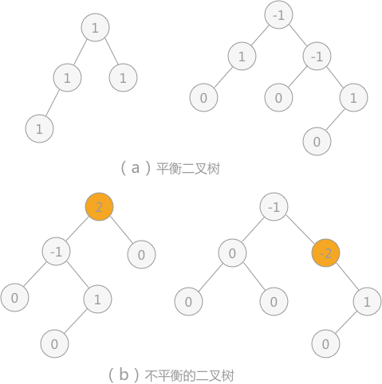
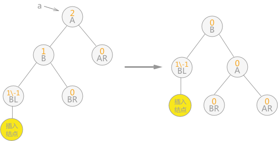
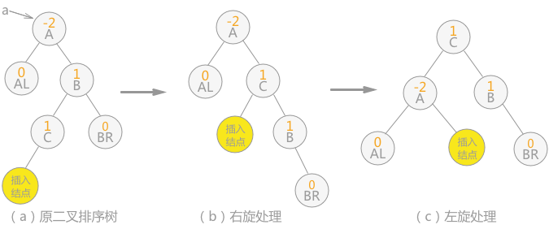

## 平衡二叉树介绍

平衡二叉树，又称为 AVL 树。实际上就是遵循以下两个特点的二叉树：

- 每棵子树中的左子树和右子树的深度差不能超过 1；
- 二叉树中每棵子树都要求是平衡二叉树；

> 其实就是在二叉树的基础上，若树中每棵子树都满足其左子树和右子树的深度差都不超过 1，则这棵二叉树就是平衡二叉树。

 

平衡因子：每个结点都有其各自的平衡因子，表示的就是其左子树深度同右子树深度的差。平衡二叉树中各结点平衡因子的取值只可能是：0、1 和 -1。

如图 1 所示，其中 （a） 的两棵二叉树中由于各个结点的平衡因子数的绝对值都不超过 1，所以 （a） 中两棵二叉树都是平衡二叉树；而 （b） 的两棵二叉树中有结点的平衡因子数的绝对值超过 1，所以都不是平衡二叉树。

## 二叉排序树转化为平衡二叉树

为了排除动态查找表中不同的数据排列方式对算法性能的影响，需要考虑在不会破坏二叉排序树本身结构的前提下，将二叉排序树转化为平衡二叉树。

例如，使用上一节的算法在对查找表`{13，24，37，90，53}`构建二叉排序树时，当插入 13 和 24 时，二叉排序树此时还是平衡二叉树：

当继续插入 37 时，生成的二叉排序树如图 3（a），平衡二叉树的结构被破坏，此时只需要对二叉排序树做“旋转”操作（如图 3（b）），即整棵树以结点 24 为根结点，二叉排序树的结构没有破坏，同时将该树转化为了平衡二叉树：

> 当二叉排序树的平衡性被打破时，就如同扁担的两头出现了一头重一头轻的现象，如图3（a）所示，此时只需要改变扁担的支撑点（树的树根），就能使其重新归为平衡。实际上图 中的 （b） 是对（a） 的二叉树做了一个向左逆时针旋转的操作。

继续插入 90 和 53 后，二叉排序树如下图（a）所示，导致二叉树中结点 24 和 37 的平衡因子的绝对值大于 1 ，整棵树的平衡被打破。此时，需要做两步操作：

1. 如图（b） 所示，将结点 53 和 90 整体向右顺时针旋转，使本该以 90 为根结点的子树改为以结点 53 为根结点；
2. 如图（c） 所示，将以结点 37 为根结点的子树向左逆时针旋转，使本该以 37 为根结点的子树，改为以结点 53 为根结点；

做完以上操作，即完成了由不平衡的二叉排序树转变为平衡二叉树。

当平衡二叉树由于新增数据元素导致整棵树的平衡遭到破坏时，就需要根据实际情况做出适当的调整，假设距离插入结点最近的“不平衡因子”为 a。则调整的规律可归纳为以下 4 种情况：

- 单向右旋平衡处理：若由于结点 a 的左子树为根结点的左子树上插入结点，导致结点 a 的平衡因子由 1 增至 2，致使以 a 为根结点的子树失去平衡，则只需进行一次向右的顺时针旋转，如下图这种情况：

- 单向左旋平衡处理：如果由于结点 a 的右子树为根结点的右子树上插入结点，导致结点 a 的平衡因子由 -1变为 -2，则以 a 为根结点的子树需要进行一次向左的逆时针旋转，如下图这种情况：

-  双向旋转（先左后右）平衡处理：如果由于结点 a 的左子树为根结点的右子树上插入结点，导致结点 a 平衡因子由 1 增至 2，致使以 a 为根结点的子树失去平衡，则需要进行两次旋转操作，如下图这种情况：

注意：上图中插入结点也可以为结点 C 的右孩子，则（b）中插入结点的位置还是结点 C 右孩子，（c）中插入结点的位置为结点 A 的左孩子。

- 双向旋转（先右后左）平衡处理：如果由于结点 a 的右子树为根结点的左子树上插入结点，导致结点 a 平衡因子由 -1 变为 -2，致使以 a 为根结点的子树失去平衡，则需要进行两次旋转（先右旋后左旋）操作，如下图这种情况：

注意：上中插入结点也可以为结点 C 的右孩子，则（b）中插入结点的位置改为结点 B 的左孩子，（c）中插入结点的位置为结点 B 的左孩子。

在对查找表`{13，24，37，90，53}`构建平衡二叉树时，由于符合第 4 条的规律，所以进行先右旋后左旋的处理，最终由不平衡的二叉排序树转变为平衡二叉树。