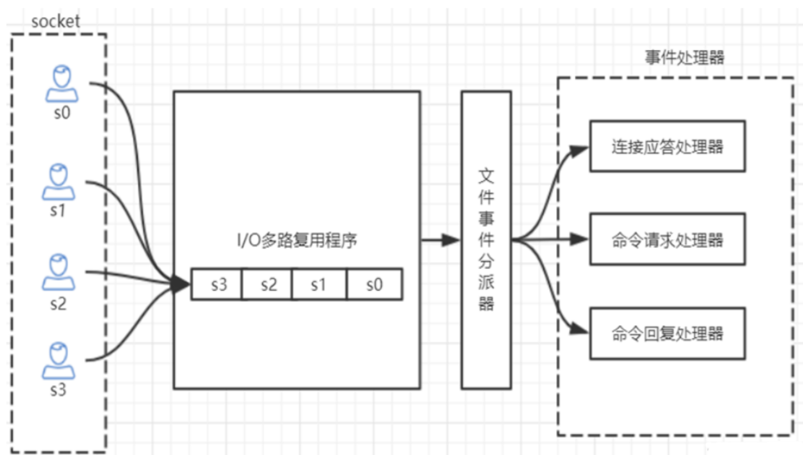
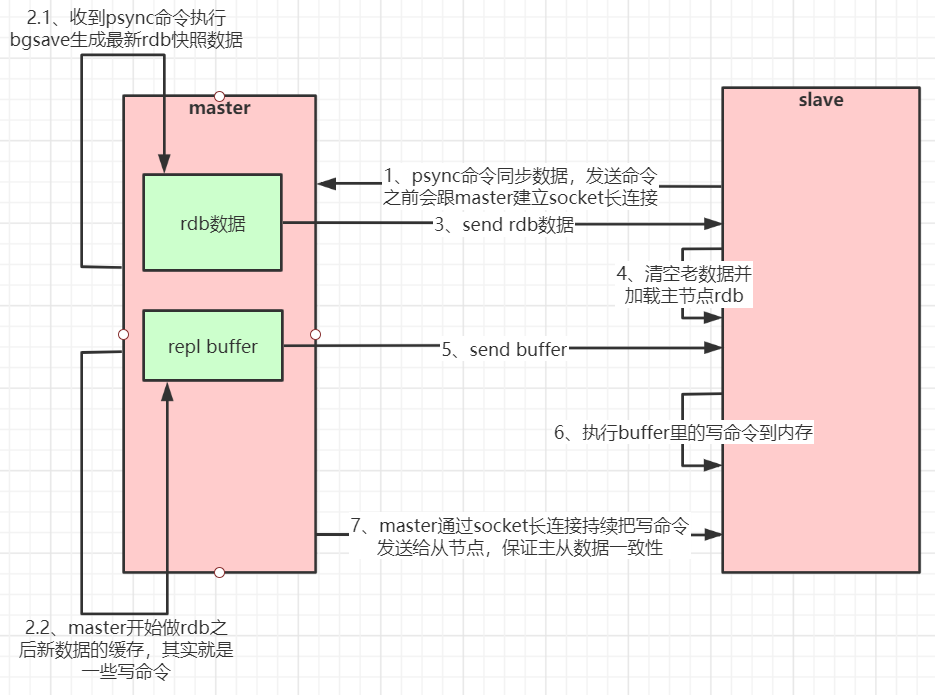
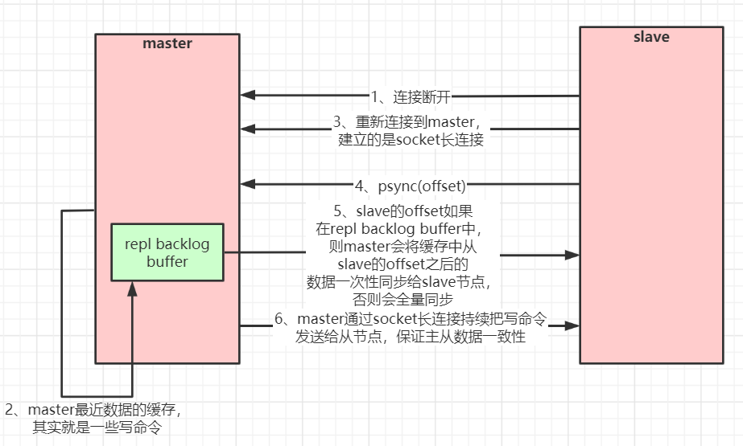
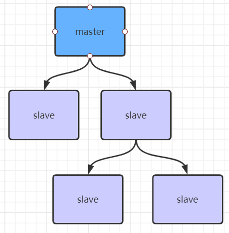
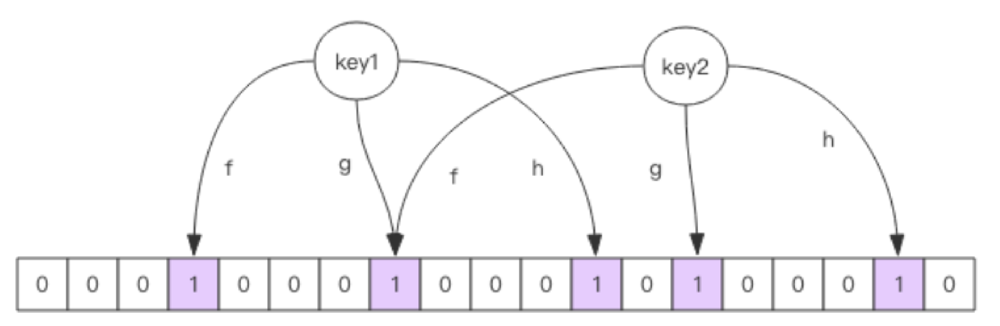
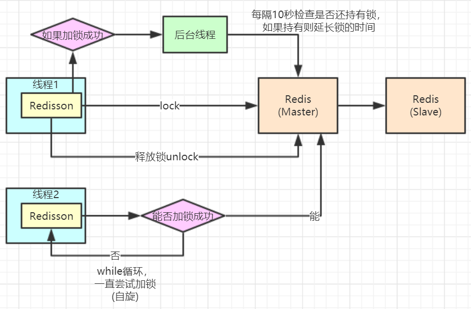

# 一、多路复用

## 1.Redis的单线程和高性能
### Redis是单线程吗？
Redis 的单线程主要是指 Redis 的网络 IO 和键值对读写是由一个线程来完成的，这也是 Redis 对外
提供键值存储服务的主要流程。但 Redis 的其他功能，比如持久化、异步删除、集群数据同步等，其实是由额外的线程执行的。
### Redis 单线程为什么还能这么快？
因为它所有的数据都在内存中，所有的运算都是内存级别的运算，而且单线程避免了多线程的切换性
能损耗问题。正因为 Redis 是单线程，所以要小心使用 Redis 指令，对于那些耗时的指令(比如
keys)，一定要谨慎使用，一不小心就可能会导致 Redis 卡顿。

## 2.Redis 单线程如何处理那么多的并发客户端连接？
Redis的IO多路复用：redis利用epoll来实现IO多路复用，将连接信息和事件放到队列中，依次放到
文件事件分派器，事件分派器将事件分发给事件处理器。





# 二、开发规范与性能优化
## 1.键值设计

### 1) key名设计
- 【建议】: 可读性和可管理性
  以业务名(或数据库名)为前缀(防止key冲突)，用冒号分隔，比如业务名:表名:id
  `trade:order:1`
- 【建议】：简洁性
  保证语义的前提下，控制key的长度，当key较多时，内存占用也不容忽视，例如：
  `user:{uid}:friends:messages:{mid} 简化为 u:{uid}:fr:m:{mid}`
- 【强制】：不要包含特殊字符
  反例：包含空格、换行、单双引号以及其他转义字符

### 2)value设计
- 【强制】：拒绝bigkey(防止网卡流量、慢查询)
  在Redis中，一个字符串最大512MB，一个二级数据结构（例如hash、list、set、zset）可以存
  储大约40亿个(2^32-1)个元素，但实际中如果下面两种情况，就会认为它是bigkey。
  - 字符串类型：它的big体现在单个value值很大，一般认为超过10KB就是bigkey。
  - 非字符串类型：哈希、列表、集合、有序集合，它们的big体现在元素个数太多。

一般来说，string类型控制在10KB以内，hash、list、set、zset元素个数不要超过5000。
反例：一个包含200万个元素的list。
非字符串的bigkey，不要使用del删除，使用hscan、sscan、zscan方式渐进式删除，同时要注
意防止bigkey过期时间自动删除问题(例如一个200万的zset设置1小时过期，会触发del操作，造
成阻塞）


## 2.bigkey的危害

### 1)导致redis阻塞
### 2)网络拥塞

bigkey也就意味着每次获取要产生的网络流量较大，假设一个bigkey为1MB，客户端每秒访问
量为1000，那么每秒产生1000MB的流量，对于普通的千兆网卡(按照字节算是128MB/s)的服务
器来说简直是灭顶之灾，而且一般服务器会采用单机多实例的方式来部署，也就是说一个bigkey
可能会对其他实例也造成影响，其后果不堪设想。

### 3)过期删除

有个bigkey，它安分守己（只执行简单的命令，例如hget、lpop、zscore等），但它设置了过
期时间，当它过期后，会被删除，如果没有使用Redis 4.0的过期异步删除(lazyfree-lazy-
expire yes)，就会存在阻塞Redis的可能性。

## 3.bigkey的产生

一般来说，bigkey的产生都是由于程序设计不当，或者对于数据规模预料不清楚造成的，来看几
个例子：

- 社交类：粉丝列表，如果某些明星或者大v不精心设计下，必是bigkey。

-  统计类：例如按天存储某项功能或者网站的用户集合，除非没几个人用，否则必是bigkey。

-  缓存类：将数据从数据库load出来序列化放到Redis里，这个方式非常常用，但有两个地方需
  要注意，第一，是不是有必要把所有字段都缓存；第二，有没有相关关联的数据，有的同学为了
  图方便把相关数据都存一个key下，产生bigkey。

## 4.如何优化bigkey

- 拆
big list： list1、list2、...listN
big hash：可以讲数据分段存储，比如一个大的key，假设存了1百万的用户数据，可以拆分成
200个key，每个key下面存放5000个用户数据
- 如果bigkey不可避免，也要思考一下要不要每次把所有元素都取出来(例如有时候仅仅需要
  hmget，而不是hgetall)，删除也是一样，尽量使用优雅的方式来处理。

- 【推荐】：选择适合的数据类型。
    例如：实体类型(要合理控制和使用数据结构，但也要注意节省内存和性能之间的平衡)
    反例：
  `set user:1:name tom`
  `set user:1:age 19`
  `set user:1:favor football`
    正例:
  `hmset user:1 name tom age 19 favor football`

- 【推荐】：控制key的生命周期，redis不是垃圾桶。
  建议使用expire设置过期时间(条件允许可以打散过期时间，防止集中过期)。

## 5.命令使用
### 1)【推荐】 O(N)命令关注N的数量
  例如hgetall、lrange、smembers、zrange、sinter等并非不能使用，但是需要明确N的值。有
  遍历的需求可以使用hscan、sscan、zscan代替。
### 2)【推荐】：禁用命令
  禁止线上使用keys、flushall、flushdb等，通过redis的rename机制禁掉命令，或者使用scan的
  方式渐进式处理。

### 3)【推荐】合理使用select
  redis的多数据库较弱，使用数字进行区分，很多客户端支持较差，同时多业务用多数据库实际还
  是单线程处理，会有干扰。
### 4)【推荐】使用批量操作提高效率 
- 原生命令：例如mget、mset。
- 非原生命令：可以使用pipeline提高效率。
  但要注意控制一次批量操作的元素个数(例如500以内，实际也和元素字节数有关)。
  注意两者不同：
- 原生是原子操作，pipeline是非原子操作。
- pipeline可以打包不同的命令，原生做不到
- pipeline需要客户端和服务端同时支持。
### 5)【建议】Redis事务功能较弱，不建议过多使用


# 三、数据持久化
还可以手动执行命令生成RDB快照，进入redis客户端执行命令save或bgsave可以生成dump.rdb文件，每次命令执行都会将所有redis内存快照到一个新的rdb文件里，并覆盖原有rdb快照文件。
## 1.bgsave的写时复制(COW)机制
Redis 借助操作系统提供的写时复制技术（Copy-On-Write, COW），在生成快照的同时，依然可以正常处理写命令。简单来说，bgsave 子进程是由主线程 fork 生成的，可以共享主线程的所有内存数据。bgsave 子进程运行后，开始读取主线程的内存数据，并把它们写入 RDB 文件。此时，如果主线程对这些数据也都是读操作，那么，主线程和 bgsave 子进程相互不影响。但是，如果主线程要修改一块数据，那么，这块数据就会被复制一份，生成该数据的副本。然后，bgsave 子进程会把这个副本数据写入 RDB 文件，而在这个过程中，主线程仍然可以直接修改原来的数据。

## 2.save与bgsave对比

| **命令**              | **save**         | **bgsave**                                     |
| --------------------- | ---------------- | ---------------------------------------------- |
| IO类型                | 同步             | 异步                                           |
| 是否阻塞redis其它命令 | 是               | 否(在生成子进程执行调用fork函数时会有短暂阻塞) |
| 复杂度                | O(n)             | O(n)                                           |
| 优点                  | 不会消耗额外内存 | 不阻塞客户端命令                               |
| 缺点                  | 阻塞客户端命令   | 需要fork子进程，消耗内存                       |


# 四、redis主从工作原理

## 1.主从复制原理

如果你为master配置了一个slave，不管这个slave是否是第一次连接上Master，它都会发送一个PSYNC
命令给master请求复制数据。
master收到PSYNC命令后，会在后台进行数据持久化通过bgsave生成最新的rdb快照文件，持久化期
间，master会继续接收客户端的请求，它会把这些可能修改数据集的请求缓存在内存中。当持久化进行完
毕以后，master会把这份rdb文件数据集发送给slave，slave会把接收到的数据进行持久化生成rdb，然后
再加载到内存中。然后，master再将之前缓存在内存中的命令发送给slave。
当master与slave之间的连接由于某些原因而断开时，slave能够自动重连Master，如果master收到了多
个slave并发连接请求，它只会进行一次持久化，而不是一个连接一次，然后再把这一份持久化的数据发送
给多个并发连接的slave。

**主从复制(全量复制)流程图：**




## 2.数据部分复制

当master和slave断开重连后，一般都会对整份数据进行复制。但从redis2.8版本开始，redis改用可以支
持部分数据复制的命令PSYNC去master同步数据，slave与master能够在网络连接断开重连后只进行部分
数据复制(断点续传)。
master会在其内存中创建一个复制数据用的缓存队列，缓存最近一段时间的数据，master和它所有的
slave都维护了复制的数据下标offset和master的进程id，因此，当网络连接断开后，slave会请求master
继续进行未完成的复制，从所记录的数据下标开始。如果master进程id变化了，或者从节点数据下标
offset太旧，已经不在master的缓存队列里了，那么将会进行一次全量数据的复制。
**主从复制(部分复制，断点续传)流程图：**




如果有很多从节点，为了缓解主从复制风暴(多个从节点同时复制主节点导致主节点压力过大)，可以做如
下架构，让部分从节点与从节点(与主节点同步)同步数据




## 3.pipeline管道
客户端可以一次性发送多个请求而不用等待服务器的响应，待所有命令都发送完后再一次性读取服务的响
应，这样可以极大的降低多条命令执行的网络传输开销，管道执行多条命令的网络开销实际上只相当于一
次命令执行的网络开销。需要注意到是用pipeline方式打包命令发送，redis必须在处理完所有命令前先缓
存起所有命令的处理结果。打包的命令越多，缓存消耗内存也越多。所以并不是打包的命令越多越好。
pipeline中发送的每个command都会被server立即执行，如果执行失败，将会在此后的响应中得到信
息；也就是pipeline并不是表达“所有command都一起成功”的语义，管道中前面命令失败，后面命令
不会有影响，继续执行。


# 五、Redis集群选举原理分析

当slave发现自己的master变为FAIL状态时，便尝试进行Failover，以期成为新的master。由于挂掉的master
可能会有多个slave，从而存在多个slave竞争成为master节点的过程， 其过程如下：

- 1.slave发现自己的master变为FAIL

- 2.将自己记录的集群currentEpoch加1，并广播FAILOVER_AUTH_REQUEST 信息

- 3.其他节点收到该信息，只有master响应，判断请求者的合法性，并发FAILOVER_AUTH_ACK，对每一个epoch只发送一次ack

- 4.尝试failover的slave收集master返回的FAILOVER_AUTH_ACK

- 5.slave收到超过半数master的ack后变成新Master(这里解释了集群为什么至少需要三个主节点，如果只有两个，当其中一个挂了，只剩一个主节点是不能选举成功的)

- 6.slave广播Pong消息通知其他集群节点。
  从节点并不是在主节点一进入 FAIL 状态就马上尝试发起选举，而是有一定延迟，一定的延迟确保我们等待FAIL状态在集群中传播，slave如果立即尝试选举，其它masters或许尚未意识到FAIL状态，可能会拒绝投票。
延迟计算公式：

```
  DELAY = 500ms + random(0 ~ 500ms) + SLAVE_RANK * 1000ms
```


  SLAVE_RANK表示此slave已经从master复制数据的总量的rank。Rank越小代表已复制的数据越新。这种方式下，持有最新数据的slave将会首先发起选举（理论上）。


# 六、 

redis集群没有过半机制会有脑裂问题，网络分区导致脑裂后多个主节点对外提供写服务，一旦网络分区恢复，会将其中一个主节点变为从节点，这时会有大量数据丢失。
规避方法可以在redis配置里加上参数(这种方法不可能百分百避免数据丢失，参考集群leader选举机制)：

```
min‐replicas‐to‐write 1 //写数据成功最少同步的slave数量，这个数量可以模仿大于半数机制配置，比如
集群总共三个节点可以配置1，加上leader就是2，超过了半数
```

注意：这个配置在一定程度上会影响集群的可用性，比如slave要是少于1个，这个集群就算leader正常也不能
提供服务了，需要具体场景权衡选择。


# 七、redis的应用场景

## 1.计数器
可以对 String 进行自增自减运算，从而实现计数器功能。Redis 这种内存型数据库的读写性能非常高，很适合存储频繁读写的计数量。

```shell
INCR article:readcount:{文章id}  	
GET article:readcount:{文章id} 
```


 


## 2.分布式ID生成
利用自增特性，一次请求一个大一点的步长如 incr 2000 ,缓存在本地使用，用完再请求。

```shell
INCRBY  orderId  1000		//redis批量生成序列号提升性能
```


## 3.海量数据统计
位图（bitmap）:存储是否参过某次活动，是否已读谋篇文章，用户是否为会员， 日活统计。

## 4.会话缓存
可以使用 Redis 来统一存储多台应用服务器的会话信息。当应用服务器不再存储用户的会话信息，也就不再具有状态，一个用户可以请求任意一个应用服务器，从而更容易实现高可用性以及可伸缩性。

## 5.分布式队列/阻塞队列
List 是一个双向链表，可以通过 lpush/rpush 和 rpop/lpop 写入和读取消息。可以通过使用brpop/blpop 来实现阻塞队列。

## 6.分布式锁实现
在分布式场景下，无法使用基于进程的锁来对多个节点上的进程进行同步。可以使用 Redis 自带的 SETNX 命令实现分布式锁。

## 7.热点数据存储
最新评论，最新文章列表，使用list 存储,ltrim取出热点数据，删除老数据。

## 8.社交类需求
Set 可以实现交集，从而实现共同好友等功能，Set通过求差集，可以进行好友推荐，文章推荐。


- 微博微信点赞、收藏、标签

  

```shell
##  点赞
SADD  like:{消息ID}  {用户ID}
## 取消点赞
SREM like:{消息ID}  {用户ID}
## 检查用户是否点过赞
SISMEMBER  like:{消息ID}  {用户ID}
## 获取点赞的用户列表
SMEMBERS like:{消息ID}
## 获取点赞用户数 
SCARD like:{消息ID}
```


- 微博微关系


```shell
## A关注的人: 
ASet-> {B, D}
## C关注的人:
CSet--> {A, F, B, D}
## B关注的人: 
BSet-> {A, C, F, D, E)
## A和C共同关注: 
SINTER ASet CSet--> {B, D}
## A关注的人也关注他(C): 
SISMEMBER BSet C 
SISMEMBER DSet C
## A可能认识的人: 
SDIFF CSet ASet->(A, F}
```


## 9.排行榜
sorted_set可以实现有序性操作，从而实现排行榜等功能。

## 10.电商购物车

- 以用户id为key
- 商品id为field
- 商品数量为value


```shell
# 购物车操作
## 添加商品
hset cart:1001 10088 1
## 增加数量
hincrby cart:1001 10088 1
## 商品总数
hlen cart:1001
## 删除商品
hdel cart:1001 10088
## 获取购物车所有商品
hgetall cart:1001
```


# 八、redis淘汰策略

Redis对于过期键有三种清除策略：
- 被动删除：当读/写一个已经过期的key时，会触发惰性删除策略，直接删除掉这个过期
  key

- 主动删除：由于惰性删除策略无法保证冷数据被及时删掉，所以Redis会定期主动淘汰一
  批已过期的key

- 当前已用内存超过maxmemory限定时，触发主动清理策略

  - LRU 算法（Least Recently Used，最近最少使用）淘汰很久没被访问过的数据，以最近一次访问时间作为参考。

  - LFU 算法（Least Frequently Used，最不经常使用）淘汰最近一段时间被访问次数最少的数据，以次数作为参考。

当存在热点数据时，LRU的效率很好，但偶发性的、周期性的批量操作会导致LRU命中率急剧下降，缓存污染情况比较严重。这时使用LFU可能更好点。根据自身业务类型，配置好maxmemory-policy(默认是noeviction)，推荐使用volatile-lru。如果不设置最大内存，当 Redis 内存超出物理内存限制时，内存的数据会开始和磁盘产生频繁的交换 (swap)，会让 Redis 的性能急剧下降。
当Redis运行在主从模式时，只有主结点才会执行过期删除策略，然后把删除操作”del key”同步到从结点删除数据。


# 九、缓存雪崩、穿透、击穿

## 1.缓存穿透
缓存穿透是指查询一个根本不存在的数据， 缓存层和存储层都不会命中， 通常出于容错的考虑， 如果从存储层查不到数据则不写入缓存层。
缓存穿透将导致不存在的数据每次请求都要到存储层去查询， 失去了缓存保护后端存储的意义。
造成缓存穿透的基本原因有两个：

- 自身业务代码或者数据出现问题。

- 一些恶意攻击、 爬虫等造成大量空命中。

**缓存穿透问题解决方案：**

- 缓存空对象

```java
String get(String key) {
    // 从缓存中获取数据
    String cacheValue = cache.get(key);
    // 缓存为空
    if (StringUtils.isBlank(cacheValue)) {
        // 从存储中获取
        String storageValue = storage.get(key);
        cache.set(key, storageValue);
        // 如果存储数据为空， 需要设置一个过期时间(300秒)
        if (storageValue == null) {
            cache.expire(key, 60 * 5);
        }
        return storageValue;
    } else {
        // 缓存非空
        return cacheValue;
    }
}
```


- 布隆过滤器


对于恶意攻击，向服务器请求大量不存在的数据造成的缓存穿透，还可以用布隆过滤器先做一次过滤，对于不存在的数据布隆过滤器一般都能够过滤掉，不让请求再往后端发送。**当布隆过滤器说某个值存在时，这个值可能不存在；当它说不存在时，那就肯定不存在。**



布隆过滤器就是一个大型的位数组和几个不一样的无偏 hash 函数。所谓无偏就是能够把元素的 hash 值算得比较均匀。
向布隆过滤器中添加 key 时，会使用多个 hash 函数对 key 进行 hash 算得一个整数索引值然后对位数组长度进行取模运算得到一个位置，每个 hash 函数都会算得一个不同的位置。再把位数组的这几个位置都置为 1 就完成了 add 操作。
向布隆过滤器询问 key 是否存在时，跟 add 一样，也会把 hash 的几个位置都算出来，看看位数组中这几个位置是否都为 1，只要有一个位为 0，那么说明布隆过滤器中这个key 不存在。如果都是 1，这并不能说明这个key 就一定存在，只是极有可能存在，因为这些位被置为 1 可能是因为其它的 key 存在所致。如果这个位数组比较稀疏，这个概率就会很大，如果这个位数组比较拥挤，这个概率就会降低。
这种方法适用于数据命中不高、 数据相对固定、 实时性低（通常是数据集较大） 的应用场景， 代码维护较为复杂， 但是**缓存空间占用很少**。
可以用redisson实现布隆过滤器，引入依赖：

```xml
<dependency>
  <groupId>org.redisson</groupId>
  <artifactId>redisson</artifactId>
  <version>3.6.5</version>
</dependency>
```


示例伪代码：

```java
package com.redisson;

import org.redisson.Redisson;
import org.redisson.api.RBloomFilter;
import org.redisson.api.RedissonClient;
import org.redisson.config.Config;

public class RedissonBloomFilter {

    public static void main(String[] args) {
        Config config = new Config();
        config.useSingleServer().setAddress("redis://localhost:6379");
        //构造Redisson
        RedissonClient redisson = Redisson.create(config);

        RBloomFilter<String> bloomFilter = redisson.getBloomFilter("nameList");
        //初始化布隆过滤器：预计元素为100000000L,误差率为3%,根据这两个参数会计算出底层的bit数组大小
        bloomFilter.tryInit(100000000L,0.03);
        //将xiaoming插入到布隆过滤器中
        bloomFilter.add("xiaoming");

        //判断下面号码是否在布隆过滤器中
        System.out.println(bloomFilter.contains("xiaoli"));//false
        System.out.println(bloomFilter.contains("xiaowang"));//false
        System.out.println(bloomFilter.contains("xiaoming"));//true
    }
}
```


使用布隆过滤器需要把所有数据提前放入布隆过滤器，并且在增加数据时也要往布隆过滤器里放，布隆过滤器缓存过滤伪代码：

```java
//初始化布隆过滤器
RBloomFilter<String> bloomFilter = redisson.getBloomFilter("nameList");
//初始化布隆过滤器：预计元素为100000000L,误差率为3%
bloomFilter.tryInit(100000000L,0.03);
        
//把所有数据存入布隆过滤器
void init(){
    for (String key: keys) {
        bloomFilter.put(key);
    }
}

String get(String key) {
    // 从布隆过滤器这一级缓存判断下key是否存在
    Boolean exist = bloomFilter.contains(key);
    if(!exist){
        return "";
    }
    // 从缓存中获取数据
    String cacheValue = cache.get(key);
    // 缓存为空
    if (StringUtils.isBlank(cacheValue)) {
        // 从存储中获取
        String storageValue = storage.get(key);
        cache.set(key, storageValue);
        // 如果存储数据为空， 需要设置一个过期时间(300秒)
        if (storageValue == null) {
            cache.expire(key, 60 * 5);
        }
        return storageValue;
    } else {
        // 缓存非空
        return cacheValue;
    }
}
```

注意：布隆过滤器不能删除数据，如果要删除得重新初始化数据。


## 2.缓存失效(击穿)
由于大批量缓存在同一时间失效可能导致大量请求同时穿透缓存直达数据库，可能会造成数据库瞬间压力过大
甚至挂掉，对于这种情况我们在批量增加缓存时最好将这一批数据的缓存过期时间设置为一个时间段内的不同
时间。
示例伪代码：

```java
String get(String key) {
    // 从缓存中获取数据
    String cacheValue = cache.get(key);
    // 缓存为空
    if (StringUtils.isBlank(cacheValue)) {
        // 从存储中获取
        String storageValue = storage.get(key);
        cache.set(key, storageValue);
        //设置一个过期时间(300到600之间的一个随机数)
        int expireTime = new Random().nextInt(300)  + 300;
        if (storageValue == null) {
            cache.expire(key, expireTime);
        }
        return storageValue;
    } else {
        // 缓存非空
        return cacheValue;
    }
}
```


## 3.缓存雪崩
缓存雪崩指的是缓存层支撑不住或宕掉后， 流量会像奔逃的野牛一样， 打向后端存储层。
由于缓存层承载着大量请求， 有效地保护了存储层， 但是如果缓存层由于某些原因不能提供服务(比如超大并发过来，缓存层支撑不住，或者由于缓存设计不好，类似大量请求访问bigkey，导致缓存能支撑的并发急剧下降)， 于是大量请求都会打到存储层， 存储层的调用量会暴增， 造成存储层也会级联宕机的情况。预防和解决缓存雪崩问题， 可以从以下三个方面进行着手。

- 保证缓存层服务高可用性，比如使用Redis Sentinel或Redis Cluster。
- 依赖隔离组件为后端限流熔断并降级。比如使用Sentinel或Hystrix限流降级组件。
比如服务降级，我们可以针对不同的数据采取不同的处理方式。当业务应用访问的是非核心数据（例如电商商品属性，用户信息等）时，暂时停止从缓存中查询这些数据，而是直接返回预定义的默认降级信息、空值或是错误提示信息；当业务应用访问的是核心数据（例如电商商品库存）时，仍然允许查询缓存，如果缓存缺失，也可以继续通过数据库读取。
- 提前演练。 在项目上线前， 演练缓存层宕掉后， 应用以及后端的负载情况以及可能出现的问题， 在此基础上做一些预案设定。


## 4.热点缓存key重建优化

开发人员使用“缓存+过期时间”的策略既可以加速数据读写， 又保证数据的定期更新， 这种模式基本能够满足绝大部分需求。 但是有两个问题如果同时出现， 可能就会对应用造成致命的危害：
- 当前key是一个热点key（例如一个热门的娱乐新闻），并发量非常大。
- 重建缓存不能在短时间完成， 可能是一个复杂计算， 例如复杂的SQL、 多次IO、 多个依赖等。
在缓存失效的瞬间， 有大量线程来重建缓存， 造成后端负载加大， 甚至可能会让应用崩溃。
要解决这个问题主要就是要避免大量线程同时重建缓存。

我们可以利用互斥锁来解决，此方法只允许一个线程重建缓存， 其他线程等待重建缓存的线程执行完， 重新从缓存获取数据即可。
示例伪代码：


```java
 @Test
    public void cacheTest(){

      List<ProductType> types = (List<ProductType>) redisTemplate.opsForValue().get("product:types");

      if(types==null){
          System.out.println("查询数据库。。。");
          types = new ArrayList<>();
          types.add(new ProductType(1L,"手机数码"));
          types.add(new ProductType(2L,"家用电器"));

          redisTemplate.opsForValue().set("product:types",types);

      }else{
          System.out.println("查询缓存。。。");
      }
    }
```

```java
 @Test
    public void multiThreadTest() throws InterruptedException {

        ExecutorService pool = new ThreadPoolExecutor(100,200,100,TimeUnit.MILLISECONDS,
                new LinkedBlockingDeque<>(100));

        for (int i = 0; i < 100; i++) {

            pool.submit(new Runnable() {
                @Override
                public void run() {
                    cacheTest();
                }
            });
        }
        Thread.sleep(1000000);
    }
```


**上锁方案**


```java
@Test
    public void cacheTest1(){

        List<ProductType> types = (List<ProductType>) redisTemplate.opsForValue().get("product:types");

        if(types==null) {
            Boolean ifAbsent = redisTemplate.opsForValue().setIfAbsent("product:types:lock", 1);
            if (ifAbsent) {
                System.out.println("查询数据库。。。");
                types = new ArrayList<>();
                types.add(new ProductType(1L, "手机数码"));
                types.add(new ProductType(2L, "家用电器"));

                redisTemplate.opsForValue().set("product:types", types);
                redisTemplate.delete("product:types:lock");
            } else {

                try {
                    Thread.sleep(1);
                } catch (InterruptedException e) {
                    e.printStackTrace();
                }

                cacheTest1();
            }
        }else{
            System.out.println("查询缓存。。。");

        }

    }

```

```java
 @Test
    public void multiThreadTest() throws InterruptedException {

        ExecutorService pool = new ThreadPoolExecutor(100,200,100,TimeUnit.MILLISECONDS,
                new LinkedBlockingDeque<>(100));

        for (int i = 0; i < 100; i++) {

            pool.submit(new Runnable() {
                @Override
                public void run() {
                    cacheTest1();
                }
            });
        }
        Thread.sleep(1000000);
    }

```


**解决死锁问题**

```java
@Test
public void cacheTest1(){
    List<ProductType> types = (List<ProductType>) redisTemplate.opsForValue().get("product:types");

    if(types==null) {
        Boolean ifAbsent = redisTemplate.opsForValue().setIfAbsent("product:types:lock", 1);
        if (ifAbsent) {
            System.out.println("查询数据库。。。");
            types = new ArrayList<>();
            types.add(new ProductType(1L, "手机数码"));
            types.add(new ProductType(2L, "家用电器"));
			//发生了异常,没办法释放锁。
			int i = 10/0;
            redisTemplate.opsForValue().set("product:types", types);
            redisTemplate.delete("product:types:lock");
        } else {

            try {
                Thread.sleep(1);
            } catch (InterruptedException e) {
                e.printStackTrace();
            }

            cacheTest1();
        }
    }else{
        System.out.println("查询缓存。。。");

    }

}
```


方案一：try-finnaly

```java
  @Test
    public void cacheTest1() {

        List<ProductType> types = (List<ProductType>) redisTemplate.opsForValue().get("product:types");

        if (types == null) {
            Boolean ifAbsent = redisTemplate.opsForValue().setIfAbsent("product:types:lock", 1);
            if (ifAbsent) {
                try {
                    System.out.println("查询数据库。。。");
                    types = new ArrayList<>();
                    types.add(new ProductType(1L, "手机数码"));
                    types.add(new ProductType(2L, "家用电器"));
                    int i = 10 / 0;
                    redisTemplate.opsForValue().set("product:types", types);
                } finally {
                    redisTemplate.delete("product:types:lock");
                }
            } else {
                try {
                    Thread.sleep(1);
                } catch (InterruptedException e) {
                    e.printStackTrace();
                }
                cacheTest1();
            }
        } else {
            System.out.println("查询缓存。。。");

        }

    }
```


方案二：给key设置有效期,但可能会造成误删锁，比如超过100毫秒的操作，进程1的锁已经到期了，进程2创建出了自己的锁，但进程1在执行时删除的是进程2的锁。

```java
    @Test
    public void cacheTest1() {

        List<ProductType> types = (List<ProductType>) redisTemplate.opsForValue().get("product:types");

        if (types == null) {
            Boolean ifAbsent = redisTemplate.opsForValue().setIfAbsent("product:types:lock", 1);
            if (ifAbsent) {
                //设置有效期
                redisTemplate.expire("product:types:lock",100,TimeUnit.MILLISECONDS);
                try {
                    System.out.println("查询数据库。。。");
                    types = new ArrayList<>();
                    types.add(new ProductType(1L, "手机数码"));
                    types.add(new ProductType(2L, "家用电器"));
                    int i = 10 / 0;
                    redisTemplate.opsForValue().set("product:types", types);
                } finally {
                    //需要避免误删别人的锁
                    redisTemplate.delete("product:types:lock");
                }
            } else {
                try {
                    Thread.sleep(1);
                } catch (InterruptedException e) {
                    e.printStackTrace();
                }
                cacheTest1();
            }
        } else {
            System.out.println("查询缓存。。。");

        }

    }
```


**避免误删锁**

```java
@Test
    public void cacheTest1() {

        List<ProductType> types = (List<ProductType>) redisTemplate.opsForValue().get("product:types");

        if (types == null) {
            String uuid = UUID.randomUUID().toString();
            Boolean ifAbsent = redisTemplate.opsForValue().setIfAbsent("product:types:lock", uuid);
            if (ifAbsent) {
                //设置有效期
                redisTemplate.expire("product:types:lock",100,TimeUnit.MILLISECONDS);
                try {
                    System.out.println("查询数据库。。。");
                    types = new ArrayList<>();
                    types.add(new ProductType(1L, "手机数码"));
                    types.add(new ProductType(2L, "家用电器"));
                    int i = 10 / 0;
                    redisTemplate.opsForValue().set("product:types", types);
                } finally {
                    //需要避免误删别人的锁
                    Object o = redisTemplate.opsForValue().get("product:types:lock");
                    if(uuid.equals(o)){
                        redisTemplate.delete("product:types:lock");
                    }
                }
            } else {
                try {
                    Thread.sleep(1);
                } catch (InterruptedException e) {
                    e.printStackTrace();
                }
                cacheTest1();
            }
        } else {
            System.out.println("查询缓存。。。");

        }

    }

```


带来分布式锁的一致性问题。

## 5.redisson 上锁原理




集群批量操作
mset {user}:name aaa {user}:age 199