# 一、索引的概述

## 1.为什么要使用索引

在海量数据中查询一条记录，这样的场景经常发生，如果没有使用索引，那么查询的速度非常慢。通过创建索引，依赖于索引来进行的查询，速度是非常快的，那么带来以下几个问题？

- 索引是什么？
- 索引为什么快？
- 为什么不使用索引会这么慢？


## 2.索引是什么

如果没有使用索引，每次查数据要进行多次的磁盘io，每次io获得4k数据，如果4k数据中没有查到需要的数据继续进行下一次磁盘io，直到查到数据为止。——没有索引会很慢。

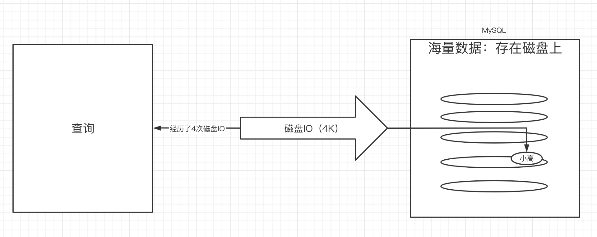

==索引相当于是字典的目录。==在查询时先查询目录，快速获得数据所在的磁盘地址，根据地址直接在磁盘上获得数据，不需要进行多次磁盘io——使用索引速度快。

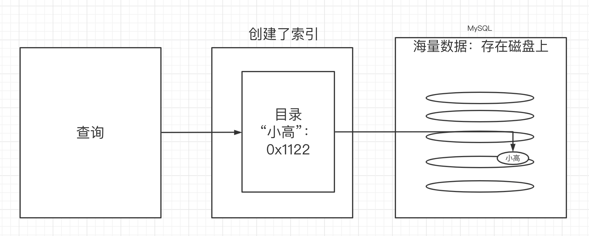


## 3.为什么查询索引就很快？

==索引中存了海量数据和地址的“映射关系”==，那如何在索引中的海量数据中快速的查找到某一条数据呢？——搞清楚这个问题，才能算是搞清楚为什么时候索引快！

这就跟索引使用了哪种数据结构有关系。


## 4.索引的存放位置

索引是保存在磁盘中的。

在mac系统中，索引是保存在`mysql的安装路径/data/数据库名文件夹` 中，在windows平台：`c://programdata(隐藏文件)/mysql/data`

在文件夹中发现有两种格式的文件：

- .ibd(表是使用了innoDB引擎):  employees.ibd该文件中包含了数据和索引，（frm 用来保存表的结构）
- .MYI .MYD（表是使用了MyISAM引擎）: .MYI 文件保存的是索引，.MYD 保存的是数据


## 5.索引的分类及创建

- 主键索引

==表的主键是自带索引的，所以建议大家建表的时候一定要创建主键==

- 普通索引

给普通列创建的索引

```sql
# 格式
create index 索引名 on 表名(列名)
# 例子
create index idx_name on employess(name)
```

- 唯一索引

该索引列中的值是唯一的，性能比普通索引要好。

```sql
# 格式
create unique index 索引名 on 表名(列名)
# 例子
create unique index idx_name on employess(name)
```

- 组合索引(联合索引)

一次性为多个列创建索引，可以减少索引带来的磁盘空间的开销，但是使用组合索引需要有一些规则（最左前缀法则）

```sql
# 格式
create index 索引名 on 表名(列1,列2)
# 例子
create index idx_name_age on employees(name,age,position)
```

- 全文索引

实现全文检索的效果，目前的版本InnoDB和MyISAM存储引擎都支持全文索引，但是我们不会用mysql做全文检索，而是用第三方的搜索引擎中间件比如es/solr来做。

# 二、索引的数据结构

索引中也存了海量数据，那么为什么在索引的海量数据中查找数据就可以很快？ 这就跟索引使用了哪种数据结构有关系，接下来聊一下数据结构相关的知识。

## 1.线性表

- 顺序线性表（数组）：增删慢，查询快
- 链式线性表（链表）：增删快，查询慢
  - 单向链表
  - 双向链表
  - 循环链表

## 2.栈和队列

- 栈：先进后出
  - 顺序栈
  - 链式栈
- 队列：先进先出
  - 顺序队列
  - 链式队列

## 3.树

树的概念在数据结构中是非常重要的。

### 1）二叉树

一个节点最多有2个字节点

### 2）多叉树

可以有大于等于2个字节点

### 3）二叉排序树

二叉排序树及其中的任何一颗子树都需要满足以下规则，中间节点始终比其左子树中任何一个节点要大，始终比其右子树中的任何一个节点要小

### 4）平衡二叉树(AVL数)

平衡二叉树的特点：首先平衡二叉树是一颗二叉排序树。平衡二叉树及其所有的子树都应该满足：==左子树的深度和右子树的深度差不能超过1。==因为平衡二叉树的这个特点，所以查询的性能是非常好的。

二叉排序树可以通过多种方案的旋转来变成一颗平衡二叉树。

### 5）红黑树

一颗二叉排序树可以通过旋转，转换成平衡二叉树。那么红黑树的特色就是可以自己旋转，将自己（二叉排序树）转换成平衡二叉树，==但是红黑树在某些情况下，自旋后并不是一颗平衡二叉树。为什么？因为红黑树在旋转和不旋转之间做了性能的权衡，有些时候，不旋转虽然不平衡，但是旋转带来的性能提升不明显，反而造成为了旋转而带来的开销。==


### 6）B树

如果索引使用红黑树这种数据结构来存数据的话，那么数据量一大，红黑树的深度会变得非常的深，于是整个查询性能会变得非常慢。究其原因，因为每一层存储的数据的个数太少了。因此B树就出现了。==默认节点16KB==

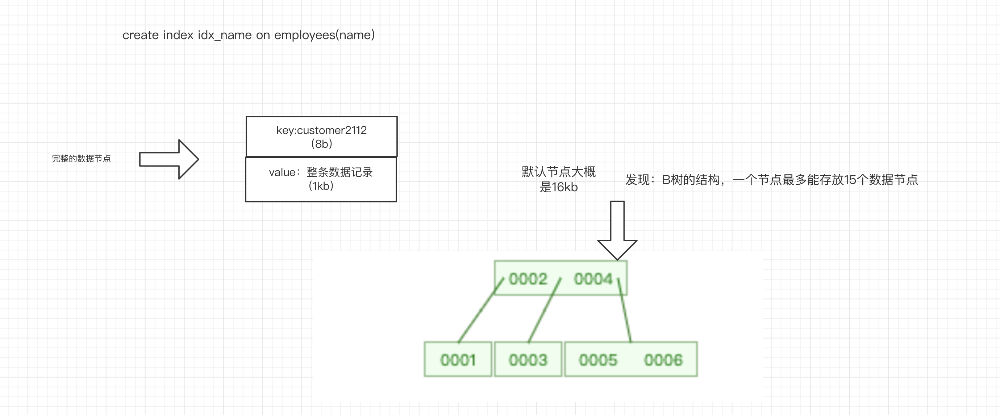


### 7）B+树——MySQL索引使用的数据结构

B+树的特点：

1.非叶子节点冗余了叶子节点的键

2.叶子节点从小到大，从左到右排列

3.叶子之间提供了指针，提高了区间访问的性能

4.只有叶子节点存放数据，其他节点不存放数据，只存放键。

根据计算，只用三层的b+树，最多能查找2千多万个数据。

```
16kb/14b * 16kb/14b*15
```


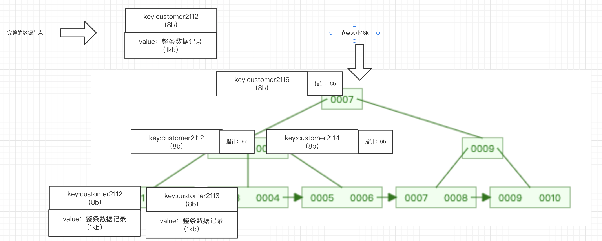


# 三、InnoDB和MyISAM的区别

InnoDB和MyISAM都是表的存储引擎（表是怎么存储）。在互联网公司一定要使用InnoDB的存储引擎来创建表，因为性能更好。

## 1.InnoDB存储引擎

对于InnoDB存储引擎来说，数据是放在叶子节点上的。

天生支持行锁，也可以手动支持表锁。

- 如果是主键索引：数据是整条记录——聚集索引（索引树和数据是在一起的）

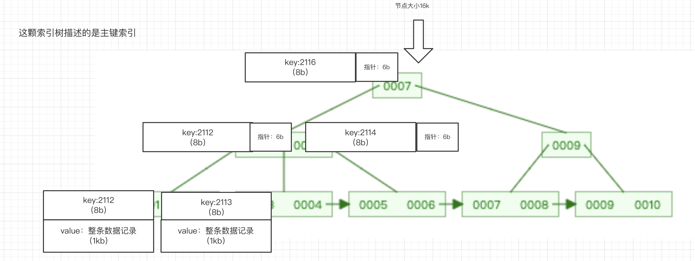


- 如果是非主键索引：叶子节点中的数据存放的是主键——辅助索引、二级索引、它也是非聚集索引

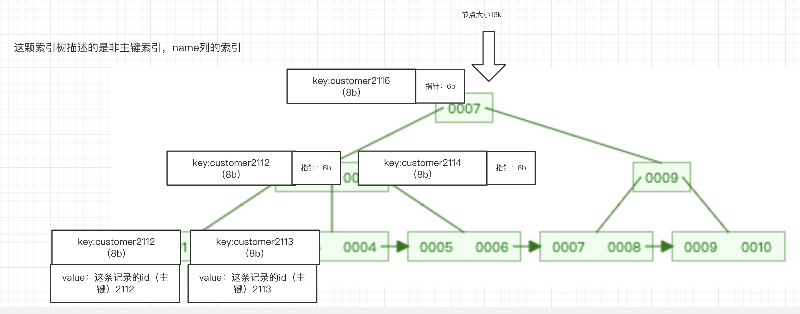


## 2.MyISAM存储引擎

MyISAM存储引擎将索引和数据分开来两个文件来存储，当查到索引后还需要去另外一个数据文件中拿数据，这样的话性能比较差，因此在追求性能的场景中都不会去使用MyISAM存储引擎。——非聚集索引

早期版本只有MyISAM支持全文检索。

MyISAM天生支持表锁。==》非常安全。没有并发可言

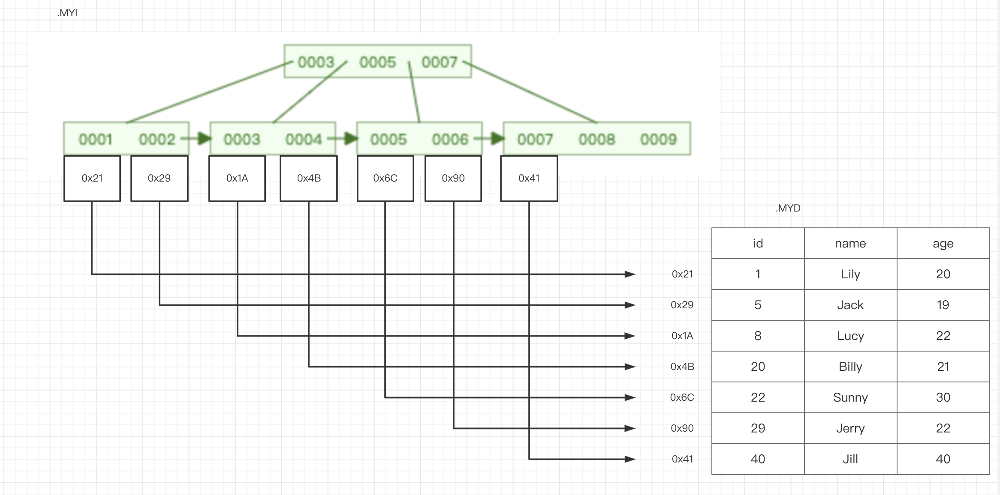


## 3.聚集索引和非聚集索引

- 聚集索引是索引和数据在一起。比如主键索引，数据是放在主键索引树的叶子节点上的。一张表最多只有一个聚集索引。但是可以有多个非聚集索引
- 非聚集索引是索引和数据不在一起，比如普通列索引、组合索引、MyISAM存储引擎的表，都是非聚集索引。


# 四、关于索引中常见的面试题

## 1.问题一：为什么非主键索引的叶子节点存放的数据是主键值

如果非主键索引中存放的是整条数据的话会面临两个问题：

- 占用的磁盘空间过大，每个索引树的叶子节点都要存放数据
- 维护成本很高，当数据要修改时，要同时修改每棵 索引树上的数据，也不安全。


## 2.问题二：为什么InnoDB表必须创建主键

如果创建InnoDB表不创建主键，会面临这么几个问题：

- 查询时不能通过主键走索引。查询性能没办法提升
- 创建辅助索引的时候，没有办法在叶子节点中存放主键，来找到主键索引。

对于整个表的优化来说就无从下手了，因此MySQL为了优化这个问题，做了下面的优化：

如果创建表时没有创建主键，MySQL的内部优化器会帮你创建一个隐藏的主键，之后创建的辅助索引也会使用这个隐藏的主键。

所以建议创建表一定要创建主键。

## 3.问题三：为什么使用主键时推荐使用整型的自增主键

### 1）为什么要使用整型

因为索引树上存的非叶子节点中的键是用来进行大小比较，来确定叶子节点中数据的位置，因此使用整形，相较于使用字符串，比较大小时性能更好。

### 2）为什么要自增

如果不自增，数据加入的大小是乱序的，那么对于整个索引树来说，==调整（自旋）的次数==，要比自增的调整的次数要大的多，影响了性能。


# 五、组合索引和最左前缀法则

## 1.组合索引的特点

```sql
create index idx_name_age on employees(name,age,position)
```

为了减少索引个数，可以给多个列创建一个组合索引。

**组合索引在底层如何存储呢？**（重点）

非叶子节点存储多个字段内容

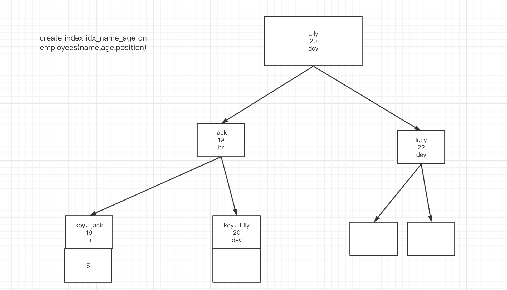

## 2.最左前缀法则

==顾名思义是最左优先,以最左边的为起点任何连续的索引都能匹配上==

```sql
# 组合索引的结构
create index idx_name_age on employees(name,age,position)
# 最左前缀法则的应用场景
## 走name的索引
select * from employees where name='customer2102112'
## 走name和age的索引
select * from employees where name='customer2102112' and age=20
## 走name age position的索引
select * from employees where name='customer2102112' and age=20 and position='dev'
## 不走索引，全表扫描
select * from employees where age=20
## 不走索引，全表扫描
select * from employees where position='dev'
## 不走索引，全表扫描
select * from employees where age = 20 and position='dev'
## 走索引，但只走了name的索引  
select * from employees where name='a' and position='dev'
## 把这个解释清楚 最左前缀法则的难点？？？？？
select * from employees where name='customer2102112' and age>20 and position='dev'
## 全走索引了？？？？？？？ ——mysql内部优化器会按照索引的顺序来执行
select * from employees where position='dev' and age=20  and name='customer2102112'
```

执行原理在后面的索引优化这块去讲。


# ==六、SQL优化==

为什么要做sql优化，是因为希望查询的性能得到提升。从查询性能提升的角度有这么几个维度需要去做：

- ==工程结构的优化==：创建的数据库、表、表中的字段、以及为表创建的索引层面如何做优化？
- ==sql语句层面的优化==：编写的sql语句是能够命中索引的，而不会造成全表扫描。
  - 如何定位出慢sql：如何找出执行的这么多sql语句，那么sql语句是比较慢的。
  - 定位出慢sql以后，该如何优化？

## 1.工程结构的优化

数据库、表、表中的字段、以及为表创建的索引具体需要注意哪些？

参考《MySQL军规升级版》


## 2.如何定位出慢SQL

慢SQL的定位方式有以下几种：

- 发现接口的响应速度很慢，查看该接口执行了哪些sql
- 如果公司的数据库是部署在阿里云RDS云数据库中，云数据库管理平台是直接能检索出系统中执行的哪些sql是慢sql
- 是在本地测试开发阶段，可以开启本地的mysql服务器慢sql查询，查看到本地mysql哪些sql语句是慢sql，如果一旦sql语句执行超过了2秒，这样的sql语句会被记录到指定的日志文件中。
- ==使用explain工具来查看sql是否走索引==，如果没有走索引，那很有可能就是慢sql。这个explain工具也能做到查看sql语句为什么是慢sql


## 3.如何优化sql语句


# 七、SQL优化神器——Explain工具


## 1.Explain工具的介绍

explain是mysql自带的一个查看sql语句性能的工具，俗称执行计划。通过explain工具，能得知SQL语句的执行过程，执行细节，来判断该sql是否是慢sql，及慢sql的原因。

使用explain工具：

```sql
EXPLAIN select * from employees where age=20
```

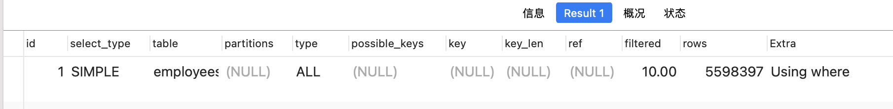

我们知道explain执行后的结果中的每个细节，来学会如何优化sql，让其命中索引。


## 2.MySQL的内部优化器

MySQL内部会存在一个优化器，在执行sql之前，内部优化器一般都会做一些小动作，尽量提升sql的性能。

```sql
EXPLAIN SELECT * from tb_book where id=1;
# 查看内部优化器做的优化：
SHOW WARNINGS;
```

结果：

```sql
# 内部优化器把sql转换成了这样的sql：数据直接从索引树上获得，而不需要查表，性能更好。
select '1' AS `id`,'qf' AS `name` from `db_mysql_pro`.`tb_book` where true
```

## 3.Explain中的各列

### 1）select_type列

该列用来描述这一次查询的类型

- 简单查询：simple

```sql
EXPLAIN select * from tb_book where id=1
```

- 复杂查询：

```sql
EXPLAIN select (select 1 from tb_author where id=1) from (select * from tb_book where id=1) der; 
```

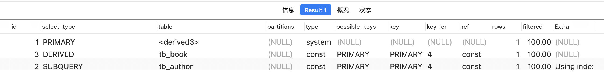

- derived:会生成一张衍生表，在from后面的字查询，是这种类型
- subquery：在select后面，from前面的子查询
- primary：最外部的select
- uinion：连接查询


### 2）id列

可以通过id列来判断那一个sql先执行。id值越大越先执行，如果id一样大，谁在上面谁先执行。


### 3）type列

type列直接可以看出当前sql是否是慢查询，type列中各种值的性能排序：

```sql
null > system > const > eq_ref > ref > range > index >ALL
```

一般来讲，**range以下的建议要做sql优化。**

- ==null==

性能最好的查询，查询的结果可以直接从索引树上获得，而不需要去查表。

```sql
EXPLAIN select min(id) from tb_book
```

- ==system==

查询的表中只有一条记录，直接获得该条记录即可。很少见的。

```sql
# 最外部的这个select属于system类型
EXPLAIN select (select 1 from tb_author where id=1) from (select * from tb_book where id=1) der;
```

- ==const==

使用了主键索引，且主键索引和一个常量值进行比较。

```sql
EXPLAIN select * from tb_book where id=1
```

- ==eq_ref==

在进行join的关联查询时，如果关联条件用的是表中的主键，那么这一次查询的类型就是eq_ref

```sql
explain select * from tb_book_author left join tb_book on tb_book_author.book_id = tb_book.id
```

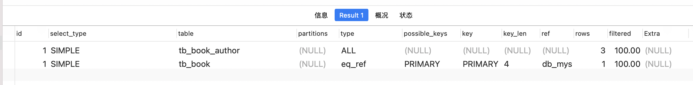

- ==ref==

  - 简单查询：使用了非主键的索引作为查询条件，则为ref

  ```sql
  explain select * from tb_book where name='a'
  ```

  - 复杂查询（join查询）:如果使用了表中的非主键的索引作为关联的条件，那么查询类型是ref

  ```sql
  explain select book_id from tb_book left join tb_book_author on tb_book_author.book_id = tb_book.id
  ```

  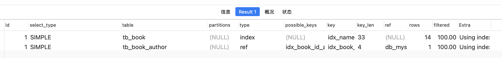

- ==range==

  描述的是范围，查询条件是用主键作范围查询，则类型为range

  ```sql
  explain select * from tb_book where id>5
  
  ```

- ==index==

这一次查询，是通过索引树来获得查询的结果

```sql
# 查name索引的范围查询
explain select * from tb_book where name>'a'
# ALL，因为有的列没有索引，所以就只能做全表扫描
explain select * from tb_account;
# index，因为所有列都有索引，所以从索引树上获得结果。
explain select * from tb_book;

```

- ALL

全表扫描，不能从索引树上定位到数据，


### 4）possible_keys

可能会用到的索引（键）

### 5）key

实际使用到的索引

### 6）key_len

索引（键）的长度

```sql
explain select * from employees where name like 'abc'

explain select * from employees where name = 'abc' and age =20

explain select * from employees where name = 'abc' and age =20 and position = 'dev'
```

在组合索引中，通过possible_keys查看到可能走的索引，通过key查看到实际走的索引，通过key_len得知具体走的是组合索引中的哪几个索引列。

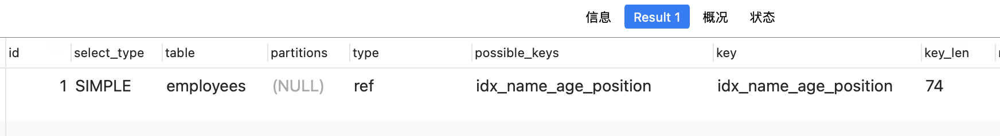

Key_len索引列的值计算规则:

```
EXPLAIN select * from employees where name = 'customer10011' and age=30 and position='dev'
- 字符串
1. char(n): n字节长度
2. varchar(n): 2字节存储字符串长度,如果是utf-8,则长度3n + 2

- 数值类型
1. tinyint: 1字节
2. smallint: 2字节
3. int: 4字节
4. bigint: 8字节

- 时间类型
1. date: 3字节
2. timestamp: 4字节
3. datetime: 8字节

如果字段允许为NULL,需要1字节记录是否为NULL
索引最大长度是768字节,当字符串过长时, mysql会做一个类似左前缀索引的处理,将前半部分的字符提取出来做索引。

```

### 7）rows

可能要查询的行数，不是结果的行数


### 8）extra

这一列会告知一些额外的信息。帮助我们判断是否使用了主键索引、覆盖索引（sql优化中非常好用的手段）、文件排序等等。

- Using index

  告诉我们这一次查询使用了==覆盖索引，指的是查询出的每一列都是索引列。==

  ```sql
  explain select * from tb_book;
  ```

- Using where

使用了where做条件判断

- Using index condition

使用了组合索引中的最左边的列

```sql
explain select * from employees where name = 'abc' and position = 'dev'
```

- Using temporary

在下面这个例子中，因为name不是索引列，所以需要创建一种临时表，来做去重，性能较差，需要优化

```sql
explain select DISTINCT name from tb_book 
```

- Using filesort

使用了文件排序，因为name不是索引列，所以需要进行文件排序，文件排序又有多种方式，在之后的专题中去讲

```sql
explain select * from tb_book order by name
```

- Select tables optimized away

  使用了聚合函数(比如max,min)操作索引列。

```sql
EXPLAIN select min(id) from tb_book
```


# 八、Trace工具

## 1.trace工具的介绍

mysql内部优化器根据走索引花费的时间，和全表扫描花费的时间，进行比较，来决定是否走索引。

如果全表扫描花费的时间比走索引花费的时间还要少，那么就全表扫描。

mysql内部优化器是怎么判断的，使用trace工具可以看到它的判断依据。

## 2.如何使用

- 开启trace

```sql
set session optimizer_trace="enabled=on", end_markers_in_json=on;
```

- 执行如下内容

```sql
 select * from employees where name > 'a' order by position;
 SELECT * FROM information_schema.OPTIMIZER_TRACE;
```

- 解析结果

```sql
{
  "steps": [ --多个阶段
    {
      "join_preparation": { -- 阶段1:进入准备阶段
        "select#": 1,
        "steps": [
          {
            "expanded_query": "/* select#1 */ select `employees`.`id` AS `id`,`employees`.`name` AS `name`,`employees`.`age` AS `age`,`employees`.`position` AS `position`,`employees`.`hire_time` AS `hire_time` from `employees` where (`employees`.`name` > 'a') order by `employees`.`position`"
          }
        ] /* steps */
      } /* join_preparation */
    },
    {
      "join_optimization": { -- 阶段2:进入到优化阶段
        "select#": 1,
        "steps": [
          {
            "condition_processing": { -- 条件处理
              "condition": "WHERE",
              "original_condition": "(`employees`.`name` > 'a')",
              "steps": [
                {
                  "transformation": "equality_propagation",
                  "resulting_condition": "(`employees`.`name` > 'a')"
                },
                {
                  "transformation": "constant_propagation",
                  "resulting_condition": "(`employees`.`name` > 'a')"
                },
                {
                  "transformation": "trivial_condition_removal",
                  "resulting_condition": "(`employees`.`name` > 'a')"
                }
              ] /* steps */
            } /* condition_processing */
          },
          {
            "substitute_generated_columns": {
            } /* substitute_generated_columns */
          },
          {
            "table_dependencies": [ -- 表的依赖详情
              {
                "table": "`employees`",
                "row_may_be_null": false,
                "map_bit": 0,
                "depends_on_map_bits": [
                ] /* depends_on_map_bits */
              }
            ] /* table_dependencies */
          },
          {
            "ref_optimizer_key_uses": [
            ] /* ref_optimizer_key_uses */
          },
          {
            "rows_estimation": [
              {
                "table": "`employees`",
                "range_analysis": {
                  "table_scan": {
                    "rows": 5598397,
                    "cost": 573360
                  } /* table_scan */,
                  "potential_range_indexes": [ -- 分析可能使用到的索引
                    {
                      "index": "PRIMARY", --主键索引
                      "usable": false,
                      "cause": "not_applicable"
                    },
                    {
                      "index": "idx_name_age_position", -- 组合索引
                      "usable": true,
                      "key_parts": [
                        "name",
                        "age",
                        "position",
                        "id"
                      ] /* key_parts */
                    }
                  ] /* potential_range_indexes */,
                  "setup_range_conditions": [
                  ] /* setup_range_conditions */,
                  "group_index_range": {
                    "chosen": false,
                    "cause": "not_group_by_or_distinct"
                  } /* group_index_range */,
                  "skip_scan_range": {
                    "potential_skip_scan_indexes": [
                      {
                        "index": "idx_name_age_position",
                        "usable": false,
                        "cause": "query_references_nonkey_column"
                      }
                    ] /* potential_skip_scan_indexes */
                  } /* skip_scan_range */,
                  "analyzing_range_alternatives": { --分析各个索引使用的成本
                    "range_scan_alternatives": [
                      {
                        "index": "idx_name_age_position", --组合索引
                        "ranges": [
                          "a < name"
                        ] /* ranges */,
                        "index_dives_for_eq_ranges": true,
                        "rowid_ordered": false,
                        "using_mrr": true,
                        "index_only": false, --是否使用了覆盖索引
                        "rows": 2799198, -- 扫描的行数
                        "cost": 1.8e6, -- 花费的时间
                        "chosen": false, -- 是否选择
                        "cause": "cost" -- 时间成本
                      }
                    ] /* range_scan_alternatives */,
                    "analyzing_roworder_intersect": {
                      "usable": false,
                      "cause": "too_few_roworder_scans"
                    } /* analyzing_roworder_intersect */
                  } /* analyzing_range_alternatives */
                } /* range_analysis */
              }
            ] /* rows_estimation */
          },
          {
            "considered_execution_plans": [
              {
                "plan_prefix": [
                ] /* plan_prefix */,
                "table": "`employees`",
                "best_access_path": {
                  "considered_access_paths": [
                    {
                      "rows_to_scan": 5598397, -- 扫描的行数
                      "access_type": "scan", -- 全表扫描
                      "resulting_rows": 5.6e6,
                      "cost": 573358, --全表扫描花费的时间
                      "chosen": true, -- 选中了
                      "use_tmp_table": true
                    }
                  ] /* considered_access_paths */
                } /* best_access_path */,
                "condition_filtering_pct": 100,
                "rows_for_plan": 5.6e6,
                "cost_for_plan": 573358,
                "sort_cost": 5.6e6,
                "new_cost_for_plan": 6.17e6,
                "chosen": true
              }
            ] /* considered_execution_plans */
          },
          {
            "attaching_conditions_to_tables": {
              "original_condition": "(`employees`.`name` > 'a')",
              "attached_conditions_computation": [
              ] /* attached_conditions_computation */,
              "attached_conditions_summary": [
                {
                  "table": "`employees`",
                  "attached": "(`employees`.`name` > 'a')"
                }
              ] /* attached_conditions_summary */
            } /* attaching_conditions_to_tables */
          },
          {
            "optimizing_distinct_group_by_order_by": {
              "simplifying_order_by": {
                "original_clause": "`employees`.`position`",
                "items": [
                  {
                    "item": "`employees`.`position`"
                  }
                ] /* items */,
                "resulting_clause_is_simple": true,
                "resulting_clause": "`employees`.`position`"
              } /* simplifying_order_by */
            } /* optimizing_distinct_group_by_order_by */
          },
          {
            "reconsidering_access_paths_for_index_ordering": {
              "clause": "ORDER BY",
              "steps": [
              ] /* steps */,
              "index_order_summary": {
                "table": "`employees`",
                "index_provides_order": false,
                "order_direction": "undefined",
                "index": "unknown",
                "plan_changed": false
              } /* index_order_summary */
            } /* reconsidering_access_paths_for_index_ordering */
          },
          {
            "finalizing_table_conditions": [
              {
                "table": "`employees`",
                "original_table_condition": "(`employees`.`name` > 'a')",
                "final_table_condition   ": "(`employees`.`name` > 'a')"
              }
            ] /* finalizing_table_conditions */
          },
          {
            "refine_plan": [
              {
                "table": "`employees`"
              }
            ] /* refine_plan */
          },
          {
            "considering_tmp_tables": [
              {
                "adding_sort_to_table": "employees"
              } /* filesort */
            ] /* considering_tmp_tables */
          }
        ] /* steps */
      } /* join_optimization */
    },
    {
      "join_execution": {
        "select#": 1,
        "steps": [
          {
            "sorting_table": "employees",
            "filesort_information": [
              {
                "direction": "asc",
                "expression": "`employees`.`position`"
              }
            ] /* filesort_information */,
            "filesort_priority_queue_optimization": {
              "usable": false,
              "cause": "not applicable (no LIMIT)"
            } /* filesort_priority_queue_optimization */,
            "filesort_execution": [
            ] /* filesort_execution */,
            "filesort_summary": {
              "memory_available": 262144,
              "key_size": 40,
              "row_size": 190,
              "max_rows_per_buffer": 1379,
              "num_rows_estimate": 5598397,
              "num_rows_found": 5913849,
              "num_initial_chunks_spilled_to_disk": 1954,
              "peak_memory_used": 262144,
              "sort_algorithm": "std::stable_sort",
              "sort_mode": "<fixed_sort_key, packed_additional_fields>"
            } /* filesort_summary */
          }
        ] /* steps */
      } /* join_execution */
    }
  ] /* steps */
}
```


# ==九、索引使用的注意事项==

- 少用or或in，有可能会造成全表扫描
- 要给列设计成非空，并设默认值，因为is null 或is not null会造成全表扫描
- 可以做一些==范围查询==的优化：

```sql
# 全表扫描
explain select * from employees where age >=1 and age <=400000;
# 拆成多个部分，每个部分都走索引
explain select * from employees where age >=1 and age <=200000;
# 拆成多个部分，每个部分都走索引
explain select * from employees where age >=200001 and age <=400000;
```

- 不要在where后面用函数，会造成索引失效
- 使用==!= 或 <>== 会造成索引失效（使用 <> 会使索引失效，为什么呢，因为，系统自上向下索引，你告诉我找谁，我能按着大街小巷胡同门牌号的给你找到，你告诉我不找谁，那你一定是在逗我。）
- 尽量使用==覆盖索引==。


# ==十、SQL优化实战==

## 1.order by 优化

如果要排序的数据没办法直接通过索引树来获得排序的效果，于是会出现文件排序。在排序的应用场景中，很容易出现文件排序，文件排序是会对性能造成影响的，所以要尽量优化。

对于order by优化来说，尽量走索引树来获得结果。

```sql
# 根据age来排序，因为name列已经走索引了，所以排序的结果可以直接从索引树上获取，因此不需要文件排序
Explain select * from employees where name='customer' and position='dev' order by age;
#使用文件排序，创建缓冲区来排序
Explain select * from employees where name='customer' order by position;
# 不需要文件排序
Explain select * from employees where name='customer' order by age, position;
# 需要了，因为先排了position，再排age，违反了最左前缀法则，建议把age放前面
Explain select * from employees where name='customer' order by position, age;
# 不走文件排序，因为age已经确定了具体的值，直接可以从索引树上获得排序结果
Explain select * from employees where name='customer' and age=20 order by position, age;
# position降序，mysql逆向获得索引树上的结果
Explain select * from employees where name='customer' and age=20 order by age, position desc;
# 因为name用了in，所以没办法直接从索引树上获得结果，因此会文件排序
Explain select * from employees where name in ('customer','aa') order by age, position;
```


## 2.文件排序的原理

**要排序的数据没办法直接通过索引树来获得排序的结果**，于是mysql会创建一个用于排序的缓冲区。该缓冲区默认是1kb（通过设置这个变量来设置缓冲区大小max_length_for_sort_data）。如果要排序的所有数据总大小超过缓冲区大小，则做的是双路排序，否则做的是单路排序。

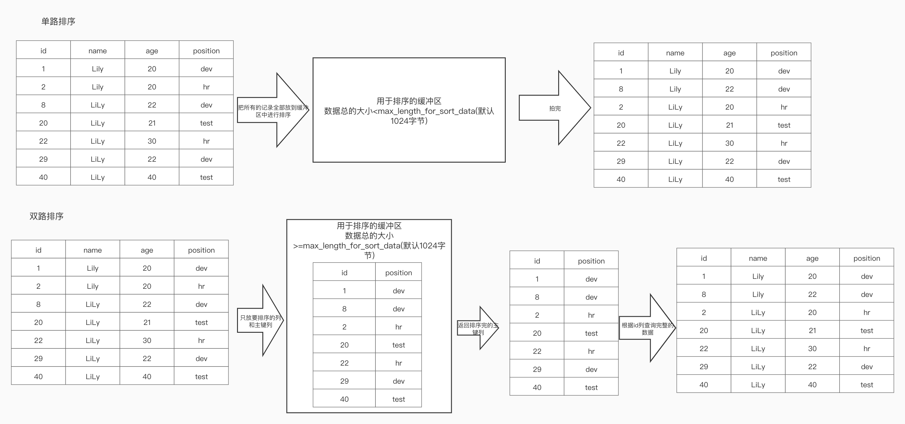


## 3.group by优化

**group by是先排序，后分组。因此对于group by的列要创建索引**，这个索引可以是普通索引，也可以是满足组合索引的左前缀的列。


## 4.==分页查询优化==

对于这样的分页查询，肯定是要全表扫描的，如何解决？

```sql
Explain select * from employees limit 100000,10
```

- 方案1:针对于id连续的情况，可以用id做范围查找，代替分页的效果，但是这种情况是比较苛刻的，很少见

```sql
-- id不连续 10 20 30 100 112 114 120，分页数据不准确
Explain select * from employees where id>10000 limit 10
```

- 方案2: id不连续

使用覆盖索引

```sql
Explain select id,name,age,position from employees limit 100000,10
```

- 方案3: 没办法使用覆盖索引

加入order by 和left join 进行优化（小表驱动大表的概念，在join中去讲）

```sql
explain select * from employees a LEFT JOIN (select id from employees  order by name limit 100000,10) b on a.id = b.id
```


## 5.join优化

### 1）nlj算法- 嵌套循环

**join优化一定要遵循一个准则，关联的两张表的字段都需要创建索引**。这样的话，在进行关联查询的时候，mysql会遵循小表驱动大表的原则，来进行优化：让小表的数据做全表扫描（mysql内部优化器自己选择的，跟书写的顺序无关），拿到小表的数据后 去大表中做查询（使用了索引来查询），这样的性能是ok的。

- 小表：数据量小的表
- 大表：数据量大的表。

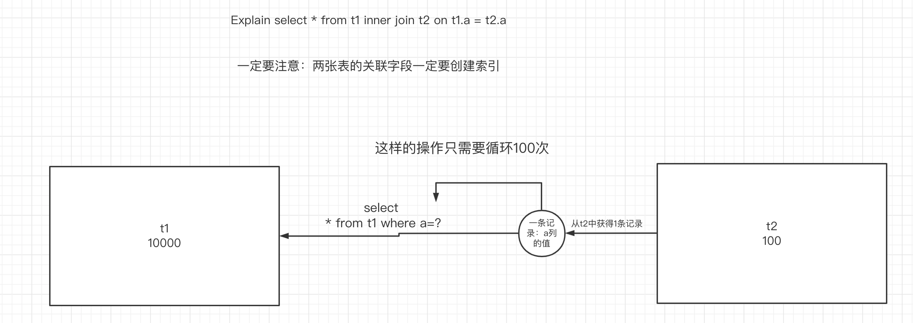

### 2）bnlj算法--块嵌套循环

如果join的时候两张表的关联字段没有创建索引，那么就会使用bnlj算法，性能非常差

此时mysql会创建一个join buffer缓冲区，拿小表的数据存入到缓冲区中，再用缓冲区中的数据和大表的数据进行比较。

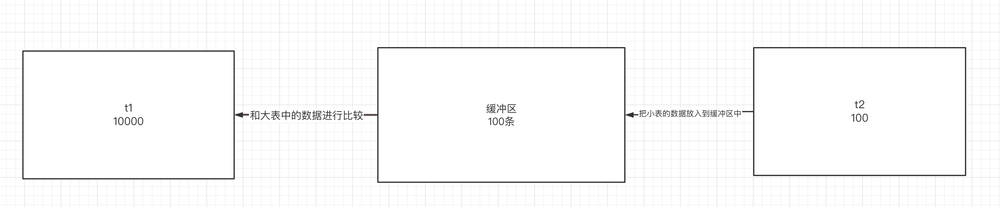

==结论：关联的两张表的字段都需要创建索引==


## 6.in和exists优化

当要做一个查询，查询A表中的数据，且A表中的id列的值存在于B表中，那么可以使用in或者exists

- in

使用in的前提是B表中的数据<A表中的数据

```sql
select * from A where id in (select id from B) 
```

等价于

```java
for(select id from B){
  select * fram A whre A.id = B.id
}
```

如果B表是大表，应该用exists

- exists

如果exists判断的内容是true，则这条记录显示，否则不显示

```sql
select * from A where exists (select 1 from B where B.id = A.id)
```

等价于

```java
for(select id from A){
  select * from B where B.id = A.id 
}
```

结论：在用in做查询时，如果B表是大表，那么in的查询会造成全表扫描。怎么优化？in->exists


## 7.count优化

count应用场景很多，比如统计员工总数、视频播放总量、评论总数、收藏总数、关注总数、点赞总数

对于count的优化，在sql层面其实是不明显的，这样的count被访问的频率是非常高的。==所以要把这些总数维护在缓存服务器redis里。==

引出一个知识点：redis和mysql双写一致性如何保证。（mysql主从数据同步时再讲这个知识点。）


## ==8.总结==

- 我们写的SQL语句需要==去命中索引==。如果没有命中索引，那就尽量使用==覆盖索引==。

- 能多建索引尽量建索引。

- 如果是组合索引，一定要想办法满足最左前缀法则。

- 即使命中了索引，因为数据量过大，导致查询依赖比较慢，这个时候就可以使用多线程，每条线程把查询到的结果进行合并。——==CountDownLatch==


# 十一、锁的定义和分类

## 1.锁的定义

锁用来解决多线程并发安全问题，死锁、性能之间的权衡。

在并发场景下，锁往往能解决并发场景下带来的数据安全问题，但是我们要追求的是既能解决安全，又能保证性能。之前学过的知识：hashtable、ConcurrentHashMap、CAS、Synchronized这些技术其实都在讨论的是**"既能解决安全，又能保证性能"。**

那么，在MySQL层面，是怎么样通过锁的机制，"既能解决安全，又能保证性能"。——MVCC设计思想。

## 2.锁的分类

### 1）从性能上划分：乐观锁和悲观锁

- 乐观锁：乐观的认为，当前锁的竞争不激烈，等有并发出现时再来解决数据安全问题——CAS
- 悲观锁：悲观的认为，当前锁的竞争非常激烈，对于任何操作都上锁。——Synchronized

### 2）从数据的操作粒度上划分：表锁和行锁

- 表锁：对整张表上锁
- 行锁：对表中的某一行上锁

### 3）从数据库的操作类型上划分：读锁和写锁

这两种锁都是属于悲观锁

- 读锁（共享锁）：对于同一行数据，读是可以的，但是写不行，要想写，必须上写锁
- 写锁（排他锁）：上写锁之前，该数据不能被上任何锁。


## 3.表锁

对于MyISAM引擎来说，天然支持表锁，但是在Innodb也可以实现手动上表锁。

```sql
# 给该表上读锁，当前会话只能读不能写，其他会话也能读，但不能写
lock table 表名 read;
# 给该表上写锁，当前会话能读能写，但其他会话不能读不能写
lock table 表名 write;
# 查看所有表的锁
show open tables;
# 释放锁
unlock tables;
```


## 4.行锁

MyISAM不支持行锁，只有InnoDB支持行锁。

在并发的事务里，以下两种方式会对某一行记录上行锁，其他会话只能读，不能写。

```sql
# 方式一： for update
select * from tb_book where id=5 for update;
# 方式二： update
update tb_book set name='m' where id=5;
```


# 十二、MVCC设计思想

==MVCC也称为多版本并发控制，目的是在并发出现时既能保证安全（一定程度的），又能保证性能。==

## 1.事务的特性

- 原子性
- 隔离性：在并发事务中，不同的隔离级别带来的并发效果是不一样的。
- 持久性
- 一致性


## 2.事务的隔离级别

- **read uncommitted: 读未提交**，会出现脏读。

  ==脏读问题：读到了其他事务还没有提交的数据。==

- **read committed: 读已提交**，在并发事务中，当前事务能读到另一个事务已经提交的数据，但是没有提交的数据，是读不到的。这样就能解决脏读问题，但是会出现不可重复读的问题。

  ==不可重复读问题：当前事务的多次读取的结果（同一行的数据）是不一样的，而同一个事务内应该读取的数据是一致的（事务一致性）。==

- **repeatable read: 可重复读**，在并发事务中，当前事务的多次读取结果是一样的，解决了不可重复读的问题，但是会出现虚读（幻读）

  ==幻读问题：指的是一个事务在前后两次查询同一个范围的时候，后一次查询看到了前一次查询没有看到         的数据行。而多出来或者少的哪一行被叫做“幻行”。幻读的重点在于新增或者删除行==

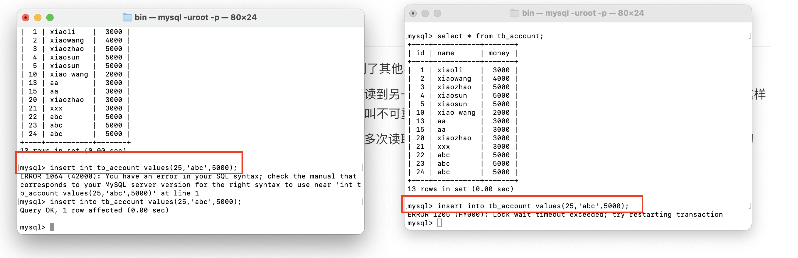

当左边的事务正在插入id是25的数据，但是没有提交，相当于是给id是25的数据上了行锁。

于是右边的事务中就没办法插入id是25的数据，但是经过查询，并不存在id是25的数据，仿佛出现了幻觉，这就是幻读。

==怎么解决幻读：执行插入之前，先for update 对这条上锁==

```sql
select * from tb_account where id=25 for update;
或者让间隙锁,锁住要插入数据的间隙
```


- serialiazable： 串行化，相当于上了表锁，锁表了，并行成了串行，没有并发可言。


## 3.MVCC设计思想

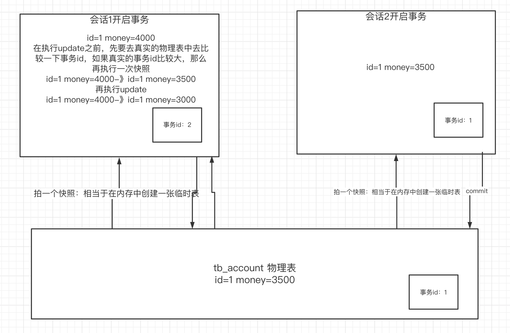

- 在默认mysql的隔离级别中，读数据是可以重复读的
- 如果出现写数据，且真实数据被修改，那么写数据之前，会先更新当前事务的最新的快照，更新完后再写，保证了数据的一致性

- ==通过mvcc并发控制==，既能一定程度的保证了并发，也在真正需要数据一致性的时候，牺牲掉并发，来同步，==保证数据一致性。==


# 十三、死锁和间隙锁

## 1.死锁

比如 小高和小胡去食堂吃饭，只有一双筷子，一人拿一只，对方都在等着对方的一只筷子，因为没吃完饭都不会释放手中的筷子。此时就出现了死锁。

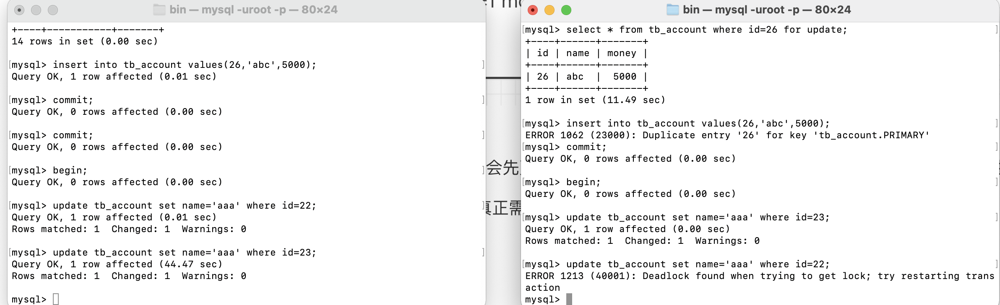

## 2.间隙锁

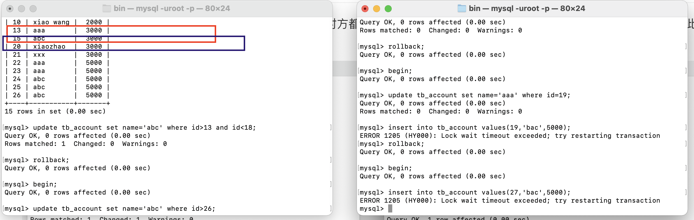

通过update where之后的一个范围上锁，那么就会上间隙锁，数据所在的整个范围被上锁。比如id>13所在的范围是13-15，这一段间隙全部被上锁。（不懂回去看视频就懂）

上了间隙锁后，这个范围内是不能执行插入的。


# 作业

- 掌握好mysql所有相关的知识。
- 掌握mysql的优化细节，在简历上写上具有一定程度的sql优化能力。
- 写简历