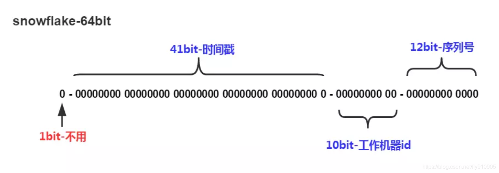

# 概述

在复杂分布式系统中，往往需要对大量的数据和消息进行唯一标识。如在美团点评的金融、支付、餐饮、酒店、猫眼电影等产品的系统中，数据日渐增长，对数据分库分表后需要有一个唯一 ID 来标识一条数据或消息，数据库的自增 ID 显然不能满足需求；特别一点的如订单、骑手、优惠券也都需要有唯一 ID 做标识。此时一个能够生成全局唯一 ID 的系统是非常必要的。概括下来，那业务系统对 ID 号的要求有哪些呢？

- **全局唯一性：** 不能出现重复的 ID 号，既然是唯一标识，这是最基本的要求。
- **趋势递增：** 在 MySQL InnoDB 引擎中使用的是聚集索引，由于多数 RDBMS 使用 B-tree 的数据结构来存储索引数据，在主键的选择上面我们应该尽量使用有序的主键保证写入性能。
- **单调递增：** 保证下一个 ID 一定大于上一个 ID，例如事务版本号、IM 增量消息、排序等特殊需求。
- **信息安全：** 如果 ID 是连续的，恶意用户的扒取工作就非常容易做了，直接按照顺序下载指定 URL 即可；如果是订单号就更危险了，竞对可以直接知道我们一天的单量。所以在一些应用场景下，会需要 ID 无规则、不规则。

> **注意：** 上述前三点对应三类不同的场景，3 和 4 需求还是互斥的，无法使用同一个方案满足。

# 面临挑战

同时除了对 ID 号码自身的要求，业务还对 ID 号生成系统的可用性要求极高，想象一下，如果 ID 生成系统瘫痪，整个美团点评支付、优惠券发券、骑手派单等关键动作都无法执行，这就会带来一场灾难。由此总结下一个 ID 生成系统应该做到如下几点：

- 平均延迟和 TP999 延迟都要尽可能低；
- 可用性 5 个 9（还记得我之前说的 6 个 9 嘛！ ︿(￣︶￣)︿）；
- 高 QPS。

# 解决方案

## 数据库生成

以 MySQL 举例，利用给字段设置 `auto_increment_increment` 和 `auto_increment_offset` 来保证 ID 自增，每次业务使用下列 SQL 读写 MySQL 得到 ID 号。

```
begin;
REPLACE INTO Tickets64 (stub) VALUES ('a');
SELECT LAST_INSERT_ID();
commit;
```

- 优点：
  - 非常简单，利用现有数据库系统的功能实现，成本小，有 DBA 专业维护。
  - ID 号单调自增，可以实现一些对 ID 有特殊要求的业务。
- 缺点：
  - 强依赖 DB，当 DB 异常时整个系统不可用，属于致命问题。配置主从复制可以尽可能的增加可用性，但是数据一致性在特殊情况下难以保证。主从切换时的不一致可能会导致重复发号。
  - ID 发号性能瓶颈限制在单台 MySQL 的读写性能。

## 数据库生成（改）

对于 MySQL 性能问题，可用如下方案解决：在分布式系统中我们可以多部署几台机器，每台机器设置不同的初始值，且步长和机器数相等。比如有两台机器。设置步长 step 为 2，TicketServer1 的初始值为 1（1，3，5，7，9，11…）、TicketServer2 的初始值为 2（2，4，6，8，10…）。这是 Flickr 团队在 2010 年撰文介绍的一种主键生成策略。如下所示，为了实现上述方案分别设置两台机器对应的参数，TicketServer1 从 1 开始发号，TicketServer2 从 2 开始发号，两台机器每次发号之后都递增 2。

```
TicketServer1:
auto-increment-increment = 2
auto-increment-offset = 1

TicketServer2:
auto-increment-increment = 2
auto-increment-offset = 2
```

假设我们要部署 N 台机器，步长需设置为 N，每台的初始值依次为 0,1,2…N-1 那么整个架构就变成了如下图所示：


**这种架构貌似能够满足性能的需求，但有以下几个缺点：**

- 系统水平扩展比较困难，比如定义好了步长和机器台数之后，如果要添加机器该怎么做？假设现在只有一台机器发号是 1,2,3,4,5（步长是 1），这个时候需要扩容机器一台。可以这样做：把第二台机器的初始值设置得比第一台超过很多，比如 14（假设在扩容时间之内第一台不可能发到 14），同时设置步长为 2，那么这台机器下发的号码都是 14 以后的偶数。然后摘掉第一台，把 ID 值保留为奇数，比如 7，然后修改第一台的步长为 2。让它符合我们定义的号段标准，对于这个例子来说就是让第一台以后只能产生奇数。扩容方案看起来复杂吗？貌似还好，现在想象一下如果我们线上有 100 台机器，这个时候要扩容该怎么做？简直是噩梦。所以系统水平扩展方案复杂难以实现。
- ID 没有了单调递增的特性，只能趋势递增，这个缺点对于一般业务需求不是很重要，可以容忍。
- 数据库压力还是很大，每次获取 ID 都得读写一次数据库，只能靠堆机器来提高性能。

## UUID

UUID (Universally Unique Identifier) 的标准型式包含 32 个 16 进制数字，以连字号分为五段，形式为 8-4-4-4-12 的 36 个字符，示例：550e8400-e29b-41d4-a716-446655440000，到目前为止业界一共有 5 种方式生成 UUID

- 优点：
  - 性能非常高：本地生成，没有网络消耗。
- 缺点：
  - 不易于存储：UUID 太长，16 字节 128 位，通常以 36 长度的字符串表示，很多场景不适用。
  - 信息不安全：基于 MAC 地址生成 UUID 的算法可能会造成 MAC 地址泄露，这个漏洞曾被用于寻找梅丽莎病毒的制作者位置。
  - ID 作为主键时在特定的环境会存在一些问题，比如做 DB 主键的场景下，UUID 就非常不适用：

> **注意：**
>
> - MySQL 官方有明确的建议主键要尽量越短越好 [4]，36 个字符长度的 UUID 不符合要求
> - 对 MySQL 索引不利：如果作为数据库主键，在 InnoDB 引擎下，UUID 的无序性可能会引起数据位置频繁变动，严重影响性能

## SNOWFLAKE

雪花算法是由 Twitter 公布的分布式主键生成算法，它能够保证不同进程主键的不重复性，以及相同进程主键的有序性。在同一个进程中，它首先是通过时间位保证不重复，如果时间相同则是通过序列位保证。 同时由于 **时间位是单调递增的**，且各个服务器如果大体做了时间同步，那么生成的主键在分布式环境可以认为是总体有序的，这就保证了对索引字段的插入的高效性。例如 MySQL 的 Innodb 存储引擎的主键。

使用雪花算法生成的主键，**二进制表示形式** 包含 4 部分，从高位到低位分表为：1bit 符号位、41bit 时间戳位、10bit 工作进程位以及 12bit 序列号位。

 

- **符号位 (1bit)**

预留的符号位，恒为零。

- **时间戳位 (41bit)**

41 位的时间戳可以容纳的毫秒数是 2 的 41 次幂，一年所使用的毫秒数是：`365 * 24 * 60 * 60 * 1000`。通过计算可知：

```
Math.pow(2, 41) / (365 * 24 * 60 * 60 * 1000L);
```

结果约等于 69.73 年。ShardingSphere 的雪花算法的时间纪元从 2016 年 11 月 1 日零点开始，可以使用到 2086 年，相信能满足绝大部分系统的要求。

- **工作进程位 (10bit)**

该标志在 Java 进程内是唯一的，如果是分布式应用部署应保证每个工作进程的 id 是不同的。该值默认为 0，可通过属性设置。

- **序列号位 (12bit)**

该序列是用来在同一个毫秒内生成不同的 ID。如果在这个毫秒内生成的数量超过 4096 (2 的 12 次幂)，那么生成器会等待到下个毫秒继续生成。

> **注意：** 该算法存在 **时钟回拨** 问题，服务器时钟回拨会导致产生重复序列，因此默认分布式主键生成器提供了一个最大容忍的时钟回拨毫秒数。 如果时钟回拨的时间超过最大容忍的毫秒数阈值，则程序报错；如果在可容忍的范围内，默认分布式主键生成器会等待时钟同步到最后一次主键生成的时间后再继续工作。 最大容忍的时钟回拨毫秒数的默认值为 0，可通过属性设置。