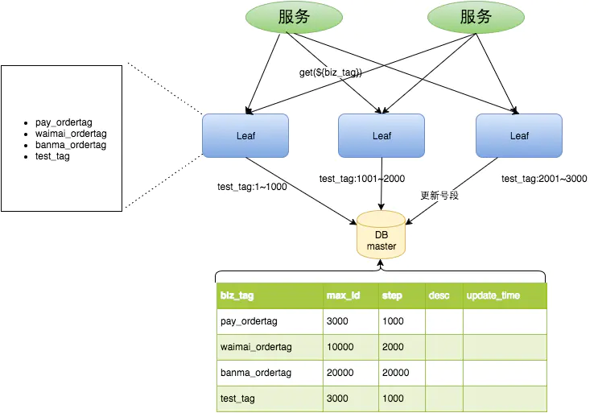
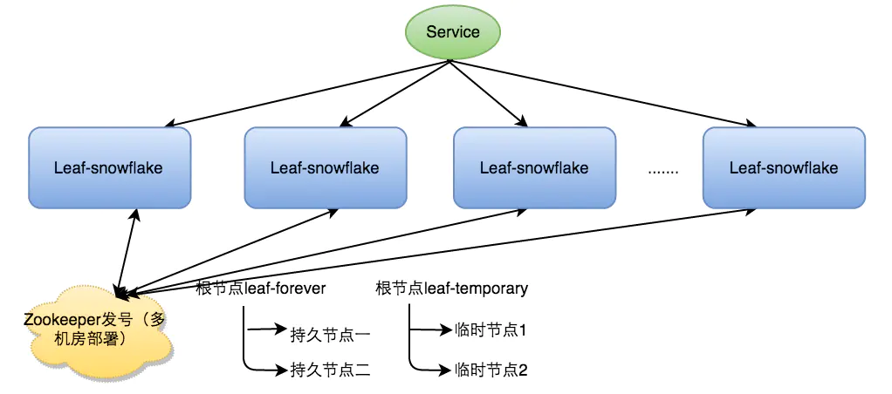

# 什么是 Leaf

Leaf 是美团开源的分布式 ID 生成系统，最早期需求是各个业务线的订单 ID 生成需求。在美团早期，有的业务直接通过 DB 自增的方式生成 ID，有的业务通过 Redis 缓存来生成 ID，也有的业务直接用 UUID 这种方式来生成 ID。以上的方式各自有各自的问题，因此美团决定实现一套分布式 ID 生成服务来满足需求

目前 Leaf 覆盖了美团点评公司内部金融、餐饮、外卖、酒店旅游、猫眼电影等众多业务线。在4C8G VM 基础上，**通过公司 RPC 方式调用**，QPS 压测结果近 5w/s，TP999 1ms（TP=Top Percentile，Top 百分数，是一个统计学里的术语，与平均数、中位数都是一类。TP50、TP90 和 TP99 等指标常用于系统性能监控场景，指高于 50%、90%、99% 等百分线的情况）

- GitHub：<https://github.com/Meituan-Dianping/Leaf/blob/master/README_CN.md>

# Leaf-segment

Leaf-segment 数据库方案，在使用数据库的方案上，做了如下改变：

- 原方案每次获取 ID 都得读写一次数据库，造成数据库压力大。改为利用 proxy server 批量获取，每次获取一个 segment (step 决定大小) 号段的值。用完之后再去数据库获取新的号段，可以大大的减轻数据库的压力。
- 各个业务不同的发号需求用 biz_tag 字段来区分，每个 biz-tag 的 ID 获取相互隔离，互不影响。如果以后有性能需求需要对数据库扩容，只需要对 biz_tag 分库分表就行。数据库表设计如下：


- 重要字段说明：
  - biz_tag 用来区分业务
  - max_id 表示该 biz_tag 目前所被分配的 ID 号段的最大值
  - step 表示每次分配的号段长度

原来获取 ID 每次都需要写数据库，现在只需要把 step 设置得足够大，比如 1000。那么只有当 1000 个号被消耗完了之后才会去重新读写一次数据库。读写数据库的频率从 1 减小到了 1/step，大致架构如下图所示：



test_tag 在第一台 Leaf 机器上是 1~1000 的号段，当这个号段用完时，会去加载另一个长度为 step=1000 的号段，假设另外两台号段都没有更新，这个时候第一台机器新加载的号段就应该是 3001~4000。同时数据库对应的 biz_tag 这条数据的 max_id 会从 3000 被更新成 4000，更新号段的 SQL 语句如下：

```
Begin
UPDATE table SET max_id=max_id+step WHERE biz_tag=xxx
SELECT tag, max_id, step FROM table WHERE biz_tag=xxx
Commit
```

## 优点

- Leaf 服务可以很方便的线性扩展，性能完全能够支撑大多数业务场景。
- ID 号码是趋势递增的 8byte 的 64 位数字，满足上述数据库存储的主键要求。
- 容灾性高：Leaf 服务内部有号段缓存，即使 DB 宕机，短时间内 Leaf 仍能正常对外提供服务。
- 可以自定义 max_id 的大小，非常方便业务从原有的 ID 方式上迁移过来。

## 缺点

- ID 号码不够随机，能够泄露发号数量的信息，不太安全。
- DB 宕机会造成整个系统不可用。

# Leaf-snowflake

Leaf-snowflake 方案完全沿用 snowflake 方案的 bit 位设计，即是“==1+41+10+12==” 的方式组装 ID 号。对于 workerID 的分配，当服务集群数量较小的情况下，完全可以手动配置。Leaf 服务规模较大，动手配置成本太高。所以使用 Zookeeper 持久顺序节点的特性自动对 snowflake 节点配置 wokerID。Leaf-snowflake 是按照下面几个步骤启动的：

- 启动 Leaf-snowflake 服务，连接 Zookeeper，在 leaf_forever 父节点下检查自己是否已经注册过（是否有该顺序子节点）
- 如果有注册过直接取回自己的 workerID（zk 顺序节点生成的 int 类型 ID 号），启动服务
- 如果没有注册过，就在该父节点下面创建一个持久顺序节点，创建成功后取回顺序号当做自己的 workerID 号，启动服务



## 弱依赖 ZooKeeper

除了每次会去 ZK 拿数据以外，也会在本机文件系统上缓存一个 workerID 文件。当 ZooKeeper 出现问题，恰好机器出现问题需要重启时，能保证服务能够正常启动。这样做到了对三方组件的弱依赖。一定程度上提高了 SLA（Service Level Agreement 服务等级协议，是在一定开销下为保障服务的性能和可用性，网站服务可用性 SLA，9 越多代表全年服务可用时间越长服务更可靠，停机时间越短，反之亦然）

## 解决时钟回拨问题

> **简单解释时钟回拨：** 比如你现在电脑上的时间是 2019 年 12 月 25 日晚上 22 点，你通过系统设置了 NTP 时间同步（还记得安装 Linux 的时候我们做了时间同步嘛），假设你的正常睡眠时间稳定在 8 小时也就是 2019 年 12 月 26 日早上 6 点起床，可起床后你发现电脑上的时间是早上 5 点而不是 6 点，你肯定以为是起早了接着再睡一小时 φ(≧ω≦*)♪ 对吧，其实实际时间应该是 6 点，但时间同步服务器的时间倒退一小时，导致你的电脑也跟着倒退一小时，这种现象叫做 **时钟回拨** （比如：**2017 年闰秒出现过部分机器回拨**）。那么此时聪明的你立马就能想到我了个擦这回拨的一小时里我通过雪花算法得到的分布式 ID 肯定出现重复了，这期间不就他喵的主主冲突了嘛，于是你赶紧下楼打个车去公司默默的修复 BUG 了

因为这种方案依赖时间，如果机器的时钟发生了回拨，那么就会有可能生成重复的 ID 号，需要解决时钟回退的问题。


参见上图整个启动流程图，服务启动时首先检查自己是否写过 ZooKeeper leaf_forever 节点：

- **若写过，** 则用自身系统时间与 `leaf_forever/${self}` 节点记录时间做比较，若小于 `leaf_forever/${self}` 时间则认为机器时间发生了大步长回拨，服务启动失败并报警
- **若未写过，** 证明是新服务节点，直接创建持久节点 `leaf_forever/${self}` 并写入自身系统时间，接下来综合对比其余 Leaf 节点的系统时间来判断自身系统时间是否准确，具体做法是取 `leaf_temporary` 下的所有临时节点 (所有运行中的 Leaf-snowflake 节点) 的服务 IP：Port，然后通过 RPC 请求得到所有节点的系统时间，计算 `sum (time)/nodeSize`
- **若 abs (系统时间 - sum (time)/nodeSize ) < 阈值，** 认为当前系统时间准确，正常启动服务，同时写临时节点 `leaf_temporary/${self}` 维持租约，否则认为本机系统时间发生大步长偏移，启动失败并报警。
- 每隔一段时间 (3s) 上报自身系统时间写入 `leaf_forever/${self}`。

> **注意：** 由于强依赖时钟，对时间的要求比较敏感，在机器工作时 NTP 同步也会造成秒级别的回退，建议可以直接关闭 NTP 同步。要么在时钟回拨的时候直接不提供服务直接返回 ERROR_CODE，等时钟追上即可