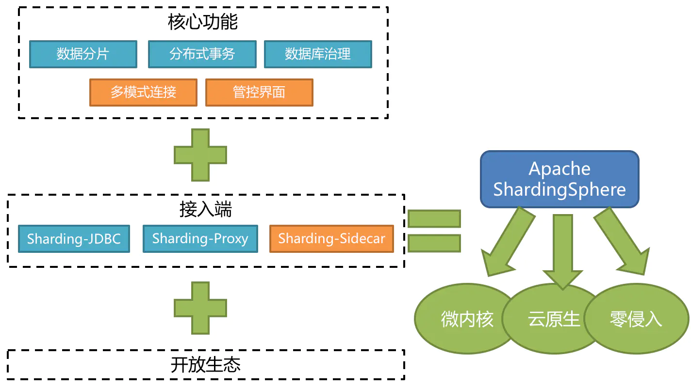
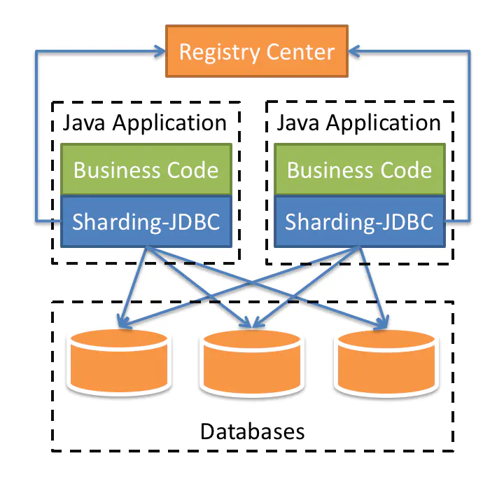
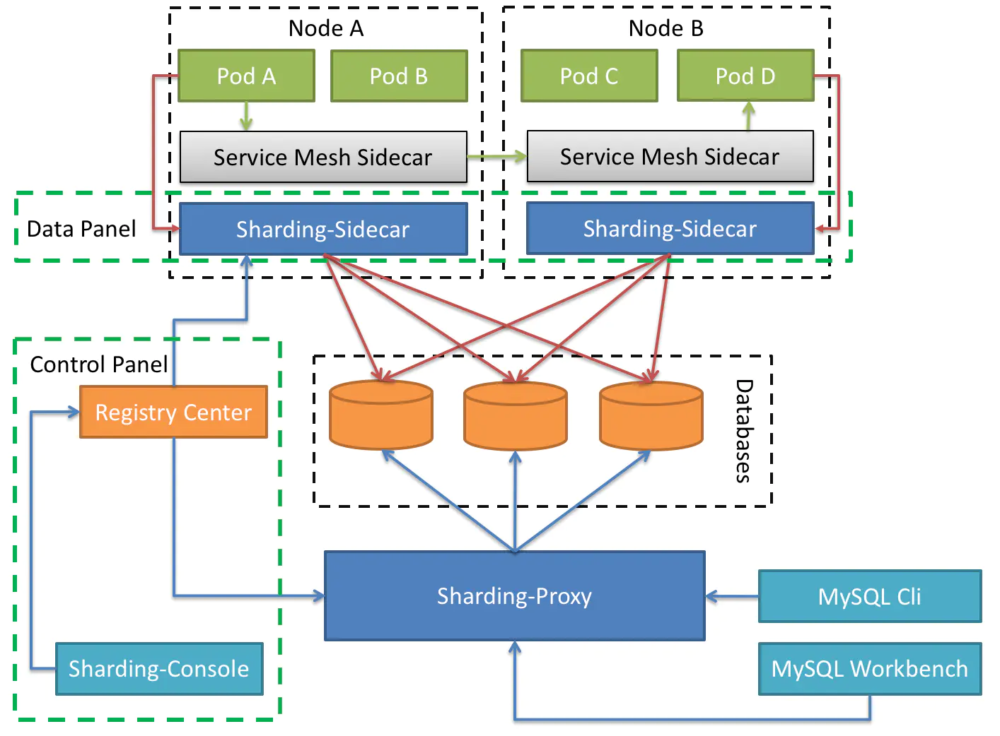
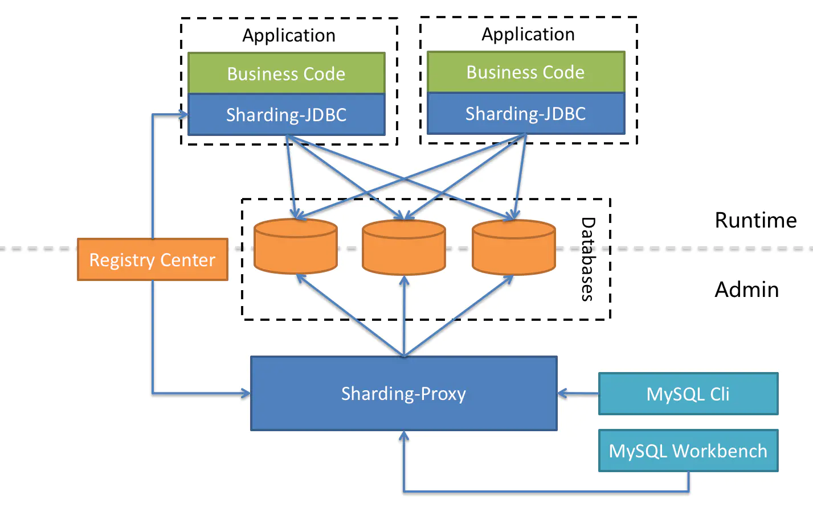
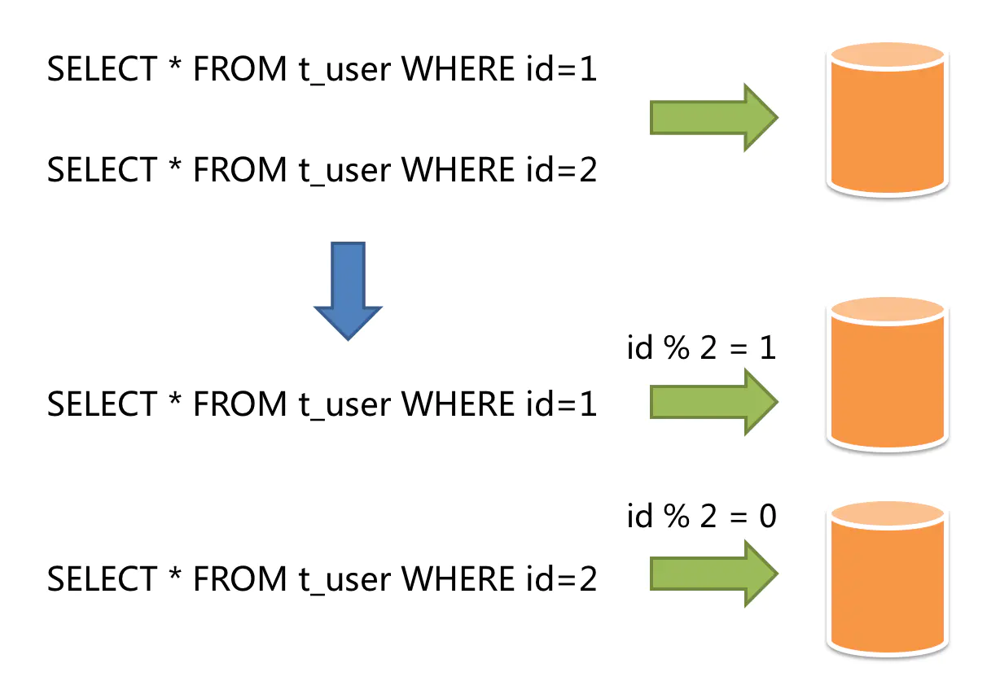

# 概述

Sharding-JDBC（**简称 SJDBC**） 是当当网 2016 年开源的适用于微服务的分布式数据访问基础类库，完整的实现了分库分表，读写分离和分布式主键功能，并初步实现了柔性事务。在经历了整体架构的数次精炼以及稳定性打磨后，如今它已积累了足够的底蕴。

**2018 年 11 月 10 日** 正式进入 Apache 孵化器并更名为 **Apache ShardingSphere (Incubator)** 它是一套 [**开源**](https://github.com/apache/incubator-shardingsphere/blob/dev/README_ZH.md) 的 **分布式数据库中间件（截至 2019 年 12 月 23 日制作的课件，目前还在孵化中）** 解决方案组成的生态圈，它由 **Sharding-JDBC**、**Sharding-Proxy** 和 **Sharding-Sidecar**（规划中）这 3 款相互独立，却又能够混合部署配合使用的产品组成。它们均提供标准化的数据分片、分布式事务和数据库治理功能，可适用于如 Java 同构、异构语言、云原生等各种多样化的应用场景。

ShardingSphere 定位为关系型数据库中间件，旨在充分合理地在分布式的场景下利用关系型数据库的计算和存储能力，而并非实现一个全新的关系型数据库。它通过关注不变，进而抓住事物本质。关系型数据库当今依然占有巨大市场，是各个公司核心业务的基石。

Apache 官方发布从 4.0.0 版本开始：

- GitHub：<https://github.com/apache/incubator-shardingsphere/blob/dev/README_ZH.md>
- 官方网站：<https://shardingsphere.apache.org/index_zh.html>

# 核心功能

## 数据分片

- 分库 & 分表
- 读写分离
- 分片策略定制化
- 无中心化分布式主键

## 分布式事务

- 标准化事务接口
- XA 强一致事务
- 柔性事务

## 数据库治理

- 配置动态化
- 编排 & 治理
- 数据脱敏
- 可视化链路追踪
- 弹性伸缩 (规划中)

# 接入端

## Sharding-JDBC

定位为轻量级 Java 框架，在 Java 的 JDBC 层提供的额外服务。 它使用客户端直连数据库，以 jar 包形式提供服务，无需额外部署和依赖，可理解为增强版的 JDBC 驱动，完全兼容 JDBC 和各种 ORM 框架。

- 适用于任何基于 JDBC 的 ORM 框架，如：JPA, Hibernate, **Mybatis**, Spring JDBC Template 或直接使用 JDBC。
- 支持任何第三方的数据库连接池，如：DBCP, C3P0, BoneCP, Druid, **HikariCP** 等。
- 支持任意实现 JDBC 规范的数据库。目前支持 MySQL，Oracle，SQLServer，PostgreSQL 以及任何遵循 SQL92 标准的数据库。

## Sharding-Proxy

定位为透明化的数据库代理端，提供封装了数据库二进制协议的服务端版本，用于完成对异构语言的支持。 目前先提供 MySQL/PostgreSQL 版本，它可以使用任何兼容 MySQL/PostgreSQL 协议的访问客户端 (如：MySQL Command Client, MySQL Workbench, Navicat 等) 操作数据，对 DBA 更加友好。

- 向应用程序完全透明，**可直接当做 MySQL/PostgreSQL 使用**。
- 适用于任何兼容 MySQL/PostgreSQL 协议的的客户端。

## Sharding-Sidecar

**定位为 Kubernetes 的云原生数据库代理（截至 2019 年 12 月 23 日制作的课件，目前属于规划中）**，以 Sidecar 的形式代理所有对数据库的访问。 通过无中心、零侵入的方案提供与数据库交互的的啮合层，**即 Database Mesh，又可称数据网格**。

Database Mesh 的关注重点在于如何将分布式的数据访问应用与数据库有机串联起来，它更加关注的是交互，是将杂乱无章的应用与数据库之间的交互有效的梳理。使用 Database Mesh，访问数据库的应用和数据库终将形成一个巨大的网格体系，应用和数据库只需在网格体系中对号入座即可，它们都是被啮合层所治理的对象。

|            | Sharding-JDBC | Sharding-Proxy | Sharding-Sidecar |
| ---------- | ------------- | -------------- | ---------------- |
| 数据库     | 任意          | MySQL          | MySQL            |
| 连接消耗数 | 高            | 低             | 高               |
| 异构语言   | 仅 Java       | 任意           | 任意             |
| 性能       | 损耗低        | 损耗略高       | 损耗低           |
| 无中心化   | 是            | 否             | 是               |
| 静态入口   | 无            | 有             | 无               |

# 混合架构

Sharding-JDBC 采用无中心化架构，适用于 Java 开发的高性能的轻量级 OLTP 应用；Sharding-Proxy 提供静态入口以及异构语言的支持，适用于 OLAP 应用以及对分片数据库进行管理和运维的场景。

ShardingSphere 是多接入端共同组成的生态圈。 通过混合使用 Sharding-JDBC 和 Sharding-Proxy，并采用同一注册中心统一配置分片策略，能够灵活的搭建适用于各种场景的应用系统，架构师可以更加自由的调整适合于当前业务的最佳系统架构。

## OLTP

- **基本含义：** OLTP(Online Transactional Processing)，OLTP 是传统的关系型数据库的主要应用，主要是基本的、日常的事务处理，记录即时的增、删、改、查，比如在银行存取一笔款，就是一个事务交易
- **实时性：** OLTP 实时性要求高，OLTP 数据库旨在使事务应用程序仅写入所需的数据，以便尽快处理单个事务
- **数据量：** OLTP 数据量不是很大，一般只读 / 写数十条记录，处理简单的事务
- **用户和系统的面向性：** OLTP 是面向顾客的，用于事务和查询处理
- **数据库设计：** OLTP 采用实体 - 联系 ER 模型和面向应用的数据库设计

## OLAP

- **基本含义：** OLAP(Online Analytical Processing) 即联机分析处理，是数据仓库的核心部心，支持复杂的分析操作，侧重决策支持，并且提供直观易懂的查询结果。典型的应用就是复杂的动态报表系统
- **实时性：** OLAP 的实时性要求不是很高，很多应用顶多是每天更新一下数据
- **数据量：** OLAP 数据量大，因为 OLAP 支持的是动态查询，所以用户也许要通过将很多数据的统计后才能得到想要知道的信息，例如时间序列分析等等，所以处理的数据量很大
- **用户和系统的面向性：** OLAP 是面向市场的，用于数据分析
- **数据库设计：** OLAP 采用星型或雪花模型和面向主题的数据库设计

|          | OLTP                               | OLAP                               |
| -------- | ---------------------------------- | ---------------------------------- |
| 用户     | 操作人员，低层管理人员             | 决策人员，高级管理人员             |
| 功能     | 日常操作处理                       | 分析决策                           |
| DB 设计  | 面向应用                           | 面向主题                           |
| 数据     | 当前的，最新的细节，二维的，分立的 | 历史的，聚集的，多维集成的，统一的 |
| 存取     | 读/写数十条记录                    | 读上百万条记录                     |
| 工作单位 | 简单的事务                         | 复杂的查询                         |
| 用户数   | 上千个                             | 上百个                             |
| DB 大小  | 100MB-GB                           | 100GB-TB                           |

# 什么是分库分表（数据分片）

简单来说，就是指通过某种特定的条件，将我们存放在同一个数据库中的数据分散存放到多个数据库（主机）上面，以达到分散单台设备负载的效果

数据的切分（Sharding）根据其切分规则的类型，可以分为两种切分模式。一种是按照不同的表（或者 Schema）来切分到不同的数据库（主机）之上，这种切可以称之为数据的垂直（纵向）切分；另外一种则是根据表中的数据的逻辑关系，将同一个表中的数据按照某种条件拆分到多台数据库（主机）上面，这种切分称之为数据的水平（横向）切分

垂直切分的最大特点就是规则简单，实施也更为方便，尤其适合各业务之间的耦合度非常低，相互影响很小，业务逻辑非常清晰的系统。在这种系统中，可以很容易做到将不同业务模块所使用的表分拆到不同的数据库中。根据不同的表来进行拆分，对应用程序的影响也更小，拆分规则也会比较简单清晰

水平切分于垂直切分相比，相对来说稍微复杂一些。因为要将同一个表中的不同数据拆分到不同的数据库中，对于应用程序来说，拆分规则本身就较根据表名来拆分更为复杂，后期的数据维护也会更为复杂一些

## 垂直分片

按照==业务==拆分的方式称为垂直分片，又称为纵向拆分，它的核心理念是专库专用。 在拆分之前，一个数据库由多个数据表构成，每个表对应着不同的业务。而拆分之后，则是按照业务将表进行归类，分布到不同的数据库中，从而将压力分散至不同的数据库。 下图展示了根据业务需要，将用户表和订单表垂直分片到不同的数据库的方案。

垂直分片往往需要对架构和设计进行调整。通常来讲，是来不及应对互联网业务需求快速变化的；而且，它也并无法真正的解决单点瓶颈。 垂直拆分可以缓解数据量和访问量带来的问题，但无法根治。如果垂直拆分之后，表中的数据量依然超过单节点所能承载的阈值，则需要水平分片来进一步处理。

- **优点**
  - 拆分后业务清晰，拆分规则明确
  - 系统之间整合或扩展容易
  - 数据维护简单
- **缺点**
  - 部分业务表无法 `join`，只能通过接口方式解决，提高了系统复杂度
  - 受每种业务不同的限制存在单库性能瓶颈，不易数据扩展跟性能提高
  - 事务处理复杂

## 水平分片

水平分片又称为横向拆分。 相对于垂直分片，它不再将数据根据业务逻辑分类，而是通过 ==某个字段==（或某几个字段），根据某种规则将数据分散至多个库或表中，每个分片仅包含数据的一部分。 例如：根据主键分片，偶数主键的记录放入 0 库（或表），奇数主键的记录放入 1 库（或表），如下图所示。

水平分片从理论上突破了单机数据量处理的瓶颈，并且扩展相对自由，是分库分表的标准解决方案。

- **优点**
  - 拆分规则抽象好， `join` 操作基本可以数据库做
  - 不存在单库大数据，高并发的性能瓶颈
  - 应用端改造较少
  - 提高了系统的稳定性跟负载能力
- **缺点**
  - 拆分规则难以抽象
  - 分片事务一致性难以解决
  - 数据多次扩展难度跟维护量极大
  - 跨库 `join` 性能较差
- **垂直与水平拆分的共同缺点**
  - 引入分布式事务的问题
  - 跨节点 `join` 的问题
  - 跨节点合并排序分页问题
  - 多数据源管理问题

## 面临挑战

虽然数据分片解决了性能、可用性以及单点备份恢复等问题，但分布式的架构在获得了收益的同时，也引入了新的问题。面对如此散乱的分库分表之后的数据，应用开发工程师和数据库管理员对数据库的操作变得异常繁重就是其中的重要挑战之一。他们需要知道数据需要从哪个具体的数据库的分表中获取。

另一个挑战则是，能够正确的运行在单节点数据库中的 SQL，在分片之后的数据库中并不一定能够正确运行。例如，分表导致表名称的修改，或者==分页、排序、聚合分组==等操作的不正确处理。==跨库事务==也是分布式的数据库集群要面对的棘手事情。 合理采用分表，可以在降低单表数据量的情况下，尽量使用本地事务，善于使用同库不同表可有效避免分布式事务带来的麻烦。 在不能避免跨库事务的场景，有些业务仍然需要保持事务的一致性。 而基于 XA 的分布式事务由于在并发度高的场景中性能无法满足需要，并未被互联网巨头大规模使用，他们大多采用最终一致性的柔性事务代替强一致事务。

**于是 Apache ShardingSphere 应用而生，尽量透明化分库分表所带来的影响，让使用方尽量像使用一个数据库一样使用水平分片之后的数据库集群，是 ShardingSphere 数据分片模块的主要设计目标。**

