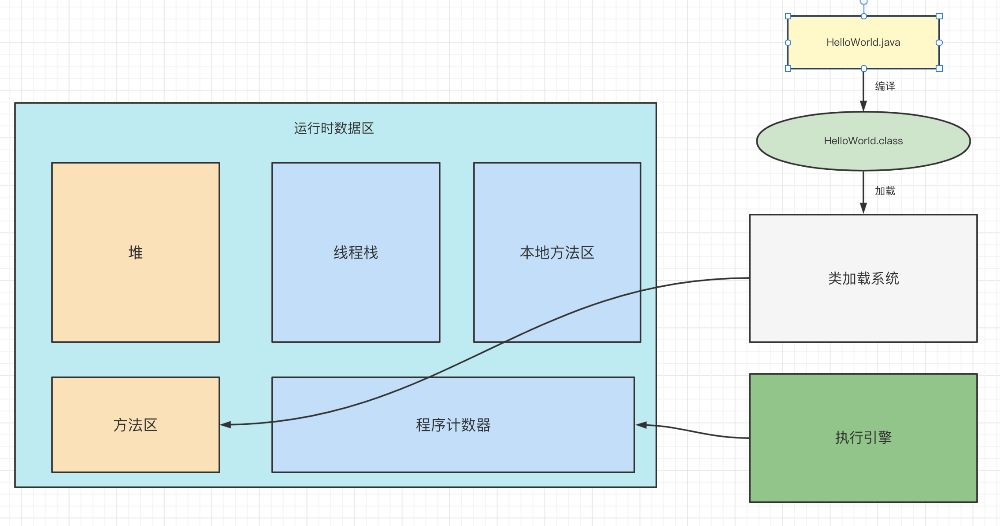

# 一、JVM介绍

## 1.JVM是什么

JVM是java程序实现跨平台的一个重要的工具（部件）。只要装有JVM的平台，都可以运行java程序。那么Java程序在JVM上是怎么被运行的？

通过介绍以下JVM的三个组成部分，就可以了解到JVM内部的工作机制

- 类加载系统：负责完成类的加载
- 运行时数据区：在运行Java程序的时候会产生的各种数据会保存在运行时数据区
- 执行引擎：执行具体的指令（代码）



## 2.学习的目的

我们学JVM相关知识的目的是为了充分理解jvm内部的工作流程，来掌握如何通过相应的参数配置，实现JVM的调优。

# 二、类加载系统

## 1.类的加载过程

一个类被加载进JVM中要经历哪几个过程

- 加载： 通过io流的方式把字节码文件读入到jvm中（方法区）
- 校验：通过校验字节码文件的头8位的16进制是否是java魔数cafebabe
- 准备：为类中的静态部分开辟空间并赋默认值
- 解析：加载该类中的其他所有类
- 初始化：为类中的静态部分赋指定值并执行静态代码块


## 2.类加载器

类是谁来负载加载的？——类加载器

- 启动（Bootstrap）类加载器：负载加载==核心类库中的类==
- 扩展类加载器：负载加载==ext目录内的类==
- 系统（应用）类加载器：负载加载==用户自己写的类==
- 自定义类加载器：自己定义的类加载器，可以==打破双亲委派机制==。


## 3.双亲委派机制

全盘委托机制：在加载这个类时需要加载Student和String，于是该类就会全盘委托给`系统类加载`来加载Student和String。

```java
public class TestJMM {
    //静态属性
    public static int baseData = 10;
    //静态属性
    public static Student student = new Student();
    
    public static String hello = "hello";
}
```

那么系统类加载器怎么加载Student和String呢？需要通过双亲委派机制


**双亲委派机制：**

当类加载进行加载类的时候，类的加载需要向上委托给上一级的类加载器，上一级继续向上委托，直到启动类加载器。启动类加载器去核心类库中找，如果没有该类则向下委派，由下一级扩展类加载器去扩展类库中，如果也没有继续向下委派，直到找不到为止，则报类找不到的异常。

**为什么要有双亲委派机制：**

- 防止核心类库中的类被随意篡改
- 防止类的重复加载（防止产生多份字节码文件）


# 作业

- 掌握分布式唯一主键的应用场景 - 动手尝试搭建服务端和客户端
- 掌握fastdfs的内部执行流程 - 动手尝试搭建服务端和客户端
- 掌握jvm相关知识
- 准备面试题（总结）