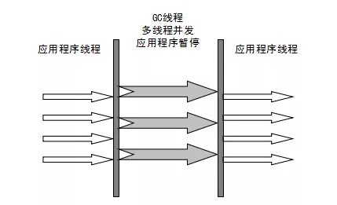
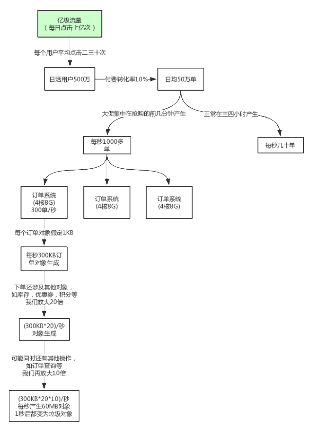

# JVM内存参数设置


Spring Boot程序的JVM参数设置格式(Tomcat启动直接加在bin目录下catalina.sh文件里)：

```
java -Xms2048M -Xmx2048M -Xmn1024M -Xss512K -XX:MetaspaceSize=256M -XX:MaxMetaspaceSize=256M -jar microservice-eureka-server.jar
```

-Xss：每个线程的栈大小

-Xms：设置堆的初始可用大小，默认物理内存的1/64 

-Xmx：设置堆的最大可用大小，默认物理内存的1/4

-Xmn：新生代大小

-XX:NewRatio：默认2表示新生代占年老代的1/2，占整个堆内存的1/3。

-XX:SurvivorRatio：默认8表示一个survivor区占用1/8的Eden内存，即1/10的新生代内存。

关于元空间的JVM参数有两个：-XX:MetaspaceSize=N和 -XX:MaxMetaspaceSize=N

**-XX：MaxMetaspaceSize**： 设置元空间最大值， 默认是-1， 即不限制， 或者说只受限于本地内存大小。

**-XX：MetaspaceSize**： 指定元空间触发Fullgc的初始阈值(元空间无固定初始大小)， 以字节为单位，默认是21M左右，达到该值就会触发full gc进行类型卸载， 同时收集器会对该值进行调整： 如果释放了大量的空间， 就适当降低该值； 如果释放了很少的空间， 那么在不超过-XX：MaxMetaspaceSize（如果设置了的话） 的情况下， 适当提高该值。这个跟早期jdk版本的**-XX:PermSize**参数意思不一样，-**XX:PermSize**代表永久代的初始容量。

由于调整元空间的大小需要Full GC，这是非常昂贵的操作，如果应用在启动的时候发生大量Full GC，通常都是由于永久代或元空间发生了大小调整，基于这种情况，一般建议在JVM参数中将MetaspaceSize和MaxMetaspaceSize设置成一样的值，并设置得比初始值要大，对于8G物理内存的机器来说，一般我会将这两个值都设置为256M。

**StackOverflowError**示例：

```
// JVM设置  -Xss128k(默认1M)
public class StackOverflowTest {
    
    static int count = 0;
    
    static void redo() {
        count++;
        redo();
    }

    public static void main(String[] args) {
        try {
            redo();
        } catch (Throwable t) {
            t.printStackTrace();
            System.out.println(count);
        }
    }
}

运行结果：
java.lang.StackOverflowError
	at com.tuling.jvm.StackOverflowTest.redo(StackOverflowTest.java:12)
	at com.tuling.jvm.StackOverflowTest.redo(StackOverflowTest.java:13)
	at com.tuling.jvm.StackOverflowTest.redo(StackOverflowTest.java:13)
   ......
```

**结论：**

-Xss设置越小count值越小，说明一个线程栈里能分配的栈帧就越少，但是对JVM整体来说能开启的线程数会更多


**JVM内存参数大小该如何设置？**

JVM参数大小设置并没有固定标准，需要根据实际项目情况分析，给大家举个例子

**日均百万级订单交易系统如何设置JVM参数**


**结论：****通过上面这些内容介绍，大家应该对JVM优化有些概念了，就是尽可能让对象都在新生代里分配和回收，尽量别让太多对象频繁进入老年代，避免频繁对老年代进行垃圾回收，同时给系统充足的内存大小，避免新生代频繁的进行垃圾回收。**


# 对象栈上分配 

我们通过JVM内存分配可以知道JAVA中的对象都是在堆上进行分配，当对象没有被引用的时候，需要依靠GC进行回收内 

存，如果对象数量较多的时候，会给GC带来较大压力，也间接影响了应用的性能。为了减少临时对象在堆内分配的数量，JVM通过**逃逸分析**确定该对象不会被外部访问。如果不会逃逸可以将该对象在**栈上分配**内存，这样该对象所占用的 

内存空间就可以随栈帧出栈而销毁，就减轻了垃圾回收的压力。 

**对象逃逸分析**：就是分析对象动态作用域，当一个对象在方法中被定义后，它可能被外部方法所引用，例如作为调用参 

数传递到其他地方中。 

```java
public User test1() { 

 User user = new User(); 

 user.setId(1); 

 user.setName("zhuge"); 

 //TODO 保存到数据库 

 return user; 

} 

public void test2() { 

 User user = new User(); 

 user.setId(1); 

 user.setName("zhuge"); 

//TODO 保存到数据库 
} 
```


很显然test1方法中的user对象被返回了，这个对象的作用域范围不确定，test2方法中的user对象我们可以确定当方法结 

束这个对象就可以认为是无效对象了，对于这样的对象我们其实可以将其分配在栈内存里，让其在方法结束时跟随栈内 

存一起被回收掉。 

JVM对于这种情况可以通过开启逃逸分析参数(-XX:+DoEscapeAnalysis)来优化对象内存分配位置，使其通过**标量替换**优 

先分配在栈上(**栈上分配**)，JDK7之后默认开启逃逸分析，如果要关闭使用参数(-XX:-DoEscapeAnalysis) 

**标量替换：**通过逃逸分析确定该对象不会被外部访问，并且对象可以被进一步分解时，**JVM不会创建该对象**，而是将该 

对象成员变量分解若干个被这个方法使用的成员变量所代替，这些代替的成员变量在栈帧或寄存器上分配空间，这样就 

不会因为没有一大块连续空间导致对象内存不够分配。开启标量替换参数(-XX:+EliminateAllocations)，JDK7之后默认 

开启。 

**标量与聚合量：**标量即不可被进一步分解的量，而JAVA的基本数据类型就是标量（如：int，long等基本数据类型以及 

reference类型等），标量的对立就是可以被进一步分解的量，而这种量称之为聚合量。而在JAVA中对象就是可以被进一 

步分解的聚合量。 

**栈上分配示例：** 

```java
/** 

 * 栈上分配，标量替换 

 * 代码调用了1亿次alloc()，如果是分配到堆上，大概需要1GB以上堆空间，如果堆空间小于该值，必然会触发GC。 

 * 

 * 使用如下参数不会发生GC 

 * ‐Xmx15m ‐Xms15m ‐XX:+DoEscapeAnalysis ‐XX:+PrintGC ‐XX:+EliminateAllocations 

 * 使用如下参数都会发生大量GC 

 * ‐Xmx15m ‐Xms15m ‐XX:‐DoEscapeAnalysis ‐XX:+PrintGC ‐XX:+EliminateAllocations 

 * ‐Xmx15m ‐Xms15m ‐XX:+DoEscapeAnalysis ‐XX:+PrintGC ‐XX:‐EliminateAllocations 

 */ 

public class AllotOnStack { 


 public static void main(String[] args) { 

  long start = System.currentTimeMillis(); 

  for (int i = 0; i < 100000000; i++) { 

   alloc(); 

  } 

  long end = System.currentTimeMillis(); 

  System.out.println(end ‐ start); 

} 

private static void alloc() { 

  User user = new User(); 

  user.setId(1); 

  user.setName("zhuge");26 } 
} 
```

**结论：****栈上分配依赖于逃逸分析和标量替换** 


# 常见引用类型 

java的引用类型一般分为四种：**强引用**、**软引用**、弱引用、虚引用 

**强引用**：普通的变量引用 

```java
public static User user = new User(); 
```

**软引用**：将对象用SoftReference软引用类型的对象包裹，正常情况不会被回收，但是GC做完后发现释放不出空间存放 

新的对象，则会把这些软引用的对象回收掉。**软引用可用来实现内存敏感的高速缓存。** 

```java
 public static SoftReference<User> user = new SoftReference<User>(new User()); 
```


软引用在实际中有重要的应用，例如浏览器的后退按钮。按后退时，这个后退时显示的网页内容是重新进行请求还是从 

缓存中取出呢？这就要看具体的实现策略了。 

（1）如果一个网页在浏览结束时就进行内容的回收，则按后退查看前面浏览过的页面时，需要重新构建 

（2）如果将浏览过的网页存储到内存中会造成内存的大量浪费，甚至会造成内存溢出 

**弱引用**：将对象用WeakReference软引用类型的对象包裹，弱引用跟没引用差不多，**GC会直接回收掉**，很少用 

```java
 public static WeakReference<User> user = new WeakReference<User>(new User()); 
```

**虚引用：**虚引用也称为幽灵引用或者幻影引用，它是最弱的一种引用关系，几乎不用


# **finalize()方法最终判定对象是否存活** 

即使在可达性分析算法中不可达的对象，也并非是“非死不可”的，这时候它们暂时处于“缓刑”阶段，要真正宣告一 

个对象死亡，至少要经历再次标记过程。 

**标记的前提是对象在进行可达性分析后发现没有与GC Roots相连接的引用链。** 

**1. 第一次标记并进行一次筛选。** 

筛选的条件是此对象是否有必要执行finalize()方法。 

当对象没有覆盖finalize方法，对象将直接被回收。 

**2. 第二次标记** 

如果这个对象覆盖了finalize方法，finalize方法是对象脱逃死亡命运的最后一次机会，如果对象要在finalize()中成功拯救 

自己，只要重新与引用链上的任何的一个对象建立关联即可，譬如把自己赋值给某个类变量或对象的成员变量，那在第 

二次标记时它将移除出“即将回收”的集合。如果对象这时候还没逃脱，那基本上它就真的被回收了。 

注意：一个对象的finalize()方法只会被执行一次，也就是说通过调用finalize方法自我救命的机会就一次。 

示例代码：

```java
public class OOMTest { 

  public static void main(String[] args) { 

   List<Object> list = new ArrayList<>(); 

   int i = 0; 

   int j = 0; 

   while (true) { 

   list.add(new User(i++, UUID.randomUUID().toString())); 

   new User(j‐‐, UUID.randomUUID().toString()); 

  } 
 } 
} 
```


# **如何判断一个类是无用的类** 

方法区主要回收的是无用的类，那么如何判断一个类是无用的类的呢？ 

类需要同时满足下面3个条件才能算是 **“无用的类”** ： 

该类所有的对象实例都已经被回收，也就是 Java 堆中不存在该类的任何实例。 

加载该类的 ClassLoader 已经被回收。 

该类对应的 java.lang.Class 对象没有在任何地方被引用，无法在任何地方通过反射访问该类的方法。


# **垃圾收集器**


**如果说收集算法是内存回收的方法论，那么垃圾收集器就是内存回收的具体实现。**

虽然我们对各个收集器进行比较，但并非为了挑选出一个最好的收集器。因为直到现在为止还没有最好的垃圾收集器出现，更加没有万能的垃圾收集器，**我们能做的就是根据具体应用场景选择适合自己的垃圾收集器**。试想一下：如果有一种四海之内、任何场景下都适用的完美收集器存在，那么我们的Java虚拟机就不会实现那么多不同的垃圾收集器了。

## Serial收集器(-XX:+UseSerialGC -XX:+UseSerialOldGC)

Serial（串行）收集器是最基本、历史最悠久的垃圾收集器了。大家看名字就知道这个收集器是一个单线程收集器了。它的 **“单线程”** 的意义不仅仅意味着它只会使用一条垃圾收集线程去完成垃圾收集工作，更重要的是它在进行垃圾收集工作的时候必须暂停其他所有的工作线程（ **"Stop The World"** ），直到它收集结束。

**新生代采用复制算法，老年代采用标记-整理算法。**


虚拟机的设计者们当然知道Stop The World带来的不良用户体验，所以在后续的垃圾收集器设计中停顿时间在不断缩短（仍然还有停顿，寻找最优秀的垃圾收集器的过程仍然在继续）。

但是Serial收集器有没有优于其他垃圾收集器的地方呢？当然有，它**简单而高效（与其他收集器的单线程相比）**。Serial收集器由于没有线程交互的开销，自然可以获得很高的单线程收集效率。

**Serial Old收集器是Serial收集器的老年代版本**，它同样是一个单线程收集器。它主要有两大用途：一种用途是在JDK1.5以及以前的版本中与Parallel Scavenge收集器搭配使用，**另一种用途是作为CMS收集器的后备方案**。

## Parallel Scavenge收集器(-XX:+UseParallelGC(年轻代),-XX:+UseParallelOldGC(老年代))

**Parallel**收集器其实**就是Serial收集器的多线程版本**，除了使用多线程进行垃圾收集外，其余行为（控制参数、收集算法、回收策略等等）和Serial收集器类似。默认的收集线程数跟cpu核数相同，当然也可以用参数(-XX:ParallelGCThreads)指定收集线程数，但是一般不推荐修改。

**Parallel Scavenge收集器关注点是吞吐量（高效率的利用CPU）。CMS等垃圾收集器的关注点更多的是用户线程的停顿时间（提高用户体验）。所谓吞吐量就是CPU中用于运行用户代码的时间与CPU总消耗时间的比值。** Parallel Scavenge收集器提供了很多参数供用户找到最合适的停顿时间或最大吞吐量，如果对于收集器运作不太了解的话，可以选择把内存管理优化交给虚拟机去完成也是一个不错的选择。

**新生代采用复制算法，老年代采用标记-整理算法。**


**Parallel Old收集器是Parallel Scavenge收集器的老年代版本**。使用多线程和“标记-整理”算法。在注重吞吐量以及CPU资源的场合，都可以优先考虑 Parallel Scavenge收集器和Parallel Old收集器(**JDK8默认的新生代和老年代收集器**)。

## ParNew收集器(-XX:+UseParNewGC)

ParNew收集器其实**跟Parallel收集器很类似**，区别主要在于它可以和CMS收集器配合使用。

**新生代采用复制算法，老年代采用标记-整理算法。**



它是许多运行在Server模式下的虚拟机的首要选择，除了Serial收集器外，只有它能与CMS收集器（真正意义上的并发收集器，后面会介绍到）配合工作。

## CMS收集器(-XX:+UseConcMarkSweepGC(old))

**CMS（Concurrent Mark Sweep）收集器是一种以获取最短回收停顿时间为目标的收集器。它非常符合在注重用户体验的应用上使用，它是HotSpot虚拟机第一款真正意义上的并发收集器，它第一次实现了让垃圾收集线程与用户线程（基本上）同时工作。**

从名字中的**Mark Sweep**这两个词可以看出，CMS收集器是一种 **“标记-清除”算法**实现的，它的运作过程相比于前面几种垃圾收集器来说更加复杂一些。整个过程分为四个步骤：

- **初始标记：** 暂停所有的其他线程(STW)，并记录下gc roots**直接能引用的对象**，**速度很快**。
- **并发标记：** 并发标记阶段就是从GC Roots的直接关联对象开始遍历整个对象图的过程， 这个过程耗时较长但是不需要停顿用户线程， 可以与垃圾收集线程一起并发运行。因为用户程序继续运行，可能会有导致已经标记过的对象状态发生改变。
- **重新标记：** 重新标记阶段就是为了修正并发标记期间因为用户程序继续运行而导致标记产生变动的那一部分对象的标记记录，**这个阶段的停顿时间一般会比初始标记阶段的时间稍长，远远比并发标记阶段时间短。主要用到三色标记里的****增量更新算法(见下面详解)做重新标记。**
- **并发清理：** 开启用户线程，同时GC线程开始对未标记的区域做清扫。这个阶段如果有新增对象会被标记为黑色不做任何处理(见下面三色标记算法详解)。
- **并发重置：**重置本次GC过程中的标记数据。


从它的名字就可以看出它是一款优秀的垃圾收集器，主要优点：**并发收集、低停顿**。但是它有下面几个明显的缺点：

- 对CPU资源敏感（会和服务抢资源）；
- 无法处理**浮动垃圾**(在并发标记和并发清理阶段又产生垃圾，这种浮动垃圾只能等到下一次gc再清理了)；
- 它使用的回收算法-**“标记-清除”算法**会导致收集结束时会有**大量空间碎片**产生，当然通过参数-XX:+UseCMSCompactAtFullCollection可以让jvm在执行完标记清除后再做整理
-   执行过程中的不确定性，会存在上一次垃圾回收还没执行完，然后垃圾回收又被触发的情况，**特别是在并发标记和并发清理阶段会出现**，一边回收，系统一边运行，也许没回收完就再次触发full gc，也就是"**concurrent mode failure**"，**此时会进入stop the world，用serial old垃圾收集器来回收**

**CMS的相关核心参数**

1. -XX:+UseConcMarkSweepGC：启用cms 
2. -XX:ConcGCThreads：并发的GC线程数
3. -XX:+UseCMSCompactAtFullCollection：FullGC之后做压缩整理（减少碎片）
4. -XX:CMSFullGCsBeforeCompaction：多少次FullGC之后压缩一次，默认是0，代表每次FullGC后都会压缩一次 
5. -XX:CMSInitiatingOccupancyFraction: 当老年代使用达到该比例时会触发FullGC（默认是92，这是百分比）
6. -XX:+UseCMSInitiatingOccupancyOnly：只使用设定的回收阈值(-XX:CMSInitiatingOccupancyFraction设定的值)，如果不指定，JVM仅在第一次使用设定值，后续则会自动调整
7. -XX:+CMSScavengeBeforeRemark：在CMS GC前启动一次minor gc，降低CMS GC标记阶段**(**也会对年轻代一起做标记，如果在minor gc就干掉了很多对垃圾对象，标记阶段就会减少一些标记时间**)**时的开销，一般CMS的GC耗时 80%都在标记阶段
8. -XX:+CMSParallellnitialMarkEnabled：表示在初始标记的时候多线程执行，缩短STW
9. -XX:+CMSParallelRemarkEnabled：在重新标记的时候多线程执行，缩短STW;

## 亿级流量电商系统如何优化JVM参数设置(ParNew+CMS)

大型电商系统后端现在一般都是拆分为多个子系统部署的，比如，商品系统，库存系统，订单系统，促销系统，会员系统等等。

我们这里以比较核心的订单系统为例 



对于8G内存，我们一般是分配4G内存给JVM，正常的JVM参数配置如下：

```
-Xms3072M -Xmx3072M -Xss1M -XX:MetaspaceSize=256M -XX:MaxMetaspaceSize=256M  -XX:SurvivorRatio=8
```

上节课说过，这样设置可能会由于**动态对象年龄判断原则**导致频繁full gc。

于是我们可以更新下JVM参数设置：

```
-Xms3072M -Xmx3072M -Xmn2048M -Xss1M -XX:MetaspaceSize=256M -XX:MaxMetaspaceSize=256M  -XX:SurvivorRatio=8 
```

 


这样就降低了因为对象动态年龄判断原则导致的对象频繁进入老年代的问题，其实**很多优化无非就是让短期存活的对象尽量都留在survivor里，不要进入老年代，这样在minor gc的时候这些对象都会被回收，不会进到老年代从而导致full gc**。

对于对象年龄应该为多少才移动到老年代比较合适，本例中一次minor gc要间隔二三十秒，大多数对象一般在几秒内就会变为垃圾，完全可以将默认的15岁改小一点，比如改为5，那么意味着对象要经过5次minor gc才会进入老年代，整个时间也有一两分钟了，如果对象这么长时间都没被回收，完全可以认为这些对象是会存活的比较长的对象，可以移动到老年代，而不是继续一直占用survivor区空间。

对于多大的对象直接进入老年代(参数-XX:PretenureSizeThreshold)，这个一般可以结合你自己系统看下有没有什么大对象生成，预估下大对象的大小，一般来说设置为1M就差不多了，很少有超过1M的大对象，这些对象一般就是你系统初始化分配的缓存对象，比如大的缓存List，Map之类的对象。

可以适当调整JVM参数如下：

```
-Xms3072M -Xmx3072M -Xmn2048M -Xss1M  -XX:MetaspaceSize=256M -XX:MaxMetaspaceSize=256M  -XX:SurvivorRatio=8 
-XX:MaxTenuringThreshold=5 -XX:PretenureSizeThreshold=1M 
```

对于JDK8默认的垃圾回收器是-XX:+UseParallelGC(年轻代)和-XX:+UseParallelOldGC(老年代)，如果内存较大(超过4个G，只是经验值)，系统对停顿时间比较敏感，我们可以使用**ParNew+CMS(**-XX:+UseParNewGC -XX:+UseConcMarkSweepGC**)**

对于老年代CMS的参数如何设置我们可以思考下，首先我们想下当前这个系统有哪些对象可能会长期存活躲过5次以上minor gc最终进入老年代。

无非就是那些Spring容器里的Bean，线程池对象，一些初始化缓存数据对象等，这些加起来充其量也就几十MB。

还有就是某次minor gc完了之后还有超过一两百M的对象存活，那么就会直接进入老年代，比如突然某一秒瞬间要处理五六百单，那么每秒生成的对象可能有一百多M，再加上整个系统可能压力剧增，一个订单要好几秒才能处理完，下一秒可能又有很多订单过来。

我们可以估算下大概每隔五六分钟出现一次这样的情况，那么大概半小时到一小时之间就可能因为老年代满了触发一次Full GC，Full GC的触发条件还有我们之前说过的**老年代空间分配担保机制**，历次的minor gc挪动到老年代的对象大小肯定是非常小的，所以几乎不会在minor gc触发之前由于老年代空间分配担保失败而产生full gc，其实在半小时后发生full gc，这时候已经过了抢购的最高峰期，后续可能几小时才做一次FullGC。

对于碎片整理，因为都是1小时或几小时才做一次FullGC，是可以每做完一次就开始碎片整理，或者两到三次之后再做一次也行。

综上，只要年轻代参数设置合理，老年代CMS的参数设置基本都可以用默认值，如下所示：

```
-Xms3072M -Xmx3072M -Xmn2048M -Xss1M  -XX:MetaspaceSize=256M -XX:MaxMetaspaceSize=256M  -XX:SurvivorRatio=8 
-XX:MaxTenuringThreshold=5 -XX:PretenureSizeThreshold=1M -XX:+UseParNewGC -XX:+UseConcMarkSweepGC 
-XX:CMSInitiatingOccupancyFraction=92 -XX:+UseCMSCompactAtFullCollection -XX:CMSFullGCsBeforeCompaction=3
```

