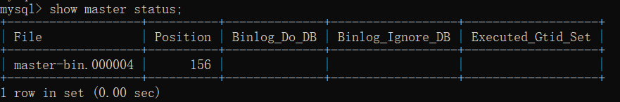
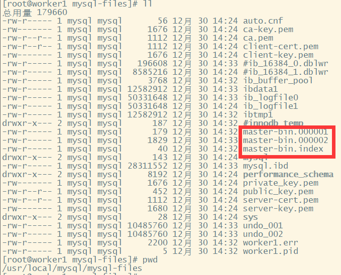
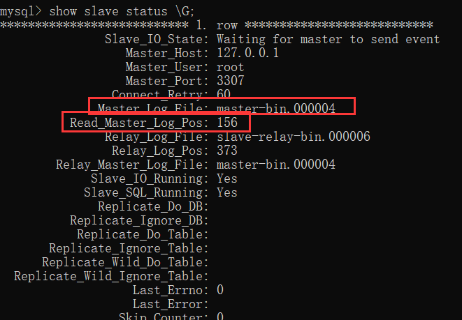
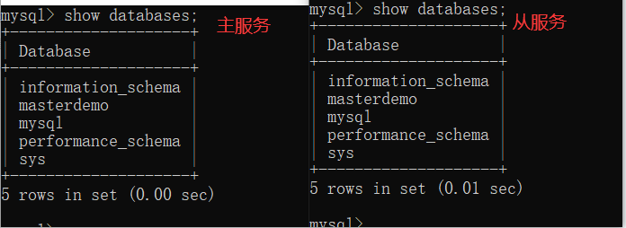
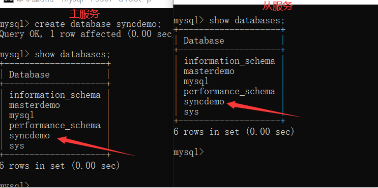
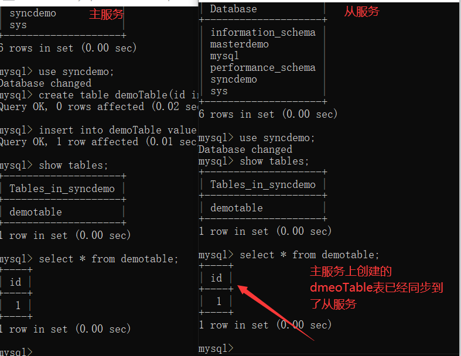
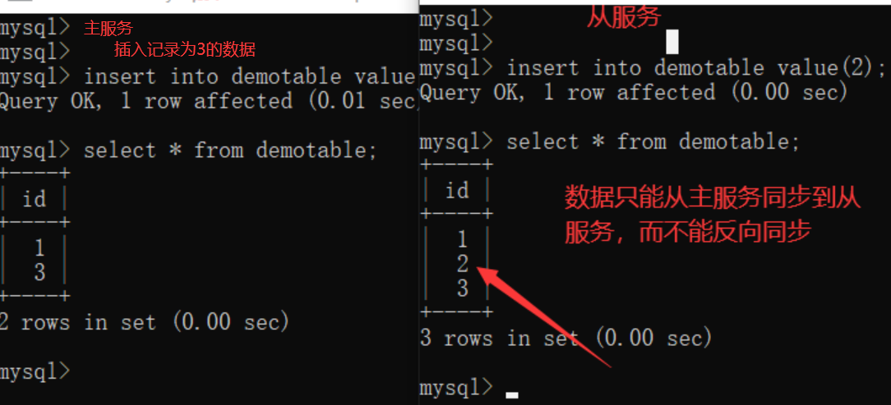

# 一、搭建MySQL主从集群

## 1、理论基础

主从架构有什么用？通过搭建MySQL主从集群，可以缓解MySQL的数据存储以及访问的压力。

1、数据安全

	给主服务增加一个数据备份。基于这个目的，可以搭建主从架构，或者也可以基于主从架构搭建互主的架构。

2、读写分离

	对于大部分的JAVA业务系统来说，都是读多写少的，读请求远远高于写请求。这时，当主服务的访问压力过大时，可以将数据读请求转为由从服务来分担，主服务只负责数据写入的请求，这样大大缓解数据库的访问压力。
	
	要理解，MySQL的主从架构只是实现读写分离的一个基础。实现读写分离还是需要一些中间件来支持，比如ShardingSphere。

3、故障转移-高可用

	当MySQL主服务宕机后，可以由一台从服务切换成为主服务，继续提供数据读写功能。
	
	对于高可用架构，主从数据的同步也只是实现故障转移的一个前提条件，要实现MySQL主从切换，还需要依靠一些其他的中间件来实现。比如MMM、MHA、MGR。
	
	在一般项目中，如果数据库的访问压力没有那么大，那读写分离不一定是必须要做的，但是，主从架构和高可用架构则是必须要搭建的。

## 2、同步的原理

	MySQL服务的主从架构一般都是通过binlog日志文件来进行的。即在主服务上打开binlog记录每一步的数据库操作，然后从服务上会有一个IO线程，负责跟主服务建立一个TCP连接，请求主服务将binlog传输过来。这时，主库上会有一个IO dump线程，负责通过这个TCP连接把Binlog日志传输给从库的IO线程。接着从服务的IO线程会把读取到的binlog日志数据写入自己的relay日志文件中。然后从服务上另外一个SQL线程会读取relay日志里的内容，进行操作重演，达到还原数据的目的。我们通常对MySQL做的读写分离配置就必须基于主从架构来搭建。


> MySQL的binlog不光可以用于主从同步，还可以用于缓存数据同步等场景。
>
> 例如Canal，可以模拟一个slave节点，向MySQL发起binlog同步，然后将数据落地到Redis、Kafka等其他组件，实现数据实时流转。

搭建主从集群时，有两个必要的要求：

- 双方MySQL必须版本一致。`至少需要主服务的版本低于从服务`
- 两节点间的时间需要同步。

## 3、搭建主从集群

### 3.1 配置master主服务器

	首先，配置主节点的mysql配置文件： /etc/my.cnf 这一步需要对master进行配置，主要是需要打开binlog日志，以及指定severId。我们打开MySQL主服务的my.cnf文件，在文件中一行server-id以及一个关闭域名解析的配置。然后重启服务。

```ini
[mysqld]
server-id=47
#开启binlog
log_bin=master-bin
log_bin-index=master-bin.index
skip-name-resolve
# 设置连接端口
port=3306
# 设置mysql的安装目录
basedir=/usr/local/mysql
# 设置mysql数据库的数据的存放目录
datadir=/usr/local/mysql/mysql-files
# 允许最大连接数
max_connections=200
# 允许连接失败的次数。
max_connect_errors=10
# 服务端使用的字符集默认为UTF8
character-set-server=utf8
# 创建新表时将使用的默认存储引擎
default-storage-engine=INNODB
# 默认使用“mysql_native_password”插件认证
#mysql_native_password
default_authentication_plugin=mysql_native_password
```

> 配置说明：主要需要修改的是以下几个属性：
>
> server-id：服务节点的唯一标识。需要给集群中的每个服务分配一个单独的ID。
>
> log_bin：打开Binlog日志记录，并指定文件名。
>
> log_bin-index：Binlog日志文件

	重启MySQL服务， `service mysqld restart`
	
	然后，我们需要给root用户分配一个replication slave的权限。

```shell
#登录主数据库
mysql -u root -p
GRANT REPLICATION SLAVE ON *.* TO 'root'@'%';
flush privileges;
#查看主节点同步状态：
show master status;
```


- docker-compose搭建

```yml
version: '3.1'
services:
  mysql:
    restart: always
    image: mysql:5.7.25
    container_name: mysql
    ports:
      - 3306:3306
    environment:
      TZ: Asia/Shanghai
      MYSQL_ROOT_PASSWORD: 123456
    command:
      --character-set-server=utf8mb4
      --collation-server=utf8mb4_general_ci
      --explicit_defaults_for_timestamp=true
      --lower_case_table_names=1
      --max_allowed_packet=128M
      --server-id=47
      --log_bin=master-bin
      --log_bin-index=master-bin.index
      --skip-name-resolve
      --sql-mode="STRICT_TRANS_TABLES,NO_AUTO_CREATE_USER,NO_ENGINE_SUBSTITUTION,NO_ZERO_DATE,NO_ZERO_IN_DATE,ERROR_FOR_DIVISION_BY_ZERO"
    volumes:
      - mysql-data:/var/lib/mysql

volumes:
  mysql-data:


```


> 在实际生产环境中，通常不会直接使用root用户，而会创建一个拥有全部权限的用户来负责主从同步。



	这个指令结果中的File和Position记录的是当前日志的binlog文件以及文件中的索引。
	
	而后面的Binlog_Do_DB和Binlog_Ignore_DB这两个字段是表示需要记录binlog文件的库以及不需要记录binlog文件的库。目前我们没有进行配置，就表示是针对全库记录日志。这两个字段如何进行配置，会在后面进行介绍。

> 开启binlog后，数据库中的所有操作都会被记录到datadir当中，以一组轮询文件的方式循环记录。而指令查到的File和Position就是当前日志的文件和位置。而在后面配置从服务时，就需要通过这个File和Position通知从服务从哪个地方开始记录binLog。
>
> 

### 	3.2 配置slave从服务

	下一步，我们来配置从服务mysqls。 我们打开mysqls的配置文件my.cnf，修改配置文件：

```ini
[mysqld]
#主库和从库需要不一致
server-id=48
#打开MySQL中继日志
relay-log-index=slave-relay-bin.index
relay-log=slave-relay-bin
#打开从服务二进制日志
log-bin=mysql-bin
#使得更新的数据写进二进制日志中
log-slave-updates=1
# 设置3306端口
port=3306
# 设置mysql的安装目录
basedir=/usr/local/mysql
# 设置mysql数据库的数据的存放目录
datadir=/usr/local/mysql/mysql-files
# 允许最大连接数
max_connections=200
# 允许连接失败的次数。
max_connect_errors=10
# 服务端使用的字符集默认为UTF8
character-set-server=utf8
# 创建新表时将使用的默认存储引擎
default-storage-engine=INNODB
# 默认使用“mysql_native_password”插件认证
#mysql_native_password
default_authentication_plugin=mysql_native_password
```

> 配置说明：主要需要关注的几个属性：
>
> server-id：服务节点的唯一标识
>
> relay-log：打开从服务的relay-log日志。
>
> log-bin：打开从服务的bin-log日志记录。

然后我们启动mysqls的服务，并设置他的主节点同步状态。

```shell
#登录从服务
mysql -u root -p;
#设置同步主节点：
CHANGE MASTER TO
MASTER_HOST='192.168.232.128',
MASTER_PORT=3306,
MASTER_USER='root',
MASTER_PASSWORD='root',
MASTER_LOG_FILE='master-bin.000004',
MASTER_LOG_POS=156;
#开启slave
start slave;
#查看主从同步状态
show slave status;
或者用 show slave status \G; 这样查看比较简洁
```

> 注意，CHANGE MASTER指令中需要指定的MASTER_LOG_FILE和MASTER_LOG_POS必须与主服务中查到的保持一致。
>
> 并且后续如果要检查主从架构是否成功，也可以通过检查主服务与从服务之间的File和Position这两个属性是否一致来确定。



	我们重点关注其中红色方框的两个属性，与主节点保持一致，就表示这个主从同步搭建是成功的。

> 从这个指令的结果能够看到，有很多Replicate_开头的属性，这些属性指定了两个服务之间要同步哪些数据库、哪些表的配置。只是在我们这个示例中全都没有进行配置，就标识是全库进行同步。后面我们会补充如何配置需要同步的库和表。

- docker-compose.yml

```yml
version: '3.1'
services:
  mysql:
    restart: always
    image: mysql:5.7.25
    container_name: mysql
    ports:
      - 3306:3306
    environment:
      TZ: Asia/Shanghai
      MYSQL_ROOT_PASSWORD: 123456
    command:
      --character-set-server=utf8mb4
      --collation-server=utf8mb4_general_ci
      --explicit_defaults_for_timestamp=true
      --lower_case_table_names=1
      --max_allowed_packet=128M
      --server-id=48
      --relay-log-index=slave-relay-bin.index
      --relay-log=slave-relay-bin
      --log-bin=mysql-bin
      --log-slave-updates=1
      --sql-mode="STRICT_TRANS_TABLES,NO_AUTO_CREATE_USER,NO_ENGINE_SUBSTITUTION,NO_ZERO_DATE,NO_ZERO_IN_DATE,ERROR_FOR_DIVISION_BY_ZERO"
    volumes:
      - mysql-data:/var/lib/mysql

volumes:
  mysql-data:

```


### 3.3 主从集群测试

	测试时，我们先用showdatabases，查看下两个MySQL服务中的数据库情况



		然后我们在主服务器上创建一个数据库

```sql
mysql> create database syncdemo;
Query OK, 1 row affected (0.00 sec)
```

	然后我们再用show databases，来看下这个syncdemo的数据库是不是已经同步到了从服务。



	接下来我们继续在syncdemo这个数据库中创建一个表，并插入一条数据。

```sql
mysql> use syncdemo;
Database changed
mysql> create table demoTable(id int not null);
Query OK, 0 rows affected (0.02 sec)

mysql> insert into demoTable value(1);
Query OK, 1 row affected (0.01 sec)
```

	然后我们也同样到主服务与从服务上都来查一下这个demoTable是否同步到了从服务。



从上面的实验过程看到，我们在主服务中进行的数据操作，就都已经同步到了从服务上。这样，我们一个主从集群就搭建完成了。

> 另外，这个主从架构是有可能失败的，如果在slave从服务上查看slave状态，发现Slave_SQL_Running=no，就表示主从同步失败了。这有可能是因为在从数据库上进行了写操作，与同步过来的SQL操作冲突了，也有可能是slave从服务重启后有事务回滚了。
>
> 如果是因为slave从服务事务回滚的原因，可以按照以下方式重启主从同步：
>
> ```sql
> mysql> stop slave ;
> mysql> set GLOBAL SQL_SLAVE_SKIP_COUNTER=1;
> mysql> start slave ;
> ```
>
> 而另一种解决方式就是重新记录主节点的binlog文件消息
>
> ```sql
> mysql> stop slave ;
> mysql> change master to .....
> mysql> start slave ;
> ```
>
> 但是这种方式要注意binlog的文件和位置，如果修改后和之前的同步接不上，那就会丢失部分数据。所以不太常用。

### 3.4 集群搭建扩展：

在完成这个基本的MySQL主从集群后，我们还可以进行后续的实验：

**1、全库同步与部分同步**

	之前提到，我们目前配置的主从同步是针对全库配置的，而实际环境中，一般并不需要针对全库做备份，而只需要对一些特别重要的库或者表来进行同步。那如何针对库和表做同步配置呢？

首先在Master端：在my.cnf中，可以通过以下这些属性指定需要针对哪些库或者哪些表记录binlog

```ini
#需要同步的二进制数据库名
binlog-do-db=masterdemo
#只保留7天的二进制日志，以防磁盘被日志占满(可选)
expire-logs-days  = 7
#不备份的数据库
binlog-ignore-db=information_schema
binlog-ignore-db=performation_schema
binlog-ignore-db=sys
```

然后在Slave端：在my.cnf中，需要配置备份库与主服务的库的对应关系。

```ini
#如果salve库名称与master库名相同，使用本配置
replicate-do-db = masterdemo 
#如果master库名[mastdemo]与salve库名[mastdemo01]不同，使用以下配置[需要做映射]
replicate-rewrite-db = masterdemo -> masterdemo01
#如果不是要全部同步[默认全部同步]，则指定需要同步的表
replicate-wild-do-table=masterdemo01.t_dict
replicate-wild-do-table=masterdemo01.t_num
```

配置完成了之后，在show master status指令中，就可以看到Binlog_Do_DB和Binlog_Ignore_DB两个参数的作用了。

	**2、读写分离配置**
	
	我们要注意，目前我们的这个MySQL主从集群是单向的，也就是只能从主服务同步到从服务，而从服务的数据表更是无法同步到主服务的。



	所以，在这种架构下，为了保证数据一致，通常会需要保证数据只在主服务上写，而从服务只进行数据读取。这个功能，就是大名鼎鼎的读写分离。但是这里要注意下，mysql主从本身是无法提供读写分离的服务的，需要由业务自己来实现。这也是我们后面要学的ShardingSphere的一个重要功能。

> 到这里可以看到，在MySQL主从架构中，是需要严格限制从服务的数据写入的，一旦从服务有数据写入，就会造成数据不一致。并且从服务在执行事务期间还很容易造成数据同步失败。
>
> 如果需要限制用户写数据，我们可以在从服务中将read_only参数的值设为1( `set` `global read_only=1;` )。这样就可以限制用户写入数据。但是这个属性有两个需要注意的地方：
>
> 1、read_only=1设置的只读模式，不会影响slave同步复制的功能。 所以在MySQL slave库中设定了read_only=1后，通过 "show slave status\G" 命令查看salve状态，可以看到salve仍然会读取master上的日志，并且在slave库中应用日志，保证主从数据库同步一致； 
>
> 2、read_only=1设置的只读模式， 限定的是普通用户进行数据修改的操作，但不会限定具有super权限的用户的数据修改操作。 在MySQL中设置read_only=1后，普通的应用用户进行insert、update、delete等会产生数据变化的DML操作时，都会报出数据库处于只读模式不能发生数据变化的错误，但具有super权限的用户，例如在本地或远程通过root用户登录到数据库，还是可以进行数据变化的DML操作； 如果需要限定super权限的用户写数据，可以设置super_read_only=0。另外 **如果要想连super权限用户的写操作也禁止，就使用"flush tables with read lock;"，这样设置也会阻止主从同步复制！** 


# 二、MySQL和Redis之间数据同步

## 1.实现逻辑

通过canal解析binlog，canal主要模拟了mysql的Slave向Master发送请求，当mysql有增删改查时则会出发请求将数据发送到canal服务中，canal将数据存放到内存，直到客户端程序(canal服务端和客户端程序都是由java编写,且客户端逻辑由我们借助com.alibaba.otter.canal工具包下的类完成开发)通过发布-订阅这种模式消费canal服务中的数据。


## 2.docker-compose

```yml
version: '3.1'
services:
  mysql:
    restart: always
    image: mysql:5.7.25
    container_name: mysql
    ports:
      - 3306:3306
    environment:
      TZ: Asia/Shanghai
      MYSQL_ROOT_PASSWORD: 123456
    command:
      --character-set-server=utf8mb4
      --collation-server=utf8mb4_general_ci
      --explicit_defaults_for_timestamp=true
      --lower_case_table_names=1
      --max_allowed_packet=128M
      --server-id=49
      --log_bin=master-bin
      --log_bin-index=master-bin.index
      --binlog-do-db=db_canal
      --skip-grant-tables
      --sql-mode="STRICT_TRANS_TABLES,NO_AUTO_CREATE_USER,NO_ENGINE_SUBSTITUTION,NO_ZERO_DATE,NO_ZERO_IN_DATE,ERROR_FOR_DIVISION_BY_ZERO"
    volumes:
      - mysql-data:/var/lib/mysql

volumes:
  mysql-data:

```


## 3.进入mysql中执行如下命令

```sql
flush privileges;

CREATE USER canal IDENTIFIED BY 'canal';

GRANT SELECT, REPLICATION SLAVE, REPLICATION CLIENT ON *.* TO 'canal'@'%';

flush privileges;
```


## 4.下载canal

官网下载：https://github.com/alibaba/canal/releases?after=canal-1.0.25

下载v1.0.19版本


## 5.修改配置文件

- 修改conf/example/instance.properties

```json
canal.instance.master.address = 172.16.253.26:3306
```

- 修改conf/canal.properties

```json
canal.register.ip = 127.0.0.1
```


## 6.启动cannal服务端

运行命令./bin/startup.sh


## 7.编写cannal-Java客户端程序

监听mysql的binlog，当有数据发生变化时更新redis

- 依赖

```xml
 <dependencies>
    <dependency>
      <groupId>com.alibaba.otter</groupId>
      <artifactId>canal.client</artifactId>
      <version>1.0.12</version>
    </dependency>
    <dependency>
      <groupId>redis.clients</groupId>
      <artifactId>jedis</artifactId>
      <version>2.4.2</version>
    </dependency>

  </dependencies>
```

- java程序

```java
package com.qf.canal;

import java.net.InetSocketAddress;
import java.util.List;

import com.alibaba.fastjson.JSONObject;
import com.alibaba.otter.canal.client.CanalConnector;
import com.alibaba.otter.canal.client.CanalConnectors;
import com.alibaba.otter.canal.protocol.Message;
import com.alibaba.otter.canal.protocol.CanalEntry.Column;
import com.alibaba.otter.canal.protocol.CanalEntry.Entry;
import com.alibaba.otter.canal.protocol.CanalEntry.EntryType;
import com.alibaba.otter.canal.protocol.CanalEntry.EventType;
import com.alibaba.otter.canal.protocol.CanalEntry.RowChange;
import com.alibaba.otter.canal.protocol.CanalEntry.RowData;


public class ClientSample {

  public static void main(String args[]) {

    // 创建链接，hostname位canal服务器ip port位canal服务器端口，username，password可不填
    CanalConnector connector = CanalConnectors.newSingleConnector(new InetSocketAddress("127.0.0.1",
      11111), "example", "", "");
    int batchSize = 1000;
    try {
      connector.connect();
      connector.subscribe(".*\\..*");
      connector.rollback();
      while (true) {
        Message message = connector.getWithoutAck(batchSize); // 获取指定数量的数据
        long batchId = message.getId();
        int size = message.getEntries().size();
        if (batchId == -1 || size == 0) {
          try {
            Thread.sleep(1000);
          } catch (InterruptedException e) {
            e.printStackTrace();
          }
        } else {
          printEntry(message.getEntries());
        }

        connector.ack(batchId); // 提交确认
        // connector.rollback(batchId); // 处理失败, 回滚数据
      }

    } finally {
      connector.disconnect();
    }
  }

  private static void printEntry(List<Entry> entrys) {
    for (Entry entry : entrys) {
      if (entry.getEntryType() == EntryType.TRANSACTIONBEGIN || entry.getEntryType() == EntryType.TRANSACTIONEND) {
        continue;
      }

      RowChange rowChage = null;
      try {
        rowChage = RowChange.parseFrom(entry.getStoreValue());
      } catch (Exception e) {
        throw new RuntimeException("ERROR ## parser of eromanga-event has an error , data:" + entry.toString(),
          e);
      }

      EventType eventType = rowChage.getEventType();
      System.out.println(String.format("================> binlog[%s:%s] , name[%s,%s] , eventType : %s",
        entry.getHeader().getLogfileName(), entry.getHeader().getLogfileOffset(),
        entry.getHeader().getSchemaName(), entry.getHeader().getTableName(),
        eventType));

      for (RowData rowData : rowChage.getRowDatasList()) {
        if (eventType == EventType.DELETE) {
          redisDelete(rowData.getBeforeColumnsList());
        } else if (eventType == EventType.INSERT) {
          redisInsert(rowData.getAfterColumnsList());
        } else {
          System.out.println("-------> before");
          printColumn(rowData.getBeforeColumnsList());
          System.out.println("-------> after");
          redisUpdate(rowData.getAfterColumnsList());
          printColumn(rowData.getAfterColumnsList());
        }
      }
    }
  }

  /**
   * 打印变化的数据
   *
   * @param columns
   */
  private static void printColumn(List<Column> columns) {
    for (Column column : columns) {
      System.out.println(column.getName() + " : " + column.getValue() + "    update=" + column.getUpdated());
    }
  }

  /**
   * 数据插入同步redis
   *
   * @param columns
   */
  private static void redisInsert(List<Column> columns) {
    JSONObject json = new JSONObject();
    for (Column column : columns) {
      json.put(column.getName(), column.getValue());
    }
    if (columns.size() > 0) {
      RedisUtil.stringSet("user:" + columns.get(0).getValue(), json.toJSONString());
    }
  }

  /**
   * 更新同步redis
   *
   * @param columns
   */
  private static void redisUpdate(List<Column> columns) {
    JSONObject json = new JSONObject();
    for (Column column : columns) {
      json.put(column.getName(), column.getValue());
    }
    if (columns.size() > 0) {
      RedisUtil.stringSet("user:" + columns.get(0).getValue(), json.toJSONString());
    }
  }

  /**
   * 数据删除同步redis
   *
   * @param columns
   */
  private static void redisDelete(List<Column> columns) {
    JSONObject json = new JSONObject();
    for (Column column : columns) {
      json.put(column.getName(), column.getValue());
    }
    if (columns.size() > 0) {
      RedisUtil.delKey("user:" + columns.get(0).getValue());
    }
  }

}

```


- RedisUtil

```java
package com.qf.canal;

import redis.clients.jedis.Jedis;
import redis.clients.jedis.JedisPool;
import redis.clients.jedis.JedisPoolConfig;


public class RedisUtil {

  // Redis服务器IP
  private static String ADDR = "172.16.253.15";

  // Redis的端口号
  private static int PORT = 6379;

  // 访问密码
  private static String AUTH = "java2101";

  // 可用连接实例的最大数目，默认值为8；
  // 如果赋值为-1，则表示不限制；如果pool已经分配了maxActive个jedis实例，则此时pool的状态为exhausted(耗尽)。
  private static int MAX_ACTIVE = 1024;

  // 控制一个pool最多有多少个状态为idle(空闲的)的jedis实例，默认值也是8。
  private static int MAX_IDLE = 200;

  // 等待可用连接的最大时间，单位毫秒，默认值为-1，表示永不超时。如果超过等待时间，则直接抛出JedisConnectionException；
  private static int MAX_WAIT = 10000;

  // 过期时间
  protected static int expireTime = 660 * 660 * 24;

  // 连接池
  protected static JedisPool pool;

  /**
   * 静态代码，只在初次调用一次
   */
  static {
    JedisPoolConfig config = new JedisPoolConfig();
    //最大连接数
    config.setMaxTotal(MAX_ACTIVE);
    //最多空闲实例
    config.setMaxIdle(MAX_IDLE);
    //超时时间
    config.setMaxWaitMillis(MAX_WAIT);
    //
    config.setTestOnBorrow(false);
    pool = new JedisPool(config, ADDR, PORT, 1000,AUTH);
  }

  /**
   * 获取jedis实例
   */
  protected static synchronized Jedis getJedis() {
    Jedis jedis = null;
    try {
      jedis = pool.getResource();
    } catch (Exception e) {
      e.printStackTrace();
      if (jedis != null) {
        pool.returnBrokenResource(jedis);
      }
    }
    return jedis;
  }

  /**
   * 释放jedis资源
   *
   * @param jedis
   * @param isBroken
   */
  protected static void closeResource(Jedis jedis, boolean isBroken) {
    try {
      if (isBroken) {
        pool.returnBrokenResource(jedis);
      } else {
        pool.returnResource(jedis);
      }
    } catch (Exception e) {

    }
  }

  /**
   * 是否存在key
   *
   * @param key
   */
  public static boolean existKey(String key) {
    Jedis jedis = null;
    boolean isBroken = false;
    try {
      jedis = getJedis();
      jedis.select(0);
      return jedis.exists(key);
    } catch (Exception e) {
      isBroken = true;
    } finally {
      closeResource(jedis, isBroken);
    }
    return false;
  }

  /**
   * 删除key
   *
   * @param key
   */
  public static void delKey(String key) {
    Jedis jedis = null;
    boolean isBroken = false;
    try {
      jedis = getJedis();
      jedis.select(0);
      jedis.del(key);
    } catch (Exception e) {
      isBroken = true;
    } finally {
      closeResource(jedis, isBroken);
    }
  }

  /**
   * 取得key的值
   *
   * @param key
   */
  public static String stringGet(String key) {
    Jedis jedis = null;
    boolean isBroken = false;
    String lastVal = null;
    try {
      jedis = getJedis();
      jedis.select(0);
      lastVal = jedis.get(key);
      jedis.expire(key, expireTime);
    } catch (Exception e) {
      isBroken = true;
    } finally {
      closeResource(jedis, isBroken);
    }
    return lastVal;
  }

  /**
   * 添加string数据
   *
   * @param key
   * @param value
   */
  public static String stringSet(String key, String value) {
    Jedis jedis = null;
    boolean isBroken = false;
    String lastVal = null;
    try {
      jedis = getJedis();
      jedis.select(0);
      lastVal = jedis.set(key, value);
      jedis.expire(key, expireTime);
    } catch (Exception e) {
      e.printStackTrace();
      isBroken = true;
    } finally {
      closeResource(jedis, isBroken);
    }
    return lastVal;
  }

  /**
   * 添加hash数据
   *
   * @param key
   * @param field
   * @param value
   */
  public static void hashSet(String key, String field, String value) {
    boolean isBroken = false;
    Jedis jedis = null;
    try {
      jedis = getJedis();
      if (jedis != null) {
        jedis.select(0);
        jedis.hset(key, field, value);
        jedis.expire(key, expireTime);
      }
    } catch (Exception e) {
      isBroken = true;
    } finally {
      closeResource(jedis, isBroken);
    }
  }
}

```

