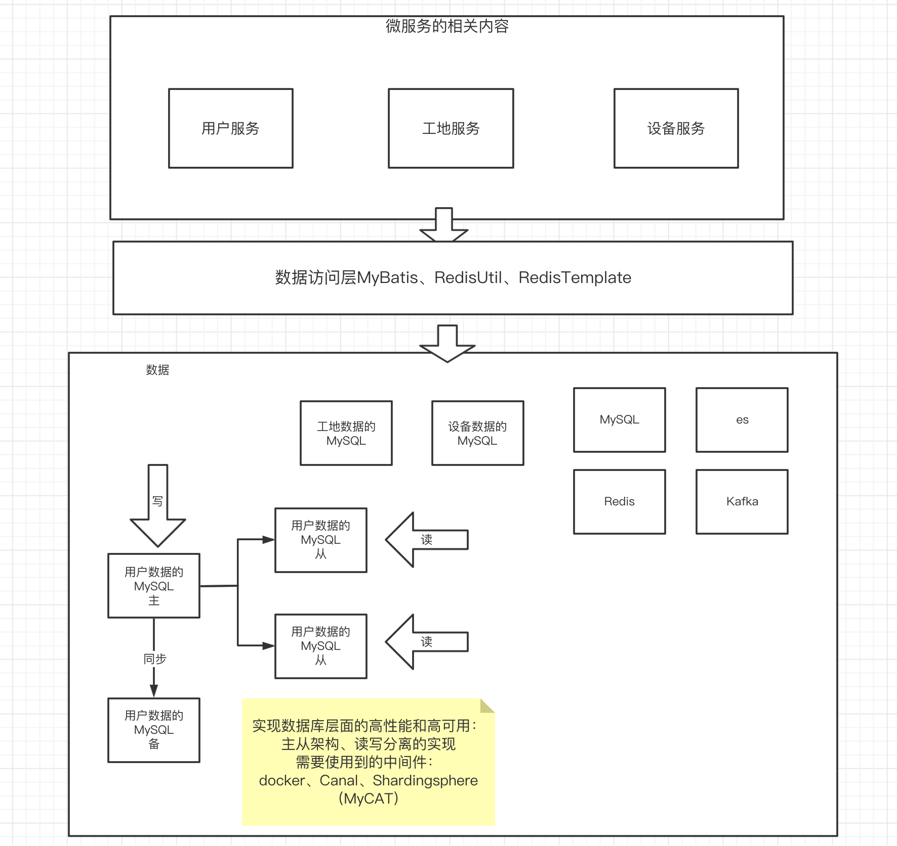
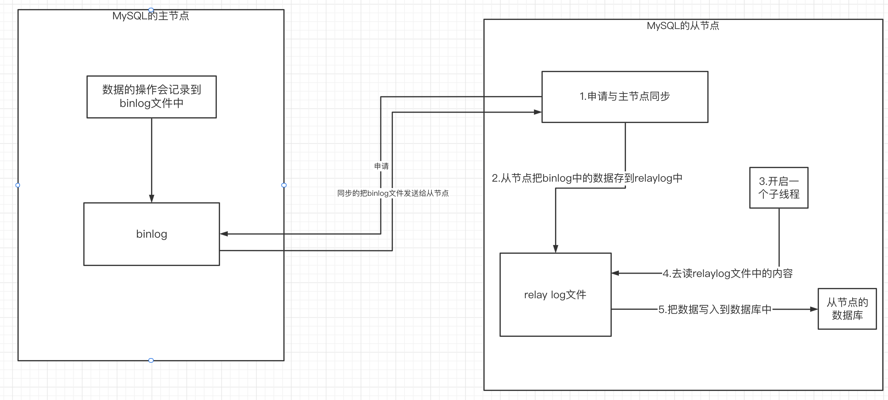
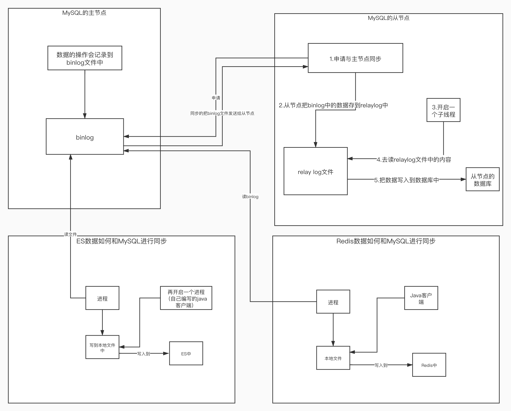
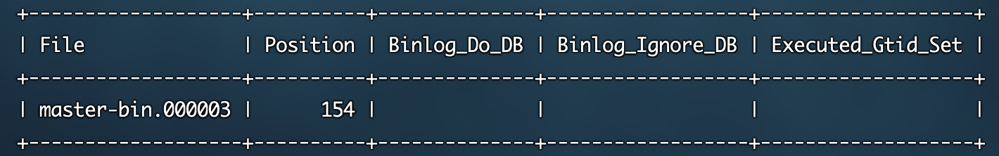
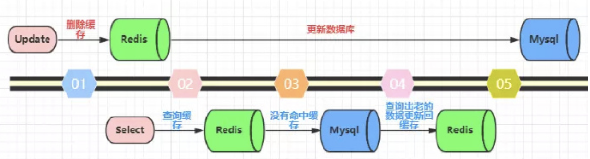
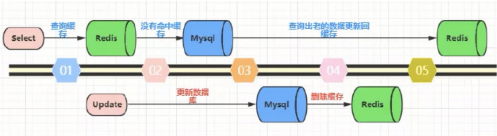
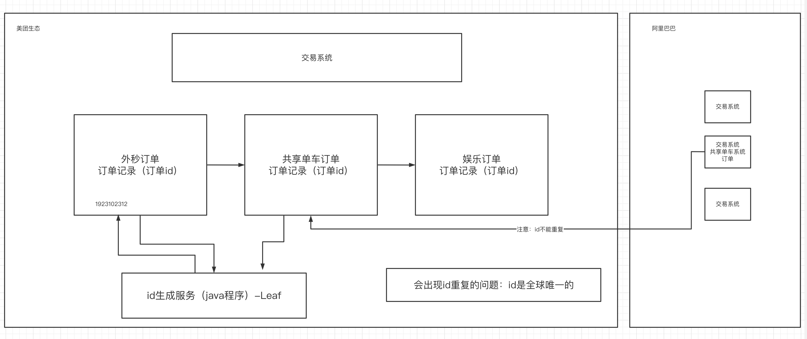
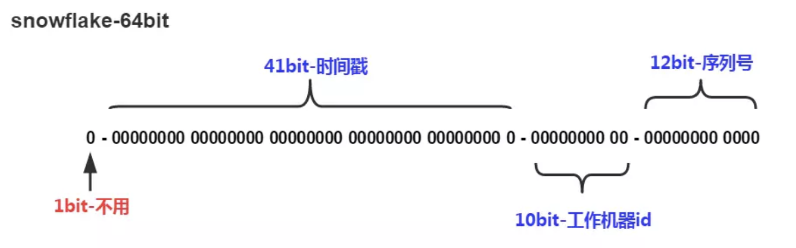
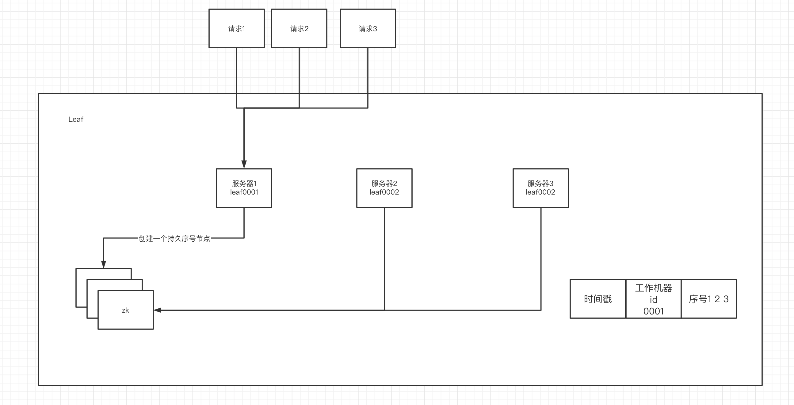

# 一、MYSQL主从的应用背景

为什么学这一块知识



# 二、MySQL主从同步的实现

## 1.MySQL主从同步原理



- 从节点申请与主节点同步
- 主节点把binlog文件发送给从节点
- 从节点拿到文件后写入到本地的relaylog文件中
- 从节点开启另一条子线程，负责把relaylog文件中的内容写入到数据库中


## 2.MySQL主从同步的应用场景



## 3.搭建MySQL主服务器

### 1）通过docker-compose进行搭建

```yml
version: '3.1'
services:
  mysql:
    restart: always
    image: mysql:5.7.25
    container_name: mysql
    ports:
      - 3306:3306
    environment:
      TZ: Asia/Shanghai
      MYSQL_ROOT_PASSWORD: 123456
    command:
      --character-set-server=utf8mb4
      --collation-server=utf8mb4_general_ci
      --explicit_defaults_for_timestamp=true
      --lower_case_table_names=1
      --max_allowed_packet=128M
      --server-id=47
      --log_bin=master-bin
      --log_bin-index=master-bin.index
      --skip-name-resolve
      --sql-mode="STRICT_TRANS_TABLES,NO_AUTO_CREATE_USER,NO_ENGINE_SUBSTITUTION,NO_ZERO_DATE,NO_ZERO_IN_DATE,ERROR_FOR_DIVISION_BY_ZERO"
    volumes:
      - mysql-data:/var/lib/mysql

volumes:
  mysql-data:
```

里面加入了这几个关键配置

```yml
      --server-id=47 # 当前节点的id，在mysql集群中需要id唯一
      --log_bin=master-bin # 开启binlog
      --log_bin-index=master-bin.index # binlog文件的名称
      --skip-name-resolve # 跳过权限检查
```

### 2）通过命令查看主节点的信息

```sql
show master status;
```



看到两个关键的信息：

- binlog文件的名称
- 当前进行同步数据的偏移量


## 4.搭建MySQL从服务器

### 1）通过docker-compose进行搭建

```yml
version: '3.1'
services:
  mysql:
    restart: always
    image: mysql:5.7.25
    container_name: mysql
    ports:
      - 3306:3306
    environment:
      TZ: Asia/Shanghai
      MYSQL_ROOT_PASSWORD: 123456
    command:
      --character-set-server=utf8mb4
      --collation-server=utf8mb4_general_ci
      --explicit_defaults_for_timestamp=true
      --lower_case_table_names=1
      --max_allowed_packet=128M
      --server-id=48
      --relay-log-index=slave-relay-bin.index
      --relay-log=slave-relay-bin
      --log-bin=mysql-bin
      --log-slave-updates=1
      --sql-mode="STRICT_TRANS_TABLES,NO_AUTO_CREATE_USER,NO_ENGINE_SUBSTITUTION,NO_ZERO_DATE,NO_ZERO_IN_DATE,ERROR_FOR_DIVISION_BY_ZERO"
    volumes:
      - mysql-data:/var/lib/mysql

volumes:
  mysql-data:


```

加入了如下关键的信息

```yml
			--server-id=48 # 
      --relay-log-index=slave-relay-bin.index #开启relay日志
      --relay-log=slave-relay-bin # 开启relay日志
      --log-bin=mysql-bin # 开启binlog
      --log-slave-updates=1 # 主从同步的数量 目前从节点是1个
```

### 2)进入从节点中的容器中并进入到mysql中

```sql
docker exec -it 容器id bash;
mysql -uroot -p
```

### 3）设置同步的主节点的信息

```sql
#设置同步主节点：
CHANGE MASTER TO
MASTER_HOST='172.16.253.41',
MASTER_PORT=3306,
MASTER_USER='root',
MASTER_PASSWORD='123456',
MASTER_LOG_FILE='master-bin.000003', 
MASTER_LOG_POS=154;
```

关键是设置binlog文件的名称和同步的偏移量，从之前的主节点的信息中查看得知（2-3-2章节的内容）

### 4）在从节点中开启主从同步

```sql
start slave;
```

###  5）在从节点中查看主从同步的信息

```sql
show slave status \G;
```


关键是两个yes

### 6）测试主从同步的效果

- 主节点添加数据
- 从节点同步到数据


### 7）关于读写分离的说明

问：从节点能添加数据吗？

可以，但是违背了我们的主负责写，从负责读的逻辑。因为主从同步是单向的，从写的数据不能同步给主。

如果从节点一定要实现只读，那么有两种方案：

- `set` `global read_only=1;` 这种方案只能约束普通用户只读，但是约束不了root用户
- `flush tables with read lock;` 这种方案可以约束root用户，但是不能主从同步。

这两种方案都不会去选择，如果一定要实现读写分离，可以通过中间件shardingshpere来实现。


# 三、MySQL和Redis之间的数据同步策略

## 1.为什么要研究MySQL和Redis之间的数据同步策略


当MySQL中的数据更新了，但是redis还没及时的更新，那么就该采用一种策略：

下面来介绍这种策略


## 2.多种策略的比较

- 先更新数据库，后更新缓存

这种情况会造成脏读


- 先删除缓存，后更新数据库

在并发严重的情况下，也会出现脏读



- 先更新数据库，后删除缓存（采用的方案）



这种方案在如上图情况下会出现脏读，但是上图的情况，读的操作比写的慢，是比较少出现的，因此这种方案是普通采用的方案，如果真的出现了读的操作比写的慢，会出现脏读，可以给缓存加一个到期时间。

# 四、MySQL和Redis之间数据同步的实现

## 1.使用中间件Canal来实现数据同步

Canal是一个伪装成MySQL Slave，实现获取Master上的binlog文件数据。实现自己的功能。


## 2.搭建Canal的服务端

- 下载Canal的官方部署压缩包：https://github.com/alibaba/canal/releases/tag/canal-1.0.19
- 解压缩
- 编辑配置

```shell
# 修改 Mysql Master主节点的ip
example/instance.properties=>canal.instance.master.address = 172.16.253.46:3306 
# 修改canal服务端的ip
canal.properties=>canal.ip=127.0.0.1
```

- 启动服务

```shell
bin/startup.sh
```


## 3.搭建Canal客户端实现redis和mysql的数据同步

- 搭建一个MySQL主节点：

```yml
version: '3.1'
services:
  mysql:
    restart: always
    image: mysql:5.7.25
    container_name: mysql
    ports:
      - 3306:3306
    environment:
      TZ: Asia/Shanghai
      MYSQL_ROOT_PASSWORD: 123456
    command:
      --character-set-server=utf8mb4
      --collation-server=utf8mb4_general_ci
      --explicit_defaults_for_timestamp=true
      --lower_case_table_names=1
      --max_allowed_packet=128M
      --server-id=49
      --log_bin=master-bin
      --log_bin-index=master-bin.index
      --binlog-do-db=db_canal
      --skip-grant-tables
      --sql-mode="STRICT_TRANS_TABLES,NO_AUTO_CREATE_USER,NO_ENGINE_SUBSTITUTION,NO_ZERO_DATE,NO_ZERO_IN_DATE,ERROR_FOR_DIVISION_BY_ZERO"
    volumes:
      - mysql-data:/var/lib/mysql

volumes:
  mysql-data:
```

- 进入到数据库中，为canal账号设置访问权限,下面的命令在mysql中执行，逐一执行

```shell
mysql>flush privileges;

mysql>CREATE USER canal IDENTIFIED BY 'canal';

mysql>GRANT SELECT, REPLICATION SLAVE, REPLICATION CLIENT ON *.* TO 'canal'@'%';

mysql>flush privileges;
```


- 编写项目

  - canal客户端程序

  ```java
  package com.qf.canal;
  
  import java.net.InetSocketAddress;
  import java.util.List;
  
  import com.alibaba.fastjson.JSONObject;
  import com.alibaba.otter.canal.client.CanalConnector;
  import com.alibaba.otter.canal.client.CanalConnectors;
  import com.alibaba.otter.canal.protocol.Message;
  import com.alibaba.otter.canal.protocol.CanalEntry.Column;
  import com.alibaba.otter.canal.protocol.CanalEntry.Entry;
  import com.alibaba.otter.canal.protocol.CanalEntry.EntryType;
  import com.alibaba.otter.canal.protocol.CanalEntry.EventType;
  import com.alibaba.otter.canal.protocol.CanalEntry.RowChange;
  import com.alibaba.otter.canal.protocol.CanalEntry.RowData;
  import com.qf.canal.util.RedisUtil;
  
  /**
   * @author Thor
   * @公众号 Java架构栈
   */
  public class TestCanalClient {
  
    public static void main(String args[]) {
  
      // 创建链接，hostname位canal服务器ip port位canal服务器端口，username，password可不填
      CanalConnector connector = CanalConnectors.newSingleConnector(new InetSocketAddress("127.0.0.1",
        11111), "example", "", "");
      int batchSize = 1000;
      try {
        connector.connect();
        connector.subscribe(".*\\..*");
        connector.rollback();
        while (true) {
          Message message = connector.getWithoutAck(batchSize); // 获取指定数量的数据
          long batchId = message.getId();
          int size = message.getEntries().size();
          if (batchId == -1 || size == 0) {
            try {
              Thread.sleep(1000);
            } catch (InterruptedException e) {
              e.printStackTrace();
            }
          } else {
            printEntry(message.getEntries());
          }
  
          connector.ack(batchId); // 提交确认
          // connector.rollback(batchId); // 处理失败, 回滚数据
        }
  
      } finally {
        connector.disconnect();
      }
    }
  
    private static void printEntry(List<Entry> entrys) {
      for (Entry entry : entrys) {
        if (entry.getEntryType() == EntryType.TRANSACTIONBEGIN || entry.getEntryType() == EntryType.TRANSACTIONEND) {
          continue;
        }
  
        RowChange rowChage = null;
        try {
          rowChage = RowChange.parseFrom(entry.getStoreValue());
        } catch (Exception e) {
          throw new RuntimeException("ERROR ## parser of eromanga-event has an error , data:" + entry.toString(),
            e);
        }
  
        EventType eventType = rowChage.getEventType();
        System.out.println(String.format("================> binlog[%s:%s] , name[%s,%s] , eventType : %s",
          entry.getHeader().getLogfileName(), entry.getHeader().getLogfileOffset(),
          entry.getHeader().getSchemaName(), entry.getHeader().getTableName(),
          eventType));
  
        for (RowData rowData : rowChage.getRowDatasList()) {
          if (eventType == EventType.DELETE) {
            redisDelete(rowData.getBeforeColumnsList());
          } else if (eventType == EventType.INSERT) {
            redisInsert(rowData.getAfterColumnsList());
          } else {
            System.out.println("-------> before");
            printColumn(rowData.getBeforeColumnsList());
            System.out.println("-------> after");
            //对于热点数据防止高并发下的redis的脏读的出现。那么可以用先更新数据库，后删除缓存的策略。
            redisDelete(rowData.getBeforeColumnsList());
  //          redisUpdate(rowData.getAfterColumnsList());
            printColumn(rowData.getAfterColumnsList());
          }
        }
      }
    }
  
    /**
     * 打印变化的数据
     *
     * @param columns
     */
    private static void printColumn(List<Column> columns) {
      for (Column column : columns) {
        System.out.println(column.getName() + " : " + column.getValue() + "    update=" + column.getUpdated());
      }
    }
  
    /**
     * 数据插入同步redis
     *
     * @param columns
     */
    private static void redisInsert(List<Column> columns) {
      JSONObject json = new JSONObject();
      for (Column column : columns) {
        json.put(column.getName(), column.getValue());
      }
      if (columns.size() > 0) {
        RedisUtil.stringSet("user:" + columns.get(0).getValue(), json.toJSONString());
      }
    }
  
    /**
     * 更新同步redis
     *
     * @param columns
     */
    private static void redisUpdate(List<Column> columns) {
      JSONObject json = new JSONObject();
      for (Column column : columns) {
        json.put(column.getName(), column.getValue());
      }
      if (columns.size() > 0) {
        RedisUtil.stringSet("user:" + columns.get(0).getValue(), json.toJSONString());
      }
    }
  
    /**
     * 数据删除同步redis
     *
     * @param columns
     */
    private static void redisDelete(List<Column> columns) {
      JSONObject json = new JSONObject();
      for (Column column : columns) {
        json.put(column.getName(), column.getValue());
      }
      if (columns.size() > 0) {
        RedisUtil.delKey("user:" + columns.get(0).getValue());
      }
    }
  
  
  
  }
  
  ```

  - RedisUtil

  ```java
  package com.qf.canal.util;
  
  import redis.clients.jedis.Jedis;
  import redis.clients.jedis.JedisPool;
  import redis.clients.jedis.JedisPoolConfig;
  
  
  public class RedisUtil {
  
    // Redis服务器IP
    private static String ADDR = "172.16.253.34";
  
    // Redis的端口号
    private static int PORT = 6379;
  
    // 访问密码
    private static String AUTH = "qfjava";
  
    // 可用连接实例的最大数目，默认值为8；
    // 如果赋值为-1，则表示不限制；如果pool已经分配了maxActive个jedis实例，则此时pool的状态为exhausted(耗尽)。
    private static int MAX_ACTIVE = 1024;
  
    // 控制一个pool最多有多少个状态为idle(空闲的)的jedis实例，默认值也是8。
    private static int MAX_IDLE = 200;
  
    // 等待可用连接的最大时间，单位毫秒，默认值为-1，表示永不超时。如果超过等待时间，则直接抛出JedisConnectionException；
    private static int MAX_WAIT = 10000;
  
    // 过期时间
    protected static int expireTime = 660 * 660 * 24;
  
    // 连接池
    protected static JedisPool pool;
  
    /**
     * 静态代码，只在初次调用一次
     */
    static {
      JedisPoolConfig config = new JedisPoolConfig();
      //最大连接数
      config.setMaxTotal(MAX_ACTIVE);
      //最多空闲实例
      config.setMaxIdle(MAX_IDLE);
      //超时时间
      config.setMaxWaitMillis(MAX_WAIT);
      //
      config.setTestOnBorrow(false);
      pool = new JedisPool(config, ADDR, PORT, 1000,AUTH);
    }
  
    /**
     * 获取jedis实例
     */
    protected static synchronized Jedis getJedis() {
      Jedis jedis = null;
      try {
        jedis = pool.getResource();
      } catch (Exception e) {
        e.printStackTrace();
        if (jedis != null) {
          pool.returnBrokenResource(jedis);
        }
      }
      return jedis;
    }
  
    /**
     * 释放jedis资源
     *
     * @param jedis
     * @param isBroken
     */
    protected static void closeResource(Jedis jedis, boolean isBroken) {
      try {
        if (isBroken) {
          pool.returnBrokenResource(jedis);
        } else {
          pool.returnResource(jedis);
        }
      } catch (Exception e) {
  
      }
    }
  
    /**
     * 是否存在key
     *
     * @param key
     */
    public static boolean existKey(String key) {
      Jedis jedis = null;
      boolean isBroken = false;
      try {
        jedis = getJedis();
        jedis.select(0);
        return jedis.exists(key);
      } catch (Exception e) {
        isBroken = true;
      } finally {
        closeResource(jedis, isBroken);
      }
      return false;
    }
  
    /**
     * 删除key
     *
     * @param key
     */
    public static void delKey(String key) {
      Jedis jedis = null;
      boolean isBroken = false;
      try {
        jedis = getJedis();
        jedis.select(0);
        jedis.del(key);
      } catch (Exception e) {
        isBroken = true;
      } finally {
        closeResource(jedis, isBroken);
      }
    }
  
    /**
     * 取得key的值
     *
     * @param key
     */
    public static String stringGet(String key) {
      Jedis jedis = null;
      boolean isBroken = false;
      String lastVal = null;
      try {
        jedis = getJedis();
        jedis.select(0);
        lastVal = jedis.get(key);
        jedis.expire(key, expireTime);
      } catch (Exception e) {
        isBroken = true;
      } finally {
        closeResource(jedis, isBroken);
      }
      return lastVal;
    }
  
    /**
     * 添加string数据
     *
     * @param key
     * @param value
     */
    public static String stringSet(String key, String value) {
      Jedis jedis = null;
      boolean isBroken = false;
      String lastVal = null;
      try {
        jedis = getJedis();
        jedis.select(0);
        lastVal = jedis.set(key, value);
        jedis.expire(key, expireTime);
      } catch (Exception e) {
        e.printStackTrace();
        isBroken = true;
      } finally {
        closeResource(jedis, isBroken);
      }
      return lastVal;
    }
  
    /**
     * 添加hash数据
     *
     * @param key
     * @param field
     * @param value
     */
    public static void hashSet(String key, String field, String value) {
      boolean isBroken = false;
      Jedis jedis = null;
      try {
        jedis = getJedis();
        if (jedis != null) {
          jedis.select(0);
          jedis.hset(key, field, value);
          jedis.expire(key, expireTime);
        }
      } catch (Exception e) {
        isBroken = true;
      } finally {
        closeResource(jedis, isBroken);
      }
    }
  }
  
  ```

  


# 五、分库分表中间件ShardingSphere

## 1.分库分表的应用场景


整个系统，访问较为频繁且数据量非常大的表才会涉及到分表的操作。

分表的操作会带来很多麻烦的地方，比如全表扫描，不如主键不连续且必须唯一，等等。

因此如果数据量不大的表，不建议做分表。


## 2.ShardingSphere的介绍

ShardingSphere目前支持三种模式

- sharding-jdbc：最稳定和最常用
- sharding-proxy：需要独立部署一个代理服务
- sharding-sidecar：整合服务网格提出的一套新的解决方案（孵化中）


## 3.什么是分库分表

- 垂直分片：根据业务边界来划分，不同的业务操作的数据库应该是不同的，比如用户数据库、工地数据库
- 水平分片：将多条记录分到不同的库的不同的表中。如果一张表的数据量非常大，通过分表可以降低单表的数据量。

对于分库分表来说，首要解决的是分片策略是怎么实现的，以及有分片策略。


## 4.实现分库分表案例

实现分库分表的案例操作流程看文档即可（shardingshpere立即开始.md）。

需要弄清楚一下几个概念：

- 逻辑表
- 物理表
- 分片策略
- 分片列


我们发现有这么几个问题：

- 如果每张表的id都是自动增长，怎么解决？
- 查询的时候查所有记录是不是会查每张表？
- 如何做范围id的范围查找？


# 六、分布式唯一主键

美团开源的一个分布式唯一主键——Leaf

## 1.分布式唯一主键的应用场景



在一个公司的生态内部，可能会存在多个系统，且该公司以后有可能会跟其他公司合并、合作，因此对于系统中的主键要做到全球唯一——这是前期的设计准备。


## 2.目前主流的主键生成策略有哪些？

- uuid：不适合做主键，因为uuid是字符串。自然顺序 A-Z，而且不能自增

- 时间戳：如果说并发非常大的话，在同一毫秒内生成多条记录，那么主键是相同的。

- 时间戳+共享维护的自增数据（这是目前大部分中小公司采用的方案）：时间戳+redis中维护的一个整数

  20212012010201+1

  20212012010201+2

  20212012010201+3

- 分布式唯一主键Leaf：雪花算法SnowFlake




## 3.leaf如何实现雪花算法



## 4.搭建leaf服务

根据《部署Leaf.md》文档来做即可


## 5.搭建leaf的客户端程序

通过访问leaf服务的http接口，获得唯一id