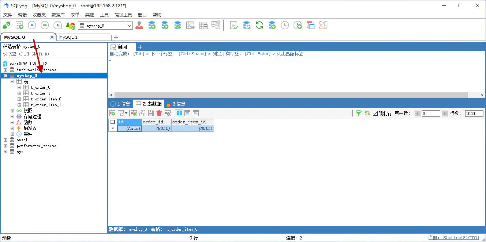
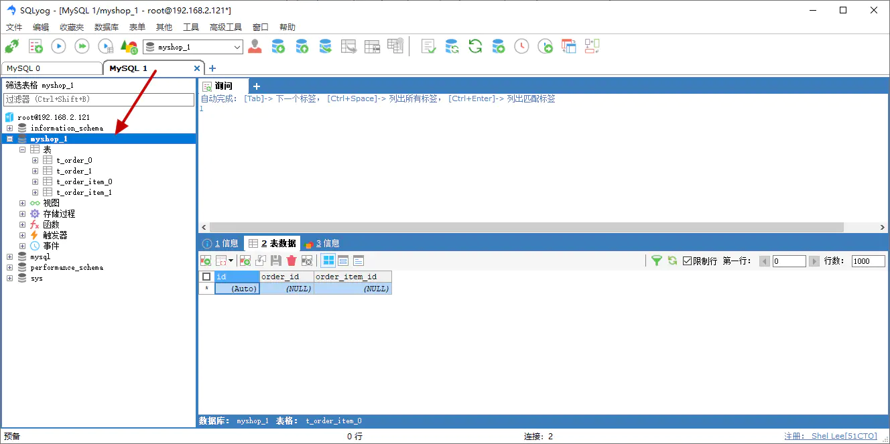

# 概述

部署方式全部基于 Docker

# 部署 2 台 MySQL 容器

- mysql-0

```
version: '3.1'
services:
  mysql-0:
    image: mysql
    container_name: mysql-0
    environment:
      MYSQL_ROOT_PASSWORD: 123456
    command:
      --default-authentication-plugin=mysql_native_password
      --character-set-server=utf8mb4
      --collation-server=utf8mb4_general_ci
      --explicit_defaults_for_timestamp=true
      --lower_case_table_names=1
    ports:
      - 3310:3306
    volumes:
      - ./data:/var/lib/mysql
```

- mysql-1

```
version: '3.1'
services:
  mysql-1:
    image: mysql
    container_name: mysql-1
    environment:
      MYSQL_ROOT_PASSWORD: 123456
    command:
      --default-authentication-plugin=mysql_native_password
      --character-set-server=utf8mb4
      --collation-server=utf8mb4_general_ci
      --explicit_defaults_for_timestamp=true
      --lower_case_table_names=1
    ports:
      - 3311:3306
    volumes:
      - ./data:/var/lib/mysql
```

# 手动创建测试库与表

- 在 `mysql-0` 上手动创建一个名为 `myshop_0` 的数据库
- 在 `mysql-1` 上手动创建一个名为 `myshop_1` 的数据库
- 分别在两个数据库上创建测试表，建表语句如下：订单基本信息表（订单id、金额、用户id、创建时间..）、订单详情表（订单id、商品id、商品数量、商品单价）

```
CREATE TABLE tb_order_0 (id BIGINT(20) NOT NULL AUTO_INCREMENT PRIMARY KEY, order_id BIGINT(20) NOT NULL, user_id BIGINT(20) NOT NULL);
CREATE TABLE tb_order_1 (id BIGINT(20) NOT NULL AUTO_INCREMENT PRIMARY KEY, order_id BIGINT(20) NOT NULL, user_id BIGINT(20) NOT NULL);

CREATE TABLE tb_order_item_0 (id BIGINT(20) NOT NULL AUTO_INCREMENT PRIMARY KEY, user_id BIGINT(20) NOT NULL, order_id BIGINT(20) NOT NULL, order_item_id BIGINT(20) NOT NULL);
CREATE TABLE tb_order_item_1 (id BIGINT(20) NOT NULL AUTO_INCREMENT PRIMARY KEY, user_id BIGINT(20) NOT NULL, order_id BIGINT(20) NOT NULL, order_item_id BIGINT(20) NOT NULL);
```





- 此时的数据库结构如下

```
mysql-0
	myshop_0
		tb_order_0
		tb_order_1
		tb_order_item_0
		tb_order_item_1
mysql-1
	myshop_1
		tb_order_0
		tb_order_1
		tb_order_item_0
		tb_order_item_1
```

# 增加 Maven 相关依赖

```
<dependency>
    <groupId>com.zaxxer</groupId>
    <artifactId>HikariCP</artifactId>
</dependency>
<dependency>
    <groupId>org.springframework.boot</groupId>
    <artifactId>spring-boot-starter-jdbc</artifactId>
    <exclusions>
        <exclusion>
            <groupId>org.apache.tomcat</groupId>
            <artifactId>tomcat-jdbc</artifactId>
        </exclusion>
    </exclusions>
</dependency>
<dependency>
    <groupId>mysql</groupId>
    <artifactId>mysql-connector-java</artifactId>
</dependency>
<dependency>
    <groupId>tk.mybatis</groupId>
    <artifactId>mapper-spring-boot-starter</artifactId>
</dependency>


<dependency>
    <groupId>org.apache.shardingsphere</groupId>
    <artifactId>sharding-jdbc-spring-boot-starter</artifactId>
    <version>4.1.1</version>
</dependency>
```

# 配置 MyBatis

详见 `Spring Boot` 章节内容，此处不再赘述

# 配置 ShardingSphere

修改 `provider-admin-service` 项目的 `application.yml` 配置文件，增加如下内容

```
spring:
  shardingsphere:
    # 属性配置
    props:
      # 是否开启 SQL 显示，默认值: false
      sql:
        show: true
    # 数据源配置，可配置多个
    datasource:
      # 本案例中配置了两个数据源，分别对应刚才创建的两个 MySQL 容器
      names: ds0,ds1
      ds0:
        type: com.zaxxer.hikari.HikariDataSource
        driver-class-name: com.mysql.jdbc.Driver
        jdbc-url: jdbc:mysql://192.168.2.121:3310/myshop_0?useUnicode=true&characterEncoding=utf-8&serverTimezone=Hongkong&useSSL=false
        username: root
        password: '123456'
        hikari:
          minimum-idle: 5
          idle-timeout: 600000
          maximum-pool-size: 10
          auto-commit: true
          pool-name: MyHikariCP
          max-lifetime: 1800000
          connection-timeout: 30000
          connection-test-query: SELECT 1
      ds1:
        type: com.zaxxer.hikari.HikariDataSource
        driver-class-name: com.mysql.jdbc.Driver
        jdbc-url: jdbc:mysql://192.168.2.121:3311/myshop_1?useUnicode=true&characterEncoding=utf-8&serverTimezone=Hongkong&useSSL=false
        username: root
        password: '123456'
        hikari:
          minimum-idle: 5
          idle-timeout: 600000
          maximum-pool-size: 10
          auto-commit: true
          pool-name: MyHikariCP
          max-lifetime: 1800000
          connection-timeout: 30000
          connection-test-query: SELECT 1
    # 分片规则配置
    sharding:
      # 绑定表规则列表
      binding-tables: tb_order,tb_order_item
      # 默认数据库分片策略，同分库策略
      default-database-strategy:
        inline:
          # 分片算法行表达式，需符合 groovy 语法
          # 此处根据 user_id 分片
          # 如果 user_id 为奇数则落入奇数库即 ds1 匹配的数据源
          # 如果 user_id 为偶数则落入偶数库即 ds0 匹配的数据源
          algorithm-expression: ds$->{user_id % 2}
          # 分片列名称
          sharding-column: user_id
      # 数据分片规则配置，可配置多个
      tables:
        # 逻辑表名称
        tb_order:
          # 由数据源名 + 表名组成，以小数点分隔
          actual-data-nodes: ds$->{0..1}.tb_order_$->{0..1}
          # 分表策略，同分库策略
          table-strategy:
            inline:
              # 此处根据 order_id 分片
              # 如果 order_id 为奇数则落入奇数表即 tb_order_1
              # 如果 order_id 为偶数则落入偶数表即 tb_order_0
              algorithm-expression: tb_order_$->{order_id % 2}
              # 分片列名称
              sharding-column: order_id
        tb_order_item:
          actual-data-nodes: ds$->{0..1}.tb_order_item_$->{0..1}
          table-strategy:
            inline:
              algorithm-expression: tb_order_item_$->{order_id % 2}
              sharding-column: order_id
```

# 单元测试数据分片

- 请将如下单元测试代码运行多次，查看是否按照注释中的说明匹配了上面的分片效果

```
package com.funtl.spring.cloud.alibaba.provider.tests;

import com.funtl.spring.cloud.alibaba.provider.domain.TOrder;
import com.funtl.spring.cloud.alibaba.provider.mapper.TOrderMapper;
import org.junit.Test;
import org.junit.runner.RunWith;
import org.springframework.beans.factory.annotation.Autowired;
import org.springframework.boot.test.context.SpringBootTest;
import org.springframework.test.context.junit4.SpringRunner;

import java.util.List;

@RunWith(SpringRunner.class)
@SpringBootTest
public class MapperTests {

    @Autowired
    private TOrderMapper orderMapper;

    @Test
    public void testInsert1() {
        // 按照配置文件中的规则
        TOrder order = new TOrder();
        // userId 为奇数进奇数库即 myshop_1
        order.setUserId(1L);
        // orderId 为奇数进奇数表即 tb_order_1
        order.setOrderId(1L);
        // 此时数据应插入 myshop_1.tb_order_1 中
        orderMapper.insert(order);
    }

    @Test
    public void testInsert2() {
        // 按照配置文件中的规则
        TOrder order = new TOrder();
        // userId 为偶数进偶数库即 myshop_0
        order.setUserId(2L);
        // orderId 为偶数进偶数表即 tb_order_0
        order.setOrderId(2L);
        // 此时数据应插入 myshop_0.tb_order_0 中
        orderMapper.insert(order);
    }

    @Test
    public void testSelectAll() {
        List<TOrder> tOrders = orderMapper.selectAll();
        tOrders.forEach(tOrder -> {
            System.out.println(tOrder);
        });
    }

}
```

- 再次运行 `testSelectAll` 方法，会发现出现了 **主主冲突** 的问题，控制台打印如下

```
TOrder(id=3, orderId=2, userId=2)
# ID 重复了，此时出现了主主冲突的问题，咱们需要考虑使用分布式主键的方式解决该问题
TOrder(id=4, orderId=2, userId=2)
TOrder(id=4, orderId=1, userId=1)
TOrder(id=5, orderId=1, userId=1)
```
