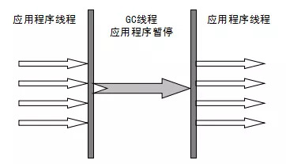

# 一、JVM介绍

## 1.JVM是什么

JVM是java程序实现跨平台的一个重要的工具（部件）。只要装有JVM的平台，都可以运行java程序。那么Java程序在JVM上是怎么被运行的？

通过介绍以下JVM的三个组成部分，就可以了解到JVM内部的工作机制

- 类加载系统：负责完成类的加载
- 运行时数据区：在运行Java程序的时候会产生的各种数据会保存在运行时数据区
- 执行引擎：执行具体的指令（代码）


## 2.学习的目的

我们学JVM相关知识的目的是为了充分理解jvm内部的工作流程，来掌握如何通过相应的参数配置，实现JVM的调优。

# 二、类加载系统

## 1.类的加载过程

一个类被加载进JVM中要经历哪几个过程

- 加载： 通过io流的方式把字节码文件读入到jvm中（方法区）
- 校验：通过校验字节码文件的头8位的16进制是否是java魔数cafebabe
- 准备：为类中的静态部分开辟空间并赋初始化值
- 解析：加载该类中的其他所有类
- 初始化：为类中的静态部分赋指定值并执行静态代码块


## 2.类加载器

类是谁来负载加载的？——类加载器

- 启动（Bootstrap）类加载器：负载加载核心类库中的类
- 扩展类加载器：负载加载ext目录内的类
- 系统（应用）类加载器：负载加载用户自己写的类
- 自定义类加载器：自己定义的类加载器，可以打破双亲委派机制。


## 3.双亲委派机制

全盘委托机制：在加载这个类时需要加载Student和String，于是该类就会全盘委托给`系统类加载`来加载Student和String。

```java
public class TestJMM {
    //静态属性
    public static int baseData = 10;
    //静态属性
    public static Student student = new Student();
    
    public static String hello = "hello";
}
```

那么系统类加载器怎么加载Student和String呢？需要通过双亲委派机制


**双亲委派机制：**

当类加载进行加载类的时候，类的加载需要向上委托给上一级的类加载器，上一级继续向上委托，直到启动类加载器。启动类加载器去核心类库中找，如果没有该类则向下委派，由下一级扩展类加载器去扩展类库中，如果也没有继续向下委派，直到找不到为止，则报类找不到的异常。

**为什么要有双亲委派机制：**

- 防止核心类库中的类被随意篡改
- 防止类的重复加载


# 三、运行时数据区

## 1.运行时数据区介绍


运行时数据区也就是JVM在运行时产生的数据存放的区域，这块区域就是JVM的内存区域，也称为JVM的内存模型——JMM

JMM分成了这么几个部分

- 堆空间（线程共享）：存放new出来的对象
- 元空间（线程共享）：存放类元信息、类的模版、常量池、静态部分
- 线程栈（线程独享）：方法的栈帧
- 本地方法区（线程独享）：本地方法产生的数据
- 程序计数器（线程独享）：配合执行引擎来执行指令


## 2.程序在执行时JMM中的内存变化

首先，在程序的.class目录内执行如下命令，查看程序具体的汇编指令

```shell
javap -c TestJMM
```

得到结果：

```shell
Compiled from "TestJMM.java"
public class com.qf.jvm.TestJMM {
  public static int baseData;

  public static com.qf.jvm.Student student;

  public static java.lang.String hello;

  public com.qf.jvm.TestJMM();
    Code:
       0: aload_0
       1: invokespecial #1                  // Method java/lang/Object."<init>":()V
       4: return

  public int add();
    Code:
       0: bipush        10
       2: istore_1
       3: bipush        20
       5: istore_2
       6: iload_1
       7: iload_2
       8: iadd
       9: iconst_5
      10: imul
      11: istore_3
      12: iload_3
      13: ireturn

  public static void main(java.lang.String[]);
    Code:
       0: new           #2                  // class com/qf/jvm/TestJMM
       3: dup
       4: invokespecial #3                  // Method "<init>":()V
       7: astore_1
       8: aload_1
       9: invokevirtual #4                  // Method add:()I
      12: istore_2
      13: getstatic     #5                  // Field java/lang/System.out:Ljava/io/PrintStream;
      16: iload_2
      17: invokevirtual #6                  // Method java/io/PrintStream.println:(I)V
      20: return

  static {};
    Code:
       0: bipush        10
       2: putstatic     #7                  // Field baseData:I
       5: new           #8                  // class com/qf/jvm/Student
       8: dup
       9: invokespecial #9                  // Method com/qf/jvm/Student."<init>":()V
      12: putstatic     #10                 // Field student:Lcom/qf/jvm/Student;
      15: ldc           #11                 // String hello
      17: putstatic     #12                 // Field hello:Ljava/lang/String;
      20: return
}

```

通过指令，JMM内存发生了如下变化：


- 线程栈：执行一个方法就会在线程栈中创建一个栈帧。
- 栈帧包含如下四个内容：
  - 局部变量表：存放方法中的局部变量
  - 操作数栈：用来存放方法中要操作的数据
  - 动态链接：存放方法名和方法内容的映射关系，通过方法名找到方法内容
  - 方法出口：记录方法执行完后调用次方法的位置。

# 四、垃圾回收机制

## 1.对象成为垃圾的判断依据

在堆空间和元空间中，GC这条守护线程会对这些空间开展垃圾回收工作，那么GC如何判断这些空间的对象是否是垃圾，有两种算法：

- 引用计数法：

对象被引用，则计数器+1，如果计数器是0，那么对象将被判定为是垃圾，于是被回收。但是这种算法没有办法解决循环依赖的对象。因此JVM目前的主流厂商Hotspot没有使用这种算法。

- 可达性分析算法：GC Roots根
  - gc roots根节点： 在对象的引用中，会有这么几种对象的变量：来自于线程栈中的局部变量表中的变量、静态变量、本地方法栈中的变量，这些变量都被称为gc roots根节点
  - 判断依据：gc在扫描堆空间中的某个节点时，向上遍历，看看能不能遍历到gc roots根节点，如果不能，那么意味着这个对象是垃圾。


## 2.对象中的finalize方法

Object类中有一个finalize方法，也就是说任何一个对象都有finalize方法。这个方法是对象被回收之前的最后一根救命稻草。

- GC在垃圾对象回收之前，先标记垃圾对象，把垃圾对象存入到一个队列中，这个队列中的所有对象的finalize方法将被调用
- 调用finalize方法如果对象被引用，那么对象继续存活
- 调用finalize方法如果对象没有被引用，那么对象将会被标记，存入到一个被回收的队列中，将被回收
- 注意，finalize方法只会被调用一次。


## 3.对象的逃逸分析

在jdk1.7之前，对象的创建都是在堆空间中创建，但是会有个问题，方法中的未被外部访问的对象

```java
public void test2() { 

 User user = new User(); 

 user.setId(1); 

 user.setName("zhuge"); 

//TODO 保存到数据库 
} 
```

这种对象没有被外部访问，且在堆空间上频繁创建，当方法结束，需要被gc，浪费了性能。

所以在1.7之后，就会进行一次逃逸分析（默认开启），于是这样的对象就直接在栈上创建，随着方法的出栈而被销毁，不需要进行gc。

**在栈上分配内存的时候**：会把聚合量替换成标量，来减少栈空间的开销。

- 标量：java中的基本数据类型（不可再分）
- 聚合量：引用数据类型


## 4.对象的引用类型

- 强引用：不会被收回

```java
# 强引用
public static User user = new User();
```


- 软引用：在内存紧张的情况下，软引用的对象会被回收。

```java
# 软引用，new User()对象可能被回收
public static SoftReference<User> user = new SoftReference<User>(new User());
```


# 五、垃圾回收算法

## 1、标记清除算法、复制算法、标记整理算法


## 2.分代回收算法


- 堆空间被分成了新生代（1/3）和老年代（2/3），新生代中被分成了eden（8/10）、survivor1(1/10)、survivor2(1/10)

- 对象的创建在eden，如果放不下则出发minor gc
- 对象经过一次minorgc 后存活的对象会被放入到survivor区，并且年龄+1
- survivor区执行的复制算法，当对象年龄到达15.进入到老年代。
- 如果老年代放满。就会触发Full GC


## 3.对象进入到老年代的条件

- 大对象直接进入到老年代：大对象可以通过参数设置大小，多大的对象被认为是大对象。 -XX:PretenureSizeThreshold
- 当对象的年龄到达15岁时将进入到老年代，这个年龄可以通过这个参数设置：-XX:MaxTenuringThreshold
- 根据对象动态年龄判断，如果s区中的对象总和超过了s区中的50%，那么下一次做复制的时候，把年龄大于等于这次最大年龄的对象都一次性全部放入到老年代。


# 六、垃圾回收器

垃圾回收机制，我们已经知道什么样的对象会成为垃圾。对象回收经历了什么——垃圾回收算法。那么谁来负责回收垃圾呢？

接下来就来讨论垃圾回收器。

## 1.Serial收集器

单线程执行垃圾收集，收集过程中会有较长的STW（stop the world）



## 2.Parallel收集器

使用多线程进行GC，会充分利用cpu，但是依然会有stw，这是jdk8默认使用的新生代和老年代的垃圾收集器。


## 3.PraNew收集器

工作原理和Parallel收集器一样，都是使用多线程进行GC，但是区别在于PraNew收集器可以和CMS收集器配合工作。主流的方案：

PraNew收集器负责收集新生代。CMS负责收集老年代。


## 4.CMS收集器

目标：尽量减少stw的时间，提升用户的体验。真正做到gc线程和用户线程几乎同时工作。

- **初始标记：** 暂停所有的其他线程(STW)，并记录下gc roots**直接能引用的对象**，**速度很快**。
- **并发标记：** 并发标记阶段就是从GC Roots的直接关联对象开始遍历整个对象图的过程， 这个过程耗时较长但是不需要停顿用户线程， 可以与垃圾收集线程一起并发运行。因为用户程序继续运行，可能会有导致已经标记过的对象状态发生改变。
- **重新标记：** 重新标记阶段就是为了修正并发标记期间因为用户程序继续运行而导致标记产生变动的那一部分对象的标记记录，**这个阶段的停顿时间一般会比初始标记阶段的时间稍长，远远比并发标记阶段时间短。主要用到三色标记里的****增量更新算法(见下面详解)做重新标记。
- **并发清理：** 开启用户线程，同时GC线程开始对未标记的区域做清扫。这个阶段如果有新增对象会被标记为黑色不做任何处理(见下面三色标记算法详解)。
- **并发重置：**重置本次GC过程中的标记数据。


## 5.G1收集器

G1收集器有如下几个核心关键点：

- 可以指定stw的时间
- 内存默认被划分成2048个region，每个region都可以充当eden、survivor、old、大对象
- G1会对每个region的回收成本（时间开销）进行排序，在指定的stw时间内，优先回收成本低的region，如果来不及回收的region放到下一次gc时再回收
- region内使用的垃圾回收算法用的是复制算法，减少碎片


# 七、JVM调优实战

## 1.JVM调优的核心参数

-Xss：每个线程的栈大小

-Xms：设置堆的初始可用大小，默认物理内存的1/64 

-Xmx：设置堆的最大可用大小，默认物理内存的1/4

-Xmn：新生代大小

-XX:NewRatio：默认2表示新生代占年老代的1/2，占整个堆内存的1/3。

-XX:SurvivorRatio：默认8表示一个survivor区占用1/8的Eden内存，即1/10的新生代内存。

以下两个参数设置元空间大小建议值相同，且写死，防止在程序启动时因为需要元空间的空间不够而频繁full gc。

-XX：MaxMetaspaceSize：

-XX：MetaspaceSize：


## 2.调优的关键点

- 设置元空间大小，最大值和初始化值相同
- 根据业务场景计算出每秒产生多少的对象。这些对象间隔多长时间会成为垃圾（一般根据接口响应时间来判断）
- 计算出堆中新生代中eden、survivor所需要的大小：根据上一条每条产生的对象和多少时间成为垃圾来计算出，依据是尽量减少full gc。

结合垃圾收集器：**PraNew+CMS**，对于CMS的垃圾收集器，还需要加上相关的配置：

- 对于一些年龄较大的bean，比如缓存对象、spring相关的容器对象，配置相关的对象，这些对象需要尽快的进入到老年代，因此需要配置：-XX:MaxTenuringThreshold=5

- CMS垃圾收集器会有并发模式失败的风险（转换为使用serialOld垃圾收集器），如何避免这种风险：将full gc的触发点调低：

  -XX:CMSInitiatingOccupancyFraction=85 （默认是92），相当于老年代使用率达到85%就触发full gc，于是还剩15%的空间允许在cms进行gc的过程中产生新的对象。

- CMS垃圾收集器收集完后会产生碎片，碎片需要整理，但不是每次收集完就整理，设置gc3次整理一次碎片：

-XX:+UseCMSCompactAtFullCollection -XX:CMSFullGCsBeforeCompaction=3


```java
java -Xms3072M -Xmx3072M -Xmn2048M -Xss1M  -XX:MetaspaceSize=256M -XX:MaxMetaspaceSize=256M  -XX:SurvivorRatio=8 
-XX:MaxTenuringThreshold=5 -XX:PretenureSizeThreshold=1M -XX:+UseParNewGC -XX:+UseConcMarkSweepGC 
-XX:CMSInitiatingOccupancyFraction=85 -XX:+UseCMSCompactAtFullCollection -XX:CMSFullGCsBeforeCompaction=3 -jar microservice-eureka-server.jar
```


 ## 3.JVM工具的使用

- jstack 查看内存、死锁等情况
- jmap 查看内存使用、溢出、死锁等等情况
- jvisualvm 查看内存实时变化的情况

参考文档：

https://blog.csdn.net/zbajie001/article/details/80045710


