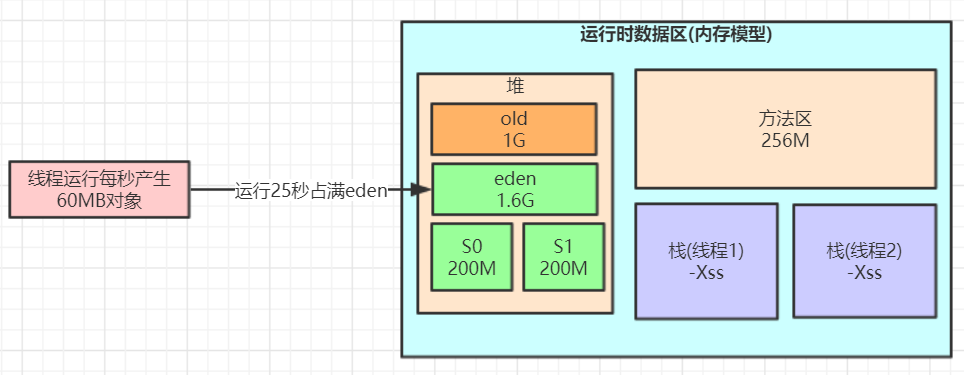

# 一、JVM内存参数设置


Spring Boot程序的JVM参数设置格式(Tomcat启动直接加在bin目录下catalina.sh文件里)：

```
java -Xms2048M -Xmx2048M -Xmn1024M -Xss512K -XX:MetaspaceSize=256M -XX:MaxMetaspaceSize=256M -jar microservice-eureka-server.jar
```

-Xss：每个线程的栈大小

-Xms：设置堆的初始可用大小，默认物理内存的1/64 

-Xmx：设置堆的最大可用大小，默认物理内存的1/4

-Xmn：新生代大小

-XX:NewRatio：默认2表示新生代占年老代的1/2，占整个堆内存的1/3。

-XX:SurvivorRatio：默认8表示一个survivor区占用1/8的Eden内存，即1/10的新生代内存。

关于元空间的JVM参数有两个：-XX:MetaspaceSize=N和 -XX:MaxMetaspaceSize=N

**-XX：MaxMetaspaceSize**： 设置元空间最大值， 默认是-1， 即不限制， 或者说只受限于本地内存大小。

**-XX：MetaspaceSize**： 指定元空间触发Fullgc的初始阈值(元空间无固定初始大小)， 以字节为单位，默认是21M左右，达到该值就会触发full gc进行类型卸载， 同时收集器会对该值进行调整： 如果释放了大量的空间， 就适当降低该值； 如果释放了很少的空间， 那么在不超过-XX：MaxMetaspaceSize（如果设置了的话） 的情况下， 适当提高该值。这个跟早期jdk版本的**-XX:PermSize**参数意思不一样，-**XX:PermSize**代表永久代的初始容量。

由于调整元空间的大小需要Full GC，这是非常昂贵的操作，如果应用在启动的时候发生大量Full GC，通常都是由于永久代或元空间发生了大小调整，基于这种情况，一般建议在JVM参数中将MetaspaceSize和MaxMetaspaceSize设置成一样的值，并设置得比初始值要大，对于8G物理内存的机器来说，一般我会将这两个值都设置为256M。

**StackOverflowError**示例：

```
// JVM设置  -Xss128k(默认1M)
public class StackOverflowTest {
    
    static int count = 0;
    
    static void redo() {
        count++;
        redo();
    }

    public static void main(String[] args) {
        try {
            redo();
        } catch (Throwable t) {
            t.printStackTrace();
            System.out.println(count);
        }
    }
}

运行结果：
java.lang.StackOverflowError
	at com.jvm.StackOverflowTest.redo(StackOverflowTest.java:12)
	at com.jvm.StackOverflowTest.redo(StackOverflowTest.java:13)
	at com.jvm.StackOverflowTest.redo(StackOverflowTest.java:13)
   ......
```

**结论：**

-Xss设置越小count值越小，说明一个线程栈里能分配的栈帧就越少，但是对JVM整体来说能开启的线程数会更多


**JVM内存参数大小该如何设置？**

JVM参数大小设置并没有固定标准，需要根据实际项目情况分析，给大家举个例子

**日均百万级订单交易系统如何设置JVM参数**


**结论：****通过上面这些内容介绍，大家应该对JVM优化有些概念了，就是尽可能让对象都在新生代里分配和回收，尽量别让太多对象频繁进入老年代，避免频繁对老年代进行垃圾回收，同时给系统充足的内存大小，避免新生代频繁的进行垃圾回收。**


# 二、对象栈上分配 

我们通过JVM内存分配可以知道JAVA中的对象都是在堆上进行分配，当对象没有被引用的时候，需要依靠GC进行回收内 

存，如果对象数量较多的时候，会给GC带来较大压力，也间接影响了应用的性能。为了减少临时对象在堆内分配的数量，JVM通过**逃逸分析**确定该对象不会被外部访问。如果不会逃逸可以将该对象在**栈上分配**内存，这样该对象所占用的 

内存空间就可以随栈帧出栈而销毁，就减轻了垃圾回收的压力。 

**对象逃逸分析**：就是分析对象动态作用域，当一个对象在方法中被定义后，它可能被外部方法所引用，例如作为调用参 

数传递到其他地方中。 

```java
public User test1() { 

 User user = new User(); 

 user.setId(1); 

 user.setName("jack"); 

 //TODO 保存到数据库 

 return user; 

} 

public void test2() { 

 User user = new User(); 

 user.setId(1); 

 user.setName("jack"); 

//TODO 保存到数据库 
} 
```


很显然test1方法中的user对象被返回了，这个对象的作用域范围不确定，test2方法中的user对象我们可以确定当方法结 

束这个对象就可以认为是无效对象了，对于这样的对象我们其实可以将其分配在栈内存里，让其在方法结束时跟随栈内 

存一起被回收掉。 

JVM对于这种情况可以通过开启逃逸分析参数(-XX:+DoEscapeAnalysis)来优化对象内存分配位置，使其通过**标量替换**优 

先分配在栈上(**栈上分配**)，JDK7之后默认开启逃逸分析，如果要关闭使用参数(-XX:-DoEscapeAnalysis) 

**标量替换：**通过逃逸分析确定该对象不会被外部访问，并且对象可以被进一步分解时，**JVM不会创建该对象**，而是将该 

对象成员变量分解若干个被这个方法使用的成员变量所代替，这些代替的成员变量在栈帧或寄存器上分配空间，这样就 

不会因为没有一大块连续空间导致对象内存不够分配。开启标量替换参数(-XX:+EliminateAllocations)，JDK7之后默认 

开启。 

**标量与聚合量：**标量即不可被进一步分解的量，而JAVA的基本数据类型就是标量（如：int，long等基本数据类型以及 

reference类型等），标量的对立就是可以被进一步分解的量，而这种量称之为聚合量。而在JAVA中对象就是可以被进一 

步分解的聚合量。 

**栈上分配示例：** 

```java
/** 

 * 栈上分配，标量替换 

 * 代码调用了1亿次alloc()，如果是分配到堆上，大概需要1GB以上堆空间，如果堆空间小于该值，必然会触发GC。 

 * 

 * 使用如下参数不会发生GC 

 * ‐Xmx15m ‐Xms15m ‐XX:+DoEscapeAnalysis ‐XX:+PrintGC ‐XX:+EliminateAllocations 

 * 使用如下参数都会发生大量GC 

 * ‐Xmx15m ‐Xms15m ‐XX:‐DoEscapeAnalysis ‐XX:+PrintGC ‐XX:+EliminateAllocations 

 * ‐Xmx15m ‐Xms15m ‐XX:+DoEscapeAnalysis ‐XX:+PrintGC ‐XX:‐EliminateAllocations 

 */ 

public class AllotOnStack { 


 public static void main(String[] args) { 

  long start = System.currentTimeMillis(); 

  for (int i = 0; i < 100000000; i++) { 

   alloc(); 

  } 

  long end = System.currentTimeMillis(); 

  System.out.println(end ‐ start); 

} 

private static void alloc() { 

  User user = new User(); 

  user.setId(1); 

  user.setName("jack");26 } 
} 
```

**结论：****栈上分配依赖于逃逸分析和标量替换** 


# 三、常见引用类型 

java的引用类型一般分为四种：**强引用**、**软引用**、弱引用、虚引用 

**强引用**：普通的变量引用 

```java
public static User user = new User(); 
```

**软引用**：将对象用SoftReference软引用类型的对象包裹，正常情况不会被回收，但是GC做完后发现释放不出空间存放 

新的对象，则会把这些软引用的对象回收掉。**软引用可用来实现内存敏感的高速缓存。** 

```java
 public static SoftReference<User> user = new SoftReference<User>(new User()); 
```


软引用在实际中有重要的应用，例如浏览器的后退按钮。按后退时，这个后退时显示的网页内容是重新进行请求还是从 

缓存中取出呢？这就要看具体的实现策略了。 

（1）如果一个网页在浏览结束时就进行内容的回收，则按后退查看前面浏览过的页面时，需要重新构建 

（2）如果将浏览过的网页存储到内存中会造成内存的大量浪费，甚至会造成内存溢出 

**弱引用**：将对象用WeakReference软引用类型的对象包裹，弱引用跟没引用差不多，**GC会直接回收掉**，很少用 

```java
 public static WeakReference<User> user = new WeakReference<User>(new User()); 
```

**虚引用：**虚引用也称为幽灵引用或者幻影引用，它是最弱的一种引用关系，几乎不用


# 四、**finalize()方法最终判定对象是否存活** 

即使在可达性分析算法中不可达的对象，也并非是“非死不可”的，这时候它们暂时处于“缓刑”阶段，要真正宣告一 

个对象死亡，至少要经历再次标记过程。 

**标记的前提是对象在进行可达性分析后发现没有与GC Roots相连接的引用链。** 

**1. 第一次标记并进行一次筛选。** 

筛选的条件是此对象是否有必要执行finalize()方法。 

当对象没有覆盖finalize方法，对象将直接被回收。 

**2. 第二次标记** 

如果这个对象覆盖了finalize方法，finalize方法是对象脱逃死亡命运的最后一次机会，如果对象要在finalize()中成功拯救 

自己，只要重新与引用链上的任何的一个对象建立关联即可，譬如把自己赋值给某个类变量或对象的成员变量，那在第 

二次标记时它将移除出“即将回收”的集合。如果对象这时候还没逃脱，那基本上它就真的被回收了。 

注意：一个对象的finalize()方法只会被执行一次，也就是说通过调用finalize方法自我救命的机会就一次。 

示例代码：

```java
public class OOMTest { 

  public static void main(String[] args) { 

   List<Object> list = new ArrayList<>(); 

   int i = 0; 

   int j = 0; 

   while (true) { 

   list.add(new User(i++, UUID.randomUUID().toString())); 

   new User(j‐‐, UUID.randomUUID().toString()); 

  } 
 } 
} 
```


# 五、**如何判断一个类是无用的类** 

方法区主要回收的是无用的类，那么如何判断一个类是无用的类的呢？ 

类需要同时满足下面3个条件才能算是 **“无用的类”** ： 

- 该类所有的对象实例都已经被回收，也就是 Java 堆中不存在该类的任何实例。 

- 加载该类的 ClassLoader 已经被回收。 

- 该类对应的 java.lang.Class 对象没有在任何地方被引用，无法在任何地方通过反射访问该类的方法。

Class cls = TestJMM.class;


# 六、**大对象直接进入老年代**

大对象就是需要大量连续内存空间的对象（比如：字符串、数组）。JVM参数 -XX:PretenureSizeThreshold 可以设置大对象的大小，如果对象超过设置大小会直接进入老年代，不会进入年轻代，这个参数只在 Serial 和ParNew两个收集器下有效。

比如设置JVM参数：-XX:PretenureSizeThreshold=1000000 (单位是字节) -XX:+UseSerialGC ，再执行下上面的第一个程序会发现大对象直接进了老年代

**为什么要这样呢？**

为了避免为大对象分配内存时的复制操作而降低效率。

# 七、**长期存活的对象将进入老年代**

既然虚拟机采用了分代收集的思想来管理内存，那么内存回收时就必须能识别哪些对象应放在新生代，哪些对象应放在老年代中。为了做到这一点，虚拟机给每个对象一个对象年龄（Age）计数器。

如果对象在 Eden 出生并经过第一次 Minor GC 后仍然能够存活，并且能被 Survivor 容纳的话，将被移动到 Survivor 空间中，并将对象年龄设为1。对象在 Survivor 中每熬过一次 MinorGC，年龄就增加1岁，当它的年龄增加到一定程度（默认为15岁，CMS收集器默认6岁，不同的垃圾收集器会略微有点不同），就会被晋升到老年代中。对象晋升到老年代的年龄阈值，可以通过参数 **-XX:MaxTenuringThreshold** 来设置。

# 八、**对象动态年龄判断**

当前放对象的Survivor区域里(其中一块区域，放对象的那块s区)，一批对象的总大小大于这块Survivor区域内存大小的50%(-XX:TargetSurvivorRatio可以指定)，那么此时**大于等于**这批对象年龄最大值的对象，就可以**直接进入老年代**了，例如Survivor区域里现在有一批对象，年龄1+年龄2+年龄n的多个年龄对象总和超过了Survivor区域的50%，此时就会把年龄n(含)以上的对象都放入老年代。这个规则其实是希望那些可能是长期存活的对象，尽早进入老年代。**对象动态年龄判断机制一般是在minor gc之后触发的。**

# 九、**老年代空间分配担保机制**

年轻代每次**minor gc**之前JVM都会计算下老年代**剩余可用空间**

如果这个可用空间小于年轻代里现有的所有对象大小之和(**包括垃圾对象**)

就会看一个“-XX:-HandlePromotionFailure”(jdk1.8默认就设置了)的参数是否设置了

如果有这个参数，就会看看老年代的可用内存大小，是否大于之前每一次minor gc后进入老年代的对象的**平均大小**。

如果上一步结果是小于或者之前说的参数没有设置，那么就会触发一次Full gc，对老年代和年轻代一起回收一次垃圾，如果回收完还是没有足够空间存放新的对象就会发生"OOM"

当然，如果minor gc之后剩余存活的需要挪动到老年代的对象大小还是大于老年代可用空间，那么也会触发full gc，full gc完之后如果还是没有空间放minor gc之后的存活对象，则也会发生“OOM”


# 十、**对象内存回收**

堆中几乎放着所有的对象实例，对堆垃圾回收前的第一步就是要判断哪些对象已经死亡（即不能再被任何途径使用的对象）。

hotspot。oracle

jvm==》hotspot jdk

## 1.**引用计数法**

给对象中添加一个引用计数器，每当有一个地方引用它，计数器就加1；当引用失效，计数器就减1；任何时候计数器为0的对象就是不可能再被使用的。

**这个方法实现简单，效率高，但是目前主流的虚拟机中并没有选择这个算法来管理内存，其最主要的原因是它很难解决对象之间相互循环引用的问题。** 所谓对象之间的相互引用问题，如下面代码所示：除了对象objA 和 objB 相互引用着对方之外，这两个对象之间再无任何引用。但是他们因为互相引用对方，导致它们的引用计数器都不为0，于是引用计数算法无法通知 GC 回收器回收他们。

```
public class ReferenceCountingGc {
   Object instance = null;

   public static void main(String[] args) {
      ReferenceCountingGc objA = new ReferenceCountingGc();
      ReferenceCountingGc objB = new ReferenceCountingGc();
      objA.instance = objB;
      objB.instance = objA;
      objA = null;
      objB = null;
   }
}
```

## 2.**可达性分析算法**

将**“GC Roots”** 对象作为起点，从这些节点开始向下搜索引用的对象，找到的对象都标记为**非垃圾对象**，其余未标记的对象都是垃圾对象

**GC Roots**根节点：线程栈的本地变量、静态变量、本地方法栈的变量等等


## 3.**常见引用类型**

java的引用类型一般分为四种：**强引用**、**软引用**、弱引用、虚引用

### 1)**强引用**

普通的变量引用

```
public static User user = new User();
```

### 2)**软引用**

将对象用SoftReference软引用类型的对象包裹，正常情况不会被回收，但是GC做完后发现释放不出空间存放新的对象，则会把这些软引用的对象回收掉。**软引用可用来实现内存敏感的高速缓存。**

```
public static SoftReference<User> user = new SoftReference<User>(new User());
```

软引用在实际中有重要的应用，例如浏览器的后退按钮。按后退时，这个后退时显示的网页内容是重新进行请求还是从缓存中取出呢？这就要看具体的实现策略了。

（1）如果一个网页在浏览结束时就进行内容的回收，则按后退查看前面浏览过的页面时，需要重新构建

（2）如果将浏览过的网页存储到内存中会造成内存的大量浪费，甚至会造成内存溢出

### 3)**弱引用**

将对象用WeakReference软引用类型的对象包裹，弱引用跟没引用差不多，**GC会直接回收掉**，很少用

```
public static WeakReference<User> user = new WeakReference<User>(new User());
```

### 4)虚引用

虚引用也称为幽灵引用或者幻影引用，它是最弱的一种引用关系，几乎不用


# 十一、**垃圾收集器**


**如果说收集算法是内存回收的方法论，那么垃圾收集器就是内存回收的具体实现。**

虽然我们对各个收集器进行比较，但并非为了挑选出一个最好的收集器。因为直到现在为止还没有最好的垃圾收集器出现，更加没有万能的垃圾收集器，**我们能做的就是根据具体应用场景选择适合自己的垃圾收集器**。试想一下：如果有一种四海之内、任何场景下都适用的完美收集器存在，那么我们的Java虚拟机就不会实现那么多不同的垃圾收集器了。

## 1.Serial收集器(-XX:+UseSerialGC -XX:+UseSerialOldGC)

Serial（串行）收集器是最基本、历史最悠久的垃圾收集器了。大家看名字就知道这个收集器是一个单线程收集器了。它的 **“单线程”** 的意义不仅仅意味着它只会使用一条垃圾收集线程去完成垃圾收集工作，更重要的是它在进行垃圾收集工作的时候必须暂停其他所有的工作线程（ **"Stop The World"** ），直到它收集结束。

**新生代采用复制算法，老年代采用标记-整理算法。**


虚拟机的设计者们当然知道Stop The World带来的不良用户体验，所以在后续的垃圾收集器设计中停顿时间在不断缩短（仍然还有停顿，寻找最优秀的垃圾收集器的过程仍然在继续）。

但是Serial收集器有没有优于其他垃圾收集器的地方呢？当然有，它**简单而高效（与其他收集器的单线程相比）**。Serial收集器由于没有线程交互的开销，自然可以获得很高的单线程收集效率。

**Serial Old收集器是Serial收集器的老年代版本**，它同样是一个单线程收集器。它主要有两大用途：一种用途是在JDK1.5以及以前的版本中与Parallel Scavenge收集器搭配使用，**另一种用途是作为CMS收集器的后备方案**。

## 2.Parallel Scavenge收集器(-XX:+UseParallelGC(年轻代),-XX:+UseParallelOldGC(老年代))

**Parallel**收集器其实**就是Serial收集器的多线程版本**，除了使用多线程进行垃圾收集外，其余行为（控制参数、收集算法、回收策略等等）和Serial收集器类似。默认的收集线程数跟cpu核数相同，当然也可以用参数(-XX:ParallelGCThreads)指定收集线程数，但是一般不推荐修改。

**Parallel Scavenge收集器关注点是吞吐量（高效率的利用CPU）。CMS等垃圾收集器的关注点更多的是用户线程的停顿时间（提高用户体验）。所谓吞吐量就是CPU中用于运行用户代码的时间与CPU总消耗时间的比值。** Parallel Scavenge收集器提供了很多参数供用户找到最合适的停顿时间或最大吞吐量，如果对于收集器运作不太了解的话，可以选择把内存管理优化交给虚拟机去完成也是一个不错的选择。

**新生代采用复制算法，老年代采用标记-整理算法。**


**Parallel Old收集器是Parallel Scavenge收集器的老年代版本**。使用多线程和“标记-整理”算法。在注重吞吐量以及CPU资源的场合，都可以优先考虑 Parallel Scavenge收集器和Parallel Old收集器(**JDK8默认的新生代和老年代收集器**)。

## 3.ParNew收集器(-XX:+UseParNewGC)

ParNew收集器其实**跟Parallel收集器很类似**，区别主要在于它可以和CMS收集器配合使用。

**新生代采用复制算法，老年代采用标记-整理算法。**


它是许多运行在Server模式下的虚拟机的首要选择，除了Serial收集器外，只有它能与CMS收集器（真正意义上的并发收集器，后面会介绍到）配合工作。

## 4.CMS收集器(-XX:+UseConcMarkSweepGC(old))

**CMS（Concurrent Mark Sweep）收集器是一种以获取最短回收停顿时间为目标的收集器。它非常符合在注重用户体验的应用上使用，它是HotSpot虚拟机第一款真正意义上的并发收集器，它第一次实现了让垃圾收集线程与用户线程（基本上）同时工作。**

从名字中的**Mark Sweep**这两个词可以看出，CMS收集器是一种 **“标记-清除”算法**实现的，它的运作过程相比于前面几种垃圾收集器来说更加复杂一些。整个过程分为四个步骤：

- **初始标记：** 暂停所有的其他线程(STW)，并记录下gc roots**直接能引用的对象**，**速度很快**。
- **并发标记：** 并发标记阶段就是从GC Roots的直接关联对象开始遍历整个对象图的过程， 这个过程耗时较长但是不需要停顿用户线程， 可以与垃圾收集线程一起并发运行。因为用户程序继续运行，可能会有导致已经标记过的对象状态发生改变。
- **重新标记：** 重新标记阶段就是为了修正并发标记期间因为用户程序继续运行而导致标记产生变动的那一部分对象的标记记录，**这个阶段的停顿时间一般会比初始标记阶段的时间稍长，远远比并发标记阶段时间短。主要用到三色标记里的****增量更新算法(见下面详解)做重新标记。
- **并发清理：** 开启用户线程，同时GC线程开始对未标记的区域做清扫。这个阶段如果有新增对象会被标记为黑色不做任何处理(见下面三色标记算法详解)。
- **并发重置：**重置本次GC过程中的标记数据。


从它的名字就可以看出它是一款优秀的垃圾收集器，主要优点：**并发收集、低停顿**。但是它有下面几个明显的缺点：

- 对CPU资源敏感（会和服务抢资源）；
- 无法处理**浮动垃圾**(在并发标记和并发清理阶段又产生垃圾，这种浮动垃圾只能等到下一次gc再清理了)；
- 它使用的回收算法-**“标记-清除”算法**会导致收集结束时会有**大量空间碎片**产生，当然通过参数-XX:+UseCMSCompactAtFullCollection可以让jvm在执行完标记清除后再做整理
-   执行过程中的不确定性，会存在上一次垃圾回收还没执行完，然后垃圾回收又被触发的情况，**特别是在并发标记和并发清理阶段会出现**，一边回收，系统一边运行，也许没回收完就再次触发full gc，也就是"**concurrent mode failure**"，**此时会进入stop the world，用serial old垃圾收集器来回收**

**CMS的相关核心参数**

1. -XX:+UseConcMarkSweepGC：启用cms 
2. -XX:ConcGCThreads：并发的GC线程数
3. -XX:+UseCMSCompactAtFullCollection：FullGC之后做压缩整理（减少碎片）
4. -XX:CMSFullGCsBeforeCompaction：多少次FullGC之后压缩一次，默认是0，代表每次FullGC后都会压缩一次 
5. -XX:CMSInitiatingOccupancyFraction: 当老年代使用达到该比例时会触发FullGC（默认是92，这是百分比）
6. -XX:+UseCMSInitiatingOccupancyOnly：只使用设定的回收阈值(-XX:CMSInitiatingOccupancyFraction设定的值)，如果不指定，JVM仅在第一次使用设定值，后续则会自动调整
7. -XX:+CMSScavengeBeforeRemark：在CMS GC前启动一次minor gc，降低CMS GC标记阶段**(**也会对年轻代一起做标记，如果在minor gc就干掉了很多对垃圾对象，标记阶段就会减少一些标记时间**)**时的开销，一般CMS的GC耗时 80%都在标记阶段
8. -XX:+CMSParallellnitialMarkEnabled：表示在初始标记的时候多线程执行，缩短STW
9. -XX:+CMSParallelRemarkEnabled：在重新标记的时候多线程执行，缩短STW;

## 5.亿级流量电商系统如何优化JVM参数设置(ParNew+CMS)

大型电商系统后端现在一般都是拆分为多个子系统部署的，比如，商品系统，库存系统，订单系统，促销系统，会员系统等等。

我们这里以比较核心的订单系统为例 


对于8G内存，我们一般是分配4G内存给JVM，正常的JVM参数配置如下：

```
-Xms3072M -Xmx3072M -Xss1M -XX:MetaspaceSize=256M -XX:MaxMetaspaceSize=256M  -XX:SurvivorRatio=8
```

上节课说过，这样设置可能会由于**动态对象年龄判断原则**导致频繁full gc。

于是我们可以更新下JVM参数设置：

```
-Xms3072M -Xmx3072M -Xmn2048M -Xss1M -XX:MetaspaceSize=256M -XX:MaxMetaspaceSize=256M  -XX:SurvivorRatio=8 
```

 



这样就降低了因为对象动态年龄判断原则导致的对象频繁进入老年代的问题，其实**很多优化无非就是让短期存活的对象尽量都留在survivor里，不要进入老年代，这样在minor gc的时候这些对象都会被回收，不会进到老年代从而导致full gc**。

对于对象年龄应该为多少才移动到老年代比较合适，本例中一次minor gc要间隔二三十秒，大多数对象一般在几秒内就会变为垃圾，完全可以将默认的15岁改小一点，比如改为5，那么意味着对象要经过5次minor gc才会进入老年代，整个时间也有一两分钟了，如果对象这么长时间都没被回收，完全可以认为这些对象是会存活的比较长的对象，可以移动到老年代，而不是继续一直占用survivor区空间。

对于多大的对象直接进入老年代(参数-XX:PretenureSizeThreshold)，这个一般可以结合你自己系统看下有没有什么大对象生成，预估下大对象的大小，一般来说设置为1M就差不多了，很少有超过1M的大对象，这些对象一般就是你系统初始化分配的缓存对象，比如大的缓存List，Map之类的对象。

可以适当调整JVM参数如下：

```
-Xms3072M -Xmx3072M -Xmn2048M -Xss1M  -XX:MetaspaceSize=256M -XX:MaxMetaspaceSize=256M  -XX:SurvivorRatio=8 
-XX:MaxTenuringThreshold=5 -XX:PretenureSizeThreshold=1M 
```

对于JDK8默认的垃圾回收器是-XX:+UseParallelGC(年轻代)和-XX:+UseParallelOldGC(老年代)，如果内存较大(超过4个G，只是经验值)，系统对停顿时间比较敏感，我们可以使用**ParNew+CMS(**-XX:+UseParNewGC -XX:+UseConcMarkSweepGC**)**

对于老年代CMS的参数如何设置我们可以思考下，首先我们想下当前这个系统有哪些对象可能会长期存活躲过5次以上minor gc最终进入老年代。

无非就是那些Spring容器里的Bean，线程池对象，一些初始化缓存数据对象等，这些加起来充其量也就几十MB。

还有就是某次minor gc完了之后还有超过一两百M的对象存活，那么就会直接进入老年代，比如突然某一秒瞬间要处理五六百单，那么每秒生成的对象可能有一百多M，再加上整个系统可能压力剧增，一个订单要好几秒才能处理完，下一秒可能又有很多订单过来。

我们可以估算下大概每隔五六分钟出现一次这样的情况，那么大概半小时到一小时之间就可能因为老年代满了触发一次Full GC，Full GC的触发条件还有我们之前说过的**老年代空间分配担保机制**，历次的minor gc挪动到老年代的对象大小肯定是非常小的，所以几乎不会在minor gc触发之前由于老年代空间分配担保失败而产生full gc，其实在半小时后发生full gc，这时候已经过了抢购的最高峰期，后续可能几小时才做一次FullGC。

对于碎片整理，因为都是1小时或几小时才做一次FullGC，是可以每做完一次就开始碎片整理，或者两到三次之后再做一次也行。

综上，只要年轻代参数设置合理，老年代CMS的参数设置基本都可以用默认值，如下所示：

```
-Xms3072M -Xmx3072M -Xmn2048M -Xss1M  -XX:MetaspaceSize=256M -XX:MaxMetaspaceSize=256M  -XX:SurvivorRatio=8 
-XX:MaxTenuringThreshold=5 -XX:PretenureSizeThreshold=1M -XX:+UseParNewGC -XX:+UseConcMarkSweepGC 
-XX:CMSInitiatingOccupancyFraction=85 -XX:+UseCMSCompactAtFullCollection -XX:CMSFullGCsBeforeCompaction=3
```


## 6.**G1收集器(-XX:+UseG1GC)**

**G1 (Garbage-First)是一款面向服务器的垃圾收集器,**主要针对配备多颗处理器及大容量内存的机器. 以极高概率满足GC停顿时间要求的同时,还具备高吞吐量性能特征.


G1将Java堆划分为多个大小相等的独立区域（**Region**），JVM目标是不超过2048个Region(JVM源码里TARGET_REGION_NUMBER 定义)，实际可以超过该值，但是不推荐。

一般Region大小等于堆大小除以2048，比如堆大小为4096M，则Region大小为2M，当然也可以用参数"-XX:G1HeapRegionSize"手动指定Region大小，但是推荐默认的计算方式。

G1保留了年轻代和老年代的概念，但不再是物理隔阂了，它们都是（可以不连续）Region的集合。

默认年轻代对堆内存的占比是5%，如果堆大小为4096M，那么年轻代占据200MB左右的内存，对应大概是100个Region，可以通过“-XX:G1NewSizePercent”设置新生代初始占比，在系统运行中，JVM会不停的给年轻代增加更多的Region，但是最多新生代的占比不会超过60%，可以通过“-XX:G1MaxNewSizePercent”调整。年轻代中的Eden和Survivor对应的region也跟之前一样，默认8:1:1，假设年轻代现在有1000个region，eden区对应800个，s0对应100个，s1对应100个。

一个Region可能之前是年轻代，如果Region进行了垃圾回收，之后可能又会变成老年代，也就是说Region的区域功能可能会动态变化。

G1垃圾收集器对于对象什么时候会转移到老年代跟之前讲过的原则一样，**唯一不同的是对大对象的处理**，G1有专门分配大对象的Region叫**Humongous区**，而不是让大对象直接进入老年代的Region中。在G1中，大对象的判定规则就是一个大对象超过了一个Region大小的50%，比如按照上面算的，每个Region是2M，只要一个大对象超过了1M，就会被放入Humongous中，而且一个大对象如果太大，可能会横跨多个Region来存放。

Humongous区专门存放短期巨型对象，不用直接进老年代，可以节约老年代的空间，避免因为老年代空间不够的GC开销。

Full GC的时候除了收集年轻代和老年代之外，也会将Humongous区一并回收。

G1收集器一次GC(主要值Mixed GC)的运作过程大致分为以下几个步骤：

- **初始标记**（initial mark，STW）：暂停所有的其他线程，并记录下gc roots直接能引用的对象，**速度很快** ；

- **并发标记**（Concurrent Marking）：同CMS的并发标记
- **最终标记**（Remark，STW）：同CMS的重新标记
- **筛选回收**（Cleanup，STW）：筛选回收阶段首先对各个Region的**回收价值和成本进行排序**，**根据用户所期望的GC停顿STW时间(可以用JVM参数 -XX:MaxGCPauseMillis指定)来制定回收计划**，比如说老年代此时有1000个Region都满了，但是因为根据预期停顿时间，本次垃圾回收可能只能停顿200毫秒，那么通过之前回收成本计算得知，可能回收其中800个Region刚好需要200ms，那么就只会回收800个Region(**Collection Set**，要回收的集合)，尽量把GC导致的停顿时间控制在我们指定的范围内。这个阶段其实也可以做到与用户程序一起并发执行，但是因为只回收一部分Region，时间是用户可控制的，而且停顿用户线程将大幅提高收集效率。不管是年轻代或是老年代，**回收算法主要用的是复制算法**，**将一个region中的存活对象复制到另一个region中，这种不会像CMS那样回收完因为有很多内存碎片还需要整理一次，G1采用复制算法回收几乎不会有太多内存碎片**。(注意：CMS回收阶段是跟用户线程一起并发执行的，G1因为内部实现太复杂暂时没实现并发回收，不过到了ZGC，Shenandoah就实现了并发收集，Shenandoah可以看成是G1的升级版本)


**G1收集器在后台维护了一个优先列表，每次根据允许的收集时间，优先选择回收价值最大的Region(这也就是它的名字Garbage-First的由来)，比如一个Region花200ms能回收10M垃圾，另外一个Region花50ms能回收20M垃圾，在回收时间有限情况下，G1当然会优先选择后面这个Region回收**。这种使用Region划分内存空间以及有优先级的区域回收方式，保证了G1收集器在有限时间内可以尽可能高的收集效率。

被视为JDK1.7以上版本Java虚拟机的一个重要进化特征。它具备以下特点：

- **并行与并发**：G1能充分利用CPU、多核环境下的硬件优势，使用多个CPU（CPU或者CPU核心）来缩短Stop-The-World停顿时间。部分其他收集器原本需要停顿Java线程来执行GC动作，G1收集器仍然可以通过并发的方式让java程序继续执行。
- **分代收集**：虽然G1可以不需要其他收集器配合就能独立管理整个GC堆，但是还是保留了分代的概念。
- **空间整合**：与CMS的“标记--清理”算法不同，G1从整体来看是基于“**标记整理**”算法实现的收集器；从局部上来看是基于“复制”算法实现的。
- **可预测的停顿**：这是G1相对于CMS的另一个大优势，降低停顿时间是G1 和 CMS 共同的关注点，但G1 除了追求低停顿外，还能建立**可预测的停顿时间模型**，能让使用者明确指定在一个长度为M毫秒的时间片段(通过参数"**-XX:MaxGCPauseMillis**"指定)内完成垃圾收集。

毫无疑问， 可以由用户指定期望的停顿时间是G1收集器很强大的一个功能， 设置不同的期望停顿时间， 可使得G1在不同应用场景中取得关注吞吐量和关注延迟之间的最佳平衡。 不过， 这里设置的“期望值”必须是符合实际的， 不能异想天开， 毕竟G1是要冻结用户线程来复制对象的， 这个停顿时

间再怎么低也得有个限度。 它默认的停顿目标为两百毫秒， 一般来说， 回收阶段占到几十到一百甚至接近两百毫秒都很正常， 但如果我们把停顿时间调得非常低， 譬如设置为二十毫秒， 很可能出现的结果就是由于停顿目标时间太短， 导致每次选出来的回收集只占堆内存很小的一部分， 收集器收集的速度逐渐跟不上分配器分配的速度， 导致垃圾慢慢堆积。 很可能一开始收集器还能从空闲的堆内存中获得一些喘息的时间， 但应用运行时间一长就不行了， 最终占满堆引发Full GC反而降低性能， 所以通常把期望停顿时间设置为一两百毫秒或者两三百毫秒会是比较合理的。

**G1垃圾收集分类**

**YoungGC**

YoungGC并不是说现有的Eden区放满了就会马上触发，G1会计算下现在Eden区回收大概要多久时间，如果回收时间远远小于参数 -XX:MaxGCPauseMills 设定的值，那么增加年轻代的region，继续给新对象存放，不会马上做Young GC，直到下一次Eden区放满，G1计算回收时间接近参数 -XX:MaxGCPauseMills 设定的值，那么就会触发Young GC

**MixedGC**

不是FullGC，老年代的堆占有率达到参数(**-XX:InitiatingHeapOccupancyPercent**)设定的值则触发，回收所有的Young和部分Old(根据期望的GC停顿时间确定old区垃圾收集的优先顺序)以及**大对象区**，正常情况G1的垃圾收集是先做MixedGC，主要使用复制算法，需要把各个region中存活的对象拷贝到别的region里去，拷贝过程中如果发现**没有足够的空region**能够承载拷贝对象就会触发一次Full GC

**Full GC**

停止系统程序，然后采用单线程进行标记、清理和压缩整理，好空闲出来一批Region来供下一次MixedGC使用，这个过程是非常耗时的。(Shenandoah优化成多线程收集了)

**G1收集器参数设置** 

  -XX:+UseG1GC:使用G1收集器

  -XX:ParallelGCThreads:指定GC工作的线程数量

  -XX:G1HeapRegionSize:指定分区大小(1MB~32MB，且必须是2的N次幂)，默认将整堆划分为2048个分区

  -XX:MaxGCPauseMillis:目标暂停时间(默认200ms)

  -XX:G1NewSizePercent:新生代内存初始空间(默认整堆5%，值配置整数，默认就是百分比)

  -XX:G1MaxNewSizePercent:新生代内存最大空间

  -XX:TargetSurvivorRatio:Survivor区的填充容量(默认50%)，Survivor区域里的一批对象(年龄1+年龄2+年龄n的多个年龄对象)总和超过了Survivor区域的50%，此时就会把年龄n(含)以上的对象都放入老年代

  -XX:MaxTenuringThreshold:最大年龄阈值(默认15)

  -XX:InitiatingHeapOccupancyPercent:老年代占用空间达到整堆内存阈值(默认45%)，则执行新生代和老年代的混合收集(**MixedGC**)，比如我们之前说的堆默认有2048个region，如果有接近1000个region都是老年代的region，则可能就要触发MixedGC了

 -XX:G1MixedGCLiveThresholdPercent(默认85%)  region中的存活对象低于这个值时才会回收该region，如果超过这个值，存活对象过多，回收的的意义不大。

  -XX:G1MixedGCCountTarget:在一次回收过程中指定做几次筛选回收(默认8次)，在最后一个筛选回收阶段可以回收一会，然后暂停回收，恢复系统运行，一会再开始回收，这样可以让系统不至于单次停顿时间过长。

  -XX:G1HeapWastePercent(默认5%): gc过程中空出来的region是否充足阈值，在混合回收的时候，对Region回收都是基于复制算法进行的，都是把要回收的Region里的存活对象放入其他Region，然后这个Region中的垃圾对象全部清理掉，这样的话在回收过程就会不断空出来新的Region，一旦空闲出来的Region数量达到了堆内存的5%，此时就会立即停止混合回收，意味着本次混合回收就结束了。

**G1垃圾收集器优化建议**

假设参数 -XX:MaxGCPauseMills 设置的值很大，导致系统运行很久，年轻代可能都占用了堆内存的60%了，此时才触发年轻代gc。

那么存活下来的对象可能就会很多，此时就会导致Survivor区域放不下那么多的对象，就会进入老年代中。

或者是你年轻代gc过后，存活下来的对象过多，导致进入Survivor区域后触发了动态年龄判定规则，达到了Survivor区域的50%，也会快速导致一些对象进入老年代中。

所以这里核心还是在于调节 -XX:MaxGCPauseMills 这个参数的值，在保证他的年轻代gc别太频繁的同时，还得考虑每次gc过后的存活对象有多少,避免存活对象太多快速进入老年代，频繁触发mixed gc.

**什么场景适合使用G1**

1. 50%以上的堆被存活对象占用
2. 对象分配和晋升的速度变化非常大
3. 垃圾回收时间特别长，超过1秒
4. 8GB以上的堆内存(建议值)
5. 停顿时间是500ms以内

**每秒几十万并发的系统如何优化JVM**

Kafka类似的支撑高并发消息系统大家肯定不陌生，对于kafka来说，每秒处理几万甚至几十万消息时很正常的，一般来说部署kafka需要用大内存机器(比如64G)，也就是说可以给年轻代分配个三四十G的内存用来支撑高并发处理，这里就涉及到一个问题了，我们以前常说的对于eden区的young gc是很快的，这种情况下它的执行还会很快吗？很显然，不可能，因为内存太大，处理还是要花不少时间的，假设三四十G内存回收可能最快也要几秒钟，按kafka这个并发量放满三四十G的eden区可能也就一两分钟吧，那么意味着整个系统每运行一两分钟就会因为young gc卡顿几秒钟没法处理新消息，显然是不行的。那么对于这种情况如何优化了，我们可以使用G1收集器，设置 -XX:MaxGCPauseMills 为50ms，假设50ms能够回收三到四个G内存，然后50ms的卡顿其实完全能够接受，用户几乎无感知，那么整个系统就可以在卡顿几乎无感知的情况下一边处理业务一边收集垃圾。

G1天生就适合这种大内存机器的JVM运行，可以比较完美的解决大内存垃圾回收时间过长的问题。