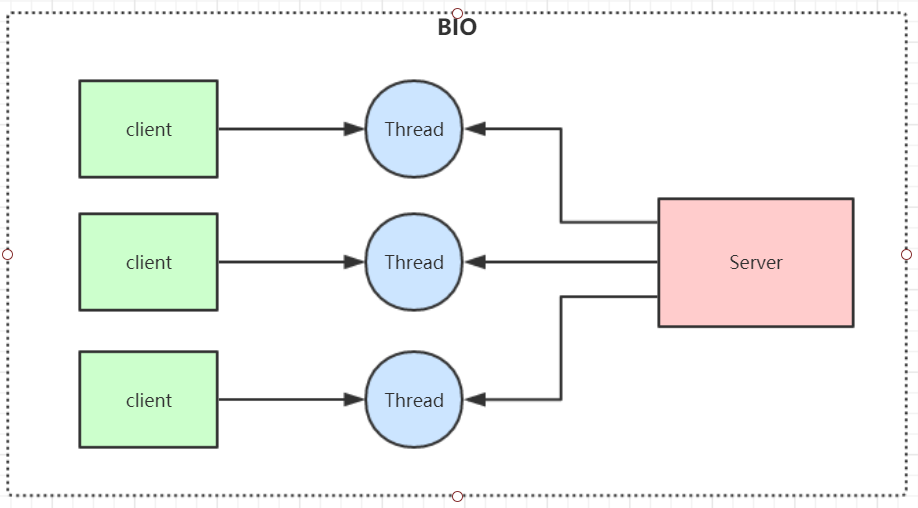

# 一、**IO模型**

IO模型就是说用什么样的通道进行数据的发送和接收，Java共支持3种网络编程IO模式：**BIO，NIO，AIO**

# 二、BIO

Blocking IO：同步阻塞模型，一个客户端连接对应一个处理线程

**缺点：**

1、IO代码里read操作是阻塞操作，如果连接不做数据读写操作会导致线程阻塞，浪费资源

2、如果线程很多，会导致服务器线程太多，压力太大。

**应用场景：**

BIO 方式适用于连接数目比较小且固定的架构，这种方式对服务器资源要求比较高，但程序简单易理解。

# 三、NIO

同步非阻塞，服务器实现模式为**一个线程可以处理多个请求(连接)**，客户端发送的连接请求都会注册到**多路复用器selector**上，多路复用器轮询到连接有IO请求就进行处理，JDK1.4开始引入。

**应用场景：**

NIO方式适用于连接数目多且连接比较短（轻操作） 的架构， 比如聊天服务器， 弹幕系统， 服务器间通讯，编程比较复杂。

#### selector+selectionKey(SocketChannel+selector)可监听连接、读、写

1.服务端：启动，新建ServerSocketChannel，注册到selector，生成selectionKey(ServerSocketChannel+selector)，负责监听连接事件。
2.客户端：启动，新建SocketChannel和selector，然后与服务端端口建立连接。
3.服务端：selector监听到连接，取出第1步的selectionKey，取到ServerSocketChannel，用ServerSocketChannel新建一个SocketChannel，注册到selector负责监听读操作。
4.客户端：建立连接成功后，把SocketChannel注册到客户端的selector，生成selectionKey，负责监听连接事件。
5.客户端：监听到第4步连接成功。取出第4步新建的selectionKey，取出SocketChannel，向该Channel写入"HelloServer"，并把该Channel注册到selector，负责监听读事件。
6.服务端：第3步中监听读事件的selector，监听到第5步客户端的事件。从selector中取出channel（第3步中的那个channel），从通道中读取到数据"HelloServer"。然后向通道写数据"HelloClient"。
7.客户端：第5步中最后负责监听的selector，监听到第6步中服务端的数据，收到"HelloClient"。客户端完成，客户端的selector继续轮询事件。
8.服务端：监听到第6步中自己的写事件，取到channel，取消监听写事件，只监听读事件。

# 四、epoll模型

I/O多路复用底层主要用的Linux 内核·函数（select，poll，epoll）来实现，windows不支持epoll实现，windows底层是基于winsock2的select函数实现的(不开源)

|              | **select**                               | **poll**                                 | **epoll(jdk 1.5及以上)**                                     |
| ------------ | ---------------------------------------- | ---------------------------------------- | ------------------------------------------------------------ |
| **操作方式** | 遍历                                     | 遍历                                     | 回调                                                         |
| **底层实现** | 数组                                     | 链表                                     | 哈希表                                                       |
| **IO效率**   | 每次调用都进行线性遍历，时间复杂度为O(n) | 每次调用都进行线性遍历，时间复杂度为O(n) | 事件通知方式，每当有IO事件就绪，系统注册的回调函数就会被调用，时间复杂度O(1) |
| **最大连接** | 有上限                                   | 无上限                                   | 无上限                                                       |

**Redis线程模型**

Redis就是典型的基于epoll的NIO线程模型(nginx也是)，epoll实例收集所有事件(连接与读写事件)，由一个服务端线程连续处理所有事件命令。

Redis底层关于epoll的源码实现在redis的src源码目录的ae_epoll.c文件里，感兴趣可以自行研究。

# 五、AIO

异步非阻塞， 由操作系统完成后回调通知服务端程序启动线程去处理， 一般适用于连接数较多且连接时间较长的应用

**应用场景：**

AIO方式适用于连接数目多且连接比较长(重操作)的架构，JDK7 开始支持。

