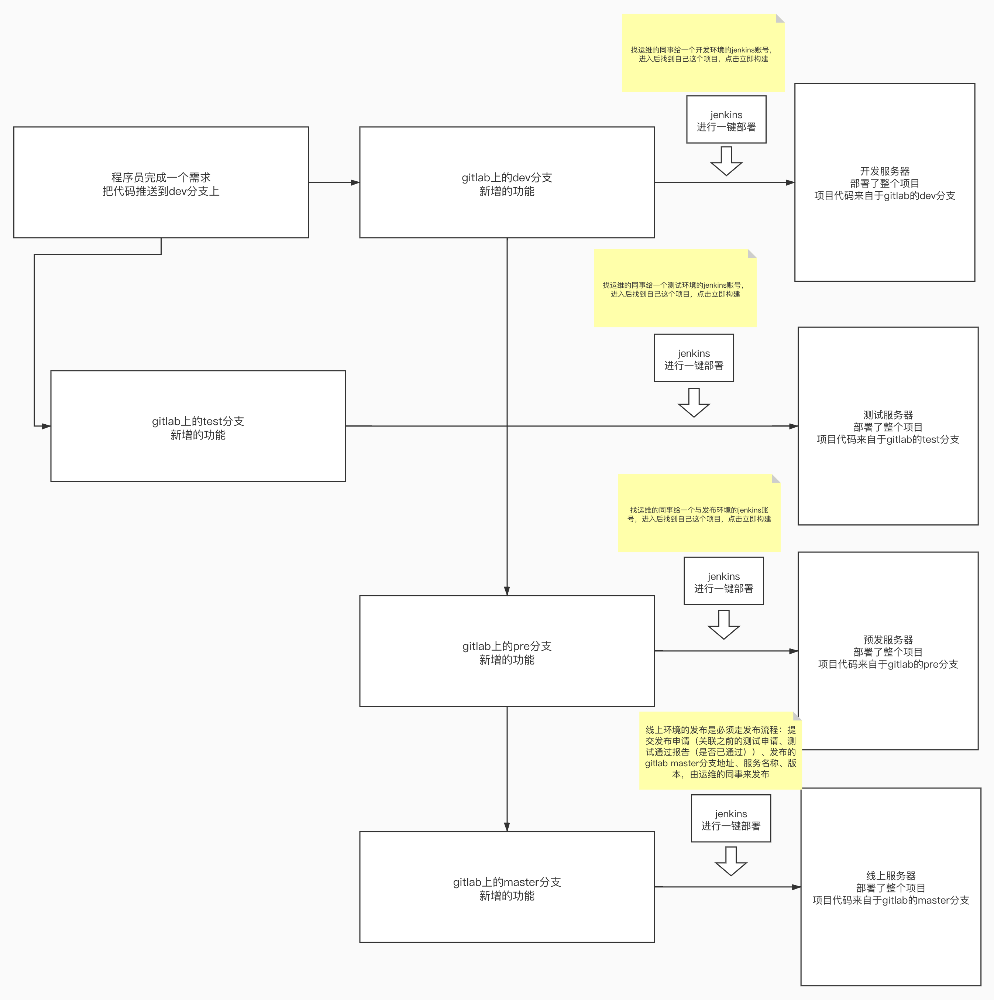
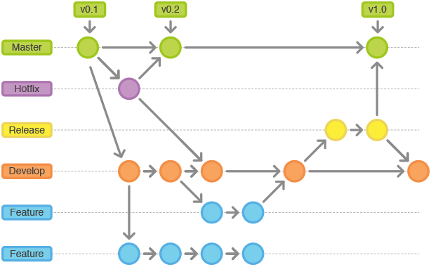
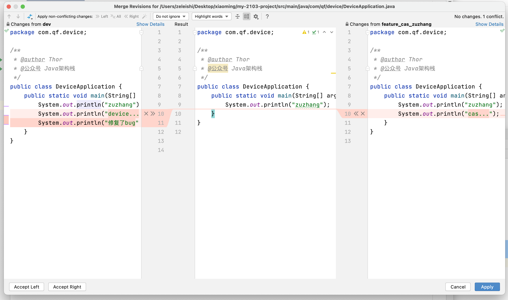
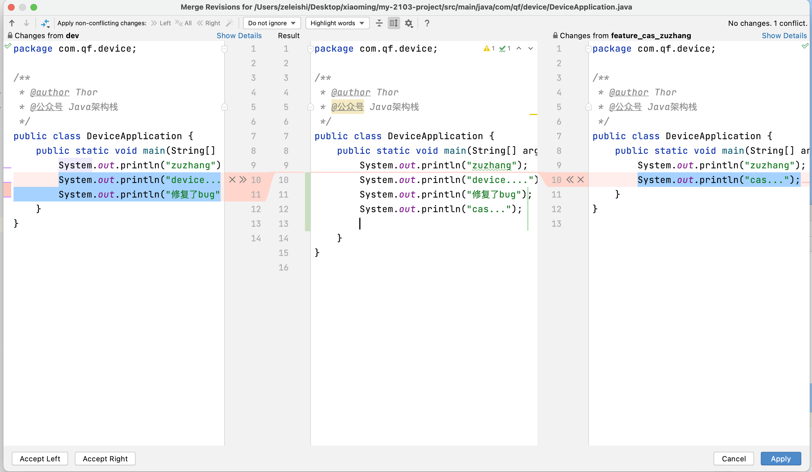

# 一、企业中多分支环境部署

# 二、Gitflow工作流介绍

## 1.工作流介绍

工作流主要有以下几种：

- 集中式工作流：类似于svn代码托管平台
- 功能分支工作流：当需要创建新的功能时，需要通过创建新的分支来开发新的功能，开发完后将分支合并到煮分支上。
- gitflow工作流：分支更多，每个分支职责更明确，分支的合并流程化，易于版本控制。
- forking 工作流：适合于超大型团队。

## 2.GitFlow工作流详解

gitflow工作流有这么一些分支：

- master：主分支，线上的代码使用的分支
- develop：开发分支，开发的主线
- feature：功能分支，从dev分支上克隆下来的分支，当需要新的功能，就需要克隆一个新的分支
- release（pre）：预发布分支，在上线之前，预发布和线上环境的数据库使用的是同一个数据库。（上线前的最后一次测试）
- Hotfix: 热修复分支，当线上代码出现bug，就会创建该分支，进行修复代码后合并到master

## 3.Pull Request合并请求

==当代码要合并到master分支上的时候才去做pull request。==

一个分支的代码要合并到目标分支的时候，需要提交pull request合并请求。

指定codereivew人员，来审查代码并决定是否合并

## 4.关于分支合并

除了pre->master是用pull request

其他的分支合并，可以通过idea中的git进行操作。

如果代码在test上，需要把代码合并到pre上：

- check out pre分支：切换到pre分支
- 选中要合并代码的test分支，选择： Merge into Current

- 把pre中的合并过来的代码推到远程仓库中。

## 5.打标签-标签的名称该怎么写

打标签的意义：

- 表示当前代码的一个最终状态
- 这个标签会出现在jenkins中，运维的同事在发布的时候，就可以选择这个标签（版本）来进行发布

标签的名称该怎么写，涉及到语义化版本规范

v1.2.3

- 3: 修改了几次bug
- 2:新增了功能
- 1:大版本的变化，比如整个系统的功能结构发生了变化。比如滴滴之前时不做两轮车业务：7.2.5==加入了两轮车业务===8.0.1

## 6.冲突怎么去解决

之前所有的动作：开发-提交-合并-打版 ，这些动作都是在组员的账号上。如果另一个开发的同事来进行提交：

- 切换到dev分支，拉取最新的dev
- 再把feature合并到dev上，此时发现有冲突，解决冲突：

发现冲突：

解决冲突：

# 三、IO模型

IO模型指的是用IO通道进行数据的传输，分成了BIO、NIO和AIO

BIO：（同步且阻塞）是比较简单的场景中使用的

NIO：同步非阻塞，是目前在并发大的情况下，基本都会采用这种方案。——Dubbo的底层通信模块里使用了Netty框架，实际就是NIO模式的实现

AIO：异步非阻塞，这种用的很少，了解即可。

## 1.BIO

## 2.NIO

## 3.AIO

参考文档