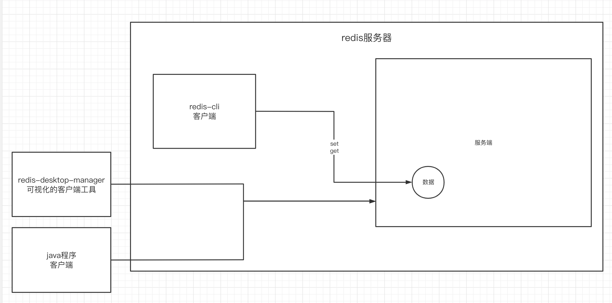
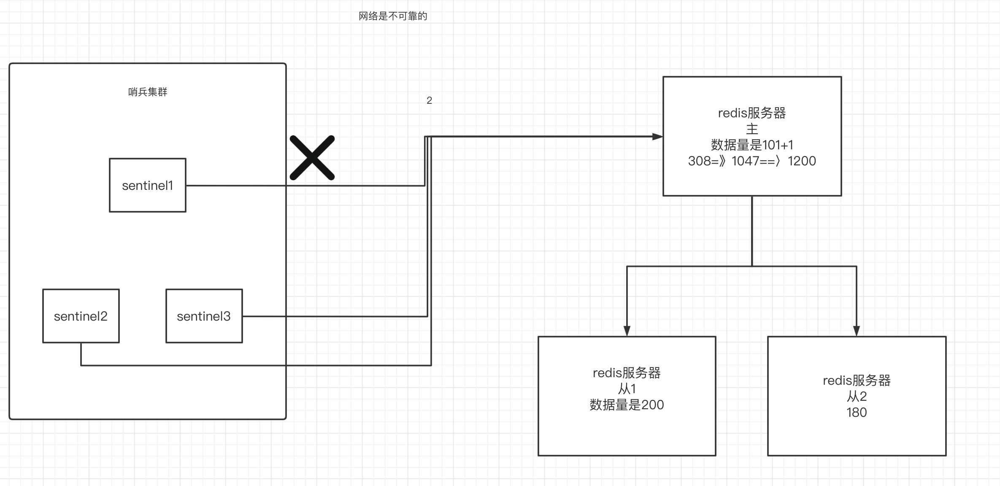

# 一、进入到第四阶段的准备工作

## 1.纪律-我们可以做到比之前的班级优秀

- 八点能到校
- 八点到了以后，去记背面试题，面试进到公司里面 没有实际开发，crud的流程？——在公司里碰到任何问题，都可以找我
- 8:50 晨考，考前一天的知识，不要去看前一天笔记，在下午的第四节课会对考的不好的同学提出要求。
- 上课时间：
  - 第一节课：9:05 - 10:10左右
  - 第二节课：10:30-11:30
  - 上午的练习时间：最后的半个小时
  - 第三节课：14:00-15:00
  - 第四节课：15:20-16:30

- 上课要做什么事情：

  唯一要做的事情：听课，有不懂的打断我

  看视屏、没有时间消化、学的比别人差、找工作：1周 4周（2周，接下来的一个月都在找工作）

  


## 2.第四阶段的项目

### 1）第四阶段主要的两大项目

数据大屏、秒杀。

### 2）其他项目：

电商闭环（视频的方式）：前台+后台

jwt：后台的权限管理（上课的形式）

2007-2101 电商闭环 秒杀 订单、购物车==》 2102、2103 秒杀、数据大屏（VUE）==〉抖音大屏、智慧城市、城市大脑。后端提供这种高性能的接口，能够让海量的数据实时的显示在前端大屏上。

- 工程架构
- 业务架构
- 中间件架构

希望通过这些架构设计，让我们的系统做到高性能、高可用。

- 什么是高性能、高可用？

高性能：应对海量的并发，2009年的双11，支付宝宕机了3分钟==》1、2秒钟的阻塞，业务不会出现宕机的。

高可用：追求的n个9，4个9，一年时间中有99.999%的时间，系统是可以用的。

- 数据大屏的接口：

可能应对海量的数据（3台kafka=》每台产生了5000万条数据），1.5亿条数据就产生了消息积压


## 3.第四阶段的学习目标

第四阶段要学的就是思想。分布式-微服务-思想


# 二、redis的应用场景

## 1.缓存服务器


## 

redis还能作为分布式session和分布式锁 的中间件来使用


## 2.redis的分布式锁应用场景


## 3.redis的介绍

redis是一个nosql数据库，所谓的nosql就是非关系型数据库。比如mysql是一个关系型数据库：创建数据库、创建表、创建字段再存数据。那么非关系型数据库很简单：就是键值对（key-value）

redis是用c开发的，是在内存中操作数据，所以性能很好，可以做到平均每秒10万次读写。redis还配了持久化机制、哨兵模式、主从方案、集群搭建方案，所以现在使用redis作为非关系型数据库是一个很好的选择。


# 三、redis的安装和使用

## 1.redis的安装

编写docker-compose.yml文件

```yml
version: '3.1'
services:
  redis:
    image: daocloud.io/library/redis:5.0.7
    restart: always
    container_name: redis
    environment:
      - TZ=Asia/Shanghai
    ports:
      - 6379:6379
```


## 2.启动后用客户端进行操作即可

- 进入到容器内部

```shell
docker exec -it 容器id bash
```

- 执行redis-cli

使用redis命令操作redis存取键值对

```shell
set k1 v1
get k1
```


## 3.redis的服务端和客户端模式

redis服务器内部又是一种客户端和服务端模式，客户端可以有以下几种：

- redis-cli：官方提供的客户端工具，可以连接指定的redis服务器
- rdm：redis桌面管理工具，提供可视化的管理
- java程序客户端：自己写的java程序来操作redis




# 四、redis内部的数据结构（非常重要）

## 1.redis数据结构概述——针对于值的数据结构来讨论

redis为什么这么受欢迎，有很大的一部分原因，是redis拥有非常丰富的数据结构。什么叫数据结构，就是存储数据的结构，也就是说redis用什么样的结构来存储值的数据。

redis中所有的键都是string类型，但是值的类型有以下几种：

- string：字符串
- hash：哈希表
- list：列表
- set：集合
- zset：有序集合


## 2.string类型

string类型是redis中最基本的和最常用的一种数据结构。

所有操作String类型的命令：

```shell
# 向redis服务器设置一个键值对，值是string类型的值,如果键相同，则值会被覆盖
set k1 v1
# 
get k1
# 一次存储多个键值对
mset k1 v1 k2 v2 k3 v3
# 一次取多个键值对
mget k1 k2 k3
# 会对age值进行+1，redis会对integer的值做一个自动类型转换，前提是值是一个数值（integer）
incr age
# 设置了步长
incrby age 2
# 减少
decr age
#
decrby age 2
# 删除
del age
# 上分布式锁，如果mylock存在，则设置失败返回0，否则返回1
setnx mylock abc
# 设置k1的过期时间
expire k1 10
# 查看k1的过期时间
ttl k1
# 让k1永久存活
persist k1
# 设置键值对，同时设置它的超时时间
setex k4 20 v4
# 追加内容
append k2 vvv
# 查看字符串长度
strlen k2
```


## 3.hash类型

键还是一个字符串，但是值是由一个或多个属性和属性值组成的。

student对象信息：

```java
public class Student{
  private Long id;
  private String name;
  private int age;
}

Student stu = new Student(1001L,"xiaoming",21)
```


**redis中如何存储对象信息：**

- 用string来存整个对象数据

```shell
student:1001:name == xiaoming
student:1001:age == 20

student:1002:name == xiaoli
student:1002:age == 21
```

- 用json来存对象

```json
set student:1002 '{"id":1001,"name":"xiaoli","age":21}'
```

- 用hash类型来存（性能更好）

```shell
172.16.253.34:6379> hset student:1003 id 1003
(integer) 1
172.16.253.34:6379> hset student:1003 name xiaowang
(integer) 1
172.16.253.34:6379> hset student:1003 age 21
(integer) 1

```


**hash类型的基本操作**

```shell
# 向student:1001键存入一个值。值的类型是hash类型，hash类型来说值是多个键值对（属性和属性值）组成的
hset student:1001 name xiaoming
hset student:1001 age 20
# 一次性设置多个属性属性值
hmset student:1004 name xiaowang age 20 birthday 2001
# 一次型获取所有的属性属性值
hgetall student:1003
# 获取某一个属性的值
hget student:1003 name
# 一次型获取多个属性值
hmget student:1004 name age birthday
# 增加
hincrby student:1004 age 1
# 判断某个属性是否存在
HEXISTS student:1004 birthday
# 获取所有的属性的集合
hkeys student:1004
# 获取所有的值的集合
hvals student:1004
# 删除一个或多个属性属性值
hdel student:1004 birthday
# 获取属性的个数
hlen student:1004
```

## 4.list类型

redis的list类型，通过lpush、rpush、lpop、rpop可以方便的实现出队列和栈的效果。

队列： 先进先出

栈：先进后出

list的常用命令

```shell
# 从左边向队列中添加数据
lpush mylist a b c
# 查看队列中的数据 0是起始位置，-1标识最后一位，也可以是具体的位置索引
lrange mylist 0 -1
# 从右边弹出一个数据
rpop mylist
# 从右边添加
rpush mylist a b c
# 从左边弹出
lpop mylist
# 给列表的指定位置设置一个值
lset mylist 1 z
# 获取列表的指定位置的值
lindex mylist 1
# 获取列表的长度
llen mylist
# 删除列表中指定个数的指定值
lrem mylist 2 a
# 保留该索引范围的元素
ltrim mylist 1 4
# 合并两个链表（一次只弹出一个）
rpoplpush mylist1 mylist2

```


## 5.set类型

set是redis中的集合。redis中的集合跟java中集合的概念相同，都是存储 不能重复，无序的数据。

set集合的常用命令

```shell
# 添加元素到集合中
sadd myset a b c
# 输出集合中所有元素
smembers myset
# 从集合中随机弹出一个元素
spop myset
# 删除集合中的指定元素
srem myset a
# 判断元素是否在集合中
sismember myset a
# 求两个集合的交集
sinter myset1 myset2
# 求两个集合的并集
sunion myset1 myset2
# 求第一个集合在第二个集合中的差集
sdiff myset1 myset2
```


## 6.zset类型

有序的集合，排序依据是分数。比如说微博的热搜排行榜，这些热搜数据的统计是发生非常频繁的用户行为触发的接口。肯定不能用mysql来维护，因为性能不ok，因此用redis，那么redis的什么数据类型来维护呢？——zset

```shell
1.***公司
2.奥运
3.////
```


zset的相关命令

```shell
# 向有序的集合中添加元素，指明分数
zadd myzset 2000 nba 2001 wnba 1999 cba
# 升序输出集合中的元素
zrange myzset 0 -1
# 降序输出集合中的元素
zrevrange myzset 0 -1
# 给集合中的元素加分数
zincrby myzset 2 nba
# 获得集合中的元素的分数
zscore myzset nba
# 获得指定分数范围内的元素个数
zcount myzset 2000 3000
# 获得指定分数范围内的元素
zrangebyscore myzset 2000 3000
# 获得集合中的元素个数
zcard myzset
# 删除集合中的元素
zrem myzset nba
```


# 五、java客户端-Maven工程

## 1.引入依赖

```xml

  <dependencies>
    <!--    1、 Jedis-->
    <dependency>
      <groupId>redis.clients</groupId>
      <artifactId>jedis</artifactId>
      <version>2.9.0</version>
    </dependency>
    <!--    2、 Junit测试-->
    <dependency>
      <groupId>junit</groupId>
      <artifactId>junit</artifactId>
      <version>4.12</version>
    </dependency>
    <!--    3、 Lombok-->
    <dependency>
      <groupId>org.projectlombok</groupId>
      <artifactId>lombok</artifactId>
      <version>1.16.20</version>
    </dependency>
  </dependencies>

```


## 2.编写连接池工具类

```java
package com.qf.jedis.util;

import org.apache.commons.pool2.impl.GenericObjectPoolConfig;
import redis.clients.jedis.Jedis;
import redis.clients.jedis.JedisPool;

public class JedisUtil {

  private static GenericObjectPoolConfig poolConfig ;
  private static String host;
  private static JedisPool jedisPool;

  static{

    poolConfig = new GenericObjectPoolConfig();
    poolConfig.setMaxIdle(10);
    poolConfig.setMaxTotal(10);//连接池的性能最好的时候，池中有10个连接被使用，且最大连接数是10
    poolConfig.setMinIdle(4);//最小连接数
    poolConfig.setMaxWaitMillis(3000);
    host = "172.16.253.34";

    //1.初始化连接池的配置
    jedisPool = new JedisPool(poolConfig,host);
  }

  /**
   * 获得一个连接对象
   * @return
   */
  public static Jedis getJedis(){
    Jedis jedis = jedisPool.getResource();
    return jedis;
  }

  /**
   * 获得连接池对象
   * @return
   */
  public static JedisPool getJedisPool(){
    return jedisPool;
  }

}

```


## 3.熟悉jedis的api

发现jedis中的api基本上redis-cli中的命令是一致的。


## 4.如何向redis中保存对象

提供了几种方案：

```java
=============用redis的hash来存对象==============
/**
   * 存储java对象
   * 向redis保存一个hash对象
   */
  @Test
  public void testHashObjectToReids(){
    //1.从连接池中获得一个连接对象
    Jedis jedis = JedisUtil.getJedis();

    Student stu = new Student();
    stu.setId(2001L);
    stu.setName("xiaoming");
    stu.setAge(20);

    //2
    Map<String,String> map = new HashMap<>();
    map.put("id",String.valueOf(stu.getId()));
    map.put("name",stu.getName());
    map.put("age",String.valueOf(stu.getAge()));
    jedis.hmset("student1:2001",map);


  }

=============用Spring的序列化工具序列化对象为byte数组来存对象==============

  /**
   * 取java对象
   */
  @Test
  public void testGetObjectFromRedis(){
    //1.从连接池中获得一个连接对象
    Jedis jedis = JedisUtil.getJedis();
    String key = "stu:2001";
    //序列化键
    byte[] keyBytes = SerializationUtils.serialize(key);

    //从redis中取值
    byte[] valueBytes = jedis.get(keyBytes);
    //反序列化
    Object deserialize = SerializationUtils.deserialize(valueBytes);
    if(deserialize instanceof Student){
      Student stu = (Student) deserialize;
      System.out.println(stu);
    }

  }


  /**
   * 存储java对象
   */
  @Test
  public void testObjectToRedis(){
    //1.从连接池中获得一个连接对象
    Jedis jedis = JedisUtil.getJedis();

    Student stu = new Student();
    stu.setId(2001L);
    stu.setName("xiaoming");
    stu.setAge(20);


    String key = "stu:2001";

    byte[] keyBytes = SerializationUtils.serialize(key);

    byte[] valBytes = SerializationUtils.serialize(stu);


    jedis.set(keyBytes,valBytes);


  }


=============用json来存取对象==============

  /**
   * 从redis中取数据
   */
  @Test
  public void testGetObject(){
    //1.从连接池中获得一个连接对象
    Jedis jedis = JedisUtil.getJedis();
    String json = jedis.get("student:2001");
    //2.将json解析成java对象
    Student student = JSONObject.parseObject(json, Student.class);
    System.out.println(student);


  }

  /**
   * 存储java对象
   * 向redis保存一个json字符串
   */
  @Test
  public void testObject(){
    //1.从连接池中获得一个连接对象
    Jedis jedis = JedisUtil.getJedis();

    Student stu = new Student();
    stu.setId(2001L);
    stu.setName("xiaoming");
    stu.setAge(20);

    //2.转换成json字符串
    String json = JSONObject.toJSONString(stu);
    jedis.set("student:"+stu.getId(),json);


  }

```


# 六、springboot中使用redis

## 1.如何在springboot中使用redis

- 引入依赖

```xml
<dependency>
      <groupId>org.springframework.boot</groupId>
      <artifactId>spring-boot-starter-data-redis</artifactId>
    </dependency>

```

- 编写配置文件

```yml
server:
  port: 8090
spring:
  redis:
    host: 172.16.253.34
    jedis:
      pool:
        max-active: 10
        max-idle: 10
        min-idle: 4
```

- 使用注解引入RedisTemplate
- 操作redis

```java
package com.qf.myspringbootredisdemo;

import org.junit.jupiter.api.Test;
import org.springframework.beans.factory.annotation.Autowired;
import org.springframework.boot.test.autoconfigure.web.servlet.AutoConfigureMockMvc;
import org.springframework.boot.test.context.SpringBootTest;
import org.springframework.data.redis.core.RedisTemplate;
import org.springframework.data.redis.core.ValueOperations;

import java.util.concurrent.TimeUnit;

@SpringBootTest
class MySpringBootRedisDemoApplicationTests {

  /**
   * 用来操作redis服务器的：
   * 操作redis的五种数据类型
   */
  @Autowired
  private RedisTemplate redisTemplate;


  @Test
  public void testRedisString(){

    //操作redis 来存入一个值
    ValueOperations valueOperations = redisTemplate.opsForValue();
    valueOperations.set("springboot:redis:1001","abc",10, TimeUnit.MINUTES);
  }

  @Test
  void contextLoads() {
  }

}

```

在企业中我们会去封装一些工具类。来对redisTemplate进行封装。

## 2.快速查看redisTemplate中的各种数据类型的操作api

- opsForValue == String
- opsForHash == Hash
- opsForList == List
- opsForSet ==set
- opsForZset == zset


## 3.RedisTemplate的序列化器

RedisTemplate在操作的过程中需要对数据进行序列化和反序列化

```java
@Test
  public void testRedisString(){

    //操作redis 来存入一个值
    ValueOperations valueOperations = redisTemplate.opsForValue();
    valueOperations.set("springboot:redis:1001","abc",10, TimeUnit.MINUTES);


  }

  @Test
  public void testRedisGetString(){

    //操作redis 来存入一个值
    ValueOperations valueOperations = redisTemplate.opsForValue();
    String value = (String) valueOperations.get("springboot:redis:1001");
    System.out.println(value);


  }
```

那么序列化的方案能不能自己选择呢？——RedisTEmplate的序列化器

RedisTemplate可以设置键和值的序列化器，序列化器有两个选择：

```java
- StringRedisSerializer：会把数据转换成String
- JdkSerializationRedisSerializer（默认的）：会把数据转换成byte[]


  redisTemplate.setKeySerializer(new StringRedisSerializer());
  redisTemplate.setValueSerializer(new StringRedisSerializer());
```

注意：存的时候和取的时候，序列化器得是相同的。

# 七、redis的配置文件

## 1.配置redis服务器的密码

- 把从官方下载的redis.conf文件复制到虚拟机中
- 修改这个文件

```shell
# bind 127.0.0.1 注释掉
protected-mode no # 保护模式设置成no
requirepass qfjava #设置密码
```

- 启动redis服务器的时候带着配置文件来启动——修改docker-compose.yml

```yml
version: '3.1'
services:
  redis:
    image: daocloud.io/library/redis:5.0.7
    restart: always
    container_name: redis
    environment:
      - TZ=Asia/Shanghai
    ports:
      - 6379:6379
    # 增加下面两个配置
    volumes:
      - ./conf/redis.conf:/usr/local/redis/redis.conf
    command: ["redis-server","/usr/local/redis/redis.conf"]

```

- 使用客户端时需要带着密码

  - redis-cli： auth qfjava
  - java客户端：

  ```yml
  spring:
    redis:
      host: 172.16.253.34
      jedis:
        pool:
          max-active: 10
          max-idle: 10
          min-idle: 4
      password: qfjava
  ```

  

## 2.redis的事务

redis也支持事务，但是redis的事务不严谨。如果有的语句在格式上没有问题，但是在执行时报错了，那么这个事务不会回滚。

redis操作事务的方案：

```shell
multi: 开启事务
exec: 提交事务
discard: 回滚事务
```


## 3.redis中的管道(流水线)

redis的瓶颈不是在它的性能，而在于网络io，因此可以把多条命令封装在管道中，交给redis一起执行。减少io的次数。

```java
 @Test
  public void testPipeline(){
    long start = System.currentTimeMillis();

    redisTemplate.executePipelined(new SessionCallback() {
      @Override
      public Object execute(RedisOperations operations) throws DataAccessException {
        for (int i = 0; i < 10000; i++) {
          operations.opsForValue().set("k"+i,"a"+i);
        }
        return null;
      }
    });
    long end = System.currentTimeMillis();
    System.out.println("消耗的时间："+(end-start));
  }
```


# 八、redis的持久化机制

## 1.概述

redis性能为什么好。很大一部分原因是因为redis使用内存来操作数据。内存操作数据会有一个弊端，就是当服务器重启后，内存会被清理，数据就丢失了，所以redis提供了持久化机制，让数据保存到磁盘。

我们关注点的是redis通过怎样的持久化机制，既能保证数据安全，又能做到性能优秀！


## 2.RDB快照机制(默认开启的)

Redis.conf中的rdb的配置

```shell
################################ SNAPSHOTTING  ################################
#
# Save the DB on disk:
#
#   save <seconds> <changes>
#
#   Will save the DB if both the given number of seconds and the given
#   number of write operations against the DB occurred.
#
#   In the example below the behaviour will be to save:
#   after 900 sec (15 min) if at least 1 key changed
#   after 300 sec (5 min) if at least 10 keys changed
#   after 60 sec if at least 10000 keys changed
#
#   Note: you can disable saving completely by commenting out all "save" lines.
#
#   It is also possible to remove all the previously configured save
#   points by adding a save directive with a single empty string argument
#   like in the following example:
#
#   save ""

save 900 1
save 300 10
save 60 10000

```


注意：dump.rdb文件会在保存时生成。需要通过数据卷挂载出来。

如果没有满足上面的三个条件。保存的动作不会被触发。

除了上面三个条件外。还有两种情况可以触发保存：

- 容器重启、服务器下线（正常）。数据会被强制的保存进dump.rdb中
- save: 手动使用save命令，来进行一次保存
- bgsave:开启一条子进程做保存的动作。不让主进程阻塞。


## 3.AOF日志机制

如果希望redis在持久化方面做的更加的安全一些，那么就可以开启日志模式。

```shell
############################## APPEND ONLY MODE ###############################

# By default Redis asynchronously dumps the dataset on disk. This mode is
# good enough in many applications, but an issue with the Redis process or
# a power outage may result into a few minutes of writes lost (depending on
# the configured save points).
#
# The Append Only File is an alternative persistence mode that provides
# much better durability. For instance using the default data fsync policy
# (see later in the config file) Redis can lose just one second of writes in a
# dramatic event like a server power outage, or a single write if something
# wrong with the Redis process itself happens, but the operating system is
# still running correctly.
#
# AOF and RDB persistence can be enabled at the same time without problems.
# If the AOF is enabled on startup Redis will load the AOF, that is the file
# with the better durability guarantees.
#
# Please check http://redis.io/topics/persistence for more information.
# 设置成yes：开启日志机制
appendonly yes

# The name of the append only file (default: "appendonly.aof")

appendfilename "appendonly.aof"

```

当发生redis的操作的时候，就会把具体的操作命令写入到日志中

疑惑？

- 什么时候写？ 默认是每秒同步一次。appendfsync everysec
- 这个日志文件会不会越来越大？当日志文件越来越大后，会触发==重写机制==。

```shell
# 下一次重写触发的文件大小是上一次的2倍
auto-aof-rewrite-percentage 100
# 最小的重写触发时的文件大小
auto-aof-rewrite-min-size 64mb 
```


# 九、redis的主从架构

## 1.应用背景

我们希望redis能够实现一个高性能和高可用的状态。而不是单节点，因为单节点会存在单点故障问题。


## 2.主从搭建

- 编写3个redis.conf文件。其中两个：redis2.conf和redis3.conf中加入如下的配置

```shell
# Master-Replica replication. Use replicaof to make a Redis instance a copy of
# another Redis server. A few things to understand ASAP about Redis replication.
#
#   +------------------+      +---------------+
#   |      Master      | ---> |    Replica    |
#   | (receive writes) |      |  (exact copy) |
#   +------------------+      +---------------+
#
# 1) Redis replication is asynchronous, but you can configure a master to
#    stop accepting writes if it appears to be not connected with at least
#    a given number of replicas.
# 2) Redis replicas are able to perform a partial resynchronization with the
#    master if the replication link is lost for a relatively small amount of
#    time. You may want to configure the replication backlog size (see the next
#    sections of this file) with a sensible value depending on your needs.
# 3) Replication is automatic and does not need user intervention. After a
#    network partition replicas automatically try to reconnect to masters
#    and resynchronize with them.
#
replicaof master 6379

# If the master is password protected (using the "requirepass" configuration
# directive below) it is possible to tell the replica to authenticate before
# starting the replication synchronization process, otherwise the master will
# refuse the replica request.
#
masterauth qfjava

```

- 编写docker-compose文件

```yml
version: "3.1"
services:
  redis1:
    image: daocloud.io/library/redis:5.0.7
    restart: always
    container_name: redis1
    environment:
      - TZ=Asia/Shanghai
    ports:
      - 7001:6379
    volumes:
      - ./conf/redis1.conf:/usr/local/redis/redis.conf
    command: ["redis-server","/usr/local/redis/redis.conf"]
  redis2:
    image: daocloud.io/library/redis:5.0.7
    restart: always
    container_name: redis2
    environment:
      - TZ=Asia/Shanghai
    ports:
      - 7002:6379
    volumes:
      - ./conf/redis2.conf:/usr/local/redis/redis.conf
    links:
      - redis1:master
    command: ["redis-server","/usr/local/redis/redis.conf"]
  redis3:
    image: daocloud.io/library/redis:5.0.7
    restart: always
    container_name: redis3
    environment:
      - TZ=Asia/Shanghai
    ports:
      - 7003:6379
    volumes:
      - ./conf/redis3.conf:/usr/local/redis/redis.conf
    links:
      - redis1:master
    command: ["redis-server","/usr/local/redis/redis.conf"]
```

## 3.主从数据同步过程

主从节点会建立长连接进行数据同步。在这个过程中，第一次是全量复制。之后是增量复制。关于主从复制原理、断点续传、主从复制风暴的问题，查看“redis高级”文档。


# 十、redis的sentinel哨兵模式

## 1.应用场景

对于redis 的集群主从架构来说。需要有一个帮助自动完成主从崩溃恢复选举的操作——通过哨兵来实现。



注意几个点：

- 哨兵集群要奇数台，建议3台
- 选举的投票个数是2
- 哨兵集群要部署在不同的服务器上，避免网络故障


## 2.搭建哨兵集群


# 十一、搭建多主多从的redis-cluster集群

## 1.应用背景

为了提升写的性能，主节点也可以做集群，但是为了访问数据同步带来的复制风暴，使用了一致性hash环来解决数据一致性问题。


## 2.操作集群的命令

- 集群搭建参考文档即可
- 使用`redis-cli -c -h 集群ip -p 某个主节点的端口`


## 3.redis-cluster的主从选举机制

当redis-cluster集群中某个主节点挂了。于是从节点开始进行崩溃恢复。此时如果主节点有多个从节点，就要进行集群选主

- 每个从节点向其他主节点发送请求
- 其他主节点返回ack给从节点
- 优先收到半数以上ack的从节点将成为主节点
- 其他主节点会延时发送ack给从节点，延时的依据是从节点的复制是否是最新的。如果最新，延时越小。


## 4.springboot中连接redis-cluster

```yml
spring:
  redis:
    host: 172.16.253.34
    jedis:
      pool:
        max-active: 10
        max-idle: 10
        min-idle: 4
    password: qfjava
    cluster:
      nodes: 172.16.253.34:7001,172.16.253.34:7002,172.16.253.34:7003
```


# 十二、redis应用场景的补充

## 1.分布式session

如果服务冗余部署，那么本地session就不能在分布式环境下使用，因此可以用redis作为分布式session的解决方案


## 2.其他的应用场景

- 计数器
- 阻塞列队
- 分布式锁   opsForValue.setnx()
- 热点缓存
- 排行榜
- 社交类的场景，关注、共同关注、点赞、可能认识
- 电商的购物车


# 十三、redis的淘汰机制

为什么要有淘汰机制，为了优化redis中的内存空间，redis的淘汰机制从两个维度去讲：

- redis中已过期的键如何删除
- redis中未过期的键是否会被删除

## 1.已过期的键的删除策略

redis中已过期的键是否会立即被删除？不会

- 惰性删除：如果redis中的键已过期，不会立即被删除，当发生对这个过期键的读写时，此时redis发现这个键已过期，于是将其删除。
- 主动删除：如果redis中的键已过期且没有触发惰性删除，那么redis会在一定的时间后进行主动删除。

## 2.未过期的键的删除策略

前提：当redis中的内存达到了设置的最大内存时，那么就出发了未过期键的主动清理策略(MAXMEMORY POLICY)。


```shell
# MAXMEMORY POLICY: how Redis will select what to remove when maxmemory
# is reached. You can select among five behaviors:
#
# volatile-lru -> Evict using approximated LRU among the keys with an expire set.
# allkeys-lru -> Evict any key using approximated LRU.
# volatile-lfu -> Evict using approximated LFU among the keys with an expire set.
# allkeys-lfu -> Evict any key using approximated LFU.
# volatile-random -> Remove a random key among the ones with an expire set.
# allkeys-random -> Remove a random key, any key.
# volatile-ttl -> Remove the key with the nearest expire time (minor TTL)
# noeviction -> Don't evict anything, just return an error on write operations.
#
# LRU means Least Recently Used
# LFU means Least Frequently Used
#
# Both LRU, LFU and volatile-ttl are implemented using approximated
# randomized algorithms.
#
# Note: with any of the above policies, Redis will return an error on write
#       operations, when there are no suitable keys for eviction.
#
#       At the date of writing these commands are: set setnx setex append
#       incr decr rpush lpush rpushx lpushx linsert lset rpoplpush sadd
#       sinter sinterstore sunion sunionstore sdiff sdiffstore zadd zincrby
#       zunionstore zinterstore hset hsetnx hmset hincrby incrby decrby
#       getset mset msetnx exec sort
#
# The default is:
# maxmemory-policy noeviction

```


会选择使用volatile-lru这种策略，但是会对性能有影响。在生产环境中，对于这一块的设置是都允许的，因为在某些情况下，比如代码出现了bug（消息积压，导致redis内存快速增长），即使选择了淘汰策略，redis依然会长时间处于内存爆满的情况，导致接口响应速度过慢。导致服务雪崩。对于运维的同事来说，redis的内存情况是经常要查看的。比如redis用了60%，正常情况下，redis的内存使用率是基本稳定的。


## 3.如何删除？

redis如何取样来删除目标key

```shell
# The default of 5 produces good enough results. 10 Approximates very closely
# true LRU but costs more CPU. 3 is faster but not very accurate.
#
# maxmemory-samples 5

```

通过样本数的设置，redis会每次取默认5个key作为删除的范围，在5个key里删除一个最近最少频率使用的。

如果设成10，最准确，但性能最差。如果设成3，最快但不准确。保持默认就行了


# 十四、【重要】redis的缓存问题（雪崩、穿透、击穿）

redis在作为缓存服务器时会存在雪崩、穿透、击穿的问题。得需要通过程序的设计来解决。

## 1.缓存穿透

理想状态：


理想状态是mysql中数据肯定存在，第一次访问mysql，之后的每次访问都访问redis。

但是会有这两种情况：

- 主动的攻击
- 自身的代码出现了bug，数据库中拿到的数据是null值

主动去访问MySQL中不存在的数据，造成了之后的每次都在访问MySQL——主动的攻击行为

```java
package com.qf.myspringbootredisdemo;

import org.junit.jupiter.api.Test;
import org.junit.platform.commons.util.StringUtils;
import org.springframework.beans.factory.annotation.Autowired;
import org.springframework.boot.test.context.SpringBootTest;
import org.springframework.data.redis.core.RedisTemplate;

@SpringBootTest
public class TestBrokeCache {


  @Autowired
  private RedisTemplate redisTemplate;


  /**
   * 模拟从数据库获取数据。但是数据库中只有id：1-10的数据
   * @param id
   */
  public String getValueFromDB(int id){

    if(id>10){
      //说明数据库中没有该id的数据
      return null;
    }
    //返回数据
    return "v"+id;

  }

  @Test
  public void testQuery(){

    for (int i = 11; i <= 20; i++) {
      String value = (String) redisTemplate.opsForValue().get("k" + i);
      if(StringUtils.isBlank(value)){
        //redis中的数据是空的=》查询数据库
        String valueFromDB = getValueFromDB(i);
        //把数据存到redis中
        redisTemplate.opsForValue().set("k" + i,valueFromDB);
        System.out.println("查询数据库");
        continue;
      }
      //查到数据后的业务
      System.out.println("查询缓存");
    }
  }

//  @Test
//  public void initCache(){
//    for (int i = 1; i <= 10; i++) {
//      //模拟从数据库获取数据存入到redis中
//      redisTemplate.opsForValue().set("k"+i,"v"+i);
//    }
//
//
//  }

}

```

解决方案：

- 解决方案一：如果MySQL中查到的数据是空的，那么创建一个空的没有意义的对象，存到redis中，并设置过期时间。

这种方式简单粗暴。


```java
 @Test
  public void testQuery(){

    for (int i = 61; i <= 70; i++) {
      String value = (String) redisTemplate.opsForValue().get("k" + i);
      if(Objects.isNull(value)){
        //redis中的数据是空的=》查询数据库
        String valueFromDB = getValueFromDB(i);
        if(Objects.isNull(valueFromDB)){
          //主动创建一个没有意义的空的对象。进行缓存。并设置有效期
          valueFromDB = new String();
          redisTemplate.opsForValue().set("k" + i,valueFromDB,300, TimeUnit.SECONDS);
          System.out.println("查询数据库");
        }else{
          //把数据存到redis中
          redisTemplate.opsForValue().set("k" + i,valueFromDB);
          System.out.println("查询数据库");
        }
        continue;
      }
      //查到数据后的业务
      System.out.println("查询缓存");
    }
  }

```

- 解决方案二：布隆过滤器

  布隆过滤器提供了一个很大的位数组+多个hash函数。

  

  - 存数据：多个hash函数计算出多个值，取模位数组的长度，得到多个索引位置，在位置上标1
  - 取数据：跟存数据一样，判断索引位置上的值，只要有0就肯定不存在，则不放行。如果全是1，则可能存在，则放行。

使用布隆过滤器的步骤：

- 引入依赖

```xml
<dependency>
      <groupId>org.redisson</groupId>
      <artifactId>redisson</artifactId>
      <version>3.6.5</version>
    </dependency>
```


- 示例：

```java
package com.qf.myspringbootredisdemo;

import org.junit.jupiter.api.Test;
import org.redisson.Redisson;
import org.redisson.api.RBloomFilter;
import org.redisson.api.RedissonClient;
import org.redisson.config.Config;
import org.springframework.boot.test.context.SpringBootTest;

@SpringBootTest
public class TestBoolFilter {

  @Test
  public void testBool(){


    Config config = new Config();
    config.useSingleServer().setAddress("redis://172.16.253.34:6379");
    config.useSingleServer().setPassword("qfjava");
    //构造Redisson
    RedissonClient redisson = Redisson.create(config);

    RBloomFilter<String> bloomFilter = redisson.getBloomFilter("nameList");
    //初始化布隆过滤器：预计元素为100000000L,误差率为3%,根据这两个参数会计算出底层的bit数组大小
    bloomFilter.tryInit(100000000L,0.03);
    //将xiaoming插入到布隆过滤器中
    bloomFilter.add("xiaoming");

    //判断下面号码是否在布隆过滤器中
    System.out.println(bloomFilter.contains("xiaoli"));//false
    System.out.println(bloomFilter.contains("xiaowang"));//false
    System.out.println(bloomFilter.contains("xiaoming"));//true
  }
}

```


## 2.缓存击穿

如果大量的缓存数据的到期时间是相同的，就有可能恰巧在到期时涌入了海量的请求同时访问数据库，造成缓存击穿。

针对这种情况可以给设置缓存中的数据的过期时间为不同的时间。

```java
//设置一个过期时间(300到600之间的一个随机数)
int expireTime = new Random().nextInt(300)  + 300;
```


## 3.缓存雪崩

当缓存出现了问题，缓存失效大量请求直接访问MySQL，MySQL被打爆导致服务宕机，服务宕机会造成级联崩盘，出现雪崩的效果。

怎么解决：

- 使用缓存的集群。实现redis的高性能和高可用
- 设置熔断器
- 压测项目的最大并发数，设置限流方案。


## 4.热点缓存重建问题

在并发量大的情况下，热点缓存的重建可能会造成缓存击穿的情况，上锁是一种解决方案

出现问题的示例代码

```java
package com.qf.myspringbootredisdemo;

import com.qf.myspringbootredisdemo.entity.Site;
import org.junit.jupiter.api.Test;
import org.springframework.beans.factory.annotation.Autowired;
import org.springframework.boot.test.context.SpringBootTest;
import org.springframework.data.redis.core.RedisTemplate;

import java.util.ArrayList;
import java.util.List;
import java.util.Objects;
import java.util.concurrent.ExecutorService;
import java.util.concurrent.Executors;
import java.util.concurrent.TimeUnit;

/**
 * 热点缓存重建优化
 */
@SpringBootTest
public class TestHotCache {

  @Autowired
  private RedisTemplate redisTemplate;

  @Test
  public void testBreak(){

    //创建多线程。模拟并发，让100条线程一起执行getSiteFromDB()这个方法。
    ExecutorService threadPool = Executors.newFixedThreadPool(100);
    for (int i = 0; i < 100; i++) {
      //被线程池执行的任务
      Runnable runnable = new Runnable() {
        @Override
        public void run() {
          getSiteFromDB();
        }
      };
      threadPool.submit(runnable);
    }

    try {
      Thread.sleep(100000000000L);
    } catch (InterruptedException e) {
      e.printStackTrace();
    }
  }


  @Test
  public void getSiteFromDB(){

    //1.先从缓存中拿数据
    List<Site> siteList = (List<Site>) redisTemplate.opsForValue().get("site2:list");
    if(Objects.isNull(siteList)){
      //2.缓存中没有，去数据库中拿
      //模拟数据库中
      siteList = new ArrayList<>();
      Site site1 = new Site();
      Site site2 = new Site();
      site1.setId(1001L);
      site1.setName("人脸识别");
      site2.setId(1002L);
      site2.setName("测温闸机");
      siteList.add(site1);
      siteList.add(site2);
      System.out.println("从数据库获取数据");
      //3.存入到缓存里面
      redisTemplate.opsForValue().set("site2:list",siteList,60, TimeUnit.SECONDS);
      return;
    }
    System.out.println("从缓存中获取");
  }


}
```

- 解决方案一：使用本地锁synchronized, 本地锁在服务冗余部署时会出现锁的不能互斥的情况。


- 解决方案二：使用redis做分布式锁，已经能够解决问题，但是下面这种方案有可能会出现死锁(锁中出异常报错)

```java
@Test
  public void getSiteFromDB() throws InterruptedException {
    //1.先从缓存中拿数据
    List<Site> siteList = (List<Site>) redisTemplate.opsForValue().get("site2:list");
    if(Objects.isNull(siteList)){
      Boolean lock = redisTemplate.opsForValue().setIfAbsent("site:lock", 1, 60, TimeUnit.SECONDS);
      if(lock){
        //2.缓存中没有，去数据库中拿
        //模拟数据库中
        siteList = new ArrayList<>();
        Site site1 = new Site();
        Site site2 = new Site();
        site1.setId(1001L);
        site1.setName("人脸识别");
        site2.setId(1002L);
        site2.setName("测温闸机");
        siteList.add(site1);
        siteList.add(site2);
        System.out.println("从数据库获取数据");
        //3.存入到缓存里面
        redisTemplate.opsForValue().set("site2:list",siteList,60, TimeUnit.SECONDS);
        //4.删除锁
        redisTemplate.delete("site:lock");
        return;
      }else{
        Thread.sleep(10);
        getSiteFromDB();
      }
    }
    System.out.println("从缓存中获取");
  }
```

| 改进：增加try finally可以解决死锁问题，但是如果程序还未执行结束时，锁已经到期失效，则线程二进入程序，此时线程一完成时会删除线程二的锁 |
| ------------------------------------------------------------ |
|  |


- 解决方案三：上锁的时候，使用uuid来表示是自己的锁，删除锁之前判断是不是自己的锁，不是就不删

```java
@Test
  public void getSiteFromDB() throws InterruptedException {
    //1.先从缓存中拿数据
    List<Site> siteList = (List<Site>) redisTemplate.opsForValue().get("site2:list");
    if(Objects.isNull(siteList)){
      String uuid = UUID.randomUUID().toString();
      //上分布式锁
      Boolean lock = redisTemplate.opsForValue().setIfAbsent("site:lock", uuid, 60, TimeUnit.SECONDS);
      if(lock){
        try {
          //2.缓存中没有，去数据库中拿
          //模拟数据库中
          siteList = new ArrayList<>();
          Site site1 = new Site();
          Site site2 = new Site();
          site1.setId(1001L);
          site1.setName("人脸识别");
          site2.setId(1002L);
          site2.setName("测温闸机");
          //死锁
          int i=10/0;
          siteList.add(site1);
          siteList.add(site2);
          System.out.println("从数据库获取数据");
          //3.存入到缓存里面
          redisTemplate.opsForValue().set("site2:list",siteList,60, TimeUnit.SECONDS);
        } finally {
          String lockUUID = (String) redisTemplate.opsForValue().get("site:lock");//456
          if(uuid.equals(lockUUID)){
            //5.释放锁
            redisTemplate.delete("site:lock");
          }
        }
      }else{
        Thread.sleep(10);
        getSiteFromDB();
      }
    }else{
      System.out.println("从缓存中获取");
    }
  }

```


上述的几种方案：虽然解决了目前的问题，但是对分布式锁在redis集群中的数据一致性和锁的上锁时间的设置上，还解决不了。如果不追求强一致性，上述的方案是ok的。如果追求强一致性，就可以使用redission来进行上锁。


# 作业

- 主从选举原理掌握好。记背
- 阐述redis的应用场景
- 掌握redis的淘汰机制
- 掌握redis各种缓存问题的解决方案