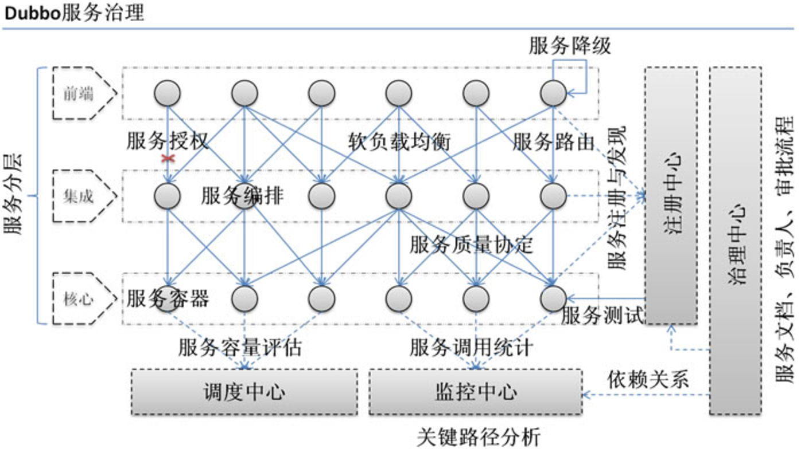
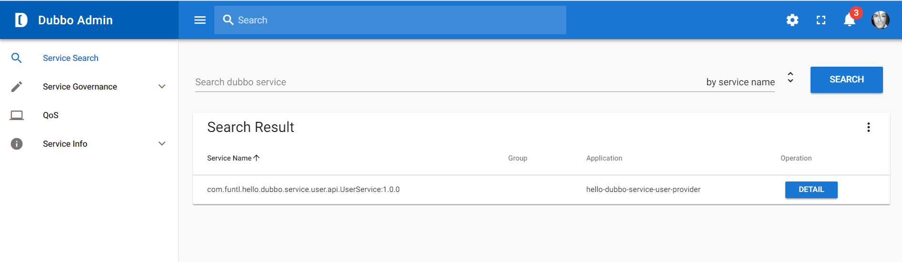

# 一、什么是 Dubbo

Apache Dubbo (incubating) |ˈdʌbəʊ| 是一款高性能、轻量级的开源 Java RPC 分布式服务框架，它提供了三大核心能力：面向接口的远程方法调用，智能容错和负载均衡，以及服务自动注册和发现。她最大的特点是按照分层的方式来架构，使用这种方式可以使各个层之间解耦合（或者最大限度地松耦合）。从服务模型的角度来看，Dubbo 采用的是一种非常简单的模型，要么是提供方提供服务，要么是消费方消费服务，所以基于这一点可以抽象出服务提供方（Provider）和服务消费方（Consumer）两个角色。

- 官网：http://dubbo.apache.org/zh-cn
- GitHub：https://github.com/apache/incubator-dubbo


# 二、Dubbo 的服务治理




| 特性         | 描述                                                         |
| :----------- | :----------------------------------------------------------- |
| 透明远程调用 | 就像调用本地方法一样调用远程方法；只需简单配置，没有任何 API 侵入 |
| 负载均衡机制 | Client 端 LB，可在内网替代 F5 等硬件负载均衡器               |
| 容错重试机制 | 服务 Mock 数据，重试次数、超时机制等                         |
| 自动注册发现 | 注册中心基于接口名查询服务提 供者的 IP 地址，并且能够平滑添加或删除服务提供者 |
| 性能日志监控 | Monitor 统计服务的调用次调和调用时间的监控中心               |
| 服务治理中心 | 路由规则，动态配置，服务降级，访问控制，权重调整，负载均衡，等手动配置 |
| 自动治理中心 | 无，比如：熔断限流机制、自动权重调整等                       |


# 三、Dubbo 的核心功能


- Remoting：远程通讯，提供对多种 NIO 框架抽象封装，包括“同步转异步”和“请求-响应”模式的信息交换方式。
- Cluster：服务框架，提供基于接口方法的透明远程过程调用，包括多协议支持，以及软负载均衡，失败容错，地址路由，动态配置等集群支持。
- Registry：服务注册中心，服务自动发现: 基于注册中心目录服务，使服务消费方能动态的查找服务提供方，使地址透明，使服务提供方可以平滑增加或减少机器。


# 四、Dubbo 的组件角色


| 组件角色 | 说明 |
| :--- | :--- |
| Provider | 暴露服务的服务提供方 |
| Consumer | 调用远程服务的服务消费方 |
| Registry | 服务注册与发现的注册中心 |
| Monitor | 统计服务的调用次调和调用时间的监控中心 |
| Container | 服务运行容器 |

**调用关系说明：**

- 服务容器 `Container` 负责启动，加载，运行服务提供者。
- 服务提供者 `Provider` 在启动时，向注册中心注册自己提供的服务。
- 服务消费者 `Consumer` 在启动时，向注册中心订阅自己所需的服务。
- 注册中心 `Registry` 返回服务提供者地址列表给消费者，如果有变更，注册中心将基于长连接推送变更数据给消费者。
- 服务消费者 `Consumer`，从提供者地址列表中，基于软负载均衡算法，选一台提供者进行调用，如果调用失败，再选另一台调用。
- 服务消费者 `Consumer` 和提供者 `Provider`，在内存中累计调用次数和调用时间，定时每分钟发送一次统计数据到监控中心 `Monitor`。


# 五、第一个 Dubbo 应用程序


## 创建服务接口项目

创建一个名为 `hello-dubbo-service-user-api` 的项目，该项目只负责**定义接口**

### POM

```
<?xml version="1.0" encoding="UTF-8"?>
<project xmlns="http://maven.apache.org/POM/4.0.0"
         xmlns:xsi="http://www.w3.org/2001/XMLSchema-instance"
         xsi:schemaLocation="http://maven.apache.org/POM/4.0.0 http://maven.apache.org/xsd/maven-4.0.0.xsd">
    <modelVersion>4.0.0</modelVersion>

    <groupId>com.duo</groupId>
    <artifactId>hello-dubbo-service-user-api</artifactId>
    <version>1.0.0-SNAPSHOT</version>
    <packaging>jar</packaging>

    <properties>
        <project.build.sourceEncoding>UTF-8</project.build.sourceEncoding>
        <project.reporting.outputEncoding>UTF-8</project.reporting.outputEncoding>
        <java.version>1.8</java.version>
    </properties>
</project>
```

### 定义服务接口

```
package com.duo.hello.dubbo.service.user.api;

public interface UserService {
    String sayHi();
}
```

## 创建服务提供者项目

创建一个名为 `hello-dubbo-service-user-provider` 的项目，该项目主要用于实现接口

### POM

```
<?xml version="1.0" encoding="UTF-8"?>
<project xmlns="http://maven.apache.org/POM/4.0.0" xmlns:xsi="http://www.w3.org/2001/XMLSchema-instance"
         xsi:schemaLocation="http://maven.apache.org/POM/4.0.0 http://maven.apache.org/xsd/maven-4.0.0.xsd">
    <modelVersion>4.0.0</modelVersion>

    <groupId>com.duo</groupId>
    <artifactId>hello-dubbo-service-user-provider</artifactId>
    <version>1.0.0-SNAPSHOT</version>
    <packaging>jar</packaging>

    <name>hello-dubbo-service-user-provider</name>
    <description>Demo project for Spring Boot</description>

    <parent>
        <groupId>org.springframework.boot</groupId>
        <artifactId>spring-boot-starter-parent</artifactId>
        <version>2.0.6.RELEASE</version>
        <relativePath/> <!-- lookup parent from repository -->
    </parent>

    <properties>
        <project.build.sourceEncoding>UTF-8</project.build.sourceEncoding>
        <project.reporting.outputEncoding>UTF-8</project.reporting.outputEncoding>
        <java.version>1.8</java.version>
    </properties>

    <dependencies>
        <dependency>
            <groupId>org.springframework.boot</groupId>
            <artifactId>spring-boot-starter</artifactId>
        </dependency>
        <dependency>
            <groupId>org.springframework.boot</groupId>
            <artifactId>spring-boot-starter-actuator</artifactId>
        </dependency>
        <dependency>
            <groupId>org.springframework.boot</groupId>
            <artifactId>spring-boot-starter-test</artifactId>
            <scope>test</scope>
        </dependency>

        <dependency>
            <groupId>com.alibaba.boot</groupId>
            <artifactId>dubbo-spring-boot-starter</artifactId>
            <version>0.2.0</version>
        </dependency>
        <dependency>
            <groupId>com.alibaba.boot</groupId>
            <artifactId>dubbo-spring-boot-actuator</artifactId>
            <version>0.2.0</version>
        </dependency>

        <dependency>
            <groupId>com.duo</groupId>
            <artifactId>hello-dubbo-service-user-api</artifactId>
            <version>1.0.0-SNAPSHOT</version>
        </dependency>
    </dependencies>

    <build>
        <plugins>
            <plugin>
                <groupId>org.springframework.boot</groupId>
                <artifactId>spring-boot-maven-plugin</artifactId>
                <configuration>
                  <mainClass>com.duo.hello.dubbo.service.user.provider.HelloDubboServiceUserProviderApplication</mainClass>
                </configuration>
            </plugin>
        </plugins>
    </build>

</project>
```

主要增加了以下依赖：

- `com.alibaba.boot:dubbo-spring-boot-starter:0.2.0`：Dubbo Starter，0.2.0 版本支持 Spring Boot 2.x，是一个长期维护的版本。注：0.1.0 版本已经不推荐使用了，是个短期维护的版本，如果你还在用旧版，请大家尽快升级。
- `com.alibaba.boot:dubbo-spring-boot-actuator:0.2.0`：Dubbo 的服务状态检查
- `com.duo:hello-dubbo-service-user-api:1.0.0-SNAPSHOT`：刚才创建的接口项目，如果无法依赖别忘记先 `mvn clean install` 到本地仓库。

### 通过 `@Service` 注解实现服务提供方

```
package com.duo.hello.dubbo.service.user.provider.api.impl;

import com.alibaba.dubbo.config.annotation.Service;
import com.duo.hello.dubbo.service.user.api.UserService;

@Service(version = "${user.service.version}")
public class UserServiceImpl implements UserService {
    @Override
    public String sayHi() {
        return "Hello Dubbo";
    }
}
```

### Application

```
package com.duo.hello.dubbo.service.user.provider;

import com.alibaba.dubbo.container.Main;
import org.springframework.boot.SpringApplication;
import org.springframework.boot.autoconfigure.SpringBootApplication;

@SpringBootApplication
public class HelloDubboServiceUserProviderApplication {
    public static void main(String[] args) {
        SpringApplication.run(HelloDubboServiceUserProviderApplication.class, args);
        // 启动 Provider 容器，注意这里的 Main 是 com.alibaba.dubbo.container 包下的
        Main.main(args);
    }
}
```

### application.yml

```
# Spring boot application
spring:
  application:
    name: hello-dubbo-service-user-provider

# UserService service version
user:
  service:
    version: 1.0.0

# Dubbo Config properties
dubbo:
  ## Base packages to scan Dubbo Component：@com.alibaba.dubbo.config.annotation.Service
  scan:
    basePackages: com.duo.hello.dubbo.service.user.provider.api
  ## ApplicationConfig Bean
  application:
    id: hello-dubbo-service-user-provider
    name: hello-dubbo-service-user-provider
    qos-port: 22222
    qos-enable: true
  ## ProtocolConfig Bean
  protocol:
    id: dubbo
    name: dubbo
    port: 12345
    status: server
  ## RegistryConfig Bean
  registry:
    id: zookeeper
    address: zookeeper://192.168.10.131:2181?backup=192.168.10.131:2182,192.168.10.131:2183

# Enables Dubbo All Endpoints
management:
  endpoint:
    dubbo:
      enabled: true
    dubbo-shutdown:
      enabled: true
    dubbo-configs:
      enabled: true
    dubbo-services:
      enabled: true
    dubbo-references:
      enabled: true
    dubbo-properties:
      enabled: true
  # Dubbo Health
  health:
    dubbo:
      status:
        ## StatusChecker Name defaults (default : "memory", "load" )
        defaults: memory
        ## StatusChecker Name extras (default : empty )
        extras: load,threadpool
```

## 创建服务消费者项目

创建一个名为 `hello-dubbo-service-user-consumer` 的项目，该项目用于消费接口（调用接口）

### POM

```
<?xml version="1.0" encoding="UTF-8"?>
<project xmlns="http://maven.apache.org/POM/4.0.0" xmlns:xsi="http://www.w3.org/2001/XMLSchema-instance"
         xsi:schemaLocation="http://maven.apache.org/POM/4.0.0 http://maven.apache.org/xsd/maven-4.0.0.xsd">
    <modelVersion>4.0.0</modelVersion>

    <groupId>com.duo</groupId>
    <artifactId>hello-dubbo-service-user-consumer</artifactId>
    <version>1.0.0-SNAPSHOT</version>
    <packaging>jar</packaging>

    <name>hello-dubbo-service-user-consumer</name>
    <description>Demo project for Spring Boot</description>

    <parent>
        <groupId>org.springframework.boot</groupId>
        <artifactId>spring-boot-starter-parent</artifactId>
        <version>2.0.6.RELEASE</version>
        <relativePath/> <!-- lookup parent from repository -->
    </parent>

    <properties>
        <project.build.sourceEncoding>UTF-8</project.build.sourceEncoding>
        <project.reporting.outputEncoding>UTF-8</project.reporting.outputEncoding>
        <java.version>1.8</java.version>
    </properties>

    <dependencies>
        <dependency>
            <groupId>org.springframework.boot</groupId>
            <artifactId>spring-boot-starter-web</artifactId>
        </dependency>
        <dependency>
            <groupId>org.springframework.boot</groupId>
            <artifactId>spring-boot-starter-actuator</artifactId>
        </dependency>
        <dependency>
            <groupId>org.springframework.boot</groupId>
            <artifactId>spring-boot-starter-test</artifactId>
            <scope>test</scope>
        </dependency>

        <dependency>
            <groupId>com.alibaba.boot</groupId>
            <artifactId>dubbo-spring-boot-starter</artifactId>
            <version>0.2.0</version>
        </dependency>
        <dependency>
            <groupId>com.alibaba.boot</groupId>
            <artifactId>dubbo-spring-boot-actuator</artifactId>
            <version>0.2.0</version>
        </dependency>

        <dependency>
            <groupId>com.duo</groupId>
            <artifactId>hello-dubbo-service-user-api</artifactId>
            <version>1.0.0-SNAPSHOT</version>
        </dependency>
    </dependencies>

    <build>
        <plugins>
            <plugin>
                <groupId>org.springframework.boot</groupId>
                <artifactId>spring-boot-maven-plugin</artifactId>
                <configuration>
                    <mainClass>com.duo.hello.dubbo.service.user.consumer.HelloDubboServiceUserConsumerApplication</mainClass>
                </configuration>
            </plugin>
        </plugins>
    </build>

</project>
```

### 通过 `@Reference` 注入 `UserService`

```
package com.duo.hello.dubbo.service.user.consumer.controller;

import com.alibaba.dubbo.config.annotation.Reference;
import com.duo.hello.dubbo.service.user.api.UserService;
import org.springframework.web.bind.annotation.RequestMapping;
import org.springframework.web.bind.annotation.RestController;

@RestController
public class UserController {

    @Reference(version = "${user.service.version}")
    private UserService userService;

    @RequestMapping(value = "hi")
    public String sayHi() {
        return userService.sayHi();
    }
}
```

### Application

```
package com.duo.hello.dubbo.service.user.consumer;

import org.springframework.boot.SpringApplication;
import org.springframework.boot.autoconfigure.SpringBootApplication;

@SpringBootApplication
public class HelloDubboServiceUserConsumerApplication {
    public static void main(String[] args) {
        SpringApplication.run(HelloDubboServiceUserConsumerApplication.class, args);
    }
}
```

### application.yml

```
# Spring boot application
spring:
  application:
    name: hello-dubbo-service-user-consumer
server:
  port: 9090

# UserService service version
user:
  service:
    version: 1.0.0

# Dubbo Config properties
dubbo:
  scan:
    basePackages: com.duo.hello.dubbo.service.user.consumer.controller
  ## ApplicationConfig Bean
  application:
    id: hello-dubbo-service-user-consumer
    name: hello-dubbo-service-user-consumer
  ## RegistryConfig Bean
  registry:
    id: zookeeper
    address: zookeeper://192.168.10.131:2181?backup=192.168.10.131:2182,192.168.10.131:2183

# Dubbo Endpoint (default status is disable)
endpoints:
  dubbo:
    enabled: true

management:
  server:
    port: 9091
  # Dubbo Health
  health:
    dubbo:
      status:
        ## StatusChecker Name defaults (default : "memory", "load" )
        defaults: memory
  # Enables Dubbo All Endpoints
  endpoint:
    dubbo:
      enabled: true
    dubbo-shutdown:
      enabled: true
    dubbo-configs:
      enabled: true
    dubbo-services:
      enabled: true
    dubbo-references:
      enabled: true
    dubbo-properties:
      enabled: true
  endpoints:
    web:
      exposure:
        include: "*"
```

## 启动 Dubbo Admin 控制台

查看是否成功注册服务，效果图如下：




# 六、Spring Ioc 容器整合Dubbo

## 创建接口项目

### 提供接口 IProductService

```java
package com.qf.api;

public interface IProductService {

    String showProductName(String name);

}
```


## 创建服务提供者项目

### provider.xml

```xml
<?xml version="1.0" encoding="UTF-8"?>
<beans xmlns="http://www.springframework.org/schema/beans"
       xmlns:xsi="http://www.w3.org/2001/XMLSchema-instance" xmlns:dubbo="http://code.alibabatech.com/schema/dubbo"
       xsi:schemaLocation="http://www.springframework.org/schema/beans http://www.springframework.org/schema/beans/spring-beans.xsd http://code.alibabatech.com/schema/dubbo http://code.alibabatech.com/schema/dubbo/dubbo.xsd">

    <!--dubbo容器中并且指明服务名称-->
    <dubbo:application name="product-provider"/>

    <!--当前服务在dubbo容器中的端口号.默认的建议端口是从20880开始-->
    <dubbo:protocol port="20881"/>

    <!--声明注册中心的地址-->
    <dubbo:registry address="zookeeper://192.168.2.143:2181"/>

    <!--在dubbo中要暴露出的服务是什么？-->
    <dubbo:service interface="com.qf.api.IProductService" ref="productService" loadbalance="roundrobin"/>

    <!--暴露出的服务的具体的实现bean-->
    <bean id="productService" class="com.qf.product.service.imp.ProductServiceImpl"/>

</beans>

```


### 服务提供者接口

```java
package com.qf.product.service.imp;

import com.qf.api.IProductService;

public class ProductServiceImpl implements IProductService {
    public String showProductName(String name) {
        return "服务提供者2：该商品的名称是："+name;
    }
}
```


## 创建服务消费者项目

### consumer.xml

```xml
<?xml version="1.0" encoding="UTF-8"?>
<beans xmlns="http://www.springframework.org/schema/beans"
       xmlns:xsi="http://www.w3.org/2001/XMLSchema-instance" xmlns:dubbo="http://code.alibabatech.com/schema/dubbo"
       xsi:schemaLocation="http://www.springframework.org/schema/beans http://www.springframework.org/schema/beans/spring-beans.xsd http://code.alibabatech.com/schema/dubbo http://code.alibabatech.com/schema/dubbo/dubbo.xsd">


    <!--dubbo中的应用名称-->
    <dubbo:application name="product-consumer"/>

    <!--配置注册中心地址-->
    <dubbo:registry address="zookeeper://192.168.2.143:2181"/>

    <!--配置要调用的服务-->
    <dubbo:reference interface="com.qf.api.IProductService" id="productService" loadbalance="roundrobin" />


</beans>

```


### 消费者业务调用

```java
package com.qf.controller;

import com.qf.api.IProductService;
import org.springframework.context.support.ClassPathXmlApplicationContext;

public class TestConsumer {

    public static void main(String[] args) {

        ClassPathXmlApplicationContext context = new ClassPathXmlApplicationContext("classpath:consumer.xml");

        for (int i = 0; i < 5; i++) {
            IProductService productService = (IProductService) context.getBean("productService");

            String pname = productService.showProductName("华为P40 Pro");

            System.out.println(pname);
        }
    }

}

```


# 七、Dubbo 的负载均衡


在集群负载均衡时，Dubbo 提供了多种均衡策略，缺省为 `random` 随机调用。

## 负载均衡策略

### Random LoadBalance

- **随机**，按权重设置随机概率。
- 在一个截面上碰撞的概率高，但调用量越大分布越均匀，而且按概率使用权重后也比较均匀，有利于动态调整提供者权重。

### RoundRobin LoadBalance

- **轮询**，按公约后的权重设置轮询比率。
- 存在慢的提供者累积请求的问题，比如：第二台机器很慢，但没挂，当请求调到第二台时就卡在那，久而久之，所有请求都卡在调到第二台上。

### LeastActive LoadBalance

- **最少活跃调用数**，相同活跃数的随机，活跃数指调用前后计数差。
- 使慢的提供者收到更少请求，因为越慢的提供者的调用前后计数差会越大。

### ConsistentHash LoadBalance

- **一致性 Hash**，相同参数的请求总是发到同一提供者。
- 当某一台提供者挂时，原本发往该提供者的请求，基于虚拟节点，平摊到其它提供者，不会引起剧烈变动。
- 算法参见：http://en.wikipedia.org/wiki/Consistent_hashing
- 缺省只对第一个参数 Hash，如果要修改，请配置 `<dubbo:parameter key="hash.arguments" value="0,1" />`
- 缺省用 160 份虚拟节点，如果要修改，请配置 `<dubbo:parameter key="hash.nodes" value="320" />`

## 配置

### 服务端服务级别

```
dubbo:
  provider:
    loadbalance: leastactive
```

### 客户端服务级别

```
dubbo:
  consumer:
    loadbalance: leastactive
```

## 测试负载均衡

### 修改 `UserServiceImpl` 代码为

```
package com.duo.hello.dubbo.service.user.provider.api.impl;

import com.alibaba.dubbo.config.annotation.Service;
import com.duo.hello.dubbo.service.user.api.UserService;
import org.springframework.beans.factory.annotation.Value;

@Service(version = "${user.service.version}")
public class UserServiceImpl implements UserService {

    @Value("${dubbo.protocol.port}")
    private String port;

    @Override
    public String sayHi() {
        return "Hello Dubbo , i am from port:" + port;
    }
}
```

注入了端口属性，当消费者访问时可以看出是从哪个端口请求的数据。

### 修改负载均衡策略为轮询

```
dubbo:
  provider:
    loadbalance: roundrobin
```

### 测试访问

修改端口号并分别启动服务提供者，此时访问服务消费者：http://localhost:9090/hi

浏览器会交替显示：

```
Hello Dubbo , i am from port:12345
Hello Dubbo , i am from port:12346
```


## 附：在 IDEA 中配置一个工程启动多个实例

### 步骤一

点击 `Run -> Edit Configurations...`


### 步骤二

选择需要启动多实例的项目并去掉 `Single instance only` 前面的勾


### 步骤三

通过修改 `application.yml` 配置文件的 `dubbo.protocol.port` 的端口，启动多个实例，需要多个端口，分别进行启动即可。


