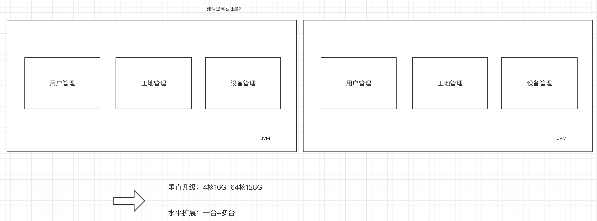
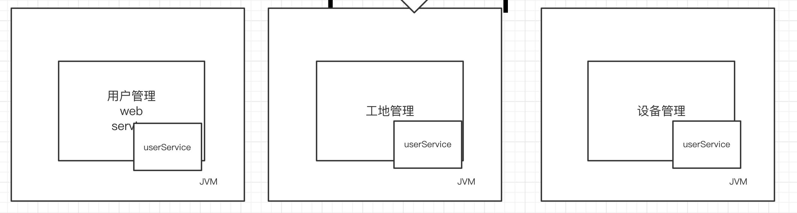
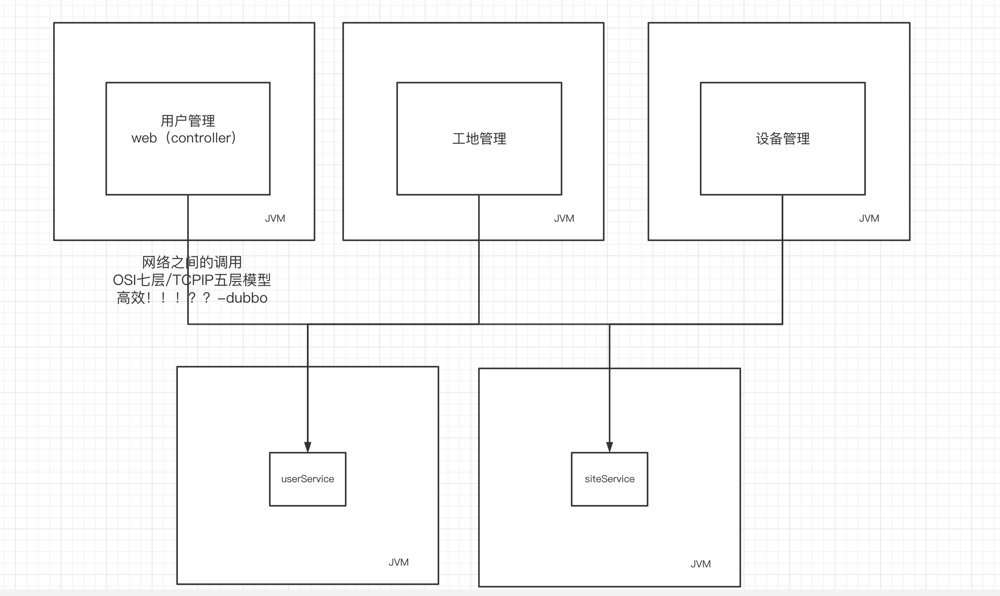
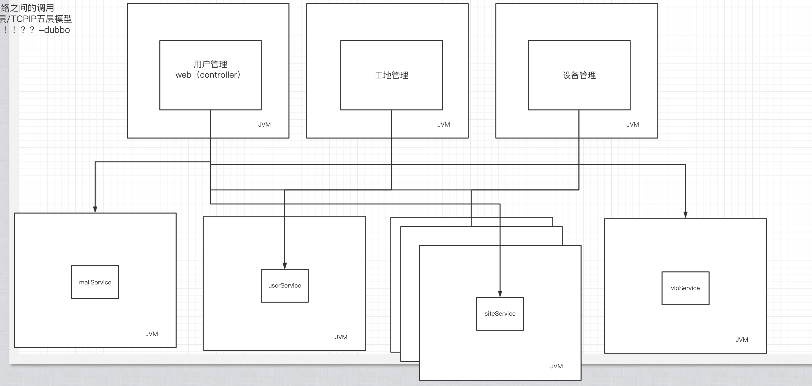
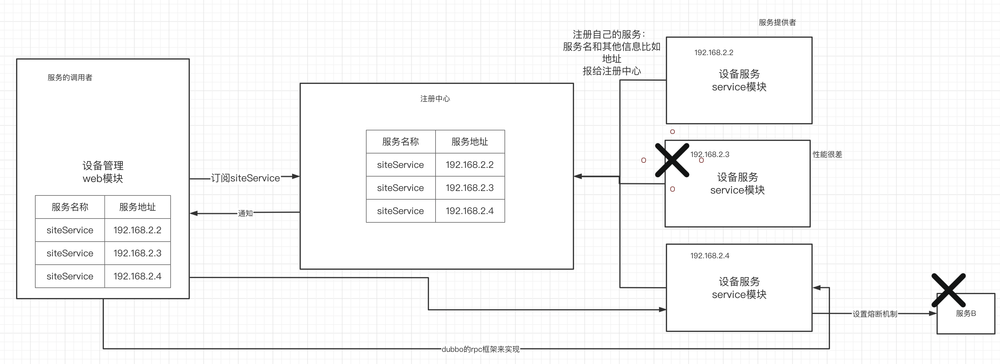
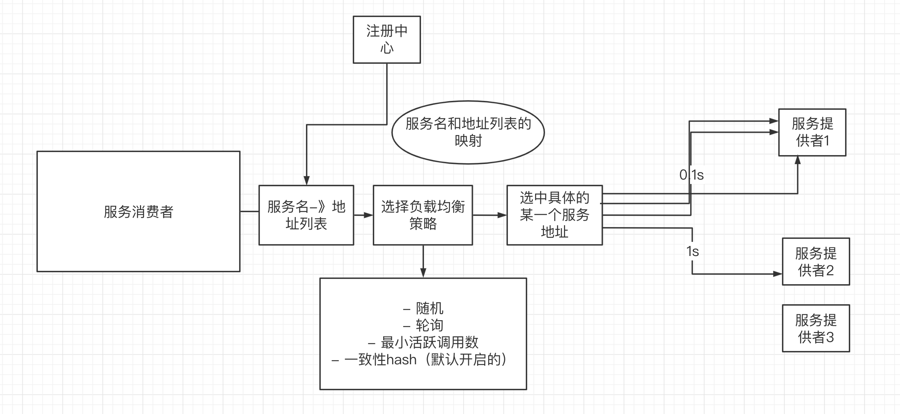
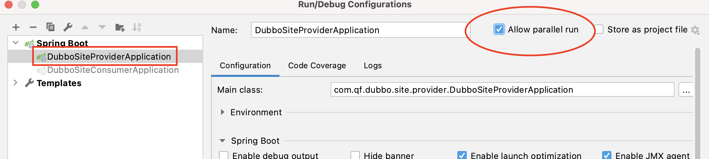
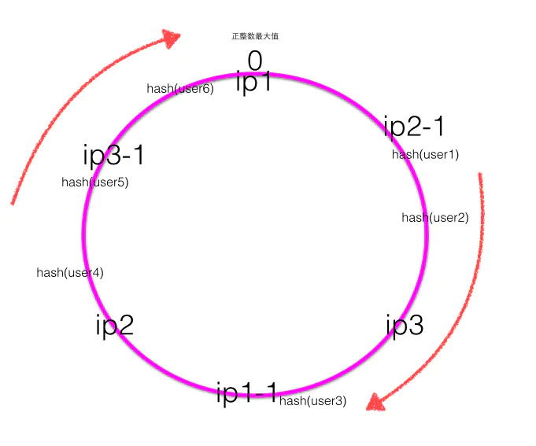
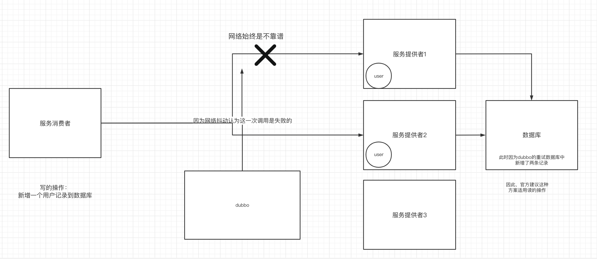

# 一、架构演进

为什么现在的系统不用单体架构，而用微服务架构。

## 1.单体架构



为了提高系统的吞吐量，单体架构中的垂直升级和水平扩展，存在以下几个问题

- 提升的性能是有限的
- 成本过高，没有办法针对某一个具体的模块做性能的提升，因为单体，所有模块都是在一起的。
- 更新、维护成本非常高，对于系统中要修改或增加的功能，整个发布的流程非常麻烦。
- 某一个模块出现了bug，就会影响整个系统。


## 2.垂直应用架构

对单体应用进行垂直拆分


**垂直应用存在的问题**



每个独立部署的服务之间，公共的部分需要部署多份。那么对公共部分的修改、部署、更新都需要重复的操作，带来比较大的成本

为了解决这一问题，接下来就进入到分布式应用架构阶段。


## 3.分布式应用架构阶段

在这个阶段里，将服务内部公用的模块抽取出来，部署成一个独立的服务，那么需要解决服务之间的高效通信问题，这个问题可以由dubbo支持的rpc或springcloud支持的http来解决。



**但是分布式应用架构阶段会存在新的问题**：



- 服务越来越多，这么多服务如何被发现？
- 服务越来越多，服务如何被治理？
- 服务之间如何实现高效通信？


## 4.微服务架构阶段



微服务架构阶段主要解决的几个问题：

- 服务的注册和发现：这么多服务如何注册。这么多服务如何被发现
- 服务之间的高效调用：使用rpc或者http进行通信
- 服务治理：服务权重、负载均衡、服务熔断、限流等等一些服务治理方面的问题


# 二、注册中心-Zookeeper

## 1.概述

注册中心的选择有很多：

- 自研：redis
- zookeeper（dubbo的推荐）：zk是一个分布式服务组件中的一个非常重要的组件，里面涉及到很多优秀的分布式设计思想，堪称鼻祖地位。
- nacos：nacos既可以作为注册中心使用，也可以作为分布式配置中心使用
- eureka：eureka是spring cloud netflix框架中著名的注册中心，里面的服务的续约、心跳等等的设计非常的经典。


## 2.搭建zookeeper注册中心

- 克隆一个虚拟机
- 安装jdk
- 解压zk的压缩包
- 进入到conf文件夹内，重命名：zoo_samples.cfg->zoo.cfg
- 进入到bin中，使用命令来操作zk

```shell
./zkServer.sh start # 启动zk
./zkServer.sh status # 查看zk状态，如果状态是：Mode: standalone 表示启动成功
./zkServer.sh stop # 关闭zk
```


# 三、dubbo

## 1.什么是dubbo

dubbo是一款面向接口的，通过rpc通信协议的，实现服务与服务之间远程调用的，高效的通信框架。


## 2.dubbo怎么实现远程通信？


服务消费者去注册中心订阅到服务提供者的信息。然后通过dubbo进行远程调用。


## 3.dubbo初体验

### 1) 创建接口层项目

直接创建了一个项目。项目里有一个接口。接口中定义了一个服务的内容。

```java
public interface SiteService {
  String getName(String name);
}

```


### 2)创建服务提供者

- 创建一个服务提供者项目。引入依赖

```xml
<?xml version="1.0" encoding="UTF-8"?>
<project xmlns="http://maven.apache.org/POM/4.0.0"
         xmlns:xsi="http://www.w3.org/2001/XMLSchema-instance"
         xsi:schemaLocation="http://maven.apache.org/POM/4.0.0 http://maven.apache.org/xsd/maven-4.0.0.xsd">
  <parent>
    <artifactId>spring-dubbo-demo</artifactId>
    <groupId>com.qf</groupId>
    <version>1.0-SNAPSHOT</version>
  </parent>
  <modelVersion>4.0.0</modelVersion>

  <artifactId>dubbo-demo-site-provider</artifactId>

  <properties>
    <maven.compiler.source>8</maven.compiler.source>
    <maven.compiler.target>8</maven.compiler.target>
  </properties>

  <dependencies>

    <!--dubbo-->
    <dependency>
      <groupId>com.alibaba</groupId>
      <artifactId>dubbo</artifactId>
      <version>2.5.8</version>
    </dependency>
    <!--zk-->
    <dependency>
      <groupId>com.github.sgroschupf</groupId>
      <artifactId>zkclient</artifactId>
      <version>0.1</version>
    </dependency>
    <!--接口层-->
    <dependency>
      <groupId>com.qf</groupId>
      <artifactId>dubbo-demo-site-api</artifactId>
      <version>1.0-SNAPSHOT</version>
    </dependency>
  </dependencies>

</project>

```

- 编写具体的提供服务的实现类

```java
package com.qf.provider.service.impl;

import com.qf.api.SiteService;
//要把这个服务交给dubbo容器-》在项目中整合dubbo
public class SiteServiceImpl implements SiteService {
  @Override
  public String getName(String name) {
    return "name:"+name;
  }
}

```

- 编写bean配置文件，将dubbo和spring ioc整合，把服务提供到dubbo中

```xml
<?xml version="1.0" encoding="UTF-8"?>
<beans xmlns="http://www.springframework.org/schema/beans"
       xmlns:xsi="http://www.w3.org/2001/XMLSchema-instance" xmlns:dubbo="http://code.alibabatech.com/schema/dubbo"
       xsi:schemaLocation="http://www.springframework.org/schema/beans http://www.springframework.org/schema/beans/spring-beans.xsd http://code.alibabatech.com/schema/dubbo http://code.alibabatech.com/schema/dubbo/dubbo.xsd">

  <!--服务名称-->
  <dubbo:application name="site-service"/>
  <!--注册中心的信息：服务要注册到这个注册中心上-->
  <dubbo:registry address="zookeeper://172.16.253.35:2181"/>
  <!--配置当前这个服务在dubbo容器中的端口号，每个dubbo容器内部的服务的端口号必须是不一样的-->
  <dubbo:protocol name="dubbo" port="20881"/>
  <!--暴露出SiteService服务，指明该服务具体的实现bean是siteService-->
  <dubbo:service interface="com.qf.api.SiteService" ref="siteService"/>
  <!--将服务提供者的bean注入到ioc容器中-->
  <bean id="siteService" class="com.qf.provider.service.impl.SiteServiceImpl"/>

</beans>

```

- 启动ioc容器，关联bean配置文件

```java
public class Provider {

  public static void main(String[] args) throws IOException {
    ClassPathXmlApplicationContext context = new ClassPathXmlApplicationContext(new String[]{"provider.xml"});
    context.start();
    System.in.read(); // 让当前服务一直在线，不会被关闭，按任意键退出
  }

}

```


### 3）创建服务消费者

- 引入依赖

```xml
<?xml version="1.0" encoding="UTF-8"?>
<project xmlns="http://maven.apache.org/POM/4.0.0"
         xmlns:xsi="http://www.w3.org/2001/XMLSchema-instance"
         xsi:schemaLocation="http://maven.apache.org/POM/4.0.0 http://maven.apache.org/xsd/maven-4.0.0.xsd">
  <parent>
    <artifactId>spring-dubbo-demo</artifactId>
    <groupId>com.qf</groupId>
    <version>1.0-SNAPSHOT</version>
  </parent>
  <modelVersion>4.0.0</modelVersion>

  <artifactId>dubbo-demo-site-consumer</artifactId>

  <properties>
    <maven.compiler.source>8</maven.compiler.source>
    <maven.compiler.target>8</maven.compiler.target>
  </properties>

  <dependencies>
    <dependency>
      <groupId>com.qf</groupId>
      <artifactId>dubbo-demo-site-api</artifactId>
      <version>1.0-SNAPSHOT</version>
    </dependency>

    <dependency>
      <groupId>com.alibaba</groupId>
      <artifactId>dubbo</artifactId>
      <version>2.5.8</version>
    </dependency>

    <dependency>
      <groupId>com.github.sgroschupf</groupId>
      <artifactId>zkclient</artifactId>
      <version>0.1</version>
    </dependency>
  </dependencies>

</project>

```

- 编写bean的配置文件

```xml
<?xml version="1.0" encoding="UTF-8"?>
<beans xmlns="http://www.springframework.org/schema/beans"
       xmlns:xsi="http://www.w3.org/2001/XMLSchema-instance" xmlns:dubbo="http://code.alibabatech.com/schema/dubbo"
       xsi:schemaLocation="http://www.springframework.org/schema/beans http://www.springframework.org/schema/beans/spring-beans.xsd http://code.alibabatech.com/schema/dubbo http://code.alibabatech.com/schema/dubbo/dubbo.xsd">

  <dubbo:application name="site-consumer"/>

  <dubbo:registry address="zookeeper://172.16.253.35:2181"/>

  <!--在消费者中，需要调用的dubbo中的哪个服务，siteService->com.qf.api.SiteService-->
  <dubbo:reference interface="com.qf.api.SiteService" id="siteService"/>
</beans>

```

- 启动消费者，调用服务提供者

```java
package com.qf.site.consumer;

import com.qf.api.SiteService;
import org.springframework.context.support.ClassPathXmlApplicationContext;

public class Consumer {


  public static void main(String[] args) {
    ClassPathXmlApplicationContext context = new ClassPathXmlApplicationContext(new String[] {"consumer.xml"});
    context.start();
    /*
    下面这一整个过程。都是在执行远程过程调用—— rpc remote produce call 服务框架
     */
    //获取一个代理，代理服务提供者内提供的bean
    SiteService service = (SiteService)context.getBean("siteService"); // 获取远程服务代理
    //调用代理对象的getName方法。通过代理对象调到服务提供者内的bean
    String result = service.getName("hellodubbo");
    System.out.println(result);


  }
}

```


**服务代理的过程**


## 4.dubbo内部工作流程


- dubbo提供了一个容器用来存放服务提供者（初始化）
- 服务提供者将服务名、及具体的服务地址、端口等信息注册到注册中心上（初始化）
- 服务消费者订阅需要的服务（初始化）
- 注册中心异步通知服务的变更情况
- 服务消费者同步的调用到服务提供者的服务
- 监控中心实时监控和治理当前的服务

注意：

- 同步：好比打电话，双方必须在线，才能完成
- 异步：好比发微信语音，上游发完就结束了，不需要等待对方执行完。


# 四、RPC协议

dubbo是一款高性能的rpc框架。什么是rpc呢？

rpc是一种协议：是一种远程过程调用（remote procudure call）协议

rpc协议是在传输层之上的协议，除了确定使用tcp等传输方式外，还确定了序列化协议及序列化方式。

- 序列化：dubbo默认使用了hession2的序列化方式。
- 传输方式：tcp的长连接，使用了nio同步非阻塞的通信方式——原生的jdk的nio稳定性没有netty框架实现的nio稳定好，所以dubbo使用了netty框架实现底层的nio的通信。


# 五、Springboot中使用dubbo

springboot中使用dubbo也是一样，需要建立接口层、服务提供者、服务消费者。

## 1.创建接口层

```java
package com.qf.api;

import com.qf.entity.Site;

public interface SiteService {
  Site getSiteById(Long id);
}

```


## 2.创建服务提供者

- 引入依赖

```xml
 <dependency>
      <groupId>com.alibaba.boot</groupId>
      <artifactId>dubbo-spring-boot-starter</artifactId>
      <version>0.2.0</version>
    </dependency>

    <dependency>
      <groupId>com.qf</groupId>
      <artifactId>dubbo-site-api</artifactId>
      <version>1.0-SNAPSHOT</version>
    </dependency>
```

- 编写配置文件

```yml
server:
  port: 9001
dubbo:
  application:
    name: site-service-provider
  registry:
    address: zookeeper://172.16.253.35:2181
  protocol:
    port: 20882

```

- 在服务提供者的实现类上打上注解来自于dubbo的@Service

```java
package com.qf.dubbo.site.provider.service.impl;

import com.alibaba.dubbo.config.annotation.Service;
import com.qf.api.SiteService;
import com.qf.entity.Site;

@Service
public class SiteServiceImpl implements SiteService {
  @Override
  public Site getSiteById(Long id) {
    Site site = new Site();
    site.setId(id);
    return site;
  }
}

```

- 在启动类上打上注解@EnableDubbo

## 3.服务消费者

- 引入依赖（与提供者相同）
- 编写配置文件

```yml
server:
  port: 8001
dubbo:
  application:
    name: site-consumer
  registry:
    address: zookeeper://172.16.253.35:2181

```

- 使用@Reference注解订阅服务，注意这个注解来自于dubbo

```java
package com.qf.dubbo.site.consumer.controller;

import com.alibaba.dubbo.config.annotation.Reference;
import com.qf.api.SiteService;
import com.qf.entity.Site;
import org.springframework.web.bind.annotation.GetMapping;
import org.springframework.web.bind.annotation.PathVariable;
import org.springframework.web.bind.annotation.RequestMapping;
import org.springframework.web.bind.annotation.RestController;

@RestController
@RequestMapping("/site")
public class SiteController {

  @Reference
  private SiteService service;

  @GetMapping("/get/{id}")
  public Site getSiteById(@PathVariable Long id){
    return service.getSiteById(id);
  }

}

```

- 启动类上打上注解

```java
package com.qf.dubbo.site.consumer;

import com.alibaba.dubbo.config.spring.context.annotation.EnableDubbo;
import org.springframework.boot.SpringApplication;
import org.springframework.boot.autoconfigure.SpringBootApplication;

@SpringBootApplication
@EnableDubbo
public class DubboSiteConsumerApplication {

  public static void main(String[] args) {
    SpringApplication.run(DubboSiteConsumerApplication.class,args);
  }
}

```

- 启动服务，访问接口


# 六、dubbo的负载均衡策略

## 1.负载均衡策略



dubbo的负载均衡是发生在服务提供者端，负载均衡策略一共有以下四种：

- 随机（默认的策略）
- 轮询
- 最小活跃调用数
- 一致性hash


## 2.dubbo中具体实现

- 冗余部署多个服务



- 在服务提供者和消费者端配置负载均衡策略

```yml
# 服务提供者
dubbo:
  application:
    name: site-service-provider
  registry:
    address: zookeeper://172.16.253.35:2181
  protocol:
    port: 20882
  provider:
    loadbalance: roundrobin


# 服务消费者
dubbo:
  application:
    name: site-consumer
  registry:
    address: zookeeper://172.16.253.35:2181
  consumer:
    loadbalance: roundrobin


```


## 3.一致性hash环


在负载均衡策略中，一致性hash环可以很好的支持服务的动态伸缩容。但是一致性hash环会存在一个问题：hash倾斜，指的是服务节点部署不均匀，此时可以通过为服务节点添加虚拟节点来解决这个问题，dubbo默认添加了160份虚拟节点。




# 七、dubbo的集群容错机制



dubbo为集群调用提供了容错方案：

- failover：（默认，推荐）

当出现失败时，会进行重试，默认重试2次，一共三次调用。但是会出现幂等性（执行一次和执行多次结果是不一样的——非幂等）问题。

虽然会出现幂等性问题，但是依然推荐使用这种容错机制，在业务层面解决幂等性问题：

​	方案一：写数据到数据库时先查一下数据在不在

   方案二：把数据的业务id作为数据库的主键，因为主键是不能重复的。

   方案三（推荐）：在缓存redis中设置标记——分布式锁

- failfast

当出现失败时。立即报错，不进行重试

- failsafe：失败不报错，记入日志
- failback：失败就失败，开启定时任务 定时重发
- forking：并行访问多个服务器，获取某一个结果既视为成功


结论：如果使用dubbo，不推荐把重试关掉，而是在非幂等性操作的场景下，服务提供者方要做幂等性的解决方案（保证）。推荐使用方案三。


# 七、搭建dubbo的监控中心

## 1.使用docker来搭建

只要修改zk的地址即可。

```shell
docker run -d \
-p 8080:8080 \
-e dubbo.registry.address=zookeeper://192.168.140.129:2181 \
-e dubbo.admin.root.password=root \
-e dubbo.admin.guest.password=guest \
chenchuxin/dubbo-admin 
```

## 2.启动容器 使用监控平台

## 3.通过Linux的ip地址+上述指定的端口登录		

#### 			→192.168.140.129:8080  