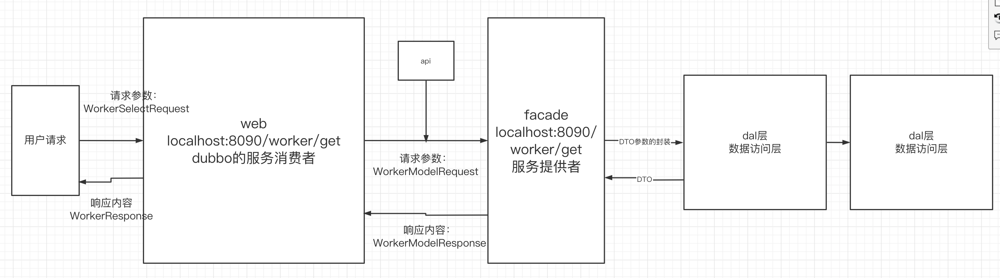

# 一、项目的规划

## 1.前台：城市大脑-智慧工地的数据大屏

### 1）前端：VUE


### 2）后端:springboot+dubbo+mysql

后端和之前的工程结构是不一样的

## 2.后台

三阶段做的项目


# 二、企业中后端项目的工程结构

## 1.各个部分的作用

后端接口对数据的操作：web（controller）收到参数->service->dao

- web（web接口层）：dubbo的服务消费者，调用dubbo的服务提供者
- facade（遮蔽层）：dubbo的服务提供者
  - api： dubbo的接口层
  - service：具体的服务提供者的实现
- ext（扩展层）：当前整个服务要调用其他服务的时候，通过ext做一次聚合，也是一个dubbo的服务提供者
- core（核心层）：
  - dal：data access level：数据访问层 是用来 访问数据的，你可以使用mybatis、hibernate来访问数据库
  - model：存放一些公共的部分，公共的bean，常量、工具类、公共的请求、公共的响应
  - service：直接操作数据库实体的service，crud-mapper（接口+映射文件），curd-service


## 2.走通一个业务流程

后端提供一个员工总数的接口：





## 3.确定后端个服务的端口

| 服务名        | tomcat端口 | dubbo端口 |
| ------------- | ---------- | --------- |
| Worker-web    | 8090       |           |
| worker-facade | 9091       | 20881     |
|               |            |           |


## 4.确定状态码信息

| 序号 | 状态码 | 说明 |
| ---- | ------ | ---- |
|      | 1000   | 成功 |
|      | 500    | 失败 |
|      | 。。。 |      |


# 三、前端细节

## 1.去除eslint的代码检查

 Package.json:   


```js
"devDependencies": {
    "@vue/cli-plugin-babel": "^4.2.0",
    //"@vue/cli-plugin-eslint": "^4.2.0",
    "@vue/cli-service": "^4.2.0",
    "babel-eslint": "^10.0.3",
    "eslint": "^6.7.2",
    "eslint-plugin-vue": "^6.1.2",
    "sass": "^1.25.0",
    "sass-loader": "^8.0.2",
    "vue-template-compiler": "^2.6.11"
  },
```

```js
"eslintConfig": {
    "root": false, //false
    "env": {
      "node": false//false
    },
    "extends": [
      "plugin:vue/essential",
      "eslint:recommended"
    ],
    "parserOptions": {
      "parser": "babel-eslint"
    },
    "rules": {}
  },
```


## 2.DataV组件库

数字大屏中的很多组件都是来自于该组件库

http://datav.jiaminghi.com/


# 作业

- 掌握dubbo的所有的知识点
- 熟练使用api在线接口文档 showdoc.cc
- 熟练使用企业工程架构去做开发
- 使用当前的数据库，用当前的工程架构，去做一次完整的crud