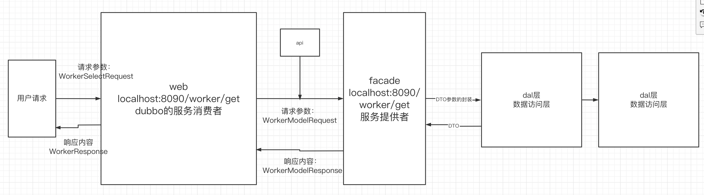
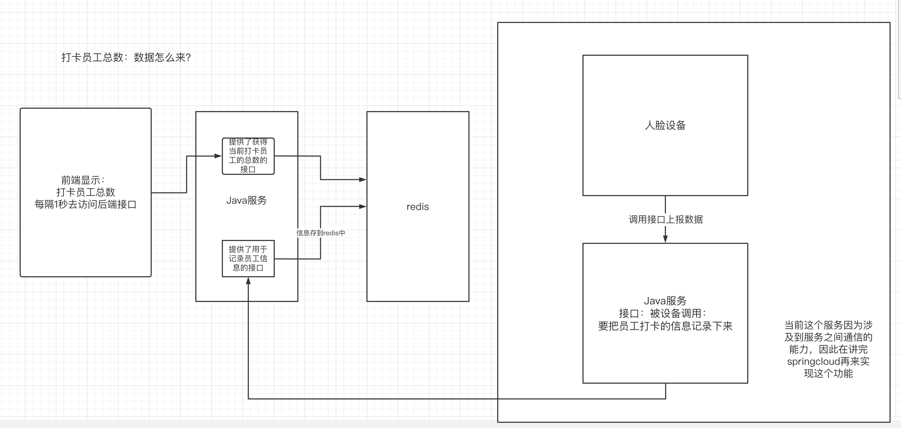
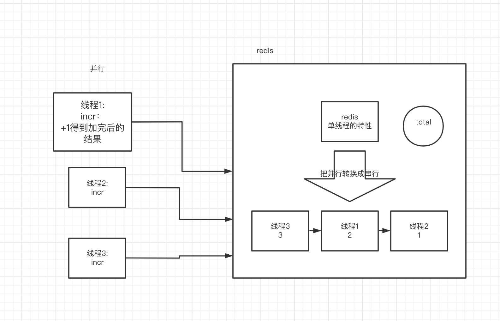
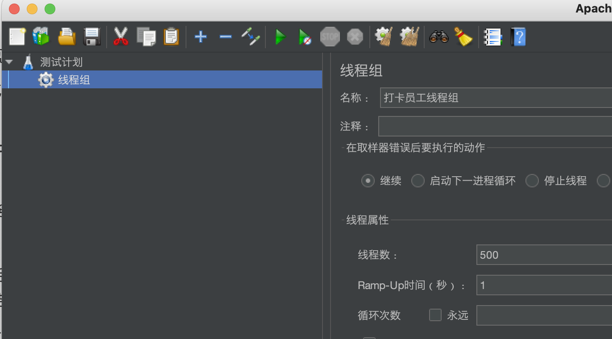
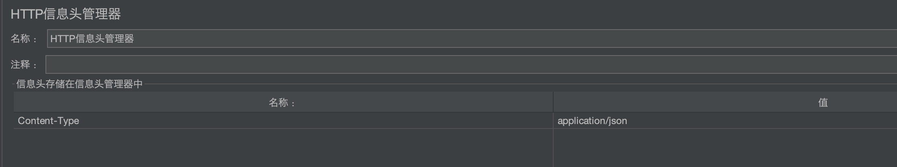

# 一、项目的规划

## 1.前台：城市大脑-智慧工地的数据大屏

### 1）前端：VUE


### 2）后端:springboot+dubbo+mysql

后端和之前的工程结构是不一样的

## 2.后台

三阶段做的项目


# 二、企业中后端项目（worker服务）的工程结构

## 1.各个部分的作用

后端接口对数据的操作：web（controller）收到参数->service->dao

- web（web接口层）：dubbo的服务消费者，调用dubbo的服务提供者
- facade（遮蔽层）：dubbo的服务提供者
  - api： dubbo的接口层
  - service：具体的服务提供者的实现
- ext（扩展层）：当前整个服务要调用其他服务的时候，通过ext做一次聚合，也是一个dubbo的服务提供者
- core（核心层）：
  - dal：data access level：数据访问层 是用来 访问数据的，你可以使用mybatis、hibernate来访问数据库
  - model：存放一些公共的部分，公共的bean，常量、工具类、公共的请求、公共的响应
  - service：直接操作数据库实体的service，crud-mapper（接口+映射文件），curd-service


## 2.走通一个业务流程

后端提供一个员工总数的接口：





## 3.确定后端个服务的端口

| 服务名        | tomcat端口 | dubbo端口 |
| ------------- | ---------- | --------- |
| Worker-web    | 8090       |           |
| worker-facade | 9091       | 20881     |
|               |            |           |


## 4.确定状态码信息

| 序号 | 状态码 | 说明 |
| ---- | ------ | ---- |
|      | 1000   | 成功 |
|      | 500    | 失败 |
|      | 。。。 |      |


# 三、前端细节

## 1.去除eslint的代码检查

 Package.json:   


```js
"devDependencies": {
    "@vue/cli-plugin-babel": "^4.2.0",
    //"@vue/cli-plugin-eslint": "^4.2.0",
    "@vue/cli-service": "^4.2.0",
    "babel-eslint": "^10.0.3",
    "eslint": "^6.7.2",
    "eslint-plugin-vue": "^6.1.2",
    "sass": "^1.25.0",
    "sass-loader": "^8.0.2",
    "vue-template-compiler": "^2.6.11"
  },
```

```js
"eslintConfig": {
    "root": false, //false
    "env": {
      "node": false//false
    },
    "extends": [
      "plugin:vue/essential",
      "eslint:recommended"
    ],
    "parserOptions": {
      "parser": "babel-eslint"
    },
    "rules": {}
  },
```


## 2.DataV组件库

数字大屏中的很多组件都是来自于该组件库

http://datav.jiaminghi.com/


## 3.安装和启动(cnpm不行就用npm)

- 安装axios：cnpm install --save axios vue-axios

- 安装依赖：需要先安装淘宝镜像，然后执行 cnpm install
- 启动：npm run serve


# 四、前后端交互

## 1.前后端交互数据流图



## 2.编写后端接口：提供数据

- redis的单线程特性来解决线程安全问题



为什么没有使用分布式锁，其实这个地方上分布式锁的逻辑和此处的逻辑基本上是一致。但是这个地方的上锁会造成多余的开销。

此处用redis的原子性可以解决我们实际业务中需要的上锁的效果

```java
//1.获得redisKey， worker:sign:2021-08-16 worker:sign:2021-08-17 worker:sign:2021-08-18
        String signTime = request.getSignTime().substring(0, 10);
        String redisKey = RedisUtils.getRedisKey(RedisConstant.WORKER_SIGN_PRE,signTime);
        //2.如果redis中没有这个值，初始化这个值,并且设置有效期
//        if (Objects.nonNull(redisTemplate.opsForValue().get(redisKey))) {
//            redisTemplate.opsForValue().set(redisKey,1,3, TimeUnit.DAYS);
//        }
        /*
        redis的原子操作-这样就可以实现分布式锁的效果：
        redisTemplate.opsForValue().increment(redisKey)
        给redis中的redisKey+1，每个线程只会得到一个唯一的值。体现了redis的单线程的特性。
         */
        if(redisTemplate.opsForValue().increment(redisKey)==1){
            redisTemplate.expire(redisKey,3,TimeUnit.DAYS);
        }
```


## 3.使用jmeter做并发压力测试

- 创建线程组



- 创建HTTP请求

  在请求中添加参数

  

- 创建HTTP请求头

  在请求头中添加参数

  

- 添加“察看结果树”和“汇总报告”来查看结构

  

## 4.编写后端接口：获取数据

```java
//获得redis中的打卡员工总数
    @Override
    public ResultModel getSignTotal() {
        redisTemplate.setKeySerializer(new StringRedisSerializer());
        redisTemplate.setValueSerializer(new StringRedisSerializer());
        //1.获得当前时间
        Date date = new Date();
        SimpleDateFormat simpleDateFormat = new SimpleDateFormat("yyyy-MM-dd");
        String currentDate = simpleDateFormat.format(date);
        //2.组织redis的键
        String redisKey = RedisUtils.getRedisKey(RedisConstant.WORKER_SIGN_PRE, currentDate);
        Integer count = Integer.parseInt((String) redisTemplate.opsForValue().get(redisKey));
        return ResultModel.success(count);
    }
```


## 5.实现前后端的联调

```js
methods: {
	 
	  setData () {
		  const { workerTotal } = this
		  
		  var vm = this;
		  this.axios({
			  method:'get',
			  url:'http://localhost:8090/worker/sign/total'
		  }).then(function(response){
			  
			  var data = response.data;
			  if(data.code == 1000){
				  vm.workerTotal.number[0] = data.data;
			  }
			  
			  
		  });
		  
		  this.workerTotal.number[0] = vm.workerTotal.number[0];
		  
		   this.workerTotal = { ...this.workerTotal }
		   
		   
	  },
	  setData1 () { //方法。需要自己实现
	  		  const { workerUnSign } = this
	  		  var vm = this;
	  		  this.workerUnSign.number[0] = vm.workerSign.number[0] - vm.workerTotal.number[0]
	  		  this.workerUnSign = { ...this.workerUnSign }  
	  },
	  setData2 () {//方法。需要自己实现
	  		  const { workerUnSafe } = this
	  		  var vm = this;
	  		  this.workerUnSafe.number[0] = vm.workerUnSign.number[0] + 1201
	  		  this.workerUnSafe = { ...this.workerUnSafe }  
	  },
	  setData3 () {//方法。需要自己实现--作业
	  		  const { workerCar } = this
	  		  var vm = this;
	  		  this.workerCar.number[0] = vm.workerTotal.number[0] - 1201
	  		  this.workerCar = { ...this.workerCar }  
	  },
	  setData4 () {//方法。需要自己实现
	  		  const { workerUnCar } = this
	  		  var vm = this;
	  		  this.workerUnCar.number[0] = 5000 - vm.workerCar.number[0]
	  		  this.workerUnCar = { ...this.workerUnCar }  
	  }
  }
```

