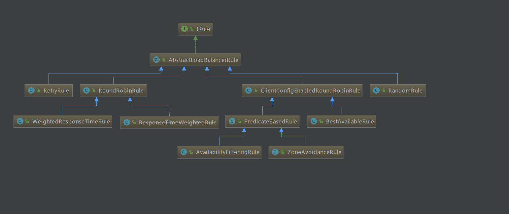
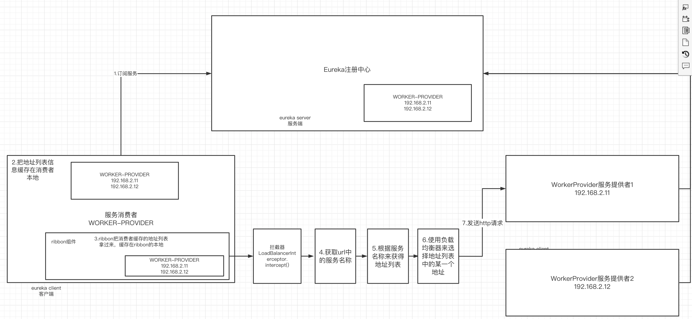
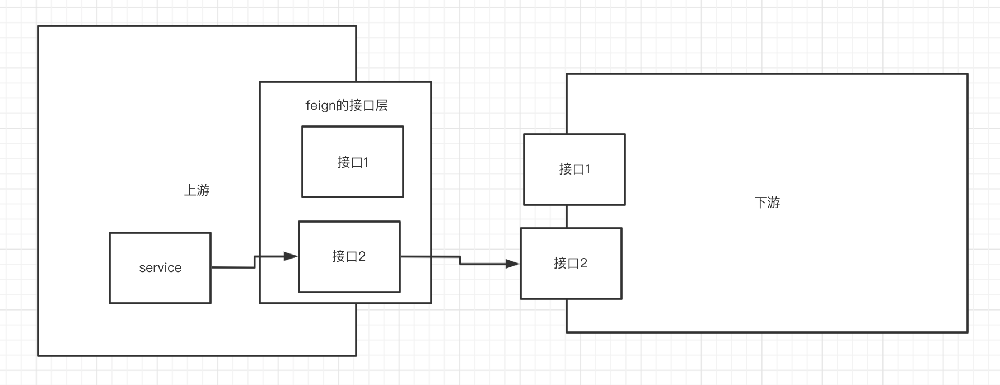
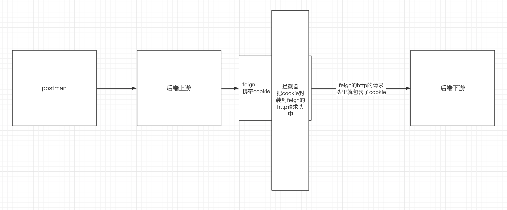
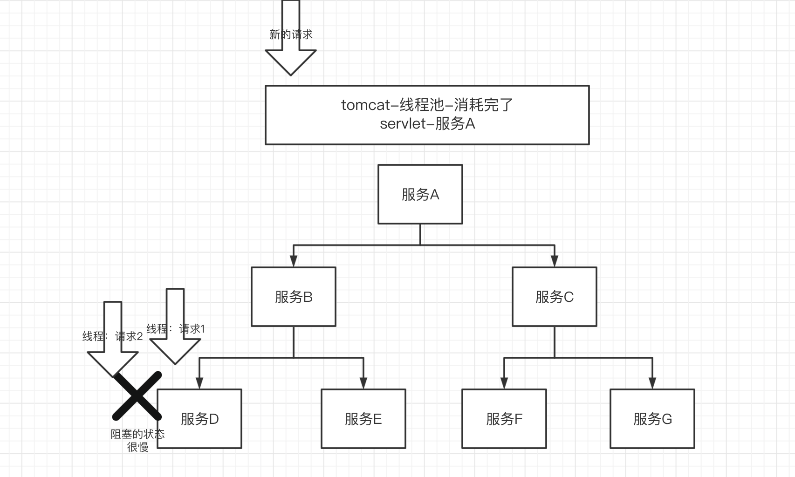
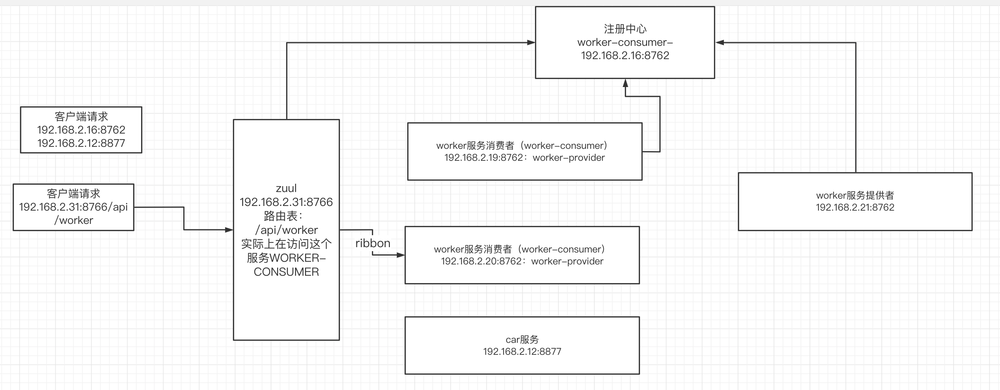
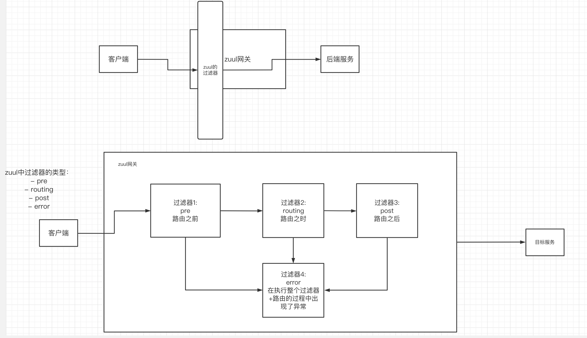

# 一、Spring Cloud的应用背景

## 1.微服务碰到的几个重点问题

- 这么多服务如何注册与被发现
- 服务和服务之间如何进行通信
- 服务的治理怎么去实现

上面这几个问题，在微服务的应用场景中需要解决的，那谁来解决呢，怎么解决呢，解决有标准吗？——spring cloud就出现了


## 2.Spring Cloud的介绍

因为分布式微服务系统碰到了上面几个问题，springcloud就提供了解决这些问题的工具，因此springcloud就好比是一个工具箱

springcloud能够快速解决以下问题：

- 分布式/版本化配置
- 服务注册和发现
- 路由
- 服务到服务呼叫
- 负载均衡
- 断路器
- 全局锁
- 领导选举和集群状态
- 分布式消息传递

springcloud内目前我们重点关注两套解决方案

- spring cloud Netflix——非常经典，在早期的微服务里企业都是用这一套中间件

  - Eureka组件（工具）：解决服务的注册与发现

  - Ribbon：负载均衡器

  - zuul：服务网关（智能路由、服务限流、降级、熔断）

  - hystrix：断路器

  - spring cloud openfeign：服务之间的通信

  - spring cloud config：分布式配置中心

    

- spring cloud alibaba

  - nacos：服务注册与发现
  - nacos：分布式配置中心
  - dubbo rpc： 服务之间的通信
  - spring cloud stream： 消息系统
  - spring cloud bus：消息总线
  - seata：分布式事务解决方案


# 二、搭建Eureka注册中心

## 1.eureka作用

作为注册中心，负责服务的注册与发现。

## 2.搭建

- 引入依赖

```xml
<dependency>
      <groupId>org.springframework.cloud</groupId>
      <artifactId>spring-cloud-starter-netflix-eureka-server</artifactId>
    </dependency>
```

- 编写配置文件

```yml
spring:
  application:
    name: hello-spring-cloud-eureka

server:
  port: 8761

eureka:
  instance:
    hostname: localhost
  client:
    # 表示自己是一个注册中心，不是客户端
    registerWithEureka: false
    # 不进行集群注册，目前是一个单节点
    fetchRegistry: false
    serviceUrl:
      defaultZone: http://${eureka.instance.hostname}:${server.port}/eureka/
```


- 使用注解：启动类上使用注解@EnableEurekaServer

```java
package com.qf.my.eureka;

import org.springframework.boot.SpringApplication;
import org.springframework.boot.autoconfigure.SpringBootApplication;
import org.springframework.cloud.netflix.eureka.server.EnableEurekaServer;

@SpringBootApplication
@EnableEurekaServer
public class MyEurekaApplication {

  public static void main(String[] args) {
    SpringApplication.run(MyEurekaApplication.class, args);
  }

}

```

- 浏览器中访问来查看注册中心的信息

```url
http://localhost:8761/
```


问题：eureka和zk作为注册中心在部署上有没有区别？


# 三、搭建服务提供者

## 1.引入依赖

```xml
<dependency>
      <groupId>org.springframework.cloud</groupId>
      <artifactId>spring-cloud-starter-netflix-eureka-client</artifactId>
    </dependency>

```

## 2.编写配置文件

```yml
spring:
  application:
    name: worker-provider
server:
  port: 8762
eureka:
  client:
    service-url:
      defaultZone: http://localhost:8761/eureka/

```

## 3.启动类上打上注解 @EnableEurekaClient

```java
package com.qf.my.worker.provider;

import org.springframework.boot.SpringApplication;
import org.springframework.boot.autoconfigure.SpringBootApplication;
import org.springframework.cloud.netflix.eureka.EnableEurekaClient;

@SpringBootApplication
@EnableEurekaClient
public class MyWorkerProviderApplication {

  public static void main(String[] args) {
    SpringApplication.run(MyWorkerProviderApplication.class, args);
  }

}

```

## 4.编写具体的服务接口

```java
package com.qf.my.worker.provider.controller;

import org.springframework.stereotype.Controller;
import org.springframework.web.bind.annotation.PathVariable;
import org.springframework.web.bind.annotation.RequestMapping;
import org.springframework.web.bind.annotation.RestController;

@RestController
@RequestMapping("/worker")
public class WorkerController {

  @RequestMapping("/get/{id}")
  public String getWorker(@PathVariable Long id){
    return "worker:"+id;
  }

}

```


# 四、创建服务消费者-ribbon

## 0.ribbon的介绍

ribbon是一个spring cloud netflix提供的，实现http通信的负载均衡客户端。

可选的http的通信工具：

- URLConnection：原声的
- OKHttp：对移动端支持较好的
- RestTemplate：在Spring Boot（Spring Cloud）项目中对URLConnection的封装——选择它！


## 1.引入依赖

```xml
		<dependency>
      <groupId>org.springframework.cloud</groupId>
      <artifactId>spring-cloud-starter-netflix-eureka-client</artifactId>
    </dependency>
    <dependency>
      <groupId>org.springframework.cloud</groupId>
      <artifactId>spring-cloud-starter-netflix-ribbon</artifactId>
    </dependency>
```

## 2.编写配置文件

```yml
spring:
  application:
    name: worker-consumer
server:
  port: 8763

eureka:
  client:
    service-url:
      defaultZone: http://localhost:8761/eureka/

```


## 3.启动类上打上注解

```java
package com.qf.my.worker.consumer;

import org.springframework.boot.SpringApplication;
import org.springframework.boot.autoconfigure.SpringBootApplication;
import org.springframework.cloud.client.discovery.EnableDiscoveryClient;

@SpringBootApplication
@EnableDiscoveryClient
public class MyWorkerConsumerApplication {

  public static void main(String[] args) {
    SpringApplication.run(MyWorkerConsumerApplication.class, args);
  }

}

```


## 4.编写配置类注入RestTemplate

```java
package com.qf.my.worker.consumer.config;

import org.springframework.cloud.client.loadbalancer.LoadBalanced;
import org.springframework.context.annotation.Bean;
import org.springframework.context.annotation.Configuration;
import org.springframework.web.client.RestTemplate;

@Configuration
public class RestConfig {

  /**
   * 注入一个RestTemplate的bean
   * @return
   */
  @Bean
  @LoadBalanced
  public RestTemplate restTemplate(){

    return new RestTemplate();

  }

}

```

其中这个@LoadBalanced注解非常重要：

让消费者去注册中心订阅具体的服务，如果没有这个注解。那么消费者不会去注册中心订阅，而直接发送http请求。


## 5.消费者调用服务提供者

```java
package com.qf.my.worker.consumer.service.impl;

import com.qf.my.worker.consumer.service.WorkerService;
import org.springframework.beans.factory.annotation.Autowired;
import org.springframework.stereotype.Service;
import org.springframework.web.client.RestTemplate;

import java.net.URI;

@Service
public class WorkerServiceImpl implements WorkerService {

  @Autowired
  private RestTemplate restTemplate;

  @Override
  public String getWorker(Long id) {
    // 设置服务提供者的服务名称，然后进行http的调用
    String url = "http://WORKER-PROVIDER/worker/get/"+id;//http://localhost:8762/worker/get/1001
    String result = restTemplate.getForObject(url, String.class);

    return result;
  }
}

```

消费者调用服务提供者的关键，是使用restTemplate，设置服务提供者的服务名称，然后进行http的调用。

注意，这个url不是服务提供者的具体的ip地址，而是服务的名称，为什么呢？

因为消费者只知道自己需要哪个服务，至于该服务具体的ip地址是由注册中心提供的，因为在编写代码的时候只需要写明服务名即可。在运行时，注册中心会把当前可用的服务的地址列表交给服务消费者。


## 6.各角色之间的配置细节

| 角色       | 依赖          | 注解                   |
| ---------- | ------------- | ---------------------- |
| 注册中心   | Eureka-server | @EnableEurekaServer    |
| 服务提供者 | Eureka-client | @EnableEurekaClient    |
| 服务消费者 | Eureka-client | @EnableDiscoveryClient |


# 五、Eureka的细节

## 1.eureka集群同步

eureka为了避免单点故障，通常需要部署集群，集群之间会进行数据的同步，集群部署时。需要把这个参数设置成true

```yml
eureka:
  instance:
    hostname: localhost
  client:
    registerWithEureka: true #集群部署需要的
    fetchRegistry: false
    serviceUrl: # 存放集群的3个节点地址
      defaultZone: http://localhost:8761/eureka/,http://localhost:7761/eureka/,http://localhost:6761/eureka/
```

## 2.服务的注册

服务提供者进行注册的时候，会通过http请求把自己的信息（地址、端口、服务名、健康状态等）发送给eureka注册中心


## 3. 服务续约

服务提供者会每隔30秒（默认），向eureka服务器发送一次心跳，表示自己还活着，防止被剔除。


## 4.服务剔除

eureka服务器内部有一个定时任务，每隔60秒执行一次。

执行的时候去看有没有服务超过90秒没有续约，会把这些服务进行强制删除——服务剔除。


## 5.服务下线

当服务关闭或重启时，会主动通知eureka服务器，自己要下线了，eureka服务器进行数据同步（广播），接下来消费者就调用不到该服务了。


## 6.获取服务

服务消费者会在启动的时候从eureka注册中心获取订阅的服务提供者的地址列表，缓存在本地（默认保留30秒时间）。

同样。eureka服务器也会缓存30秒 服务提供者的地址列表。都是为了提高性能。

注意。服务提供者也是能够获取其他服务提供者的信息并进行调用的。


## 7.自我保护机制

eureka有一个自我保护机制：防止因为网络短时间内的故障造成eureka误删了服务。

阈值：15分钟内只有低于85%的服务是在线的，就会触发自我保护机制。


# 六、Ribbon的执行原理

## 1.场景

在上面的介绍中，我们发现ribbon可以帮助我们去注册中心获得服务地址列表进行通信。那么这个过程具体是怎么实现的？


## 2.ribbon的负载均衡策略

ribbon在进行通信之前，会缓存服务提供者的地址列表到本地，那么如何选择哪一台服务提供者进行通信。这就跟ribbon使用的负载均衡策略有关。




重点关注这几个：

- random： 随机
- roundrobin：轮询（默认）
- retry：如果这一次访问失败，会进行重试，访问集群中的另一台
- weightedresponsetime：根据响应时间为权重来选择访问哪一台，访问响应时间越短，获得的访问机会越大


## 3.ribbon的负载均衡具体是如何实现的



整个执行的过程：

- ribbon组件先将服务地址列表缓存进来
- 使用LoadBalancerInterceptor拦截器去获取请求的服务的名称（WORKER-PROVIDER）
- 根据服务名称获得地址列表中的多个ip地址
- 通过负载均衡器LoadBalancer，在多个ip地址选择一个ip地址，作为这一次请求的目标服务器
- 通过http的方式发送请求。

这个流程也解答了为什么restTemplate上面要打上LoadBalanced注解


# 七、RestTemplate详解

## 1.HTTP协议组成部分

- 请求
  - 请求头： 压缩格式、时间、cookie等等信息
  - 请求行：url、请求方式
  - 请求体：请求携带的参数
- 响应
  - 响应头：响应的时间、内容的格式、压缩的格式
  - 响应行：响应的状态码、状态值、状态说明
  - 响应体：具体要响应的内容

## 2.RestTemplate的Get请求

### 1) getForObject

有三种重载的方法：

-  设计好下游(服务提供者)：

````
@RequestMapping("/getForObject")
  public String getForObject(Long id,String name){
    return String.format("id:%d,name:%S",id,name);
  }
````

- 上游服务消费者重载的方法一：

```java
 //****getForObject(String url, Class<T> responseType)*****
  String url = "http://WORKER-PROVIDER/worker/getForObject?id="+id+"&name="+name;
  String result = restTemplate.getForObject(url, String.class);
```

- 上游服务消费者重载的方法二：

```java
//********getForObject(String url, Class<T> responseType, Object... uriVariables)***********
 String url = "http://WORKER-PROVIDER/worker/getForObject?id={1}&name={2}";
 String result = restTemplate.getForObject(url, String.class, new Object[]{id, name});
```

- 上游服务消费者重载的方法三：

```java
//********getForObject(String url, Class<T> responseType, Map<String, ?> uriVariables)***********
    String url = "http://WORKER-PROVIDER/worker/getForObject?id={id}&name={name}";
    Map<String,Object> map = new HashMap<>();
    map.put("id",id);
    map.put("name",name);
    String result = restTemplate.getForObject(url, String.class, map);
    return result;
```


### 2)getForEntity

getForEntity实际上和getForObject执行的过程是一样的，就是返回的内容不一样。

- getForEntity返回的是整个响应消息

- getForObject是获得返回的响应消息中的响应消息体中内容


## 3.RestTemplate的Post请求

### 1）普通的方式

- 下游(服务提供者)：

```java
@PostMapping("/postForObject")
  public String postForObject(@RequestBody Worker worker){
    return String.format("id:%d,name:%s",worker.getId(),worker.getName());
  }
```

- 上游（服务消费者）

```java
//方式一：postForEntity(String url, Object request, Class<T> responseType)
String url = "http://WORKER-PROVIDER/worker/postForObject";
ResponseEntity<String> entity = restTemplate.postForEntity(url, worker, String.class);
return entity.getBody();
```


### 2) 封装请求消息体和消息头方式一

- 下游

```java
@PostMapping("/postForObject1")
  public String postForObject1(Long id,String name){
    return String.format("id:%d,name:%s",id,name);
  }
```

- 上游

```java
 //方式二：postForObject(String url, Object request, Class<T> responseType)

    MultiValueMap<String, Object> parammap = new LinkedMultiValueMap<>();
    parammap.add("id",worker.getId());
    parammap.add("name",worker.getName());

    HttpHeaders headers = new HttpHeaders();
    headers.setContentType(MediaType.APPLICATION_FORM_URLENCODED);

    //请求消息entity中封装了请求消息体（ID，name），和请求头（封装了消息的类型是json格式）
    HttpEntity entity  =new HttpEntity(parammap,headers);

    String url = "http://WORKER-PROVIDER/worker/postForObject1";
    ResponseEntity<String> entity1 = restTemplate.postForEntity(url, entity, String.class);
    return entity1.getBody();
```


### 3）封装请求消息体和消息头方式二:携带cookie


- 下游：

```java
  @PostMapping("/postForObjectWithCookie")
  public String postForObjectWithCookie(@RequestBody Worker worker,@CookieValue(name = "login_token",required = false) String loginToken){
    return String.format("id:%d,name:%s,cookie:%s",worker.getId(),worker.getName(),loginToken);
  }
```

- 上游

```java
  //携带cookie
  @Override
  public String postForObjectWithCookie(Worker worker, String loginToken) {
   
    HttpHeaders headers = new HttpHeaders();
    //list里可以存放多个cookie键值对
    List<String> cookieValue = new ArrayList<>();
    cookieValue.add("login_token="+loginToken);
    headers.put("Cookie",cookieValue);
    //封装了请求体，和请求头，请求头中有cookie
    HttpEntity entity  =new HttpEntity(worker,headers);

    String url = "http://WORKER-PROVIDER/worker/postForObjectWithCookie";
    ResponseEntity<String> entity1 = restTemplate.postForEntity(url, entity, String.class);
    return entity1.getBody();
  }
```


# 八、OpenFeign工具的使用

feign内部集成了ribbon，实现了面向接口的通信方式。简化了ribbon的http的请求。

## 1.feign的实现

- 引入依赖

```xml
<dependency>
      <groupId>org.springframework.cloud</groupId>
      <artifactId>spring-cloud-starter-netflix-eureka-client</artifactId>
    </dependency>
    <dependency>
      <groupId>org.springframework.cloud</groupId>
      <artifactId>spring-cloud-starter-openfeign</artifactId>
    </dependency>
```

- 编写配置文件

```yml
spring:
  application:
    name: worker-consumer-feign
server:
  port: 8764
eureka:
  client:
    service-url:
      defaultZone: http://localhost:8761/eureka/
```

- 启动类上打上注解

```java
package com.qf.my.worker.consumer.feign;

import org.springframework.boot.SpringApplication;
import org.springframework.boot.autoconfigure.SpringBootApplication;
import org.springframework.cloud.client.discovery.EnableDiscoveryClient;
import org.springframework.cloud.openfeign.EnableFeignClients;

@SpringBootApplication
@EnableDiscoveryClient
@EnableFeignClients
public class MyWorkerConsumerFeignApplication {
  public static void main(String[] args) {
    SpringApplication.run(MyWorkerConsumerFeignApplication.class, args);
  }
}
```

- 创建feign API层

创建接口，在接口中复制下游提供的web接口（里面有一些细节需要完善），注意接口上打上注解，指明服务名

```java
package com.qf.my.worker.consumer.feign.api;

import com.qf.common.entity.Worker;
import org.springframework.cloud.openfeign.FeignClient;
import org.springframework.web.bind.annotation.PathVariable;
import org.springframework.web.bind.annotation.PostMapping;
import org.springframework.web.bind.annotation.RequestBody;
import org.springframework.web.bind.annotation.RequestMapping;

@FeignClient("WORKER-PROVIDER")  //指明服务名
public interface WorkerFeignAPI {

  @RequestMapping("/worker/get/{id}")
  public String getWorker(@PathVariable(name = "id") Long id); //@PathVariable

//  @RequestMapping("/getForObject")
//  public String getForObject(Long id,String name);

  @PostMapping("/worker/postForObject")
  public String postForObject(@RequestBody Worker worker);

//  @PostMapping("/postForObject1")
//  public String postForObject1(Long id,String name);


}

```

细节：

- 方法的参数中一定要有注解，@RequestBody、@PathVariable（name=“一定要指明”） @RequestParam(name=“一定要指明”)
- 方法的参数中最多只能有一个参数。如果多个参数，请封装到一个dto（data transport object实体）进行传输。




## 2.Feign实现post请求

如果请求的参数中有多个参数。需要把多个参数封装在一个DTO中。

```java
@RequestMapping("/worker/getForObject")
public String getForObject(@RequestBody WorkerDTO workerDTO);
```


## 3.Feign发送请求时携带Cookie（场景不多见）

一般携带cookie可以直接封装进dto中，但是也可以通过以下方案来实现：使用feign的拦截器.

当Feign开启Hystrix支持时，拦截器中HttpServletRequest request = null报空指针异常,所以默认是不能和熔断同时开启的,需要配置. 解决方案参考文章https://www.jianshu.com/p/f30892335057



- 下游：(服务提供者)

```java
  @PostMapping("/getForObjectWithCookie")
  public String postForObject2(@RequestBody WorkerDTO workerDTO,
                               @CookieValue(name="login_token",required = false) String loginToken){
    return String.format("id:%d,name:%s,cookie:%s",workerDTO.getId(),workerDTO.getName(),loginToken);
  }
```

- 上游：服务消费者

```java
  @PostMapping("/worker/getForObjectWithCookie")
  public String postForObject2(@RequestBody WorkerDTO workerDTO);
```

- 上游拦截器：FeigInterceptor.java

```java
package com.qf.my.worker.consumer.feign.interceptor;

import feign.RequestInterceptor;
import feign.RequestTemplate;
import org.apache.commons.lang.StringUtils;
import org.springframework.http.HttpHeaders;
import org.springframework.web.context.request.RequestAttributes;
import org.springframework.web.context.request.RequestContextHolder;
import org.springframework.web.context.request.ServletRequestAttributes;
import sun.swing.StringUIClientPropertyKey;

import javax.servlet.http.Cookie;
import javax.servlet.http.HttpServletRequest;

/**
 * feign执行http请求之前会执行该拦截器
 */
public class FeignInterceptor implements RequestInterceptor {
  /*
  这个方法。是feign在发送http请求。我们重写这个方法的目的是feign发http请求时先获得cookie，然后再携带cookie发送http请求
   */
  @Override
  public void apply(RequestTemplate requestTemplate) {
    //1.先获得cookie，在request对象里，-》先获得request对象
    RequestAttributes requestAttributes = RequestContextHolder.getRequestAttributes();
    ServletRequestAttributes servletRequestAttributes = (ServletRequestAttributes) requestAttributes;
    HttpServletRequest request = servletRequestAttributes.getRequest();
    //2.request对象中获得cookie
    Cookie[] cookies = request.getCookies();
    String loginToken = "";
    for (Cookie cookie : cookies) {
      if("login_token".equals(cookie.getName())){
        loginToken = cookie.getValue();
        break;
      }
    }
    if(StringUtils.isNotBlank(loginToken)){
      //2.封装到Feign的http请求头中
      requestTemplate.header(HttpHeaders.COOKIE,new StringBuffer().append("login_token").append("=").append(loginToken).toString());
    }

  }
}

```

- 上游：让拦截器生效

在feignAPI中加入拦截器的配置`configuration = FeignInterceptor.class`

```java
package com.qf.my.worker.consumer.feign.api;

import com.qf.common.entity.Worker;
import com.qf.common.entity.dto.WorkerDTO;
import com.qf.my.worker.consumer.feign.interceptor.FeignInterceptor;
import org.springframework.cloud.openfeign.FeignClient;
import org.springframework.web.bind.annotation.*;

//加入拦截器的配置
@FeignClient(value="WORKER-PROVIDER",configuration = FeignInterceptor.class)
public interface WorkerFeignAPI {

  @RequestMapping("/worker/get/{id}")
  public String getWorker(@PathVariable(name = "id") Long id);

  @RequestMapping("/worker/getForObject")
  public String getForObject(@RequestBody WorkerDTO workerDTO);

  @PostMapping("/worker/postForObject")
  public String postForObject(@RequestBody Worker worker);

  @PostMapping("/worker/getForObjectWithCookie")
  public String postForObject2(@RequestBody WorkerDTO workerDTO);

}

```

# 九、熔断器-Hystrix

## 1.什么是熔断


当服务级联调用时，如果有一个服务出现了问题。那么上一级的服务也会因为调用这个服务造成阻塞而也出现问题，于是整个系统就不能访问了。如果此时有配置熔断器的话。当调用某个服务一旦出问题，就会触发熔断，此时对于上一级服务来说并不会阻塞，而是获得一个预设好的值，使得整个系统能够继续正常运行。

## 2.熔断相关的概念

- 服务扇出

在微服务的应用中，多个服务之间的级联调用，使得整个微服务系统像一把扇子。


- 服务雪崩



当服务D出现问题，此时又有大量的请求涌进来，访问服务D，于是大量的请求都阻塞在服务D上，导致Tomcat的线程池中的线程消耗殆尽，那么此时再有新的请求来访问其他服务，于是就没有办法获得新的线程，从而造成整个服务宕机，出现服务雪崩的情况。

- 服务熔断

一旦满足熔断的条件，就会触发熔断，让这一次访问快速获得预设好的值。而不会出现阻塞，导致服务雪崩。

- 服务降级

服务降级是一个比较大的概念，在电商大促时，比如双11，电商的注册、评论、退款等服务是会被关闭的——服务的降级，为了保证核心服务可以用，比如登陆、下单、支付等核心服务。

在熔断里面，也会有服务降级的概念，指的是：如果某个服务在多次访问时出现熔断的情况，那么这个服务将会被降级，也就意味着之后的请求访问这个服务前熔断器直接告知结果，而不需要真实访问该服务触发熔断再获得结果。


## 3.熔断器hystrix的使用——在ribbon中使用（消费者端）

- 引入依赖

```xml
		<dependency>
      <groupId>org.springframework.cloud</groupId>
      <artifactId>spring-cloud-starter-netflix-hystrix</artifactId>
    </dependency>
```

- 在启动类上打上注解@EnableHystrix

```java
package com.qf.my.worker.consumer;

import org.springframework.boot.SpringApplication;
import org.springframework.boot.autoconfigure.SpringBootApplication;
import org.springframework.cloud.client.discovery.EnableDiscoveryClient;
import org.springframework.cloud.netflix.hystrix.EnableHystrix;

@SpringBootApplication
@EnableDiscoveryClient
@EnableHystrix
public class MyWorkerConsumerApplication {

  public static void main(String[] args) {
    SpringApplication.run(MyWorkerConsumerApplication.class, args);
  }

}

```

- 在要设置的熔断方法上打上注解，并设置错误回调方法

```java
@HystrixCommand(fallbackMethod = "hiError")
  @Override
  public String getWorker(Long id) {

    String url = "http://WORKER-PROVIDER/worker/get/"+id;//http://localhost:8762/worker/get/1001
    String result = restTemplate.getForObject(url, String.class);
    return result;
  }

  public String hiError(Long id) {
    return "你的网络有问题，请联系当地的电信服务提供商";
  }

```


## 4.在Feign中使用hystrix

- 在配置文件中开启hystrix

feign默认继承了hystrix，只需要在配置文件中开启即可

```yml
feign:
  hystrix:
    enabled: true
```

- 创建一个类实现feignAPI，重写接口中的方法，这些重写的方法就是熔断方法

```java
package com.qf.my.worker.consumer.feign.fallback;

import com.qf.common.entity.Worker;
import com.qf.common.entity.dto.WorkerDTO;
import com.qf.my.worker.consumer.feign.api.WorkerFeignAPI;
import org.springframework.stereotype.Component;

@Component
public class WorkerFeignFallback implements WorkerFeignAPI {
  @Override
  public String getWorker(Long id) {
    return "请检查你的网络";
  }

  @Override
  public String getForObject(WorkerDTO workerDTO) {
    return null;
  }

  @Override
  public String postForObject(Worker worker) {
    return null;
  }

  @Override
  public String postForObject2(WorkerDTO workerDTO) {
    return "请检查你的网络";
  }
}

```

- 在FeignAPI中配置该类作为熔断方法类`fallback = WorkerFeignFallback.class`
- 不论是在Ribbon或是Feign中,熔断方法的访问权限, 参数列表 , 返回值 都要和被熔断方法一致 .

```java
package com.qf.my.worker.consumer.feign.api;

import com.qf.common.entity.Worker;
import com.qf.common.entity.dto.WorkerDTO;
import com.qf.my.worker.consumer.feign.fallback.WorkerFeignFallback;
import com.qf.my.worker.consumer.feign.interceptor.FeignInterceptor;
import org.springframework.cloud.openfeign.FeignClient;
import org.springframework.web.bind.annotation.*;

  //加入拦截器的配置
  @FeignClient(value="WORKER-PROVIDER",configuration = FeignInterceptor.class,fallback = WorkerFeignFallback.class)
//@FeignClient(value="WORKER-PROVIDER",fallback = WorkerFeignFallback.class)
public interface WorkerFeignAPI {

  @RequestMapping("/worker/get/{id}")
  public String getWorker(@PathVariable(name = "id") Long id);

  @RequestMapping("/worker/getForObject")
  public String getForObject(@RequestBody WorkerDTO workerDTO);

  @PostMapping("/worker/postForObject")
  public String postForObject(@RequestBody Worker worker);

  @PostMapping("/worker/getForObjectWithCookie")
  public String postForObject2(@RequestBody WorkerDTO workerDTO);
//  @PostMapping("/postForObject1")
//  public String postForObject1(Long id,String name);


}

```


## 5.熔断打开的条件


触发熔断的条件有三种：

- 服务宕机
- 服务抛异常

演示：下游抛异常

```java
 @RequestMapping("/get/{id}")
  public String getWorker(@PathVariable Long id){
    if(id!=null){
      throw new RuntimeException("出现了异常");
    }
    return String.format("from %s:worker:%d",serverPort,id);
  }
```


- 服务超时:默认ribbon和hystrix的超时时间是1s时间

```java
@RequestMapping("/get/{id}")
  public String getWorker(@PathVariable Long id) throws InterruptedException {
//    if(id!=null){
//      throw new RuntimeException("出现了异常");
//    }
    //访问到此时线程会睡2s
    Thread.sleep(2000);
    return String.format("from %s:worker:%d",serverPort,id);
  }
```

如果要延长超时时间，那么在上游加入对hystrix和ribbon的超时时间配置

```yml
# 配置ribbon的超时时间
ribbon:
  ReadTimeout: 3000
  ConnectTimeout: 3000
# 配置hystrix的超时时间
hystrix:
  command:
    default:
      execution:
        isolation:
          thread:
            timeoutInMilliseconds: 3000

```

## 6.熔断器的半开状态


熔断器会有这么几种状态：

- 打开：

  当熔断的次数达到一定的阈值，熔断器将会长时间处于打开状态（默认是5s），此时下游服务处于被降级的情况

  ```yml
  - `hystrix.command.default.circuitBreaker.requestVolumeThreshold`：当在配置时间窗口内达到此数量的失败后，进行短路。默认 20 个（10s 内请求失败数量达到 20 个，断路器开）
  
  - `hystrix.command.default.circuitBreaker.errorThresholdPercentage`：出错百分比阈值，当达到此阈值后，开始短路。默认 10s50%的异常数
  ```

  

- 关闭

  当没有达到打开状态，熔断器处于关闭状态

- 半开

  默认情况下，打开状态保持5s后进入到半开状态，熔断器会放行一个请求到下游，如果请求成功，则 进入到关闭状态，否则回到打开状态

  ```yml
  - `hystrix.command.default.circuitBreaker.sleepWindowInMilliseconds`：短路多久以后开始尝试是否恢复，默认 5s
  ```

  

# 十、服务网关Zuul

## 1.网关的选型

在分布式微服务项目中，网关的作用非常重要，因为很多的安全控制、服务治理、服务路由等等都可以在网关里做。比如大促时期海量的并发会把系统打垮，可以通过网关做限流。除了限流以外。还能做一些安全控制，比如黑名单用户。

目前有几款流行的网关组件：

  - nginx
  - spring cloud gateway
  - spring cloud netflix zuul
  - 自研的网关组件

## 2.zuul的介绍

  zuul主要包含了以下三种功能：

  - 路由转发
  - 服务降级（熔断）
  - 过滤器（重要）

  

## 3.zuul实现路由转发功能

### 1)为什么需要有路由转发功能

  

有了网关的路由转发功能，服务调用可以直接调用网关设计好的路径，来跳转到指定的服务，可以通过注册中心，根据服务名来找到服务器ip，而不需要把ip写死

### 2）实现路由转发功能

- 创建一个独立的网关服务
- 引入依赖

```xml
<dependency>
      <groupId>org.springframework.cloud</groupId>
      <artifactId>spring-cloud-starter-netflix-eureka-client</artifactId>
    </dependency>
    <dependency>
      <groupId>org.springframework.cloud</groupId>
      <artifactId>spring-cloud-starter-netflix-zuul</artifactId>
    </dependency>
```

- 启动类上打上注解

```java
package com.qf.my.zuul;

import org.springframework.boot.SpringApplication;
import org.springframework.boot.autoconfigure.SpringBootApplication;
import org.springframework.cloud.client.discovery.EnableDiscoveryClient;
import org.springframework.cloud.netflix.zuul.EnableZuulProxy;

@SpringBootApplication
@EnableDiscoveryClient
@EnableZuulProxy
public class MyZuulApplication {

  public static void main(String[] args) {
    SpringApplication.run(MyZuulApplication.class, args);
  }

}

```

- 配置文件中路由表的配置

```yml
spring:
  application:
    name: zuul-server
server:
  port: 8765
eureka:
  client:
    service-url:
      defaultZone: http://localhost:8761/eureka/
# 编写zuul的路由表
zuul:
  routes:
    api-worker-ribbon:
      path: /api/ribbon/**
      serviceId: WORKER-CONSUMER
    api-worker-feign:
      path: /api/feign/**
      serviceId: WORKER-CONSUMER-FEIGN

# ribbon的超时配置
ribbon:
  ReadTimeout: 3000
  ConnectTimeout: 3000

```


通过路径来访问到两个服务：

```
http://localhost:8765/api/ribbon/worker/get/123123
http://localhost:8765/api/feign/worker/get/123123
```


## 4.zuul中路由表的配置细节

- 统一前缀和剥离前缀的配置

```yml
# 编写zuul的路由表
zuul:
  routes:
    api-worker-ribbon:
      path: /ribbon/**
      serviceId: WORKER-CONSUMER
      # 剥离前缀，如果是false，前缀/ribbon在目标的服务的路径中是真实存在的。
      strip-prefix: false
    api-worker-feign:
      path: /feign/**
      serviceId: WORKER-CONSUMER-FEIGN
  # 统一前缀的配置
  prefix: /api
  strip-prefix: false
```

- 保护敏感路径

- 携带cookie

```yml
# 编写zuul的路由表
zuul:
  routes:
    api-worker-ribbon:
      path: /ribbon/**
      serviceId: WORKER-CONSUMER
      # 剥离前缀，如果是false，前缀/ribbon在目标的服务的路径中是真实存在的。
      strip-prefix: false
    api-worker-feign:
      path: /feign/**
      serviceId: WORKER-CONSUMER-FEIGN
  # 统一前缀的配置
  prefix: /api
#  strip-prefix: false
  # 保护敏感路径：所有只要包含/admin/路径的访问都会被拒绝，在业务场景中 admin 的访问应该属于内部管理员访问的路径
  ignored-patterns: /**/admin/**
  # 敏感头：设置敏感头集合为空的,这样就可以携带cookie了
  sensitive-headers:
```


## 5.zuul的错误回调功能-熔断

zuul中整合了hystrix，可以给zuul配置熔断方法，当zuul在进入路由转发时，配上熔断器的效果，如果下游服务出现问题则会触发熔断。

触发熔断实际上是给zuul的调用方返回一个响应消息，因此整个熔断方法的配置实际上就是在配置一个响应消息。

```java
package com.qf.my.zuul.fallback;

import com.fasterxml.jackson.databind.ObjectMapper;
import com.sun.xml.internal.messaging.saaj.util.ByteInputStream;
import org.springframework.cloud.netflix.zuul.filters.route.FallbackProvider;
import org.springframework.http.HttpHeaders;
import org.springframework.http.HttpStatus;
import org.springframework.http.MediaType;
import org.springframework.http.client.ClientHttpResponse;
import org.springframework.stereotype.Component;

import javax.activation.MimeType;
import java.io.ByteArrayInputStream;
import java.io.IOException;
import java.io.InputStream;
import java.nio.charset.StandardCharsets;
import java.util.HashMap;

@Component
public class MyZuulFallBack implements FallbackProvider {
  /**
   * 指明对哪个服务进行熔断
   * @return
   */
  @Override
  public String getRoute() {
//    return null; //对所有服务进行熔断配置
    return "WORKER-CONSUMER";//对WORKER-CONSUMER服务进行熔断配置
  }

  /**
   * 具体要熔断的内容
   * @param route
   * @param cause
   * @return 响应消息：消息头、消息行、消息体
   */
  @Override
  public ClientHttpResponse fallbackResponse(String route, Throwable cause) {
    return new ClientHttpResponse() {
      /**
       * 设置响应消息的内容类型：json
       * @return
       */
      @Override
      public HttpHeaders getHeaders() {
        HttpHeaders headers = new HttpHeaders();
//        headers.put(HttpHeaders.CONTENT_TYPE, MimeType)
        headers.setContentType(MediaType.APPLICATION_JSON);
        return headers;
      }

      @Override
      public InputStream getBody() throws IOException {

        //java对象转换成json ： jackson、gson、fastjson
        ObjectMapper objectMapper = new ObjectMapper();
        HashMap<String,Object> map = new HashMap<>();
        map.put("code",1000);
        map.put("message","success");
        map.put("data","Please Check Your Network!");
        String json = objectMapper.writeValueAsString(map);
        //String->byte数组-》存到输入流中
        ByteArrayInputStream inputStream = new ByteArrayInputStream(json.getBytes(StandardCharsets.UTF_8));
        return inputStream;
      }

      //响应行
      @Override
      public HttpStatus getStatusCode() throws IOException {
        return HttpStatus.OK;
      }

      //响应行
      @Override
      public int getRawStatusCode() throws IOException {
        return HttpStatus.OK.value();
      }

      //响应行
      @Override
      public String getStatusText() throws IOException {
        return HttpStatus.OK.getReasonPhrase();
      }

      @Override
      public void close() {

      }
    };
  }
}

```


## 6.zuul中的过滤器



### 1）zuul中过滤器的介绍

zuul在进行路由的时候，可以在zuul内部创建过滤器，实现服务治理的效果，比如：安全控制、限流、降级等等

zuul的过滤器分成了以下四种类型

- pre：在路由之前执行的过滤器
- routing：在路由之时执行的过滤器
- post：在路由之后执行的过滤器
- error：在过程中出现了异常执行的过滤器


### 2）实现一个过滤器

- 创建一个类继承ZuulFilter类
- 编写具体方法,注意要注入容器@component

```java
package com.qf.my.zuul.filter;

import com.netflix.zuul.ZuulFilter;
import com.netflix.zuul.context.RequestContext;
import com.netflix.zuul.exception.ZuulException;
import org.springframework.beans.factory.annotation.Autowired;
import org.springframework.data.redis.core.RedisTemplate;
import org.springframework.data.redis.core.StringRedisTemplate;
import org.springframework.stereotype.Component;

import java.util.concurrent.TimeUnit;

@Component
public class RequestLimitZuulFilter extends ZuulFilter {

  @Autowired
  private StringRedisTemplate redisTemplate;

  /**
   * 指明过滤器的类型
   * @return
   */
  @Override
  public String filterType() {
    return "pre";
  }

  /**
   * 指明相同类型的多个过滤器的顺序
   * @return
   */
  @Override
  public int filterOrder() {
    return 1;
  }

  /**
   * 是否执行过滤,如果有多个过滤器的，这个地方要设置成false，最后一个过滤器设置成true
   * @return
   */
  @Override
  public boolean shouldFilter() {
    return true;
  }

  /**
   * 执行具体的业务：做一个计数器限流，限制后端服务的访问数5个，访问数谁来维护
   *  重点关注：放行和不放行
   * @return
   * @throws ZuulException
   */
  @Override
  public Object run() throws ZuulException {
    //去获得一个zuul的上下文对象
    RequestContext context = RequestContext.getCurrentContext();


    //原子操作，防止线程安全问题
    Long count = redisTemplate.opsForValue().increment("zuul:count");
    if(count==1){
      redisTemplate.expire("zuul:count",60, TimeUnit.SECONDS);
    }
    if(count<=5){
      //放行
      context.setSendZuulResponse(true);
      context.setResponseStatusCode(200);
      return null;
    }

    //不放行
    context.setSendZuulResponse(false);
    context.setResponseStatusCode(200);
    context.setResponseBody("request reach max!");
    return null;
  }
}

```


# 作业

- 掌握feign的请求
- 掌握熔断器的细节，结合代码，逐一落地实现
- 掌握网关的三种功能
- 用zuul网关去实现登陆验证：看这一次请求中cookie中有没有携带login_tokn，如果有的话放行，如果没有的话就返回“请登录！”
- 如何使用redis实现一套负载均衡算法