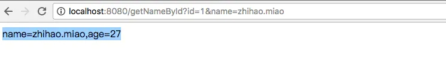
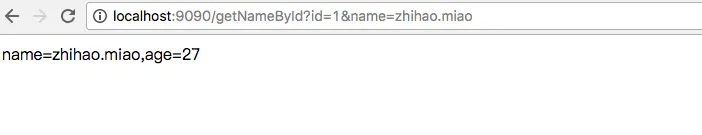
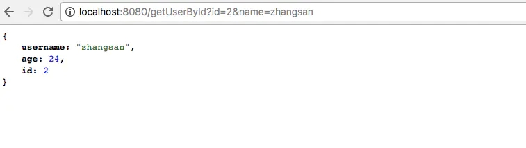
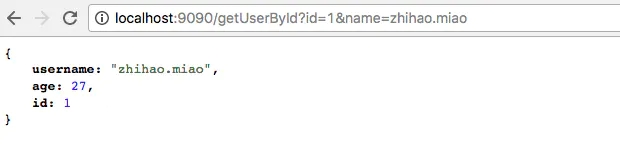
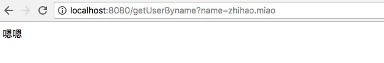
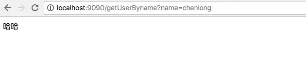
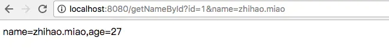
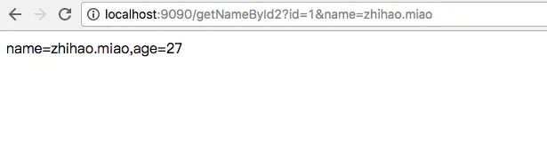

## 客户端负载均衡：Spring Cloud Ribbon

Spring Cloud Ribbon是一个基于HTTP和TCP的客户端负载均衡工具，它基于Netfilx Ribbon实现。通过Spring Cloud封装，可以轻松地将面向服务的Rest模版请求自动转换为客户端负载均衡的服务调用。
 Spring cloud Ribbon虽然只是一个工具类框架，它不像服务注册中心，配置中心，api网关那样需要独立部署，但是它几乎存在于每一个Spring cloud构建的微服务和基础设施中。因为微服务间的调用，API网关的请求转发等内容，实际上都是通过Ribbon来实现的，包括Feign也是基于Ribbon实现的工具。

## 客户端负载均衡

负载均衡是对系统的高可用，网络压力的缓解和处理能力扩容的重要手段之一。我们通常所说的负载均衡指的是服务端的负载均衡，其中分为硬件负载均衡和软件负载均衡，硬件负载均衡主要通过在服务节点之间安装专门的负载均衡设备，比如F5，而软件的负载均衡则是通过在服务端安装一些具有均衡负载功能或者模块的软件来完成请求的分发工作，比如Nginx。

硬件负载均衡的设备或是软件负载均衡的软件模块都会维护一个下挂可用的服务端清单，通过心跳检测来剔除故障的服务端节点以保证清单中都是可以正常访问的服务端节点。当客户端发送请求到负载均衡设备的时候，该设备按某种算法（比如线性轮询，按权重负载，按流量负载等）从维护的可用服务清单中取出一台服务端的地址，然后进行转发。

客户端负载均衡和服务端的负载均衡最大的不同点在于服务清单存储的位置。客户端负载均衡，所有的客户端节点都维护着自己要访问的服务端清单，这些清单来自于服务注册中心。客户端负载均衡也需要心跳去维护服务端清单的健康性，这个步骤需要配合注册中心去完成。在spring cloud 实现的服务治理框架中，默认会创建对各个服务治理框架的Ribbon自动化整合配置，比如Eureka中的`org.springframework.cloud.netflix.ribbon.eureka.RibbonEurekaAutoConfiguration`，Consul中的`org.springframework.cloud.consul.discovery.RibbonConsulAutoConfiguration`。在实际使用的时候，可以通过查看这两个类的实现，以找到它们的配置详情来帮助我们更好的使用它。

通过`spring cloud Ribbon`的封装，客户端的负载均衡只要完成以下二步：

- 服务提供者只需要启动多个服务实例并注册到注册中心
- 服务端直接通过在`RestTemplate`上使用`@LoadBalanced`注解。

## RestTemplate类使用

官网对这个类的介绍：
 Spring's central class for synchronous client-side HTTP access.It simplifies communication with HTTP servers, and enforces RESTful principles.It handles HTTP connections, leaving application code to provide URLs (with possible template variables) and extract results.

`Spring`为了简化客户端的Http访问的核心类。它简化了与Http服务端的通信，并且遵循了RESTful的原则。处理了HTTP的连接，使得应用简单的运用提供的URLs（提供的模版参数）运行得到结果。

**Note**: by default the RestTemplate relies on standard JDK facilities to establish HTTP connections. You can switch to use a different HTTP library such as Apache HttpComponents, Netty, and OkHttp through the `setRequestFactory` property.

**注意**：默认情况下，RestTemplate类依赖默认的JDK以便建立HTTP连接。可以使用不同的HTTP库，比如Apache HttpComponents，Netty，OkHttp.

The main entry points of this template are the methods named after the six main HTTP methods:
 这个模版主要有六种HTTP方法：
 HTTP method RestTemplate methods：
 **DELETE**: delete
 **GET**: getForObject,getForEntity
 **HEAD**: headForHeaders
 **OPTIONS**: optionsForAllow
 **POST**: postForLocation,postForObject
 **PUT**: put
 **any**:exchange,execute

In addition the  `exchange` and `execute` methods are generalized versions of the above methods and can be used to support additional, less frequent combinations (e.g.HTTP PATCH, HTTP PUT with response body, etc.). Note however that the underlying HTTP library used must also support the desired combination.
 此外，`exchange`和`execute`方法支持附加的需求，较不频繁的结合（egHTTP PATCH，具有响应体等HTTP PUT等等）。然而，注意，所用的底层HTTP库必须也支持这些期望的结合。

For each HTTP method there are three variants: two accept a URI template string and URI variables (array or map) while a third accepts a `URI`.
 对于每一种HTTP方法都有三种重载的方法，一种是接收String模版的参数，一种是接收（数组或者map）的URI类型，一种是接收URI。下面的讲解会有说明

Internally the template uses `HttpMessageConverter` instances to convert HTTP messages to and from POJOs. Converters for the main mime types are registered by default but you can also register additional converters via `setMessageConverters`.

template的内部使用`HttpMessageConverter`类的实例将HTTP消息的类型转换成POJOs类型。一些默认的转换已经被注册支持并且你可以注册额外的转换器通过`setMessageConverters`方法。

This template uses a  `org.springframework.http.client.SimpleClientHttpRequestFactory` and a `DefaultResponseErrorHandler` as default strategies for creating HTTP connections or handling HTTP errors, respectively. These defaults can be overridden through `setRequestFactory` and `setErrorHandler` respectively.

这个template使用`org.springframework.http.client.SimpleClientHttpRequestFactory`和`DefaultResponseErrorHandler`作为其默认策略去创建HTTP连接和处理HTTP错误。这些默认的策略可以分别被重写通过`setRequestFactory` 和`setErrorHandler`方法

## Get请求

使用RestTemplate，对get请求可以通过如下下面的二种方法实现：

**getForEntity函数**
 该方法返回ResponseEntity，该对象是Spring对Http请求响应的封装，其中主要存储了HTTP的几个重要元素，比如说HTTP请求码的枚举对象HttpStatus（404，405，500等错误码），它的父类事HttpEntity中还存储着HTTP请求的头信息对象HttpHeaders以及泛型类型的请求体对象。

getForEntity有三种重载的方法：

```java
@Override
public <T> ResponseEntity<T> getForEntity(String url, Class<T> responseType, Object... uriVariables)
            throws RestClientException {

        RequestCallback requestCallback = acceptHeaderRequestCallback(responseType);
        ResponseExtractor<ResponseEntity<T>> responseExtractor = responseEntityExtractor(responseType);
        return execute(url, HttpMethod.GET, requestCallback, responseExtractor, uriVariables);
    }
```

```
该方法提供了三个参数，url就是请求的地址，responseType返回的数据类型，uriVariables为url中参数绑定。会顺序对应url中占位符定义的数字顺序。
```

```java
@Override
public <T> ResponseEntity<T> getForEntity(String url, Class<T> responseType, Map<String, ?> uriVariables)
            throws RestClientException {

        RequestCallback requestCallback = acceptHeaderRequestCallback(responseType);
        ResponseExtractor<ResponseEntity<T>> responseExtractor = responseEntityExtractor(responseType);
        return execute(url, HttpMethod.GET, requestCallback, responseExtractor, uriVariables);
    }
```

url参数和responseType和上面一致，只有第三个参数uriVariables是不同的类型，这里使用了Map<String, ?>类型，所以使用该方法进行参数绑定时需要在占位符中指定Map中参数的key值，我们需要向map中put
 一个key为id和name的值来对应{id}和{name}

```java
@Override
public <T> ResponseEntity<T> getForEntity(URI url, Class<T> responseType) throws RestClientException {
      RequestCallback requestCallback = acceptHeaderRequestCallback(responseType);
      ResponseExtractor<ResponseEntity<T>> responseExtractor = responseEntityExtractor(responseType);
      return execute(url, HttpMethod.GET, requestCallback, responseExtractor);
}
```

该方法使用URI对象来替代之前的url和urlVariables参数来指定访问地址和参数来指定访问地址和参数绑定。URI是JDK java.net包下的一个类，它表示一个统一的资源标识符引用.

demo如下，定义二个项目，一个User项目，一个Order项目，User项目使用localhost:8080来访问，Order项目使用localhost:9090来访问，

返回对象是String：
 User项目定义一个get方法：

```java
@GetMapping("/getNameById")
public String getNameById(@RequestParam int id,@RequestParam String name){
        if(1 == id && "zhihao.miao".equals(name)){
            return "name="+name+",age="+27;
        }else {
            return "name="+name;
        }
}
```

访问：
 http://localhost:8080/getNameById?id=1&name=zhihao.miao



Order中使用RestTemplate进行调用：

```java
@GetMapping("/getNameById")
public String getNameById(@RequestParam int id,@RequestParam String name){
String username = restTemplate.getForEntity("http://localhost:8080/getNameById?id={1}&name={2}",String.class,new Object[]{id,name}).getBody();
        logger.info(username);
        return username;
}
```

[http://localhost:9090/getNameById?id=1&name=zhihao.miao](https://link.jianshu.com?t=http://localhost:9090/getNameById?id=1&name=zhihao.miao)



返回参数是一个实体对象：
 Use项目中定义：

```java
@GetMapping("/getUserById")
public User getUserById(@RequestParam int id,@RequestParam String name){
        User user = new User();

        if(id == 1 && "zhihao.miao".equals(name)){
            user.setId(1);
            user.setUsername("zhihao.miao");
            user.setAge(27);
        }

        if(id ==2 && "zhangsan".equals(name)){
            user.setId(2);
            user.setUsername("zhangsan");
            user.setAge(24);
        }

        return user;
    }
```

访问：
 [http://localhost:8080/getUserById?id=2&name=zhangsan](https://link.jianshu.com?t=http://localhost:8080/getUserById?id=2&name=zhangsan)



Order服务：

```java
@GetMapping("/getUserById")
 public User getUserById(@RequestParam int id,@RequestParam String name){
        Map<String,Object> params = new HashMap<>();
        params.put("id",id);
        params.put("name",name);
        User user = restTemplate.getForEntity("http://localhost:8080/getUserById?id={id}&name={name}",User.class,params).getBody();
        return user;
}
```

访问：
 [http://localhost:9090/getUserById?id=1&name=zhihao.miao](https://link.jianshu.com?t=http://localhost:9090/getUserById?id=1&name=zhihao.miao)



使用URI类：
 User服务定义一接口：

```java
@GetMapping("/getUserByname")
public String getUserByname(@RequestParam String name){
        if("zhihao.miao".equals(name)){
            return "嗯嗯";
        }else{
            return "哈哈";
        }
}
```

[http://localhost:8080/getUserByname?name=zhihao.miao](https://link.jianshu.com?t=http://localhost:8080/getUserByname?name=zhihao.miao)



Order中调用：

```java
@GetMapping("/getUserByname")
public String getUserByname(@RequestParam String name){
        UriComponents uriComponents = UriComponentsBuilder.fromUriString("http://localhost:8080/getUserByname?name={name}").build().expand(name).encode();

        URI uri = uriComponents.toUri();
        String response = restTemplate.getForEntity(uri,String.class).getBody();

        return response;
}
```

[http://localhost:9090/getUserByname?name=chenlong](https://link.jianshu.com?t=http://localhost:9090/getUserByname?name=chenlong)



**getForObject函数**
 该方法可以理解对getForEntity的进一步封装，它通过HttpMessageConverterExtractor对http的请求响应体body内容进行对象转换，实现请求直接返回包装好的对象内容。

```java
@Override
public <T> T getForObject(String url, Class<T> responseType, Object... uriVariables) throws RestClientException {
        RequestCallback requestCallback = acceptHeaderRequestCallback(responseType);
        HttpMessageConverterExtractor<T> responseExtractor =
                new HttpMessageConverterExtractor<T>(responseType, getMessageConverters(), logger);
        return execute(url, HttpMethod.GET, requestCallback, responseExtractor, uriVariables);
}
```

```java
@Override
public <T> T getForObject(String url, Class<T> responseType, Map<String, ?> uriVariables) throws RestClientException {
        RequestCallback requestCallback = acceptHeaderRequestCallback(responseType);
        HttpMessageConverterExtractor<T> responseExtractor =
                new HttpMessageConverterExtractor<T>(responseType, getMessageConverters(), logger);
        return execute(url, HttpMethod.GET, requestCallback, responseExtractor, uriVariables);
    }
```

```java
@Override
    public <T> T getForObject(URI url, Class<T> responseType) throws RestClientException {
        RequestCallback requestCallback = acceptHeaderRequestCallback(responseType);
        HttpMessageConverterExtractor<T> responseExtractor =
                new HttpMessageConverterExtractor<T>(responseType, getMessageConverters(), logger);
        return execute(url, HttpMethod.GET, requestCallback, responseExtractor);
}
```

demo如下：
 User项目定义一接口：

```java
@GetMapping("/getNameById")
public String getNameById(@RequestParam int id,@RequestParam String name){
        if(1 == id && "zhihao.miao".equals(name)){
            return "name="+name+",age="+27;
        }else {
            return "name="+name;
        }
    }
```

访问：
 [http://localhost:8080/getNameById?id=1&name=zhihao.miao](https://link.jianshu.com?t=http://localhost:8080/getNameById?id=1&name=zhihao.miao)



Order项目中实现：

```java
@Autowired
private RestTemplate restTemplate;

@GetMapping("/getNameById2")
public String getNameById(@RequestParam int id, @RequestParam String name){
        String username = restTemplate.getForObject("http://localhost:8080/getNameById?id={1}&name={2}",String.class,new Object[]{id,name});
        logger.info(username);
        return username;
}
```

[http://localhost:9090/getNameById2?id=1&name=zhihao.miao](https://link.jianshu.com?t=http://localhost:9090/getNameById2?id=1&name=zhihao.miao)



Order类中实现：

```java
@GetMapping("/getUserById2")
public User getUserById(@RequestParam int id, @RequestParam String name){
        Map<String,Object> params = new HashMap<>();
        params.put("id",id);
        params.put("name",name);
        User user = restTemplate.getForObject("http://localhost:8080/getUserById?id={id}&name={name}",User.class,params);
        return user;
    }
```

访问：
 [http://localhost:9090/getUserById2?id=1&name=zhihao.miao](https://link.jianshu.com?t=http://localhost:9090/getUserById2?id=1&name=zhihao.miao)

```java
@GetMapping("/getUserByname2")
public String getUserByname(@RequestParam String name){
        UriComponents uriComponents = UriComponentsBuilder.fromUriString("http://localhost:8080/getUserByname?name={name}").build().expand(name).encode();

        URI uri = uriComponents.toUri();
        String response = restTemplate.getForObject(uri,String.class);

        return response;
}
```

[http://localhost:9090/getUserByname2?name=chenlong](https://link.jianshu.com?t=http://localhost:9090/getUserByname2?name=chenlong)

## post请求

在RestTemplate中，对post请求时可以通过如下三个方法进行调用实现：

**第一种：postForEntity函数**
 其包含三种重载的方法。第一个重载方法和第二个重载函数的uriVariables参数都用来对url中的参数进行绑定使用，responseType是返回对象的类型定义。增加的request参数，该参数可以是一个普通对象，也可以是一个HttpEntity对象。如果是一个普通对象，而非HttpEntity对象的时候，RestTemplate会将普通对象转换成HttpEntity对象。其中Object中不仅包含了body内容，也包含了header的内容。

```java
@Override
public <T> ResponseEntity<T> postForEntity(String url, Object request, Class<T> responseType, Object... uriVariables)
            throws RestClientException {

        RequestCallback requestCallback = httpEntityCallback(request, responseType);
        ResponseExtractor<ResponseEntity<T>> responseExtractor = responseEntityExtractor(responseType);
        return execute(url, HttpMethod.POST, requestCallback, responseExtractor, uriVariables);
}
```

```java
@Override
public <T> ResponseEntity<T> postForEntity(String url, Object request, Class<T> responseType, Map<String, ?> uriVariables)
            throws RestClientException {

        RequestCallback requestCallback = httpEntityCallback(request, responseType);
        ResponseExtractor<ResponseEntity<T>> responseExtractor = responseEntityExtractor(responseType);
        return execute(url, HttpMethod.POST, requestCallback, responseExtractor, uriVariables);
}
```

```java
@Override
public <T> ResponseEntity<T> postForEntity(URI url, Object request, Class<T> responseType) throws RestClientException {
        RequestCallback requestCallback = httpEntityCallback(request, responseType);
        ResponseExtractor<ResponseEntity<T>> responseExtractor = responseEntityExtractor(responseType);
        return execute(url, HttpMethod.POST, requestCallback, responseExtractor);
}
```

User定义一接口：

```java
@PostMapping("/queryLoginPrivilegeByUser")
public List<String> queryLoginPrivilegeByUser(@RequestBody User user){
        int id = user.getId();

        if(id ==1 ){
            return Arrays.asList("台账查询,用户设置".split(","));
        }else{
            return Arrays.asList("购物车设置,积分后台查询".split(","));
        }
}
```

Order的实现：
 //post请求

```java
@PostMapping("/queryLoginPrivilegeByUser")
 public List<String> queryLoginPrivilegeByUser(@RequestBody User user){
        List<String> menulist = restTemplate.postForEntity("http://localhost:8080/queryLoginPrivilegeByUser",user,List.class).getBody();
        return menulist;
}
```

```java
@PostMapping("/queryLoginPrivilegeByUser2")
public List<String> queryLoginPrivilegeByUser2(@RequestBody User user){
        UriComponents uriComponents = UriComponentsBuilder.fromUriString("http://localhost:8080/queryLoginPrivilegeByUser").build();
        URI uri = uriComponents.toUri();
        List<String> menulist = restTemplate.postForEntity(uri,user,List.class).getBody();
        return menulist;
}
```

User定义一接口：

```java
@PostMapping("/queryUserPrivilegeById")
    public String queryUserPrivilegeById(@RequestParam int id,@RequestParam String name){
        if(1 ==id){
            return "user is "+name;
        }
        return "user is not exist";
    }
```

```java
@PostMapping("/queryUserPrivilegeById")
public String queryUserPrivilegeById(@RequestParam int id,@RequestParam String name){
        HttpHeaders headers = new HttpHeaders();
       // headers.setHeader("cookie","jsessionid=12o312dsfdasi")

        MultiValueMap<String, Object> parammap = new LinkedMultiValueMap<>();
        parammap.add("id",id);
        parammap.add("name",name);

        HttpEntity<Map> entity = new HttpEntity<>(parammap,headers);

        String result = restTemplate.postForEntity("http://localhost:8080/queryUserPrivilegeById",entity,String.class).getBody();
        return result;
}
```

**携带cookie

```java
String cart_url = "http://CART-SERVER/cart/merge";
HttpHeaders headers = new HttpHeaders();
List<String> cookie_list = new ArrayList<>();
cookie_list.add("cart_token="+cart_token);
cookie_list.add("login_token="+token);
headers.put(HttpHeaders.COOKIE,cookie_list);
HttpEntity<Map> entity1 = new HttpEntity<>(headers);
restTemplate.postForObject(cart_url,entity1, ResultBean.class);
```


**第二种:postForObject函数**
 该方法可以理解为对postForEntity的进一步封装，它通过org.springframework.web.client.HttpMessageConverterExtractor对HTTP的请求响应体body内容进行对象转换，实现请求直接返回包装好的对象内容。

```
@PostMapping("/queryUserByPrivilege")
public User queryUserByPrivilege(@RequestParam String privilege){
        HttpHeaders headers = new HttpHeaders();

        MultiValueMap<String, Object> parammap = new LinkedMultiValueMap<>();
        parammap.add("privilege",privilege);
        
        HttpEntity<Map> entity = new HttpEntity<>(parammap,headers);
        
        User user = restTemplate.postForObject(userService+"/queryUserByPrivilege",entity,User.class);
        return user;
}
```

postForObject函数也提供了三个重载的方法

```
@Override
public <T> T postForObject(String url, Object request, Class<T> responseType, Object... uriVariables)
            throws RestClientException {

        RequestCallback requestCallback = httpEntityCallback(request, responseType);
        HttpMessageConverterExtractor<T> responseExtractor =
                new HttpMessageConverterExtractor<T>(responseType, getMessageConverters(), logger);
        return execute(url, HttpMethod.POST, requestCallback, responseExtractor, uriVariables);
}
```

```
@Override
public <T> T postForObject(String url, Object request, Class<T> responseType, Map<String, ?> uriVariables)
            throws RestClientException {

        RequestCallback requestCallback = httpEntityCallback(request, responseType);
        HttpMessageConverterExtractor<T> responseExtractor =
                new HttpMessageConverterExtractor<T>(responseType, getMessageConverters(), logger);
        return execute(url, HttpMethod.POST, requestCallback, responseExtractor, uriVariables);
}
```

```
@Override
public <T> T postForObject(URI url, Object request, Class<T> responseType) throws RestClientException {
        RequestCallback requestCallback = httpEntityCallback(request, responseType);
        HttpMessageConverterExtractor<T> responseExtractor =
                new HttpMessageConverterExtractor<T>(responseType, getMessageConverters());
        return execute(url, HttpMethod.POST, requestCallback, responseExtractor);
}
```

**第三种使用postForLocation函数**
 该方法实现了以post提交资源，返回新资源的URI。

```
@PostMapping("/queryLoginPrivilegeByUser3")
public void queryLoginPrivilegeByUser3(@RequestBody User user){
        URI uri = restTemplate.postForLocation("http://localhost:8080/queryLoginPrivilegeByUser",user);
        System.out.println("uri=="+uri);

}
```

postForLocation函数也提供了三种不同的重载方法

```
@Override
public URI postForLocation(String url, Object request, Object... uriVariables) throws RestClientException {
        RequestCallback requestCallback = httpEntityCallback(request);
        HttpHeaders headers = execute(url, HttpMethod.POST, requestCallback, headersExtractor(), uriVariables);
        return headers.getLocation();
}
```

```
@Override
public URI postForLocation(String url, Object request, Map<String, ?> uriVariables) throws RestClientException {
        RequestCallback requestCallback = httpEntityCallback(request);
        HttpHeaders headers = execute(url, HttpMethod.POST, requestCallback, headersExtractor(), uriVariables);
        return headers.getLocation();
}
```

```
@Override
public URI postForLocation(URI url, Object request) throws RestClientException {
        RequestCallback requestCallback = httpEntityCallback(request);
        HttpHeaders headers = execute(url, HttpMethod.POST, requestCallback, headersExtractor());
        return headers.getLocation();
}
```

## PUT请求

put函数也实现了三种不同的重载方法：

```
@Override
public void put(String url, Object request, Object... uriVariables) throws RestClientException {
        RequestCallback requestCallback = httpEntityCallback(request);
        execute(url, HttpMethod.PUT, requestCallback, null, uriVariables);
}
```

```
@Override
public void put(String url, Object request, Map<String, ?> uriVariables) throws RestClientException {
        RequestCallback requestCallback = httpEntityCallback(request);
        execute(url, HttpMethod.PUT, requestCallback, null, uriVariables);
}
```

```
@Override
public void put(URI url, Object request) throws RestClientException {
        RequestCallback requestCallback = httpEntityCallback(request);
        execute(url, HttpMethod.PUT, requestCallback, null);
}
```

put函数为void类型，所以没有返回内容，也就没有其他函数定义的responseType参数。

## DELETE请求

User项目中定义：

```
@DeleteMapping("/deleteUserById/{id}")
public void deleteUserById(@PathVariable int id){
         logger.info(id+"");
}
```

localhost:8080/deleteUserById/1

Order项目中调用

```
@DeleteMapping("/deleteUserById/{id}")
public void deleteUserById(@PathVariable int id){
         restTemplate.delete(userService+"/deleteUserById/{1}",id);
}
```

localhost:9090/deleteUserById/1

delete函数也有三种不同的重载方法：

```
@Override
public void delete(String url, Object... uriVariables) throws RestClientException {
        execute(url, HttpMethod.DELETE, null, null, uriVariables);
}
```

```
@Override
public void delete(String url, Map<String, ?> uriVariables) throws RestClientException {
        execute(url, HttpMethod.DELETE, null, null, uriVariables);
}
```

```
@Override
public void delete(URI url) throws RestClientException {
        execute(url, HttpMethod.DELETE, null, null);
}
```

 

 

 

 

 