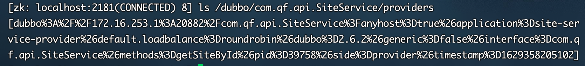

# 一、zookeeper的应用场景

## 1.分布式协调组件

在分布式系统中，需要有zookeeper作为分布式协调组件，协调分布式系统中的状态。

## 2.分布式锁

zk在实现分布式锁上，可以做到强一致性

## 3.无状态化的实现

# 二、zk内部的数据模型

## 1.zk是如何保存数据的

zk中的数据是保存在节点上的，节点就是znode，多个znode之间构成一颗树的目录结构

以zk作为dubbo的注册中心为例。当有服务注册到zk上时，zk会在内部为服务创建znode节点，来存放服务信息，供消费者去订阅。

通过zkCli工具去查看zk中的节点信息

## 2.zk中的znode是什么样的结构

zk中的znode，包含了四个部分：

- data：保存数据
- acl：权限
- stat：描述当前znode的元数据
- child：当前节点的子节点

## 3.zk中节点znode的类型

- 持久节点: 创建出的节点，在会话结束后依然存在。

- 持久序号节点: 创建出的节点，根据先后顺序，会在节点之后带上一个数值，越后执行数值越大，适用于分布式锁的应用场景

- 临时节点：

  临时节点是在会话结束后，自动被删除的，通过这个特性，zk可以实现服务注册与发现的效果

- 临时序号节点：跟持久序号节点相同，适用于临时的分布式锁。

# 三、zk实现分布式锁

## 1.zk中锁的种类：

- 读锁：大家都可以读，要想上读锁的前提：之前的锁没有写锁
- 写锁：只有得到写锁的才能写。要想上写锁的前提是，之前没有任何锁。

## 2.zk如何上读锁

- 创建一个临时序号节点，节点的数据是read，表示是 读锁

- 获取当前zk中序号比自己小的所有节点

- 判断最小节点是否是读锁：

  - 如果不是读锁的话，则上锁失败，为最小节点设置监听。阻塞等待，zk的watch机制会当最小节点发生变化时通知当前节点，于是再执行第二步的流程

  - 如果是读锁的话，则上锁成功

## 3.zk如何上写锁

- 创建一个临时序号节点，节点的数据是write，表示是 写锁
- 获取zk中所有的子节点
- 判断自己是否是最小的节点：
  - 如果是，则上写锁成功
  - 如果不是，说明前面还有锁，则上锁失败，监听最小的节点，如果最小节点有变化，则回到第二步。

## 4.羊群效应

如果用上述的上锁方式，只要有节点发生变化，就会触发其他节点的监听事件，这样的话对zk的压力非常大，——羊群效应。可以调整成

链式监听。解决这个问题。

# 作业

- 尝试使用zuul做多个过滤器的开发
- 搭建分布式配置中心服务端，用客户端去服务端获取配置
- 掌握、熟悉企业日常流程（每天都要开晨会，汇报前一天项目进度，碰到的问题，主要的工作内容）
- 掌握zk的各种细节。预习下zk中的其他知识
- 把springcloud和项目整合 做一个crud